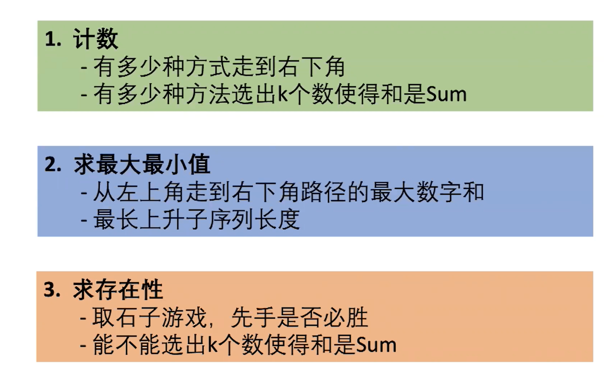

<center>更多内容请关注：</center>


<center><a href="https://wjhub.gitee.io">锁清秋</a></center>

----

## LRU

> 运用你所掌握的数据结构，设计和实现一个  LRU (最近最少使用) 缓存机制 。
> 实现 LRUCache 类：
>
> LRUCache(int capacity) 以正整数作为容量 capacity 初始化 LRU 缓存
> int get(int key) 如果关键字 key 存在于缓存中，则返回关键字的值，否则返回 -1 。
> void put(int key, int value) 如果关键字已经存在，则变更其数据值；如果关键字不存在，则插入该组「关键字-值」。当缓存容量达到上限时，它应该在写入新数据之前删除最久未使用的数据值，从而为新的数据值留出空间。
>
>
> 进阶：你是否可以在 O(1) 时间复杂度内完成这两种操作？
>

```java
class LRUCache {
    private Map<Integer, DoubleNode> map;
    private Integer capacity;

    public LRUCache(int capacity) {
      this.capacity = capacity;
      this.map = new HashMap<>(capacity);
      this.head = new DoubleNode(-1, -1);
      this.tail = new DoubleNode(-1, -1);
      head.next = tail;
      tail.pre = head;
    }

    public int get(int key) {
      if (!map.containsKey(key)) {
        return -1;
      }
      DoubleNode doubleNode = map.get(key);
      updateNode(doubleNode);
      return doubleNode.val;
    }

    public void put(int key, int value) {
      if (map.containsKey(key)) {
        DoubleNode doubleNode = map.remove(key);
        doubleNode.val = value;
        updateNode(doubleNode);
        map.put(key, doubleNode);
        return;
      }
      DoubleNode node = new DoubleNode(key, value);
      if (capacity <= map.size()) {
        map.remove(tail.pre.key);
        removeNode(tail.pre);
      }
      map.put(key, node);
      addNode(node);
    }

    private class DoubleNode {
      private DoubleNode pre, next;
      private Integer key;
      private Integer val;

      public DoubleNode(Integer key, Integer val) {
        this.key = key;
        this.val = val;
      }
    }

    private DoubleNode head, tail;

    private void addNode(DoubleNode node) {
      node.next = head.next;
      head.next.pre = node;
      node.pre = head;
      head.next = node;
    }

    private void removeNode(DoubleNode node) {
      node.pre.next = node.next;
      node.next.pre = node.pre;
    }

    private void updateNode(DoubleNode node) {
      removeNode(node);
      addNode(node);
    }
  }
```

## 和为K的子数组

> > 前缀和思想 + map(添加时查看是否包含，将双重循环变为一重)
>
> 给定一个整数数组和一个整数 k，你需要找到该数组中和为 k 的连续的子数组的个数。
> 
> 输入:nums = [1,1,1], k = 2，输出: 2 , [1,1] 与 [1,1] 为两种不同的情况。

```
class Solution {
  public int subarraySum(int[] nums, int k) {
    int count = 0;
    int sum = 0;
    // 前缀和 : 出现次数
    final HashMap<Integer, Integer> map = new HashMap<>();
    map.put(0, 1);
    for (int i = 0; i < nums.length; i++) {
      sum += nums[i];
      if (map.containsKey(sum - k)) count += map.get(sum - k);

      if (map.containsKey(sum)) map.put(sum, map.get(sum) + 1);
      else map.put(sum, 1);
    }
    return count;
  }
}
```


## 并查集

```java
/** 并查集 */
private class UnionFind {
  private int[] parent;

  public UnionFind(int size) {
    parent = new int[size];
    for (int i = 0; i < parent.length; i++) parent[i] = i;
  }

  /**
   * 连接两个元素
   *
   * @param p index
   * @param q index
   */
  void union(int p, int q) {
    if (parent[p] == parent[q]) return;
    for (int i = 0; i < parent.length; i++)
      // 可先不改变p，在遍历完后再改变
      if (i != p && parent[i] == parent[p]) parent[i] = parent[q];
    parent[p] = parent[q];
  }

  /**
   * 判断 是否相连
   *
   * @param p index
   * @param q index
   * @return
   */
  Boolean isUnion(int p, int q) {
    return parent[p] == parent[q];
  }
}
```

## 回溯算法

优质博客：[一文学会回溯算法解题技巧](https://mp.weixin.qq.com/s/xrxU0SB9c-vLu4QHyODO7w)

>回溯法可以理解为通过选择不同的岔路口寻找目的地，一个岔路口一个岔路口的去尝试找到目的地。如果走错了路，继续返回来找到岔路口的另一条路，直到找到目的地。

模板：


```java
void dfs(已选解集合,每个阶段可选解) {
    if (已选解集合满足条件) {
        结果集.add(已选解集合);
        return;
    }

    // 遍历每个阶段的可选解集合
    for (可选解 in 每个阶段的可选解) {

        // 选择此阶段其中一个解,将其加入到已选解集合中
        已选解集合.add(可选解)

        // 进入下一个阶段
        dfs(已选解集合,下个阶段可选的空间解)

        // 「回溯」换个解再遍历
        已选解集合.remove(可选解)

    }
}
```

## 动态规划(DP)

### 动态规划题目类型

> 


一、 最值型动态规划：

动态规划组成部分:

1.确定状态

- 最后一步(最优策略中使用的最后一 枚硬币ak )
- 化成子问题(最少的硬币拼出更小的面值27-aK )

2.转移方程

- f[X] = min{f[X-2]+1, f[X-5]+1, f[X-7]+1} 

3.初始条件和边界情况

- f[O] = 0,如果不能拼出Y , f[Y]=正无穷

4.计算顺序（倒着来）

- f[0], f[1], f[2]

 例1

```java
// Java：零钱兑换 : 322
public int coinChange(int[] coins, int amount) {
  if (amount == 0) return 0;
  /** 
   * f(n): 数量；n:金额 ；
   * f(n) = [f(n-X0),...,f(n-Xn)]min
   * */
  final int[] f = new int[amount + 1];
  f[0] = 0;
  for (int i = 1; i < f.length; i++) {
    f[i] = Integer.MAX_VALUE;
    for (int j = 0; j < coins.length; j++)
      /** 处理 金额比面值小得情况 和 f[i - coins[j]] == Integer.MAX_VALUE 时，+1 会溢出的问题 */
      if (i >= coins[j] && f[i - coins[j]] != Integer.MAX_VALUE)
        f[i] = Math.min(f[i], f[i - coins[j]] + 1);
  }
  return f[amount] == Integer.MAX_VALUE ? -1 : f[amount];
}
```

例2

```java
class Solution {
  //    跳跃游戏 : 55
  public boolean canJump(int[] nums) {
    if (nums == null || nums.length == 0) {
      return true;
    }
    int l = nums.length;
    boolean[] f = new boolean[l]; // 是否能跳到 i
    f[0] = true;
    /*判断是否能从 j 跳到 i */
    for (int i = 1; i < nums.length; i++) {
      for (int j = 0; j < i; j++) {
        if (f[j] && j + nums[j] >= i) {
          f[i] = true;
          break;
        }
      }
    }
    return f[l - 1];
  }
}
```

总结：


## 常见排序算法


