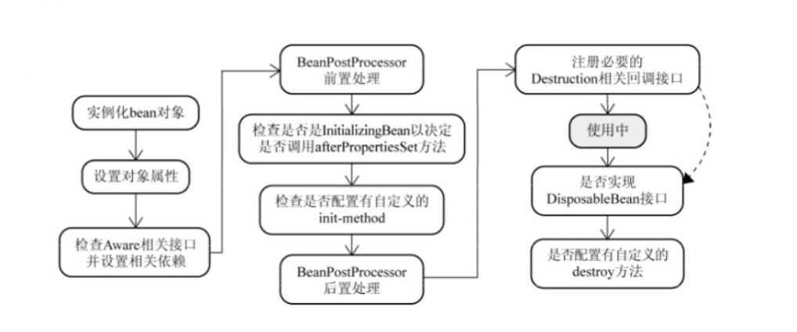
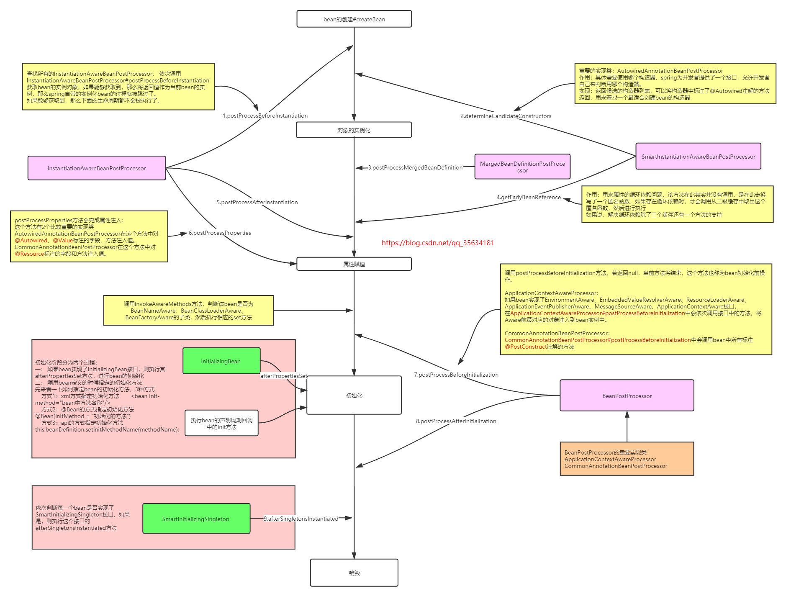
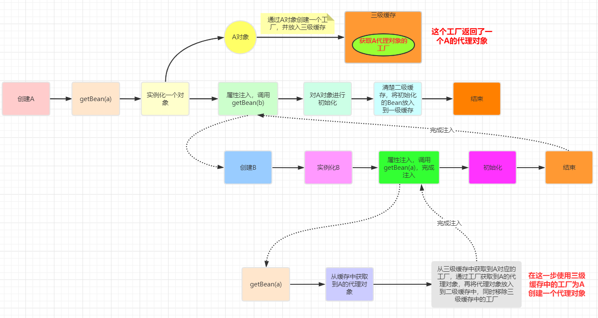

<center>更多内容请关注：</center>


<center><a href="https://wjhub.gitee.io">锁清秋</a></center>

----
# Spring

Spring框架由Rod Johnson开发，2004年发布了Spring框架的第一版。Spring是一个从实际开发中抽取出来的框架，因此它完成了大量开发中的通用步骤，留给开发者的仅仅是与特定应用相关的部分，从而大大提高了企业应用的开发效率。

Spring总结起来优点如下：

- 低侵入式设计，代码的污染极低。
- 独立于各种应用服务器，基于Spring框架的应用，可以真正实现Write Once，Run Anywhere的承诺。
- Spring的IoC容器降低了业务对象替换的复杂性，提高了组件之间的解耦。
- Spring的AOP支持允许将一些通用任务如安全、事务、日志等进行集中式管理，从而提供了更好的复用。
- Spring的ORM和DAO提供了与第三方持久层框架的良好整合，并简化了底层的数据库访问。
- Spring的高度开放性，并不强制应用完全依赖于Spring，开发者可自由选用Spring框架的部分或全部。

## Spring 核心组件


## Spring---七大核心模块

### 核心容器（Spring Core）

核心容器提供Spring框架的基本功能。Spring以bean的方式组织和管理Java应用中的各个组件及其关系。Spring使用BeanFactory来产生和管理Bean，它是工厂模式的实现。BeanFactory使用控制反转(IoC)模式将应用的配置和依赖性规范与实际的应用程序代码分开。

### 应用上下文（Spring Context）

Spring上下文是一个配置文件，向Spring框架提供上下文信息。Spring上下文包括企业服务，如JNDI、EJB、电子邮件、国际化、校验和调度功能。

### Spring面向切面编程（Spring AOP）

通过配置管理特性，Spring AOP 模块直接将面向方面的编程功能集成到了 Spring框架中。所以，可以很容易地使 Spring框架管理的任何对象支持 AOP。Spring AOP 模块为基于 Spring 的应用程序中的对象提供了事务管理服务。通过使用 Spring AOP，不用依赖 EJB 组件，就可以将声明性事务管理集成到应用程序中。

### JDBC和DAO模块（Spring DAO）

JDBC、DAO的抽象层提供了有意义的异常层次结构，可用该结构来管理异常处理，和不同数据库供应商所抛出的错误信息。异常层次结构简化了错误处理，并且极大的降低了需要编写的代码数量，比如打开和关闭链接。

### 对象实体映射（Spring ORM）

Spring框架插入了若干个ORM框架，从而提供了ORM对象的关系工具，其中包括了Hibernate、JDO和 IBatis SQL Map等，所有这些都遵从Spring的通用事物和DAO异常层次结构。

### Web模块（Spring Web）

Web上下文模块建立在应用程序上下文模块之上，为基于web的应用程序提供了上下文。所以Spring框架支持与Struts集成，web模块还简化了处理多部分请求以及将请求参数绑定到域对象的工作。

### MVC模块（Spring Web MVC）

MVC框架是一个全功能的构建Web应用程序的MVC实现。通过策略接口，MVC框架变成为高度可配置的。MVC容纳了大量视图技术，其中包括JSP、POI等，模型来有JavaBean来构成，存放于m当中，而视图是一个街口，负责实现模型，控制器表示逻辑代码，由c的事情。Spring框架的功能可以用在任何J2EE服务器当中，大多数功能也适用于不受管理的环境。Spring的核心要点就是支持不绑定到特定J2EE服务的可重用业务和数据的访问的对象，毫无疑问这样的对象可以在不同的J2EE环境，独立应用程序和测试环境之间重用。

## Spring的核心机制

### 管理Bean


程序主要是通过Spring容器来访问容器中的Bean，ApplicationContext是Spring容器最常用的接口，该接口有如下两个实现类：

- ClassPathXmlApplicationContext: 从类加载路径下搜索配置文件，并根据配置文件来创建Spring容器。
- FileSystemXmlApplicationContext: 从文件系统的相对路径或绝对路径下去搜索配置文件，并根据配置文件来创建Spring容器。

```java
        ApplicationContext ctx = new ClassPathXmlApplicationContext("beans.xml");
        Person p = ctx.getBean("person", Person.class);
        p.say();

```

### 依赖注入 DI （Dependency Injection）

Spring框架的核心功能有两个：

- Spring容器作为超级大工厂，负责创建、管理所有的Java对象，这些Java对象被称为Bean。
- Spring容器管理容器中Bean之间的依赖关系，Spring使用一种被称为"依赖注入 DI"的方式来管理Bean之间的依赖关系。

使用依赖注入，不仅可以为Bean注入普通的属性值，还可以注入其他Bean的引用。依赖注入是一种优秀的解耦方式，其可以让Bean以配置文件组织在一起，而不是以硬编码的方式耦合在一起。

#### 理解依赖注入

Rod Johnson是第一个高度重视以配置文件来管理Java实例的协作关系的人，他给这种方式起了一个名字：控制反转（Inverse of Control，IoC）。后来Martine Fowler为这种方式起了另一个名称：依赖注入（Dependency Injection），因此不管是依赖注入，还是控制反转，其含义完全相同。当某个Java对象（调用者）需要调用另一个Java对象（被依赖对象）的方法时，在传统模式下通常有两种做法：

1. 原始做法: 调用者主动创建被依赖对象，然后再调用被依赖对象的方法。
2. 简单工厂模式: 调用者先找到被依赖对象的工厂，然后主动通过工厂去获取被依赖对象，最后再调用被依赖对象的方法。

注意上面的**主动**二字，这必然会导致调用者与被依赖对象实现类的硬编码耦合，非常不利于项目升级的维护。使用Spring框架之后，调用者无需主动获取被依赖对象，**调用者只要被动接受Spring容器为调用者的成员变量赋值即可**，由此可见，使用Spring后，调用者获取被依赖对象的方式由原来的主动获取，变成了被动接受——所以Rod Johnson称之为控制反转。

另外从Spring容器的角度来看，Spring容器负责将被依赖对象赋值给调用者的成员变量——相当于为调用者注入它依赖的实例，因此Martine Fowler称之为依赖注入。

#### 依赖注入两种方式

1. 设值注入:
设值注入是指IoC容器通过成员变量的setter方法来注入被依赖对象。这种注入方式简单、直观，因而在Spring的依赖注入里大量使用。

2. 构造注入:
利用构造器来设置依赖关系的方式，被称为构造注入。通俗来说，就是驱动Spring在底层以反射方式执行带指定参数的构造器，当执行带参数的构造器时，就可利用构造器参数对成员变量执行初始化——这就是构造注入的本质。

#### 两种注入方式的对比

- 设值注入有如下优点：

与传统的JavaBean的写法更相似，程序开发人员更容易理解、接受。通过setter方法设定依赖关系显得更加直观、自然。对于复杂的依赖关系，如果采用构造注入，会导致构造器过于臃肿，难以阅读。Spring在创建Bean实例时，需要同时实例化其依赖的全部实例，因而导致性能下降。而使用设值注入，则能避免这些问题。尤其在某些成员变量可选的情况下，多参数的构造器更加笨重。

- 构造注入优势如下：

构造注入可以在构造器中决定依赖关系的注入顺序，优先依赖的优先注入。对于依赖关系无需变化的Bean，构造注入更有用处。因为没有setter方法，所有的依赖关系全部在构造器内设定，无须担心后续的代码对依赖关系产生破坏。依赖关系只能在构造器中设定，则只有组件的创建者才能改变组件的依赖关系，对组件的调用者而言，组件内部的依赖关系完全透明，更符合高内聚的原则。

>建议采用设值注入为主，构造注入为辅的注入策略。对于依赖关系无须变化的注入，尽量采用构造注入；而其他依赖关系的注入，则考虑采用设值注入。

### Spring容器中的Bean

对于开发者来说，开发者使用Spring框架主要是做两件事：①开发Bean；②配置Bean。对于Spring框架来说，它要做的就是根据配置文件来创建Bean实例，并调用Bean实例的方法完成"依赖注入"——这就是所谓IoC的本质。

#### 容器中Bean的作用域

当通过Spring容器创建一个Bean实例时，不仅可以完成Bean实例的实例化，还可以为Bean指定特定的作用域。Spring支持如下五种作用域：

- singleton: 单例模式，在整个Spring IoC容器中，singleton作用域的Bean将只生成一个实例。
- prototype: 每次通过容器的getBean()方法获取prototype作用域的Bean时，都将产生一个新的Bean实例。
- request: 对于一次HTTP请求，request作用域的Bean将只生成一个实例，这意味着，在同一次HTTP请求内，程序每次请求该Bean，得到的总是同一个实例。只有在Web应用中使用Spring时，该作用域才真正有效。
- session：该作用域将 bean 的定义限制为 HTTP 会话。 只在web-aware Spring ApplicationContext的上下文中有效。
- global session: 每个全局的HTTP Session对应一个Bean实例。在典型的情况下，仅在使用portlet context的时候有效，同样只在Web应用中有效。

如果不指定Bean的作用域，Spring默认使用singleton作用域。prototype作用域的Bean的创建、销毁代价比较大。而singleton作用域的Bean实例一旦创建成果，就可以重复使用。因此，应该尽量避免将Bean设置成prototype作用域。

#### 使用自动装配注入合作者Bean

Spring能自动装配Bean与Bean之间的依赖关系，即无须使用ref显式指定依赖Bean，而是由Spring容器检查XML配置文件内容，根据某种规则，为调用者Bean注入被依赖的Bean。

Spring自动装配可通过<beans/>元素的default-autowire属性指定，该属性对配置文件中所有的Bean起作用；也可通过对<bean/>元素的autowire属性指定，该属性只对该Bean起作用。

autowire和default-autowire可以接受如下值：

- no: 不使用自动装配。Bean依赖必须通过ref元素定义。这是默认配置，在较大的部署环境中不鼓励改变这个配置，显式配置合作者能够得到更清晰的依赖关系。
- byName: 根据setter方法名进行自动装配。Spring容器查找容器中全部Bean，找出其id与setter方法名去掉set前缀，并小写首字母后同名的Bean来完成注入。如果没有找到匹配的Bean实例，则Spring不会进行任何注入。
- byType: 根据setter方法的形参类型来自动装配。Spring容器查找容器中的全部Bean，如果正好有一个Bean类型与setter方法的形参类型匹配，就自动注入这个Bean；如果找到多个这样的Bean，就抛出一个异常；如果没有找到这样的Bean，则什么都不会发生，setter方法不会被调用。
- constructor: 与byType类似，区别是用于自动匹配构造器的参数。如果容器不能恰好找到一个与构造器参数类型匹配的Bean，则会抛出一个异常。
- autodetect: Spring容器根据Bean内部结构，自行决定使用constructor或byType策略。如果找到一个默认的构造函数，那么就会应用byType策略。

>当一个Bean既使用自动装配依赖，又使用ref显式指定依赖时，则显式指定的依赖覆盖自动装配依赖；对于大型的应用，不鼓励使用自动装配。虽然使用自动装配可减少配置文件的工作量，但大大限制死了依赖关系的清晰性和透明性。依赖关系的装配依赖于源文件的属性名和属性类型，导致Bean与Bean之间的耦合降低到代码层次，不利于高层次解耦。

```xml
<!--通过设置可以将Bean排除在自动装配之外-->
<bean id="" autowire-candidate="false"/>

<!--除此之外，还可以在beans元素中指定，支持模式字符串，如下所有以abc结尾的Bean都被排除在自动装配之外-->
<beans default-autowire-candidates="*abc"/>

```

## 创建Bean的3种方式

### 使用构造器创建Bean实例

使用构造器来创建Bean实例是最常见的情况，如果不采用构造注入，Spring底层会调用Bean类的无参数构造器来创建实例，因此要求该Bean类提供无参数的构造器。

采用默认的构造器创建Bean实例，Spring对Bean实例的所有属性执行默认初始化，即所有的基本类型的值初始化为0或false；所有的引用类型的值初始化为null。

### 使用静态工厂方法创建Bean

使用静态工厂方法创建Bean实例时，class属性也必须指定，但此时class属性并不是指定Bean实例的实现类，而是静态工厂类，Spring通过该属性知道由哪个工厂类来创建Bean实例。

除此之外，还需要使用factory-method属性来指定静态工厂方法，Spring将调用静态工厂方法返回一个Bean实例，一旦获得了指定Bean实例，Spring后面的处理步骤与采用普通方法创建Bean实例完全一样。如果静态工厂方法需要参数，则使用<constructor-arg.../>元素指定静态工厂方法的参数。

### 调用实例工厂方法创建Bean

实例工厂方法与静态工厂方法只有一个不同：调用静态工厂方法只需使用工厂类即可，而调用实例工厂方法则需要工厂实例。使用实例工厂方法时，配置Bean实例的<bean.../>元素无须class属性，配置实例工厂方法使用factory-bean指定工厂实例。
采用实例工厂方法创建Bean的<bean.../>元素时需要指定如下两个属性：

- factory-bean: 该属性的值为工厂Bean的id。
- factory-method: 该属性指定实例工厂的工厂方法。

若调用实例工厂方法时需要传入参数，则使用<constructor-arg.../>元素确定参数值。

## 协调作用域不同步的Bean

当singleton作用域的Bean依赖于prototype作用域的Bean时，会产生不同步的现象，原因是因为当Spring容器初始化时，容器会预初始化容器中所有的singleton Bean，由于singleton Bean依赖于prototype Bean，因此Spring在初始化singleton Bean之前，会先创建prototypeBean——然后才创建singleton Bean，接下里将prototype Bean注入singleton Bean。

解决不同步的方法有两种：

- 放弃依赖注入: singleton作用域的Bean每次需要prototype作用域的Bean时，主动向容器请求新的Bean实例，即可保证每次注入的prototype Bean实例都是最新的实例。
- 利用方法注入: 方法注入通常使用lookup方法注入，使用lookup方法注入可以让Spring容器重写容器中Bean的抽象或具体方法，返回查找容器中其他Bean的结果，被查找的Bean通常是一个non-singleton Bean。Spring通过使用JDK动态代理或cglib库修改客户端的二进制码，从而实现上述要求。

建议采用第二种方法，使用方法注入。为了使用lookup方法注入，大致需要如下两步：

1. 将调用者Bean的实现类定义为抽象类，并定义一个抽象方法来获取被依赖的Bean。
2. 在<bean.../>元素中添加<lookup-method.../>子元素让Spring为调用者Bean的实现类实现指定的抽象方法

> Spring会采用运行时动态增强的方式来实现<lookup-method.../>元素所指定的抽象方法，如果目标抽象类实现过接口，Spring会采用JDK动态代理来实现该抽象类，并为之实现抽象方法；如果目标抽象类没有实现过接口，Spring会采用cglib实现该抽象类，并为之实现抽象方法。Spring4.0的spring-core-xxx.jar包中已经集成了cglib类库。

## 两种后处理器

Spring提供了两种常用的后处理器：

- Bean后处理器: 这种后处理器会对容器中Bean进行后处理，对Bean进行额外加强。
- 容器后处理器: 这种后处理器会对IoC容器进行后处理，用于增强容器功能。

### Bean后处理器 (BeanPostProcessor)

Bean后处理器是一种特殊的Bean，这种特殊的Bean并不对外提供服务，它甚至可以无须id属性，它主要负责对容器中的其他Bean执行后处理，例如为容器中的目标Bean生成代理等，这种Bean称为Bean后处理器。Bean后处理器会在Bean实例创建成功之后，对Bean实例进行进一步的增强处理。Bean后处理器必须实现BeanPostProcessor接口，同时必须实现该接口的两个方法。

- Object postProcessBeforeInitialization(Object bean, String name) throws BeansException: 该方法的第一个参数是系统即将进行后处理的Bean实例，第二个参数是该Bean的配置id
- Object postProcessAfterinitialization(Object bean, String name) throws BeansException: 该方法的第一个参数是系统即将进行后处理的Bean实例，第二个参数是该Bean的配置id

容器中一旦注册了Bean后处理器，Bean后处理器就会自动启动，在容器中每个Bean创建时自动工作，Bean后处理器两个方法的回调时机如下图：


>如果使用BeanFactory作为Spring容器，则必须手动注册Bean后处理器，程序必须获取Bean后处理器实例，然后手动注册。

```java
BeanPostProcessor bp = (BeanPostProcessor)beanFactory.getBean("bp");
beanFactory.addBeanPostProcessor(bp);
Person p = (Person)beanFactory.getBean("person");
```

### 容器后处理器

Bean后处理器负责处理容器中的所有Bean实例，而容器后处理器则负责处理容器本身。容器后处理器必须实现BeanFactoryPostProcessor接口，并实现该接口的一个方法postProcessBeanFactory(ConfigurableListableBeanFactory beanFactory)实现该方法的方法体就是对Spring容器进行的处理，这种处理可以对Spring容器进行自定义扩展，当然也可以对Spring容器不进行任何处理。

类似于BeanPostProcessor，ApplicationContext可自动检测到容器中的容器后处理器，并且自动注册容器后处理器。但若使用BeanFactory作为Spring容器，则必须手动调用该容器后处理器来处理BeanFactory容器。

## Spring的AOP


### 为什么需要AOP

AOP（Aspect Orient Programming）也就是面向切面编程，作为面向对象编程的一种补充，已经成为一种比较成熟的编程方式。其实AOP问世的时间并不太长，AOP和OOP互为补充，面向切面编程将程序运行过程分解成各个切面。

AOP专门用于处理系统中分布于各个模块（不同方法）中的交叉关注点的问题，在JavaEE应用中，常常通过AOP来处理一些具有横切性质的系统级服务，如事务管理、安全检查、缓存、对象池管理等，AOP已经成为一种非常常用的解决方案。

### 使用AspectJ实现AOP

AspectJ是一个基于Java语言的AOP框架，提供了强大的AOP功能，其他很多AOP框架都借鉴或采纳其中的一些思想。其主要包括两个部分：一个部分定义了如何表达、定义AOP编程中的语法规范，通过这套语法规范，可以方便地用AOP来解决Java语言中存在的交叉关注点的问题；另一个部分是工具部分，包括编译、调试工具等。

AOP实现可分为两类：

1. 静态AOP实现: AOP框架在编译阶段对程序进行修改，即实现对目标类的增强，生成静态的AOP代理类，以AspectJ为代表。
2. 动态AOP实现: AOP框架在运行阶段动态生成AOP代理，以实现对目标对象的增强，以Spring AOP为代表。

一般来说，静态AOP实现具有较好的性能，但需要使用特殊的编译器。动态AOP实现是纯Java实现，因此无须特殊的编译器，但是通常性能略差。

### AOP的基本概念

关于面向切面编程的一些术语：

- 切面（Aspect）: 切面用于组织多个Advice，Advice放在切面中定义。
- 连接点（Joinpoint）: 程序执行过程中明确的点，如方法的调用，或者异常的抛出。在Spring AOP中，连接点总是方法的调用。
- 增强处理（Advice）: AOP框架在特定的切入点执行的增强处理。处理有"around"、"before"和"after"等类型
- 切入点（Pointcut）: 可以插入增强处理的连接点。简而言之，当某个连接点满足指定要求时，该连接点将被添加增强处理，该连接点也就变成了切入点。

### Spring的AOP支持

Spring中的AOP代理由Spring的IoC容器负责生成、管理，其依赖关系也由IoC容器负责管理。为了在应用中使用@AspectJ支持，Spring需要添加三个库：

- aspectjweaver.jar
- aspectjrt.jar
- aopalliance.jar

并在Spring配置文件中做如下配置：

```xml
<!--启动@AspectJ支持-->
<aop:aspectj-autoproxy/>

<!--指定自动搜索Bean组件、自动搜索切面类-->
<context:component-scan base-package="edu.shu.sprint.service">
    <context:include-filter type="annotation" expression="org.aspectj.lang.annotation.Aspect"/>
</context:component-scan>

```

## Spring注解开发

### 标注Spring Bean

- @Component: 标注一个普通的Spring Bean类
- @Controller: 标注一个控制器组件类
- @Service: 标注一个业务逻辑组件类
- @Repository: 标注一个DAO组件类

在Spring配置文件中做如下配置，指定自动扫描的包：

```xml
<context:component-scan base-package="edu.shu.spring.domain"/>
```

### 使用@Resource配置依赖

@Resource位于javax.annotation包下，是来自JavaEE规范的一个Annotation，Spring直接借鉴了该Annotation，通过使用该Annotation为目标Bean指定协作者Bean。使用@Resource与<property.../>元素的ref属性有相同的效果。
@Resource不仅可以修饰setter方法，也可以直接修饰实例变量，如果使用@Resource修饰实例变量将会更加简单，此时Spring将会直接使用JavaEE规范的Field注入，此时连setter方法都可以不要。

```java
@Resource(name="bucket")
private String bucketName;
@Resource(name="style")
private String styleName;
```

```xml
<bean name="bucket" class="java.lang.String">
    <constructor-arg value="${oos.bucketName}"/>
</bean> 
<!-- 图片样式名 --> 
<bean name="style" class="java.lang.String">
    <constructor-arg value="${oos.styleName}"/>
</bean>
```

### 使用@PostConstruct和@PreDestroy定制生命周期行为

@PostConstruct和@PreDestroy同样位于javax.annotation包下，也是来自JavaEE规范的两个Annotation，Spring直接借鉴了它们，用于定制Spring容器中Bean的生命周期行为。它们都用于修饰方法，无须任何属性。其中前者修饰的方法时Bean的初始化方法；而后者修饰的方法时Bean销毁之前的方法。

### Spring4.0增强的自动装配和精确装配

Spring提供了@Autowired注解来指定自动装配，@Autowired可以修饰setter方法、普通方法、实例变量和构造器等。当使用@Autowired标注setter方法时，默认采用byType自动装配策略。在这种策略下，符合自动装配类型的候选Bean实例常常有多个，这个时候就可能引起异常，为了实现精确的自动装配，Spring提供了@Qualifier注解，通过使用@Qualifier，允许根据Bean的id来执行自动装配。

### 1. 配置如图


### 2. 注解分类

| 相当于创建对象的<bean> | 用于注入数据的<property> | 用于改变作用范围的（scope） | 用于改变生命周期的（init函数和destroy函数的） |
| ---------------------- | ------------------------ | --------------------------- | --------------------------------------------- |
| @Compoent              | @Autowired               | @Scope                      | @PreDestroy                                   |
| @Service               | @Resource                |                             | @PostConstruct                                |
| @Controller            | @Qualifier               |                             |                                               |
| @Repostory             | @Value("${数据}")        |                             |                                               |

>*想要用注解，必须添加注解包和开启注解扫描 <context:component-scan base-package="com.njau.account"/>*
>*注意：@Autowired只能按照数据类型自动注入，@Qualifier不能单独使用，@Reseource可以任意注入（不同与前两个，这个属性用 name="id"）。--》》》但是，这是那种数据注入都只能注入复杂数据类型，对简单数据类型无法注入 ，对简单数据只能用@value("${数据}")的方式注入！*

### 3. 配置类（spring新注解）

| 注解名称        | 注解作用/注解注意事项                                        | 例子                                                         |
| --------------- | ------------------------------------------------------------ | ------------------------------------------------------------ |
| @Configuratiuon | 这是一个配置内（当注解是spring主配置的时候可以省略）         ||
| @ComponentScan  | 组件扫描（开启注解，扫描注解的包）                           |  |
| @Bean           | 将方法返回值作为Bea放入到容器中，name相当于id，如果没有，默认是方法名 | |
| @Scop           | 控制作用范围，多例还是单例（默认是单例，数据库或取得连接要用多例） | |
| @Import         | 向主配置类中导入其他配置，相当于@ComponentScan(basePackages = {"com.njau","**config**"}) | |
| @PropertySource | 指定properties文件的位置并将数据放入到容器中，取得时候要用@value的方式取（要加classpath指在类路径下）（一般在主配置文件中加这个注解说明properties文件位置） |  |

>*注意：如果是自己写的类，直接用全部注解开发简单，如果是jar包或者是别人的类，则xml比较省事*

### 4. 整合Junit

| 注解名称              | 注解作用/注解注意事项                                        | 例子                                                       |
| --------------------- | ------------------------------------------------------------ | ---------------------------------------------------------- |
| @RunWith              | 替换Junit中的main方法，让其能有ioc容器                       | @RunWith(SpringJUnit4ClassRunner.class)                    |
| @ContextConfiguration | 告知Junit配置位置和方式（@ContextConfiguration(classes =。。。。是注解类配置）（@ContextConfiguration(locations =...是xml配置） | @ContextConfiguration(classes = SpringConfiguration.class) |

   注意：*在使用spring5 的时候，Junit的版本必须是4.12以上版本！*

##  AOP(面向切面编程 aspect oriented programming)

简单的说它就是把我们程序重复的代码抽取出来，在需要执行的时候，使用动态代理的技术，在不修改源码的基础上，对我们的已有方法进行增强 。
在spring中主要用**动态代理**的方法将代码中大量重复的代码抽取出来聚合在一起（类），即**横向抽取**

### 1. spring中AOP的配置（基于xml）

| 步骤                                                         | 例子 |
| ------------------------------------------------------------ | ---- |
| 1.导入aop名称空间                                            |      |
| 2.将要被通知的类（增强的类）配置静ioc中                      |      |
| 3.将通知类交给spring管理                                     |      |
| 一下是配置AOP                                                |      |
| 4. <aop:config>标明开始配置AOP                               |      |
| 5.<aop:aspect配置切面（id ：为切面指定一个唯一标示，ref ： 指定通知bean的id） |      |
| 6. <aop:befor 配置通知顺序和位置（method 通知需要执行的方法， pointcut 切入点表达式，标明对那个方法增强） |      |
| 7.pointcut切入点表达式的写法：pointcut（“execution（表达式）”） |      |
| 8. 表达式：                                                  |      |
| a.  ***访问修饰符  返回值  包名.包名.包名.类名.方法名***  (也就是写类方法的方式，只是加上了具体的包名和类名) 如：*pointcut="execution(**public void com.njau.account.service.impl.AccourceServiceImpl.saveMoney()**)* |      |
| b.访问修饰符可以省略,其他报名和类名均可用通配符代替，包名及其子包名可以用 *..  的方式来实现通配，如： |      |
| c.访问修饰符可以省略,全通配写法： |      |
| d. 开发中一般写法是写到业务层实现类的所有方法： |      |
| 9.切入点一般配置在切面之前                                   |      |
| 10.环绕通知：                                                |      |
|                                                              |      |
|                                                              |      |

完整配置 1 如下：

```xml

<?xml version="1.0" encoding="UTF-8"?>
<beans xmlns="http://www.springframework.org/schema/beans"
        xmlns:xsi="http://www.w3.org/2001/XMLSchema-instance"
        xmlns:aop="http://www.springframework.org/schema/aop"
        xsi:schemaLocation="http://www.springframework.org/schema/beans
        https://www.springframework.org/schema/beans/spring-beans.xsd
        http://www.springframework.org/schema/aop
        https://www.springframework.org/schema/aop/spring-aop.xsd">
<bean class="com.njau.account.service.impl.AccourceServiceImpl" id="accourceService">
</bean>

<bean class="com.njau.account.utils.Logger" id="logger">
</bean>

<!--开始配置AOP-->
<aop:config>
    <!--指定切面，即那个通知-->
    <aop:aspect id="logger" ref="logger">
        <aop:pointcut id="as" expression="execution(* com.njau.account.service.impl.*.*(..))"></aop:pointcut>
        <!--将上述切面与切入点进行关联，即指定那个方法是增强的类，那个方法是被怎强的类-->
        <!--<aop:before method="printLog" pointcut="execution(public void com.njau.account.service.impl.AccourceServiceImpl.saveMoney())"></aop:before>-->
        <!--访问修饰符可以省略 -->
        <!--<aop:before method="printLog" pointcut="execution(* *..*.*(..))"></aop:before>-->
        <!--前置通知-->
        <aop:before method="before" pointcut-ref="as"></aop:before>
        <!--後置通知-->
        <aop:after-returning method="after" pointcut-ref="as"></aop:after-returning>
        <!--異常通知-->
        <aop:after-throwing method="exception" pointcut-ref="as"></aop:after-throwing>
        <!--最終通知-->
        <aop:after method="finall" pointcut-ref="as"></aop:after>
    </aop:aspect>
</aop:config>
</beans>


```

完整配置 2 如下：（环绕通知）

```java

/**
    * 环绕通知
    *
    * @param joinPoint 在spring中通过ProceedingJoinPoint接口的proceed()得到切入点方法
    * @return
    */
public Object around(ProceedingJoinPoint joinPoint) {
    Object[] args = joinPoint.getArgs();
    Object proceed = null;
    try {
        System.out.println("环绕通知-------前置通知---------end");

        /**
            * 切点方法执行（proceed(args)相当于当前切点的方法）
            */
        proceed = joinPoint.proceed(args);

        System.out.println("环绕通知-------后置通知---------1end");
        return proceed;
    } catch (Throwable e) {
        System.out.println("环绕通知-------异常通知---------end");
        throw new RuntimeException(e);
    } finally {
        System.out.println("环绕通知-------最终通知---------end");
    }
}
```

### 2.spring中AOP的配置（基于配置）

1. 步骤

- 添加Context和AOP名称空间
- 开启注解扫描
- 开启aop注解扫描
- 将通知类和切点类都交给spring管理
- 添加注解@Aspect表是是一个切面类

2. 注解

| 注解                        | 作用                 | 实例 |
| --------------------------- | -------------------- | ---- |
| @Aspect                     | 表示该类是一个切面类 |      |
| @Pointcut                   | 切入点表达式         |      |
| @Before("表达式名")         | 前                   |      |
| @AfterReturning("表达式名") | 后                   |      |
| @AfterThrowing("表达式名")  | 异常                 |      |
| @After("表达式名")          | 最终                 |      |
| @Around("表达式名")         | 环绕                 |      |

3. spring配置（xml）

```xml
<?xml version="1.0" encoding="UTF-8"?>
<beans xmlns="http://www.springframework.org/schema/beans"
        xmlns:xsi="http://www.w3.org/2001/XMLSchema-instance"
        xmlns:aop="http://www.springframework.org/schema/aop"
        xmlns:context="http://www.springframework.org/schema/context"
        xsi:schemaLocation="http://www.springframework.org/schema/beans
        https://www.springframework.org/schema/beans/spring-beans.xsd
        http://www.springframework.org/schema/aop
        https://www.springframework.org/schema/aop/spring-aop.xsd
        http://www.springframework.org/schema/context
        https://www.springframework.org/schema/context/spring-context.xsd">
<!--开启注解扫描-->
<context:component-scan base-package="com.njau"/>
<!--开启AOP注解扫描-->
<aop:aspectj-autoproxy/>


</beans>

```

   4.配置好的切面类

```java
package com.njau.account.utils;

import org.aspectj.lang.ProceedingJoinPoint;
import org.aspectj.lang.annotation.*;
import org.springframework.stereotype.Component;

/**
* @author 张文军
* @Description:模拟日志记录（切面类）
* @Company:南京农业大学工学院
* @version:1.0
* @date 2019/7/1621:12
*/
@Component("logger")
@Aspect
public class Logger {

/**
    * 切入点表达式
    */
@Pointcut("execution(* com.njau.account.service.impl.*.*(..))")
public void as() {

}

@Before("as()")
public void before() {
    System.out.println("before记录日志！----11111");
}

@AfterReturning("as()")
public void after() {
    System.out.println("after记录日志！----22222");
}

@AfterThrowing("as()")
public void exception() {
    System.out.println("exception记录日志！----33333");
}

@After("as()")
public void finall() {
    System.out.println("finall记录日志！44444");
}

/**
    * 环绕通知
    *
    * @param joinPoint 在spring中通过ProceedingJoinPoint接口的proceed()得到切入点方法
    * @return
    */
@Around("as()")
public Object around(ProceedingJoinPoint joinPoint) {
    Object[] args = joinPoint.getArgs();
    Object proceed = null;
    try {
        System.out.println("环绕通知-------前置通知---------end");

        /**
            * 切点方法执行（proceed(args)相当于当前切点的方法）
            */
        proceed = joinPoint.proceed(args);

        System.out.println("环绕通知-------后置通知---------1end");
        return proceed;
    } catch (Throwable e) {
        System.out.println("环绕通知-------异常通知---------end");
        throw new RuntimeException(e);
    } finally {
        System.out.println("环绕通知-------最终通知---------end");
    }
}
}

```

>*注意：我发现最好用自己写的环绕通知，其他如果用spring提供的通知在执行顺序上有点诧异*

## JDBCTelplate

### 1. 步骤

- 得到数据源datasource（DriverManagerDataSource）

- 将数据源注入到jabcTemplate中

```xml
<?xml version="1.0" encoding="UTF-8"?>
<beans xmlns="http://www.springframework.org/schema/beans"
    xmlns:xsi="http://www.w3.org/2001/XMLSchema-instance"
    xsi:schemaLocation="http://www.springframework.org/schema/beans http://www.springframework.org/schema/beans/spring-beans.xsd">

<bean class="org.springframework.jdbc.core.JdbcTemplate" id="jdbcTemplate">
    <property name="dataSource" ref="dataSource"/>
</bean>

<bean class="org.springframework.jdbc.datasource.DriverManagerDataSource" id="dataSource">
    <property name="driverClassName" value="com.mysql.cj.jdbc.Driver"/>
    <property name="url" value="jdbc:mysql://localhost:3306/test"/>
    <property name="username" value="root"/>
    <property name="password" value="root"/>
</bean>

</beans>
```

### 2. 使用

| 方法语句                                 | 使用范围                                                     | 例子                                                         |
| ---------------------------------------- | ------------------------------------------------------------ | :----------------------------------------------------------- |
| update（“sql”,..args）                   | 没有返回值得都用此方法（即，增删改），差别只是在sql语句和参数上 | *jdbcTemplate.update("update account set name=?,money=? where id=?", "文军", 9001,15);* |
| ***下面是查询***用query方法              |                                                              |                                                              |
| **查询类型**                             | **方法**                                                     | **实例**                                                     |
| 查询所有                                 | *query(String sql, RowMapper<T> rowMapper, @Nullable Object... args)*；rowMapper是对查询单行结果的封装对象，spring有写好的类可以使用BeanPropertyRowMapper<T>(T.class) | **//查询所有金额大于900的账户 List<Account> accountList = jdbcTemplate.query("select * from account where money > ?", new BeanPropertyRowMapper<Account>(Account.class), 900f);** |
| 查询返回一行或一类（聚合但不用group by） | queryForObject(String sql, Class<T> requiredType, @Nullable Object... args) | *Long aLong = jdbcTemplate.queryForObject("select count(*) from account where money > ?", Long.class, 900f); |
|                                          |                                                              |                                                              |

## Spring中的事务控制器

### 1. 概述

*spring 框架为我们提供了一组事务控制的接口（PlatformTransactionManager ） ，这组接口是在spring-tx-5.0.2.RELEASE.jar 中。spring 的事务控制都是基于 AOP 的，它既可以使用编程的方式实现，也可以使用配置的方式实现 。*

### 2. spring 中基于XML的声明式事务配置

1. 步骤

   - 配置事务管理器，注入datasource
   - 配置事务通知（导入事物约束tx和aop）
   - 配置AOP中的切入点表达式
   - 配置切入点表达式和事务通知之间的关系
   - 配置事务的属性（在事务通知里面配置）

   配置如下

```xml

<?xml version="1.0" encoding="UTF-8"?>
<beans xmlns="http://www.springframework.org/schema/beans"
       xmlns:xsi="http://www.w3.org/2001/XMLSchema-instance"
       xmlns:aop="http://www.springframework.org/schema/aop"
       xmlns:tx="http://www.springframework.org/schema/tx"
       xsi:schemaLocation="
        http://www.springframework.org/schema/beans
        http://www.springframework.org/schema/beans/spring-beans.xsd
        http://www.springframework.org/schema/tx
        http://www.springframework.org/schema/tx/spring-tx.xsd
        http://www.springframework.org/schema/aop
        http://www.springframework.org/schema/aop/spring-aop.xsd">

    <bean class="com.itheima.service.impl.IAccountServiceImpl" id="accountService">
        <property name="IAccountDao" ref="accountDao"/>
    </bean>

    <!-- 配置账户的持久层-->
    <bean id="accountDao" class="com.itheima.dao.impl.AccountDaoImpl">
        <!--<property name="jdbcTemplate" ref="jdbcTemplate"></property>-->
        <property name="dataSource" ref="dataSource"></property>
    </bean>


    <!-- 配置数据源-->
    <bean id="dataSource" class="org.springframework.jdbc.datasource.DriverManagerDataSource">
        <property name="driverClassName" value="com.mysql.cj.jdbc.Driver"></property>
        <property name="url" value="jdbc:mysql://localhost:3306/test"></property>
        <property name="username" value="root"></property>
        <property name="password" value="root"></property>
    </bean>

    <!--配置事务管理器 -->
    <bean class="org.springframework.jdbc.datasource.DataSourceTransactionManager" id="transactionManager">
        <property name="dataSource" ref="dataSource"/>
    </bean>

    <!--配置事务源-->
    <tx:advice transaction-manager="transactionManager" id="txAdvice">
        <!--配置事务的属性-->
        <tx:attributes>
            <tx:method name="*" propagation="REQUIRED"/>
            <tx:method name="find*" propagation="SUPPORTS" read-only="true"/>
        </tx:attributes>

    </tx:advice>

    <!--配置AOP-->
    <aop:config>
        <!--配置AOP中的切入点表达式-->
        <aop:pointcut id="pointcut" expression="execution(* com.itheima.service.impl.*.*(..))"/>
        <!--配置切入点表达式和事务通知之间的关系-->
        <aop:advisor advice-ref="txAdvice" pointcut-ref="pointcut"/>
    </aop:config>

</beans>

```

### 3. spring 中基于注解的声明式事务配置

1. 步骤

   - 配置事务管理器
   - 开启spring对注解事物的支持
   - 在需要业务支持的地方加上@Transactional注解

   配置如下：

```xml
<?xml version="1.0" encoding="UTF-8"?>
<beans xmlns="http://www.springframework.org/schema/beans"
       xmlns:xsi="http://www.w3.org/2001/XMLSchema-instance"
       xmlns:aop="http://www.springframework.org/schema/aop"
       xmlns:tx="http://www.springframework.org/schema/tx"
       xmlns:context="http://www.springframework.org/schema/context"
       xsi:schemaLocation="
        http://www.springframework.org/schema/beans
        http://www.springframework.org/schema/beans/spring-beans.xsd
        http://www.springframework.org/schema/tx
        http://www.springframework.org/schema/tx/spring-tx.xsd
        http://www.springframework.org/schema/aop
        http://www.springframework.org/schema/aop/spring-aop.xsd
        http://www.springframework.org/schema/context
        http://www.springframework.org/schema/context/spring-context.xsd">

    <context:component-scan base-package="com.itheima"/>

    <bean class="org.springframework.jdbc.core.JdbcTemplate" id="jdbcTemplate">
        <property name="dataSource" ref="dataSource"/>
    </bean>


    <!-- 配置数据源-->
    <bean id="dataSource" class="org.springframework.jdbc.datasource.DriverManagerDataSource">
        <property name="driverClassName" value="com.mysql.cj.jdbc.Driver"></property>
        <property name="url" value="jdbc:mysql://localhost:3306/test"></property>
        <property name="username" value="root"></property>
        <property name="password" value="root"></property>
    </bean>

    <!--开启spring对注解事物的支持-->
    <tx:annotation-driven transaction-manager="transactionManager"/>
    <!--配置事务管理器 -->
    <bean class="org.springframework.jdbc.datasource.DataSourceTransactionManager" id="transactionManager">
        <property name="dataSource" ref="dataSource"/>
    </bean>
    </beans>
```


## Spring Bean 的生命周期

●Bean容器找到配置文件中Spring Bean的定义。
●Bean 容器利用Java Reflection API创建一个 Bean的实例。
●如果涉及到一些属性值利用set()方法设置一些属性值。
●如果Bean实现了BeanNameAware接口，调用setBeanName()方法，传入Bean的名字。
●如果Bean实现了BeanClassLoaderAware接口，调用setBeanClassLoader()方法，传入ClassLoader对象的实例。
●与上面的类似，如果实现了其他 *. Aware接口，就调用相应的方法。
●如果有和加载这个Bean的Spring容器相关的BeanPostProcessor对象，执行postProcessBeforeInitialization()方法
●如果Bean实现了InitializingBean接口， 执行afterPropertiesSet()方法。
●如果Bean在配置文件中的定义包含init-method属性，执行指定的方法。
●如果有和加载这个Bean的Spring容器相关的BeanPostProcessor对象，执行postProcessAfterInitialization()方法
●当要销毁Bean的时候，如果Bean实现了DisposableBean接口，执行destroy()方法。
●当要销毁Bean的时候，如果Bean在配置文件中的定义包含destroy-method属性，执行指定的方法。






## Spring是如何解决的循环依赖？

Spring通过三级缓存解决了循环依赖，其中一级缓存为单例池（`singletonObjects`）,二级缓存为早期曝光对象`earlySingletonObjects`，三级缓存为早期曝光对象工厂（`singletonFactories`）。当A、B两个类发生循环引用时，在A完成实例化后，就使用实例化后的对象去创建一个对象工厂，并添加到三级缓存中，如果A被AOP代理，那么通过这个工厂获取到的就是A代理后的对象，如果A没有被AOP代理，那么这个工厂获取到的就是A实例化的对象。当A进行属性注入时，会去创建B，同时B又依赖了A，所以创建B的同时又会去调用getBean(a)来获取需要的依赖，此时的getBean(a)会从缓存中获取，第一步，先获取到三级缓存中的工厂；第二步，调用对象工工厂的getObject方法来获取到对应的对象，得到这个对象后将其注入到B中。紧接着B会走完它的生命周期流程，包括初始化、后置处理器等。当B创建完后，会将B再注入到A中，此时A再完成它的整个生命周期。至此，循环依赖结束！



### 为什么要使用三级缓存呢？二级缓存能解决循环依赖吗？

如果要使用二级缓存解决循环依赖，意味着所有Bean在实例化后就要完成AOP代理，这样违背了Spring设计的原则，Spring在设计之初就是通过`AnnotationAwareAspectJAutoProxyCreator`这个后置处理器来在Bean生命周期的最后一步来完成AOP代理，而不是在实例化后就立马进行AOP代理。


## 常用状态码

200OK:正常返回信息

400 Bad Request:客户端请求有语法错误，不能被服务器所理解

401 Unauthorized:请求未经授权，这个状态代码必须和WWW-Authenticate报头域一起使用

403 Forbidden:服务器收到请求，但是拒绝提供服务

404 Not Found:请求资源不存在，eg，输入了错误的URL500 Internal Server Error:服务器发生不可预期的错误

503 Server Unavailable:服务器当前不能处理客户端的请求,一段时间后可能恢复正常