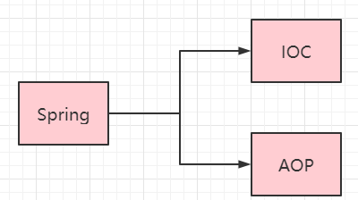
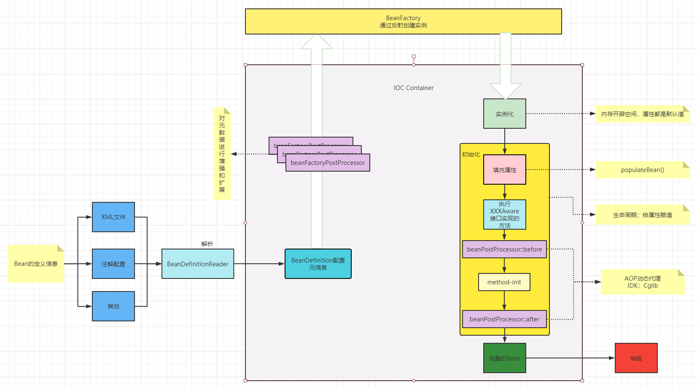
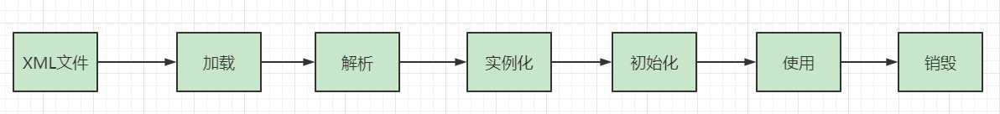

<center>更多内容请关注：</center>


<center><a href="https://wjhub.gitee.io">锁清秋</a></center>

----

## Spring源码架构简单梳理


### 1. Spring核心：IOC和AOP




### 2. Spring Bean的加载流程图解






## Spring启动加载Bean核心方法

### 1. refresh()

> org.springframework.context.support.AbstractApplicationContext#refresh

```java
public void refresh() throws BeansException, IllegalStateException {
		synchronized (this.startupShutdownMonitor) {
			StartupStep contextRefresh = this.applicationStartup.start("spring.context.refresh");

			// Prepare this context for refreshing.
			/**
			 * 1、设置容器的启动时间
			 * 2、设置活跃状态为true
			 * 3、设置关闭状态为false
			 * 4、获取Environment对象， 并加载当前系统的属性值到Environment对象中
			 * 5、准备监听器和事件的集合对象，默认为空的集合
			 */
			prepareRefresh();

			// Tell the subclass to refresh the internal bean factory.
			/**
			 * 创建容器对象: DefaultListabLeBeanFactory
			 * 加载xm配置文件的属性值到当前工厂中，最重要的就是BeanDefinition 
			 * 即：创建Beanfactory->读取Bean的配置信息->解析成BeanDefinition对象，存入Map
			 */
			ConfigurableListableBeanFactory beanFactory = obtainFreshBeanFactory();

			// Prepare the bean factory for use in this context.
			// beanFactory 准备工作，给各种属性初始化赋值
			prepareBeanFactory(beanFactory);

			try {
				// Allows post-processing of the bean factory in context subclasses.
				// 子类覆盖方法做额外的处理，此处我们自己一般不做任何扩展 工作，但是可以查看web中的代码，是有具体实现的
				postProcessBeanFactory(beanFactory);

				StartupStep beanPostProcess = this.applicationStartup.start("spring.context.beans.post-process");
				// Invoke factory processors registered as beans in the context.
				// 调用BeanFactory的各种后置处理器：对BeanDefinition增强、修改、替换
				invokeBeanFactoryPostProcessors(beanFactory);


				/**---------------------为Bean的实例化和初始化做准备工作-----开始----------------------------------*/
				

				// Register bean processors that intercept bean creation.
				// 注册bean的后置处理器，这里只是注册功能，为Bean的初始化做准备工作，真正调用的是getBean方法
				registerBeanPostProcessors(beanFactory);
				beanPostProcess.end();

				// Initialize message source for this context.
				// 为上下文初始化message源，即不同语言的消息体，用来做国际化
				initMessageSource();

				// Initialize event multicaster for this context.
				// 初始化事件监听多路广播器
				initApplicationEventMulticaster();

				// Initialize other special beans in specific context subclasses.
				onRefresh();

				// Check for listener beans and register them.
				// 注册监听器：在所有注册的bean中查找listener bean, 注册到消息广播器中
				registerListeners();

				/**---------------------为Bean的实例化和初始化做准备工作-----结束----------------------------------*/

				// Instantiate all remaining (non-lazy-init) singletons.
				// 实例化所有剩余的（非延迟初始化）单例
				finishBeanFactoryInitialization(beanFactory);

				// Last step: publish corresponding event.
				finishRefresh();
			}

			catch (BeansException ex) {
				if (logger.isWarnEnabled()) {
					logger.warn("Exception encountered during context initialization - " +
							"cancelling refresh attempt: " + ex);
				}

				// Destroy already created singletons to avoid dangling resources.
				destroyBeans();

				// Reset 'active' flag.
				cancelRefresh(ex);

				// Propagate exception to caller.
				throw ex;
			}

			finally {
				// Reset common introspection caches in Spring's core, since we
				// might not ever need metadata for singleton beans anymore...
				resetCommonCaches();
				contextRefresh.end();
			}
		}
	}
```


### 2. preInstantiateSingletons()

> org.springframework.beans.factory.support.DefaultListableBeanFactory#preInstantiateSingletons
>
> > 实例化和初始化所有单例对象

```java
/**
 * [preInstantiateSingletons 实例化和初始化所有单例对象]
 * @throws BeansException [description]
 */
public void preInstantiateSingletons() throws BeansException {
		if (logger.isTraceEnabled()) {
			logger.trace("Pre-instantiating singletons in " + this);
		}

		// Iterate over a copy to allow for init methods which in turn register new bean definitions.
		// While this may not be part of the regular factory bootstrap, it does otherwise work fine.
		// 将所有BeanDefinition的名字拷贝到一个集合中
		List<String> beanNames = new ArrayList<>(this.beanDefinitionNames);

		// Trigger initialization of all non-lazy singleton beans...
		// 触发所有非懒加载的单例对象的实例化
		for (String beanName : beanNames) {
			/*获取合并BeanDefinition后的BeanDefinition对象*/
			RootBeanDefinition bd = getMergedLocalBeanDefinition(beanName);
			if (!bd.isAbstract() && bd.isSingleton() && !bd.isLazyInit()) {
				/*判断当前Bean是否实现了FactoryBean接口*/
				if (isFactoryBean(beanName)) {
					Object bean = getBean(FACTORY_BEAN_PREFIX + beanName);
					if (bean instanceof FactoryBean) {
						/*进行类型转换*/
						FactoryBean<?> factory = (FactoryBean<?>) bean;
					
						boolean isEagerInit;
						if (System.getSecurityManager() != null && factory instanceof SmartFactoryBean) {
							isEagerInit = AccessController.doPrivileged(
									(PrivilegedAction<Boolean>) ((SmartFactoryBean<?>) factory)::isEagerInit,
									getAccessControlContext());
						}
						else {
							isEagerInit = (factory instanceof SmartFactoryBean &&
									((SmartFactoryBean<?>) factory).isEagerInit());
						}
						/*判断是否需要立即初始化*/
						if (isEagerInit) {
							/*进行初始化*/
							getBean(beanName);
						}
					}
				}

				/*如果beanName对应的bean不是FactoryBean, 只是普通的bean,通过beanName获取bean实例*/
				/*即：当前Bean是首次进行实例化和初始化*/
				else {
					getBean(beanName);
				}
			}
		}

		// Trigger post-initialization callback for all applicable beans...
		for (String beanName : beanNames) {
			Object singletonInstance = getSingleton(beanName);
			if (singletonInstance instanceof SmartInitializingSingleton) {
				StartupStep smartInitialize = this.getApplicationStartup().start("spring.beans.smart-initialize")
						.tag("beanName", beanName);
				SmartInitializingSingleton smartSingleton = (SmartInitializingSingleton) singletonInstance;
				if (System.getSecurityManager() != null) {
					AccessController.doPrivileged((PrivilegedAction<Object>) () -> {
						smartSingleton.afterSingletonsInstantiated();
						return null;
					}, getAccessControlContext());
				}
				else {
					smartSingleton.afterSingletonsInstantiated();
				}
				smartInitialize.end();
			}
		}
	}
```

### 3. getBean()

> org.springframework.beans.factory.support.AbstractBeanFactory#doGetBean

```java
/**
 * [doGetBean 此方法是实际获取bean的方法，也是触发依赖注入的方法]
 * @param  name           [description]
 * @param  requiredType   [description]
 * @param  args           [description]
 * @param  typeCheckOnly  [description]
 * @return                [description]
 * @throws BeansException [description]
 */
protected <T> T doGetBean(
		String name, @Nullable Class<T> requiredType, @Nullable Object[] args, boolean typeCheckOnly)
		throws BeansException {

	String beanName = transformedBeanName(name);
	Object beanInstance;

	// Eagerly check singleton cache for manually registered singletons.
	// 检查缓存中是否已经有手动注册了该Bean
	Object sharedInstance = getSingleton(beanName);
	if (sharedInstance != null && args == null) {
		if (logger.isTraceEnabled()) {
			if (isSingletonCurrentlyInCreation(beanName)) {
				logger.trace("Returning eagerly cached instance of singleton bean '" + beanName +
						"' that is not fully initialized yet - a consequence of a circular reference");
			}
			else {
				logger.trace("Returning cached instance of singleton bean '" + beanName + "'");
			}
		}
		beanInstance = getObjectForBeanInstance(sharedInstance, name, beanName, null);
	}

	else {
		// Fail if we're already creating this bean instance:
		// We're assumably within a circular reference.
		if (isPrototypeCurrentlyInCreation(beanName)) {
			throw new BeanCurrentlyInCreationException(beanName);
		}

		// Check if bean definition exists in this factory.
		// 检查当前BeanDefinition是否在当前的BeanFactory中，并且当前benaDefinition不是抽象的，即parentBeanDefinition
		BeanFactory parentBeanFactory = getParentBeanFactory();
		if (parentBeanFactory != null && !containsBeanDefinition(beanName)) {
			// Not found -> check parent.
			String nameToLookup = originalBeanName(name);
			if (parentBeanFactory instanceof AbstractBeanFactory) {
				return ((AbstractBeanFactory) parentBeanFactory).doGetBean(
						nameToLookup, requiredType, args, typeCheckOnly);
			}
			else if (args != null) {
				// Delegation to parent with explicit args.
				return (T) parentBeanFactory.getBean(nameToLookup, args);
			}
			else if (requiredType != null) {
				// No args -> delegate to standard getBean method.
				return parentBeanFactory.getBean(nameToLookup, requiredType);
			}
			else {
				return (T) parentBeanFactory.getBean(nameToLookup);
			}
		}

		if (!typeCheckOnly) {
			markBeanAsCreated(beanName);
		}

		StartupStep beanCreation = this.applicationStartup.start("spring.beans.instantiate")
				.tag("beanName", name);
		try {
			if (requiredType != null) {
				beanCreation.tag("beanType", requiredType::toString);
			}
			/*获取合并后的BeanDefinition*/
			RootBeanDefinition mbd = getMergedLocalBeanDefinition(beanName);
			/*检查BeanDefinition*/
			checkMergedBeanDefinition(mbd, beanName, args);

			// Guarantee initialization of beans that the current bean depends on.
			// 保证当前 bean 所依赖的 bean 的初始化
			// 即：实例化和初始化依赖对象
			String[] dependsOn = mbd.getDependsOn();
			if (dependsOn != null) {
				for (String dep : dependsOn) {
					if (isDependent(beanName, dep)) {
						throw new BeanCreationException(mbd.getResourceDescription(), beanName,
								"Circular depends-on relationship between '" + beanName + "' and '" + dep + "'");
					}
					registerDependentBean(dep, beanName);
					try {
						/*递归调用实例化和初始化依赖Bean*/
						getBean(dep);
					}
					catch (NoSuchBeanDefinitionException ex) {
						throw new BeanCreationException(mbd.getResourceDescription(), beanName,
								"'" + beanName + "' depends on missing bean '" + dep + "'", ex);
					}
				}
			}

			// Create bean instance.
			// 创建Bean的实例
			
			// 单例
			if (mbd.isSingleton()) {
				sharedInstance = getSingleton(beanName, () -> {
					try {
						/*创建单例对象*/
						return createBean(beanName, mbd, args);
					}
					catch (BeansException ex) {
						// Explicitly remove instance from singleton cache: It might have been put there
						// eagerly by the creation process, to allow for circular reference resolution.
						// Also remove any beans that received a temporary reference to the bean.
						destroySingleton(beanName);
						throw ex;
					}
				});
				beanInstance = getObjectForBeanInstance(sharedInstance, name, beanName, mbd);
			}

			else if (mbd.isPrototype()) {
				// It's a prototype -> create a new instance.
				Object prototypeInstance = null;
				try {
					beforePrototypeCreation(beanName);
					prototypeInstance = createBean(beanName, mbd, args);
				}
				finally {
					afterPrototypeCreation(beanName);
				}
				beanInstance = getObjectForBeanInstance(prototypeInstance, name, beanName, mbd);
			}

			else {
				String scopeName = mbd.getScope();
				if (!StringUtils.hasLength(scopeName)) {
					throw new IllegalStateException("No scope name defined for bean ´" + beanName + "'");
				}
				Scope scope = this.scopes.get(scopeName);
				if (scope == null) {
					throw new IllegalStateException("No Scope registered for scope name '" + scopeName + "'");
				}
				try {
					Object scopedInstance = scope.get(beanName, () -> {
						beforePrototypeCreation(beanName);
						try {
							return createBean(beanName, mbd, args);
						}
						finally {
							afterPrototypeCreation(beanName);
						}
					});
					beanInstance = getObjectForBeanInstance(scopedInstance, name, beanName, mbd);
				}
				catch (IllegalStateException ex) {
					throw new ScopeNotActiveException(beanName, scopeName, ex);
				}
			}
		}
		catch (BeansException ex) {
			beanCreation.tag("exception", ex.getClass().toString());
			beanCreation.tag("message", String.valueOf(ex.getMessage()));
			cleanupAfterBeanCreationFailure(beanName);
			throw ex;
		}
		finally {
			beanCreation.end();
		}
	}

	return adaptBeanInstance(name, beanInstance, requiredType);
}
```

### 4. doCreateBean()

> :实例化和初始化

> org.springframework.beans.factory.support.AbstractAutowireCapableBeanFactory#doCreateBean()

```java
/**
 * [doCreateBean 创建Bean]
 * @param  beanName              [description]
 * @param  mbd                   [description]
 * @param  args                  [description]
 * @return                       [description]
 * @throws BeanCreationException [description]
 */
protected Object doCreateBean(String beanName, RootBeanDefinition mbd, @Nullable Object[] args)
		throws BeanCreationException {

	// Instantiate the bean.
    // 实例化Bean
	BeanWrapper instanceWrapper = null;
	if (mbd.isSingleton()) {
		instanceWrapper = this.factoryBeanInstanceCache.remove(beanName);
	}
	if (instanceWrapper == null) {
		/*通过反射实例化Bean*/
		instanceWrapper = createBeanInstance(beanName, mbd, args);
	}
	Object bean = instanceWrapper.getWrappedInstance();
	Class<?> beanType = instanceWrapper.getWrappedClass();
	if (beanType != NullBean.class) {
		mbd.resolvedTargetType = beanType;
	}

	// Allow post-processors to modify the merged bean definition.
	synchronized (mbd.postProcessingLock) {
		if (!mbd.postProcessed) {
			try {
				applyMergedBeanDefinitionPostProcessors(mbd, beanType, beanName);
			}
			catch (Throwable ex) {
				throw new BeanCreationException(mbd.getResourceDescription(), beanName,
						"Post-processing of merged bean definition failed", ex);
			}
			mbd.postProcessed = true;
		}
	}

	// Eagerly cache singletons to be able to resolve circular references
	// even when triggered by lifecycle interfaces like BeanFactoryAware.
	boolean earlySingletonExposure = (mbd.isSingleton() && this.allowCircularReferences &&
			isSingletonCurrentlyInCreation(beanName));
	if (earlySingletonExposure) {
		if (logger.isTraceEnabled()) {
			logger.trace("Eagerly caching bean '" + beanName +
					"' to allow for resolving potential circular references");
		}
		addSingletonFactory(beanName, () -> getEarlyBeanReference(beanName, mbd, bean));
	}

	// Initialize the bean instance.
	// 初始化Bean
	Object exposedObject = bean;
	try {
		/**
		* 对bean的属性进行填充，将各个属性值注入，
		* 其中，可能存在依赖于其他bean的属性，则会递归初始化依赖的bean
		*/
		populateBean(beanName, mbd, instanceWrapper);
		/*执行初始化流程：执行Aware接口方法，Bean执行处理器逻辑和method-init方法*/
		exposedObject = initializeBean(beanName, exposedObject, mbd);
	}
	catch (Throwable ex) {
		if (ex instanceof BeanCreationException && beanName.equals(((BeanCreationException) ex).getBeanName())) {
			throw (BeanCreationException) ex;
		}
		else {
			throw new BeanCreationException(
					mbd.getResourceDescription(), beanName, "Initialization of bean failed", ex);
		}
	}

	if (earlySingletonExposure) {
		Object earlySingletonReference = getSingleton(beanName, false);
		if (earlySingletonReference != null) {
			if (exposedObject == bean) {
				exposedObject = earlySingletonReference;
			}
			else if (!this.allowRawInjectionDespiteWrapping && hasDependentBean(beanName)) {
				String[] dependentBeans = getDependentBeans(beanName);
				Set<String> actualDependentBeans = new LinkedHashSet<>(dependentBeans.length);
				for (String dependentBean : dependentBeans) {
					if (!removeSingletonIfCreatedForTypeCheckOnly(dependentBean)) {
						actualDependentBeans.add(dependentBean);
					}
				}
				if (!actualDependentBeans.isEmpty()) {
					throw new BeanCurrentlyInCreationException(beanName,
							"Bean with name '" + beanName + "' has been injected into other beans [" +
							StringUtils.collectionToCommaDelimitedString(actualDependentBeans) +
							"] in its raw version as part of a circular reference, but has eventually been " +
							"wrapped. This means that said other beans do not use the final version of the " +
							"bean. This is often the result of over-eager type matching - consider using " +
							"'getBeanNamesForType' with the 'allowEagerInit' flag turned off, for example.");
				}
			}
		}
	}

	// Register bean as disposable.
	try {
		registerDisposableBeanIfNecessary(beanName, bean, mbd);
	}
	catch (BeanDefinitionValidationException ex) {
		throw new BeanCreationException(
				mbd.getResourceDescription(), beanName, "Invalid destruction signature", ex);
	}

	return exposedObject;
}
```

### 5. populateBean（）

> : 属性填充(不会执行Aware方法)

> org.springframework.beans.factory.support.AbstractAutowireCapableBeanFactory#populateBean()

```java
protected void populateBean(String beanName, RootBeanDefinition mbd, @Nullable BeanWrapper bw) {
   if (bw == null) {
      if (mbd.hasPropertyValues()) {
         throw new BeanCreationException(
               mbd.getResourceDescription(), beanName, "Cannot apply property values to null instance");
      }
      else {
         // Skip property population phase for null instance.
         return;
      }
   }

   // Give any InstantiationAwareBeanPostProcessors the opportunity to modify the
   // state of the bean before properties are set. This can be used, for example,
   // to support styles of field injection.
   if (!mbd.isSynthetic() && hasInstantiationAwareBeanPostProcessors()) {
      for (InstantiationAwareBeanPostProcessor bp : getBeanPostProcessorCache().instantiationAware) {
         if (!bp.postProcessAfterInstantiation(bw.getWrappedInstance(), beanName)) {
            return;
         }
      }
   }

   PropertyValues pvs = (mbd.hasPropertyValues() ? mbd.getPropertyValues() : null);

   int resolvedAutowireMode = mbd.getResolvedAutowireMode();
   if (resolvedAutowireMode == AUTOWIRE_BY_NAME || resolvedAutowireMode == AUTOWIRE_BY_TYPE) {
      MutablePropertyValues newPvs = new MutablePropertyValues(pvs);
      // Add property values based on autowire by name if applicable.
      if (resolvedAutowireMode == AUTOWIRE_BY_NAME) {
         autowireByName(beanName, mbd, bw, newPvs);
      }
      // Add property values based on autowire by type if applicable.
      if (resolvedAutowireMode == AUTOWIRE_BY_TYPE) {
         autowireByType(beanName, mbd, bw, newPvs);
      }
      pvs = newPvs;
   }

   boolean hasInstAwareBpps = hasInstantiationAwareBeanPostProcessors();
   boolean needsDepCheck = (mbd.getDependencyCheck() != AbstractBeanDefinition.DEPENDENCY_CHECK_NONE);

   PropertyDescriptor[] filteredPds = null;
   if (hasInstAwareBpps) {
      if (pvs == null) {
         pvs = mbd.getPropertyValues();
      }
      for (InstantiationAwareBeanPostProcessor bp : getBeanPostProcessorCache().instantiationAware) {
         PropertyValues pvsToUse = bp.postProcessProperties(pvs, bw.getWrappedInstance(), beanName);
         if (pvsToUse == null) {
            if (filteredPds == null) {
               filteredPds = filterPropertyDescriptorsForDependencyCheck(bw, mbd.allowCaching);
            }
            pvsToUse = bp.postProcessPropertyValues(pvs, filteredPds, bw.getWrappedInstance(), beanName);
            if (pvsToUse == null) {
               return;
            }
         }
         pvs = pvsToUse;
      }
   }
   if (needsDepCheck) {
      if (filteredPds == null) {
         filteredPds = filterPropertyDescriptorsForDependencyCheck(bw, mbd.allowCaching);
      }
      checkDependencies(beanName, mbd, filteredPds, pvs);
   }

   if (pvs != null) {
      applyPropertyValues(beanName, mbd, bw, pvs);
   }
}
```

### 6. initializeBean()

> :执行初始化逻辑->执行AwareMethods和Bean后置处理器

> org.springframework.beans.factory.support.AbstractAutowireCapableBeanFactory#initializeBean()

```java
protected Object initializeBean(String beanName, Object bean, @Nullable RootBeanDefinition mbd) {
   if (System.getSecurityManager() != null) {
      AccessController.doPrivileged((PrivilegedAction<Object>) () -> {
         invokeAwareMethods(beanName, bean);
         return null;
      }, getAccessControlContext());
   }
   else {
       //执行Aware方法，给相应属性赋值
      invokeAwareMethods(beanName, bean);
   }

   Object wrappedBean = bean;
   if (mbd == null || !mbd.isSynthetic()) {
       // 执行Bean的处理器前置方法
      wrappedBean = applyBeanPostProcessorsBeforeInitialization(wrappedBean, beanName);
   }

   try {
       //执行用户自定义的 init-method方法
      invokeInitMethods(beanName, wrappedBean, mbd);
   }
   catch (Throwable ex) {
      throw new BeanCreationException(
            (mbd != null ? mbd.getResourceDescription() : null),
            beanName, "Invocation of init method failed", ex);
   }
   if (mbd == null || !mbd.isSynthetic()) {
       // 执行Bean的处理器后置方法
      wrappedBean = applyBeanPostProcessorsAfterInitialization(wrappedBean, beanName);
   }

   return wrappedBean;
}
```