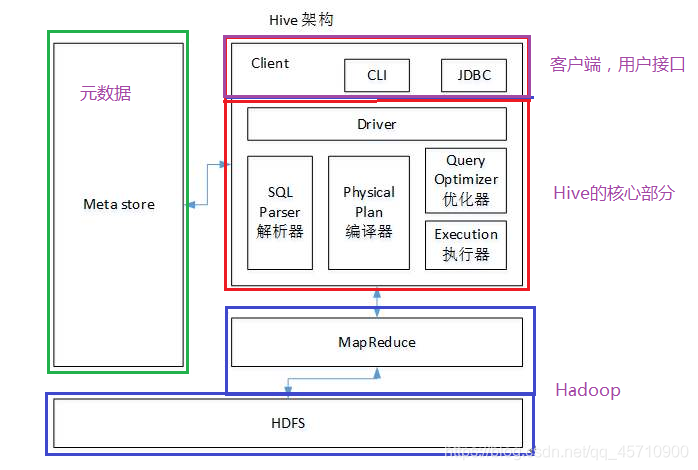
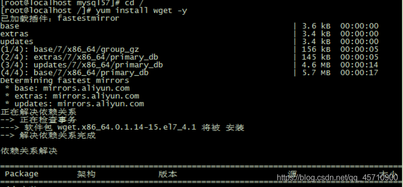
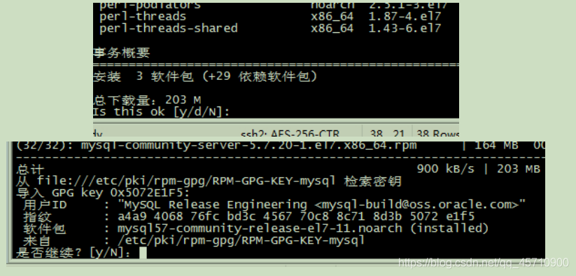
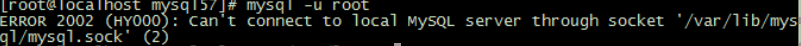
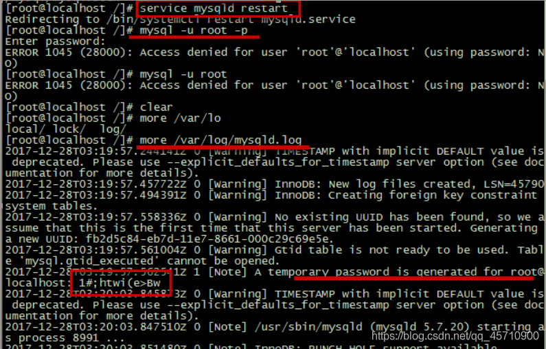
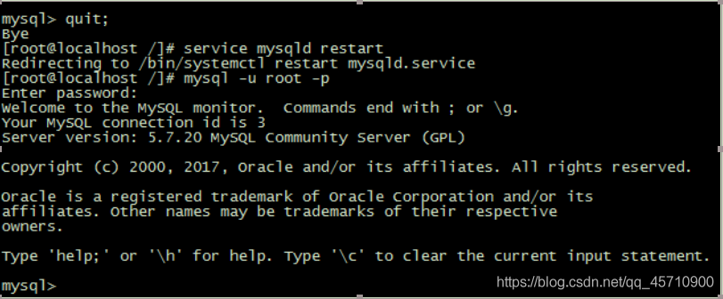
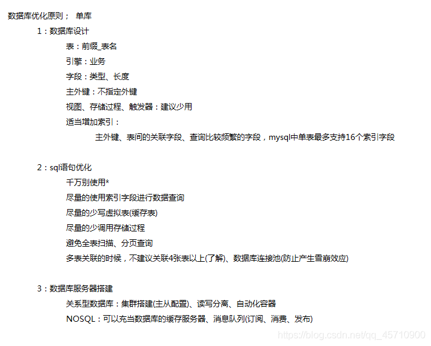

<center>更多内容请关注：</center>


<center><a href="https://wjhub.gitee.io">锁清秋</a></center>

----

# hive 


# 一 . hive

## 1. 概述

```
数据仓库(Data Warehouse)工具
基于Hadoop的
将  结构化的数据文件  映射成一张表
提供了类SQL的HQL的查询功能

本质：将sql语句转换为MapReduce任务进行运行（ 记住 ），本质上就是MapReduce
作用： 对海量的大数据（结构化）  数据进行分析和统计

HQL:HQL是Hibernate Query Language的缩写，提供更加丰富灵活、更为强大的查询能力；
HQL更接近SQL语句查询语法。
数据仓库: 英文名称为Data Warehouse ，存储各种类型的数据，面向主体（分类存储），
          存储大量的数据，数据的不可以更新，可以一直追加数据
```

## 1.2. 组成架构（运行流程）



```
1. 用户使用命令行工具或者JDBC发送HQL
2. 使用Driver驱动结合MetaStore元数据，将指定翻译成MapReduce
3. 首先使用SQL Parser解释器进行HQL的翻译
4. 使用编译器对解释结果进行编译
5. 使用优化器对编译结果进行优化
6. 最后将优化的结果使用执行器进行执行操作（本质上就是在Hadoop集群上使用MapReduce操作）
7. 将处理结果返回给客户端用户


组成：客户端接口、Hive的引擎（驱动）、元数据、Hadoop

说明：
    元数据（数据的描述信息：表的名称，数据库的名称，权限，所有者，组成字段等等）
        默认情况下存储在hive内部自带的derby数据库中
        问题：derby数据库，在同一时刻，只允许一个线程操作
        建议：使用MySQL对元数据进行存储

    Hive的引擎：
        解释器、编译器、优化器、执行器 （顺序）

    Hadoop:
        执行Hive

    Client 接口：用户操作、访问Hive 的方式（jdbc,cli... ...）
```

## 1.3. 特点

```
Hive使用HQL实现对数据的操作，操作方便简单（比MapReduce操作方便）
Hive处理大数据（比MySQL/Oracle强大）
Hive提供的大量的工具
Hive支持自定义函数，使用自定义需求
Hive实现离线数据分析


Hive使用类SQL语句实现功能，处理业务的范围受限（SQL语法所能表达的业务受限）
Hive运行效率较低（延迟高，离线数据分析）
    Hive ----> MapReduce （效率低）（机器转换的）

hadoop  mr    离线
        hive  离线
        hbase 离线 实时
        spark 实时
```

## 4. Hive和数据库的区别

```
Hive不是数据库
能够使用类SQL对数据进行查询操作（和数据库的相同点）

Hive中没有索引（暴力扫描整张表 ， 访问数据延迟高；使用MR，并行访问数据） 

Hive操作的数据是在分布式文件系统（HDFS）上的数据

Hive使用类SQL语言，功能更加的强大（分布式集群数据）

Hive不支持数据的修改

... ...


索引的使用场景：
    税务局：
        白天查询数据
        晚上添加新的数10000条数据据

    提高效率：
        白天查询：给表建立索引
        晚上：创建临时表，没有索引的（索引需要动态维护的），向此表中追加数据
             删除主表的索引，追加新的数据，建立索引

oracle： select * from teacher  where age = 10 and id >10;   
    where后的条件语句的顺序是：从右向左
```

# 二、Hive的搭建

## 2.1. 版本的选择

建议使用 1.x 版本

只需要在一个节点上安装（Master节点）

## 2.2. 步骤

1. 下载
   hive.apache.org

2. 拷贝到linux
   winscp
   设置共享文件夹

3. 解压
   tar -zxvf apache-hive-1.2.1-bin.tar.gz -C /opt/programfile/

4. 配置环境变量（/etc/profile）

   ```
     export HIVE_HOME=/opt/programfile/hive
     export PATH= $PATH:$HIVE_HOME/bin
   ```

   使新的配置生效：source /etc/profile

5. 配置hive

   1. 改名
      cp hive-env.sh.template hive-env.sh

   2. 修改配置（指定hadoop的路径，因为hive基于Hadoop运行的）
      HADOOP_HOME=/opt/programfile/hadoop
      export HIVE_CONF_DIR=/opt/programfile/hive/conf

   3. 开启集群
      start-dfs.sh
      start-yarn.sh

   4. 配置数据仓库的存储路径（数据最终存储在HDFS上）（在HDFS上配置的路径）
      注意：此路径需要具有写权限

      创建数据存储目录：
      hdfs dfs -mkdir /tmp
      hdfs dfs -mkdir -p /user/hive/warehouse

      修改权限：
      hdfs dfs -chmod 777 /tmp
      hdfs dfs -chmod 777 /user/hive/warehouse

## 2.3. 软件的基本操作

### 2.3.1. 进入hive

```
[root@localhost ~] hive  回车
```

### 2.3.2. 操作

```
    show databases;
    use databaseName;
    show tables;
    create table...
    insert into ...
    select ....
```

### 2.3.3. 退出

```
ctrl+c
exit;
quit;
```

### 2.3.4. hive对本地文件数据进行表的映射操作

```
hive> load data local inpath   '/home/zhangsan/cat.txt 文件路径'   into table  表名称 ;

添加失败：当前表没有指定数据属性的分割符好

解决：指定属性间的分隔符
    create table dog(did int ,name string)  
        ROW FORMAT DELIMITED FIELDS  TERNIBATED BY  ',';  //分隔符
```

### 2.3.5. 转移元数据的存储路径

```
问题：derby数据库，在同一时刻，只允许一个进程操作（连接数据库，访问数据库derby）
建议：使用MySQL对元数据进行存储
```

### 2.3.6. metastore的设置方式 ：元数据

```
内嵌方式：
    使用derby数据库作为内嵌的metastore数据库（用于测试），在同一时刻，只允许一个进程操作

外嵌方式（远程方式）：
    使用第三方数据库存储metastore
```

### 2.3.7. 设置metastore的存储路径（选择MySQL数据库进行存储）实现多客户端范文hive

#### 2.3.7.1 安装MySQL数据库（在线安装模式，请保持外网络畅通 )

使用root用户登录系统，并切换到根目录
进入opt文件下，创建文件目录mysql57，并进入）

1. 再次切换到/opt/mysql57目录下，执行下载命令：
   wget http://repo.mysql.com/mysql57-community-release-el7-11.noarch.rpm
2. 如果提示wget命令未找到，则在保持外网网络畅通下执行命令：
   cd /
   yum install wget -y
   
3. 再次切换到/opt/mysql57目录下，执行下载命令：
   wget http://repo.mysql.com/mysql57-community-release-el7-11.noarch.rpm
4. 下载完毕之后，执行如下命令：
   sudo rpm -ivh mysql57-community-release-el7-11.noarch.rpm
5. 执行如下命令，安装mysql数据库
   安装过程中提示如下信息，输入y，然后回车即可
   **sudo yum install mysql-server**
   
   至此，mysql基本安装已经成功，接下来配置mysql一些相关信息
6. 输入如下命令，登录数据库客户端
   mysql -u root
   提示如下信息：
   
   是因为此目录，没有对应的操作权限问题，执行如下命令修改目录权限
   sudo chown -R root:root /var/lib/mysql
   重新启动数据库，执行如下命令：
   service mysqld restart
7. 再次登录，执行如下命令：
   mysql -u root -p
   初始化密码查看：
   通过命令：more /var/log/mysqld.log 获取：1#;htwi(e>Bw
   
8. 再次登录，执行如下命令
   mysql -u root -p 1#;htwi(e>Bw
9. 修改登录密码
   alter user user() identified by ‘12345678’;
10. 提示密码安全问题
    执行如下命令，修改密码安全策略后，再次修改密码
    set global validate_password_policy=0;

重启mysql数据库，测试密码登录
service mysqld restart

至此，centos下，mysql安装成功

#### 2.3.7.2远程连接配置

如果此时需要远程客户端访问数据库，则还需要进行如下配置 ：

1. 开启3306默认端口，并保存
   /sbin/iptables -I INPUT -p tcp --dport 3306 -j ACCEPT

2. 设置远程连接信息

   ```
    mysql -u root -p
    use mysql;
    update user set host='%' where user ='root' and host='localhost';
    select host,user from user;
    set global validate_password_policy=0;
    grant all privileges on *.* to root@'%' identified by 'Likang123qwe' with grant option
   ```

3. 重启mysql服务
   service mysqld restart

4. 其他配置
   取消mysql默认分区表、字段的大小写
   修改配置文件/etc/my.conf

   ```
    lower_case_table_names=1 不区分大小写
    lower_case_table_names=0 默认、区分大小写
   ```

#### 2.3.7.3MySQL管理

1. 查看mysql服务是否启动
   ps -ef|grep mysqld

2. 启动、关闭mysql服务
   service mysqld restart 重启
   service mysqld start 启动
   service mysqld stop 停止

3. 配置文件
   /etc/my.cnf

4. 常见管理命令

   ```
    USE 数据库名 使用数据库
    SHOW DATABASES 列出 MySQL 数据库管理系统的数据库列表
    SHOW TABLES 显示指定数据库的所有表
    SHOW COLUMNS FROM 数据表 显示数据表的属性
    SHOW INDEX FROM 数据表 显示数据表的详细索引信息
    SHOW TABLE STATUS LIKE [FROM db_name] [LIKE 'pattern'] \G: 该命令将输出Mysql数据库管理系统
    的性能及统计信息。
   ```

#### 2.3.7.4 Hive元数据存到到MySQL的参数配置

```
    目的：hive如何能连接上mysql
    
    步骤：
        1. 驱动
            mv /opt/software/mysql-connection-java-xxx.jar  /opt/programfile/hive/lib/

        2. 连接mysql参数配置：user  password  driver  url
            hive-default.xml.template ，  hive的配置文件模板    

        3. 创建一个配置文件：hive-site.xml
            <?xml version="1.0" encoding="UTF-8" standalone="no"?>
            <?xml-stylesheet type="text/xsl" href="configuration.xsl"?>
            <configuration>

                      <property>
                        <name>javax.jdo.option.ConnectionPassword</name>
                        <value>root</value>
                      </property>

                     <property>
                        <name>javax.jdo.option.ConnectionDriverName</name>
                        <value>com.mysql.jdbc.Driver</value>
                      </property>

                      <property>
                        <name>javax.jdo.option.ConnectionUserName</name>
                        <value>root</value>
                      </property>

                     <property>
                        <name>javax.jdo.option.ConnectionURL</name>
                        <value>jdbc:mysql://192.168.175.200:3306/metastore?createDatabaseIfNotExist=true</value>
                      </property>

            </configuration>
```

### 2.3.8. Hive的基本配置

#### 2.3.8.1 配置日志的存储位置

```
    日志文件默认存储位置：/tmp/zhangsan/hive.log

    设置用户自定义的存储位置：
        1. 创建   hive-log4j.properties   
            cp hive-log4j.properties.template  hive-log4j.properties    

        2. 修改参数
            hive.log.dir=/opt/programfile/hive/logs

        3. 重新进入hive，当前日志文件所在的路径发生的变更
```

#### 2.3.8.2 hive-site.xml中进行配置

```
    配置数据仓库的位置：
         <property>
            <name>hive.metastore.warehouse.dir</name>
            <value>/user/hive/warehouse</value>
          </property>

    配置当前数据库提示信息：
          <property>
            <name>hive.cli.print.current.db</name>
            <value>false</value>
          </property>

    配置查询结果的字段提示信息：
          <property>
            <name>hive.cli.print.header</name>
            <value>true</value>
          </property>
```

### 2.3.9. 特有的操作

#### 2.3.9.1. 将文件中的数据存储到数据表中：指定分隔符

```
    hive> load data local inpath  "路径" into table 表名称 （在创建表时，指定了分隔符）

    注意：create table(字段列表... ...)  row format delimited fields terminated "分隔符"
```

#### 2.3.9. 2. 不进入hive，执行sql语句

```
    hive -e  select * from teacher;
        -e 直接在命令行编写sql语句，执行sql语句，不需要进入hive中

    hive -f 文件名称
        -f 直接在文件中编写sql语句，执行sql语句，不需要进入hive中

    hive -f 文件名称     > 结果数据的存储路径  
        将hive命令的结果数据，指定存储到一个文件中
```

#### 2.3.9.3. 在hive查看hdfs文件系统

```
    hive (default)> dfs ls /;

    hive (default)> dfs ls /user/hive/;

    hive (default)> ! ls /home/zhangsan;     //查看本地的文件系统
```

#### 2.3.9.4. 查看hive操作的历史记录

```
    [zhangsan@master /home/zhangsan]$ cat .hivehistory
```

### 2.3.10. 配置文件的修改（优先级）

```
默认的配置、用户编写hive-site.xml配置文件、用户通过命令行实现参数的配置

优先级：从小到大的顺序
```

### 2.3.11. hive 元数据存储到MySQL（初始化）

```
schematool -dbType mysql -initSchema
```

## 2.4 Hive的数据类型

### 2.4.1. 基本数据类型

```
int float double  string boolean  timestamp

在hive中使用string来表示字符串类型的数据，存储数据量为：2G左右       
```

### 2.4.2. 复杂数据类型

```
array、map、struct
```

#### 2.4.2.1 Array

```
    create table arr_tb(name string,score Array<double>)
        row format delimited fields terminated by '\t'  # 设置每行中的每一个属性间的分隔符
        collection items terminated by '_'              # 设置一个数组类型的数据项间的分隔符     
        lines terminated by '\n';                       # 设置多行间的分隔符
```

#### 2.4.2.2 Map

```
    create table hash_tb(name string ,score map<string,double>)
        row format delimited fields terminated by '\t' 
        collection items terminated by '_'
        map keys terminated by ':'          # map中一个数据项的kv的分隔符
        lines terminated by '\n';   
```

#### 2.4.2.3 Struct

```
    create table struct_tb(name string ,score struct<java:double,bigdata:double,mysql:double>)
        row format delimited fields terminated by '\t' 
        collection items terminated by '_'
        lines terminated by '\n';
```

### 2.4.3. hive数据类型向上转型

```
小的数据类型可以转换成大的数据类型       
所有的数据类型类型都可以转成double类型
boolean类型无法转换
```

# 三.Hive数据的DDL,DML

SQL：数据库的核心语言，采纳为操作关系型数据库的国际标准语言（ ISO ）
非关系型数据库引入此语言（ hive : HQL 额外的功能 ）

分类：
数据定义语言 ：Data definition language DDL ，create /drop /alter
数据操作语言 ：Data manipulation language DML ，update /delete /insert
数据查询语言 ：Data Query language DQL ， select

## 1. DDL（和数据无关）

### 1.1 针对数据库

#### 1.1.1. 创建数据库

```
语法：create database  [if not exists]   dbName  [location  path];

例如：
    create database db1;  //    /user/hive/warehouse/
    create database db1;//报错 
    create database if not exists db1;

    create database  db2 location '/user/db2.db';
```

#### 1.1.2. 查看数据库

```
使用某一个数据库：use databaseName;

查看所有的数据库：show databases;

查看某一个数据库的详细信息：desc database [extended]  dbName
```

#### 1.1.3. 修改数据库

```
只能修改数据库的描述信息

语法：alter database  dbName  set dbproperties('desc'='ceshi db');
```

#### 1.1.4. 删除数据库

```
语法：
    drop database [if exists] dbName
```

### 1.2 针对数据表

#### 1.2.1. 创建表

```
完整版的建表语句：

create [external] table [if not exists] tbName
    (col definiton [comment 字段的描述信息] ... ... ...)
    [comment 表的描述信息]

    [PARTITIONED BY (col_name data_type [COMMENT col_comment], ...)] # 创建分区
    [CLUSTERED BY (col_name, col_name, ...)  ]                       # 创建分桶表
    [row format ... ... ...] # 指定表的分隔符
    [location path] # 指定表的存储位置


    [AS select_statement]               # 创建表的方式
    LIKE existing_table_or_view_name    # 创建表的方式

创建表方式一：直接创建
    create table tbName (col  type... ...)

创建表方式二：查询建表法     , AS  （复制表结构，和表中所有数据到新的表中）
    create table tbName 
                as  
            select * from tbName2 ;

创建表方式三：like建表法 , LIKE （只复制表结构，不复制表中所有数据到新的表中）
    create table tbName 
                like
                tbName2;
```

#### 1.2.2. 查看表

```
show tables;  查看当前库中的所有的表
show create table tbName;  查看某一个表的具体的建表语句（获取当前表设置的分隔符信息）

show tables in dbName;  指定查看某一个数据库中的所有的表
show tables like 'stu*' ;  模糊查询多个表

desc tbName; 查看表中的具体的字段信息
desc extended tbName ; 查看表的详情 （查看外部表）
desc formatted tbName ; 查看表的详情 （查看内部表和外部表）
```

#### 1.2.3. 修改表

```
1. 修改表的名称
    alter table tbName  rename to newTbName ;

2. 修改表字段的定义
    添加新的列：
        alter table tbName add columns(colName type... ....)

    修改列定义：change可以修改  列名称 / 列类型 /  列的位置
        alert table tbName change  oldColName  newColName newType  [first|after colName]

    表结构替换： 替换调原来的表结构
        alert table tbName replace  columns(colName type... ....)


注意：hive2.0+版本中，对类型转换进行限制
        小类型 》大类型 ---> 运行
        大类型 》小大类型 ---> 运行
```

#### 1.2.4. 删除表

```
1. 删除内部表
    drop table tbName;
    truncate table tbName;


    注意：更换mysql驱动包的版本

2. 删除外部表
    方式一：
        alter table  tbName set tblproperties('external'='false');  
        drop table tbName;

    方式二：
        hdfs dfs -rm -r -f /user/hive/warehouse/tbName
```

## 2. DML

数据仓库

# 四、表的分类（内部表、外部表、分区表）

## 1. 内部表（管理表）

概述：
默认创建的所有表
当前用户对其拥有所有的操作权限（删除，修改… …）
删除内部表，数据仓库存储的数据被删除，元数据中的内容也被删除

查看表的类型：desc formatted tbName ;
Table Type: MANAGED_TABLE

删除表：
drop table tbName;

注意：删除管理表，将所有数据全部删除

## 2. 外部表

概述：
在创建表时使用external关键字创建的表时外部表
当前用户其拥有部分的操作权限（删除，修改… …）
删除外部表，数据仓库存储的数据不会被删除，元数据中的内容会被删除
适合存储被共享的数据

创建表：
使用关键字 : external

查看表的类型：desc formatted tbName ;
desc extended tbName;
desc tbName;

```
        Table Type:             EXTERNAL_TABLE
```

删除表： 除的删是当前表的元数据
drop table tbName;

注意：删除外部表，不会将所有数据全部删除
创建新的同名称表，数据会进行自动的管理操作

## 3. 分区表

概述：
分区表对当前数据进行划分并存储不同的分区中（ 文件夹 ）
分区表对当前的数据所在的分区进行单独的管理
提高查询效率

创建表：partitioned by

```
create table tbName(col type... ...)
    partitioned by (pCol type)  # 按照什么字段进行分区
    row format delimited fields terminated by ',';
```

例如：创建订单表，order

```
create table partition_tb(id int ,name string)
    partitioned by (year string)  # 按照什么字段进行分区
    row format delimited fields terminated by ',';      
```

导入数据：将一个文件中的所有数据全部加载到一个分区中

```
    load data local inpath ' asdsad' into table partition_tb  
            partition(k=v);
```

查询分区数据：

```
select * from tbName where k=v ; 查询 k所在分区   

select * from tbName where k=v 
    union
    select * from tbName  where k =v2 ; 查询 多个分区 
```

查看表的分区信息：

```
show partitions tbName;
```

删除分区：

```
alter table tbName drop  parititon(k='v') [,parititon(k='v'),parititon(k='v')... ...]           
```

添加分区：一次添加多个分区时，分区间不需要添加逗号

```
alter table tbName add  parititon(k='v') [parititon(k='v') parititon(k='v')... ...]     
```

多级分区表：（本质上就是多层级目录）

```
partitioned by(year string ,month string)  //按照多个字段分区
```

多级分区表查询指定分区的数据：

```
select * from tbName where year=2019 and  month=6
```

## 4. 分区表的数据的上传方式

### 方式一：用户自定义分区目录，上传数据

```
hive (default)> dfs -mkdir -p /user/hive/warehouse/partition_tb2/year=2019/month=7;
hive (default)> dfs -put /home/zhangsan/partition.sql  /user/hive/warehouse/partition_tb2/year=2019/month=7;

修复表上的分区的元数据
    msck repair table partition_tb2; 
```

### 方式二：用户自定义分区目录

```
hive (default)> dfs -mkdir -p /user/hive/warehouse/partition_tb2/year=2019/month=1;
hive (default)> dfs -put /home/zhangsan/partition.sql  /user/hive/warehouse/partition_tb2/year=2019/month=1;

show partitions partition_tb2 ;//查看此表的分区信息

手动的给表添加用户的自定义的分区路径：
    alter table partition_tb2 add partition(year='2019',month='1');
```

### 方式三：

```
hive (default)> dfs -mkdir -p /user/hive/warehouse/partition_tb2/year=2019/month=2;
hive (default)> load data local inpath '/home/zhangsan/partition.sql' into table partition(year='2019',month='2')   
```

# 五、数据的导入导出

## 1. 导入数据

### 方式一：load方式

```
语法：load data [local] inpath  数据源路径 into table tbName [overwrite] [partition(k=v)]

说明：local表示从本地文件系统中导入数据
     不加local 默认从HDFS文件系统中导入数据

情况一：数据从本地导入
    本质：将数据从本地上传到HDFS的数据仓库中

情况二：数据从hdfs加载
    本质：在HDFS上进行数据的移动（不是复制）

    注意：数据源一定需要在hdfs上存在
```

### 方式二：insert语句 （使用少）

```
语法：insert into  table  tbName   [partition(k=v)]    values(v,v,v,v)

此方式底层：将insert语句转换成MR任务执行
          效率较低
```

补充：创建表时，直接导入HDFS上数据， location 指定数据表加载数据的路径
create table tbName(…)
location ‘hdfs path’

```
例如：
    create table load_tb2(id int ,name string)
          > row format delimited fields terminated by '@'
          > location '/home/zhangsan/';
```

## 2导出数据

### 方式一：将数据仓库中的数据表的数据导出到HDFS

```
export table  tbName to 'hdfs path'
```

### 方式二：将数据仓库中的数据表的数据导出到本地

```
dfs -get hiveDataPath  localPath
```

### 方式三：insert overwrite 命令

```
语法格式：insert overwrite [local] directory  path  selectExpr

说明：local表示从本地文件系统中导入数据
     不加local 默认从HDFS文件系统中导入数据   

     path 本地或者HDFS的具体导出路径

例如：insert overwrite local directory /home/zhangsan select * from tbName
```

# 六、数据的查询（ 重点 ）

```
语法：
    select  [ all | distinct] expr | 字段列表
         [
            from  tableName
            where 条件
            group by 分组条件 
            having 过滤
            order by 排序条件
            limit 启动，数量
         ]

模糊查询：like  , not like , rlike

多表查询：
    连接查询：join 
        右连接： 
        左连接：
    合并查询：union

    子查询：

    自连接：

常用的聚合/分组函数：
    max(字段)
    min(字段)
    sum(字段)
    avg(字段)
    count(*|字段)
```

# 七. Hive的DQL

## 1. 语法

```
select [distinct|all] expr，expr... ...
    from tbName
    where whereCondition
    group by colList
    having havingCondition
    order by colList
    cluster by colList 
    limit num
```

## 2. where子句

```
is null
is not null
between...and...
in(v1,v2,v3,... ...) | not in( v1,v2,v3,... ...)
and
or
like | rlike
        %  通配符
        _  占位符
```

## 3. group by 子句

概述：
按照某些字段的值进行分组，有相同值的放置到一起
通常和聚合函数一起使用

SQL案例：
select c1 ,c2
where condition ------>map端执行
group by c1,c2 ------>reduce端执行
having condition ------>reduce端执行

### 3.1 案例：

```
1. 建表
    create table order_tb(oid int ,num int ,pname string ,uid int)
        row format delimited fields terminated by ',';

    导入数据：
        load data local inpath '/home/zhangsan/order.txt' into table order_tb;


    create table user_tb(uid int ,name string ,addr string)
        row format delimited fields terminated by ',';

    导入数据：
        load data local inpath '/home/zhangsan/user.txt' into table user_tb;
2. 注意
    select 后面非聚合列，必须要出现在group by 中
    可以使用as对表和列设置别名

    having和where的区别：
        位置，condition使用的过滤字段，针对的数据（单位：一条数据；单位：一组数据）

3. 按照用户id分组查询订单表
    select o.uid from order_tb as o group by o.uid 

    使用分组函数|聚合函数：查询用户购买商品数量
        select o.uid , count(o.num) from order_tb as o group by o.uid 

    使用分组函数|聚合函数：查询用户购买商品数量，显示数量大于2的信息
        select  o.uid , count(o.num) from order_tb as o group by o.uid having count(o.num) >2;

4. 常见的聚合参数
    count()         
    max()1
    min()
    sum()
    avg()
```

## 4. order by 子句

1. 概述
   按照某些字段进行排序

   现象：order by 可以使用多列进行排序（全局排序），此操作在reduce阶段进行，只有一个reduce
   问题：数据量很大

2. 全局排序：order by
   asc|desc

3. 案例
   select * from order_tb order by num desc;

   select * from order_tb order by num ,oid asc ; // 多字段排序

## 5. sort by 排序

```
在mapreduce内部的排序，不是全局排序

1. 设置reduce的个数
    默认 < 配置文件 < 命令行 

    set key=value 设置属性
    set key 获取属性

    set mapreduce.job.reduces=3; 设置属性值
    set mapreduce.job.reduces  ; 查看属性值


2. 执行排序
    select * from order_tb sort by num;

3. 查看reduce中各个阶段输出的结果数据（将结果导出到本地查看）
    insert overwrite local directory '/home/zhangsan/sortbyResult' 
        select * from order_tb sort by num desc;

总结：只对当前的分区进行内容的排序
```

## 6. distribute by 分区

```
mapreduce中的partition操作,进行分区，结果sort by使用

distribute by字句需要写在sort by之前（先分区，在排序）

案例：sql转成mr时，内部使用oid字段进行分区，使用num字段进行排序
    insert overwrite local directory '/home/zhangsan/distributebyResult'
        select * from order_tb distribute by oid  sort by num desc;
```

## 7. cluster by 分区并排序

```
insert overwrite local directory '/home/zhangsan/clusterbyResult'
        select * from cluster by num ;  

注意：分区和排序的字段需要一致
     不可以指定排序的方向
```

## 8. join 子句（多表连接查询）（子查询）

1. 概述
   两张表m,n之间可以按照on的条件进行连接，m中的一条记录和n表中的一条记录组成一个新的记录。

   join 等值连接（内连接）：只有某个值在m和n中同时存在时，才连接。
   left outer join (左外连接) ：左表中的值无论在右表中是否存在，都输出；右表中的值只有在左表中存在才输出
   right outer join (右外连接) ：相反
   mapjoin （map端完成连接）: 在map端进行表的连接操作，基于内存（优化的方式）

2. 案例
   等值连接：
   select from user_tb u join order_tb o ; // 笛卡尔积现象
   select u.name,o.num,o.pname from user_tb u join order_tb o on u.uid=o.uid ; //添加过滤条件避免，笛卡尔积现象

   左外连接：（和右外连接相对的）
   insert into user_tb values(10004,‘xiaoliu’,‘beijing’);
   select u.name,o.num,o.pname from user_tb u
   left join order_tb o on u.uid=o.uid ;

   注意：表和表的一次连接，代表一个MapReduce 作业job
   如果sql语句中存在多个表之间的连接，会创建多个job作业，连接的顺序就是job执行的顺序

3. 子查询
   SQL语句的嵌套查询

   ```
    select * from (select * from ...)
    selct * from tbName  where col = (select * from ...)
   ```

   嵌套的SQL语句中，子SQL语句的结果 可以作为查询的数据源，也可以作为查询的条件

   统计汽车类型的分布：
   商用 n1/count
   个人 n2/count

   hive:
   select 汽车的类型 , count(*) from cart group by 汽车类型select count(*) from cart

   ```
    select 汽车类型 ， 当前类型数量/ (select count(*) from cart )  from    
        (select 汽车的类型 , count(*) from cart group by 汽车类型)
   ```

# 八、Hive中的分桶

分区：将文件切割成多个子目录
select * from partition(k=v) ;//减少数据量

分桶：将文件切割成多个小文件
采集数据，按照桶采集 //减少数据量
桶中数据的join操作，效率更高 //减少数据量

原理：
MR中：按照key的hash值对reducetask个数求模
Hive中：按照分桶字段的hash值对分桶的个数求模

分桶：
方便抽样（采用数据）
提高join的查询效率

案例：

```
1. 创建表，设置分桶字段
    create table cluster_tb(id int ,name string) 
        clustered by(id) into 4 buckets
        row format delimited fields terminated by ',';

    创建普通表：
        create table cluster_tb2(id int ,name string)
            row format delimited fields terminated by ',';

        load data local inpath '/home/zhangsan/cluster.txt' into table cluster_tb2;

2. 配置属性
    set hive.enforce.bucketing=true
    set mapreduce.job.reduces=-1


3. 使用子查询的方式，将数据添加到cluster_tb中
    insert into table cluster_tb
        select id,name from cluster_tb2 cluster by(id); 
```

数据的采集：
select * from tbName tablesample (bucket startNum out of sizeNum on colName)

```
从startNum开始抽取数据，采取bucketSize/sizeNum的数据
```

# 九、自定义函数

```
1. 查看系统提供的函数列表
    show functions;

2. 查看具体某一个函数的描述信息
    desc function  [extended] 函数名称；

3. 自定义函数User defined function  / UDF    
    3.1 创建一个java项目，导入hive的libs

    3.2 创建类，继承org.apache.hadoop.hive.ql.exec.UDF
        public class FirstChar extends UDF {
        }
    3.3 业务代码
        public String evaluate(final String s) { # 重写此方法 evaluate
                if (s == null) {
                    return null;
                }
                return s.charAt(0)+"";
            }

    3.4 将当前项目打包成jar包，将jar包移动linux上

    3.5 将jar包添加hive的classpath下
        hive> add jar  /opt/software/FirstChar.jar

    3.6 创建临时函数和自定义class 的关联
        hive> create [temporary] function my_func3 as 'cn.xdl.hanshu.FirstChar';

    3.7 HQL中使用自定义函数
        select my_func3(name) from user_tb;
            z
            w
            ...
            ...
```

# 十、优化

## 1. 数据倾斜

maptask和reducetask的个数

### 1.1 maptask的个数： 文件的大小、文件的个数、集群上blocksize的大小

问题：小文件过多的问题 （ maptask并不是越多越好 ）
在map执行前进行合并，减少maptask的个数

```
//配置文件修改配置
      <property>
         <name>hive.input.format</name>
         <value>org.apache.hadoop.hive.ql.io.CombineHiveInputFormat</value>
      </property>


//命令行修改配置
    set hive.input.format = org.apache.hadoop.hive.ql.io.CombineHiveInputFormat
```

问题：字段少，数据量，大小于128M的文件数据处理，造成一个maptask压力过大
添加maptask的个数（ 127.999M<128M — maptask ）

```
    computeSpliteSize(){                 50     128
        return Math.max( 0,   Math.min(maxSize,blockSize))
    }

//命令行修改配置
    set mapreduce.input.fileinputformat.split.maxsize=50  #  默认是256M

127.999  50     ----maptask
         50     ----maptask
         27.999 ----maptask
```

### 1.2 reducetask的个数，合理的设计

设置reduce的个数：
set mapreduce.job.reduces=10； # 一个job中的

reduce的个数决定的输出文件的个数，参考当前环境下的数据量和数据分布

## 2. JVM的重用（性能提升的力度很大50%）

在hadoop的配置文件mapred-site.xml,添加jvm配置：

mapreduce.job.jvm.numtasks
15

JVM的创建和启动会消耗大量的性能，不建议频繁的创建和启动
重用：一个jvm实例在同一个job作业中重用15次。

## 3.Fetch 抓取

Hive对某些操作不执行MapReduce计算
select * from user_tb; //查询语句没有必要去开启mr运算

```
配置文件：hive-site.xml
     <property>
        <name>hive.fetch.task.conversion</name>
        <value>more</value>
        <description>
          0. none : 所有操作都执行mr
          1. minimal : 全表查询，字段查询，limit，分区等操作
          2. more    : 查询和limit语句不走mr (不需要执行mr计算)
        </description>
      </property>   
```

命令行修改：

```
set hive.fetch.task.conversion ; 查看默认值
set hive.fetch.task.conversion = more ; 查看默认值

select * from tbName;//不需要使用mr计算
```

## 4.本地模式

处理数据量非常小，hive可以在本地模式下的一台机器上处理当前job的所有的任务，减少执行时间。

开启本地模式：

```
 //开启本地模式
      <property>
        <name>hive.exec.mode.local.auto</name>
        <value>true</value>
      </property>

 //设置本地模式下能够处理的数据的数量规模  128M
      <property>  
        <name>hive.exec.mode.local.auto.inputbytes.max</name>
        <value>134217728</value>
      </property>

 //设置本地模式下能够处理的数据的个数
      <property>
        <name>hive.exec.mode.local.auto.input.files.max</name>
        <value>4</value>
      </property>
```

命令行：

```
set hive.exec.mode.local.auto=true|false;
```

## 5. 并发执行

Hive将命令划分成多个阶段执行，默认hive一次只执行一个阶段，减少执行时间

设置Hive的并发操作：

```
 //是否并发的执行一个job作业
     <property>
        <name>hive.exec.parallel</name>
        <value>false</value>
      </property>

 //一个job的并发度，默认 8  （此大小的设置和当前机器的硬件配置有关）
      <property>
        <name>hive.exec.parallel.thread.number</name>
        <value>8</value>
      </property>
```

命令行：

```
set hive.exec.parallel = true; //开启任务的并发执行
set hive.exec.parallel.thread.number = 10; //设置一个job的并发度
```

## 6.表的设计和查询优化


mapjoin：在map阶段进行数据的合并
默认情况下，join操作在reduce阶段完成。

```
开启Mapjoin:
        //开启mapjoin
           <property>
             <name>hive.auto.convert.join</name>
             <value>true</value>
            </property>

        //如果文件小于25M则是要被合并小表
          <property>
            <name>hive.mapjoin.smalltable.filesize</name>
            <value>25000000</value> 
          </property>

    set hive.auto.convert.join = true;
    set hive.mapjoin.smalltable.filesize = 20000000;

案例：
    order_tb   join   user_tb

总结：在map阶段进行合并操作，避免reduce数据的倾斜和压力

group by：
    map阶段切割的同一个key------------->一个reduce处理----------->outputFile  （数据倾斜）
        同一个key的数量级大           默认聚合操作在reduce端处理
     在map阶段对key进行聚合操作   

实现：在map端开启聚合操作

     //开启map阶段聚合操作
      <property>
        <name>hive.map.aggr</name>
        <value>true</value>
      </property>


    //map阶段能够聚合的数据量
      <property>
            <name>hive.groupby.mapaggr.checkinterval</name>
             <value>100000</value> //十万条
      </property>


    //如果存在数据倾斜，启动均衡负载   ，默认是关闭
     <property>
        <name>hive.groupby.skewindata</name>
        <value>true</value> 
      </property>

    启动均衡负载原理：
        job-----添加一个新的MR JOB，在当前job的map中将处理结果  随机  交给reduce，避免数据发生倾斜
        然后使用第二个MR JOB实现对结果数据的分组在合并。

    总结：使用两个job,一个实现负载均衡，一个实现最终数据的聚合操作。
```

