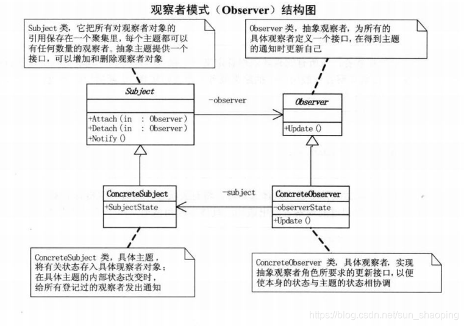

<center>更多内容请关注：</center>


<center><a href="https://wjhub.gitee.io">锁清秋</a></center>

----
# Spring 事件使用-观察者、发布/订阅模式


当系统从小到大演变过程，小的系统一个需求可能就2行代码就解决了，当不断添加新的需求或功能原有的代码就会越来越多，各种 if else语句各种循环，就算将一些功能抽离出使用新的方法，代码的可读性依然会随着系统的功能膨胀变得越来越低，扩展性、可维护性显得越来越重要，设计模式显得也就越来越重要。
本章介绍下，Spring 事件使用及观察者模式，如果对观察者模式有所了解可以直接调到Spring事件

Spring版本最好在4.2以上，低版本有些功能(注解)可能不支持。

## 观察者模式定义

一种一对多的依赖关系，让多个观察者对象同时监听某一个主题对象。这个主题对象状态发生变化时，会通知所有观察者对象，使它们能够自动更新自己。

类图




对于刚刚接触设计模式的童鞋来说，看到它的定义和类图是一脸懵逼，千万不要死记硬背，就算记住了没有理解它的使用场景，在正式开发过程中根本想不到使用它，或变成了为了使用设计模式而使用设计模式。

MQ(消息队列中间件)就是这个设计模式的实现，如：RabbitMQ、ActiveMQ、Kafka等等；将一段消息发送到MQ继续处理其他逻辑，不需要关心消息是否被处理。

## 自定义观察者模式

自定义实现观察者模式，所有对象的创建交给Spring容器

主题类Subject

```java
package com.example.custom;

import org.springframework.beans.factory.annotation.Autowired;
import org.springframework.stereotype.Component;

import java.util.List;
/**
 * 观察的主题，主题发生变化通知所用观察者
 * @author: sunshaoping
 * @date: Create by in 15:29 2021-6-13
 */
@Component
public class Subject {
    private final List<Observer> observerList;
    /**
     * Spring 容器中所有实现Observer接口的实例
     * @param observerList 所有实现Observer接口的实例
     */
    @Autowired
    public Subject(List<Observer> observerList) {
        this.observerList = observerList;
    }
    /**
     * 通知观察者
     * @param content 通知内容
     */
    public void notify(String content) {
        //通知全部观察者
        for (Observer observer : observerList) {
            observer.update(content);
        }
    }
}
```

观察者接口`Observer`

```java
package com.example.custom;

/**
 * 观察者/监听者
 * @author: sunshaoping
 * @date: Create by in 15:25 2021-6-13
 */
public interface Observer {
    /**
     * 被观察者发布通知时，调用改方法
     * @param content 通知内容，此处使用的是String，它可以是任意对象
     */
    void update(String content);

}
```

观察者1实现

```java
package com.example.custom;

import org.springframework.stereotype.Component;

/**
 * 观察者1
 * @author: sunshaoping
 * @date: Create by in 15:42 2021-6-13
 */
@Component
public class ObserverOne implements Observer {

    @Override
    public void update(String content) {
        System.out.println("我是观察者1，得到了通知：" + content);
    }
}
```

观察者2实现

```java
package com.example.custom;

import org.springframework.stereotype.Component;

/**
 * 观察者2
 * @author: sunshaoping
 * @date: Create by in 15:42 2021-6-13
 */
@Component
public class ObserverTwo implements Observer {

    @Override
    public void update(String content) {
        System.out.println("我是观察者2，得到了通知：" + content);
    }
}
```

发布通知测试

```java
package com.example.custom;

import org.junit.Test;
import org.junit.runner.RunWith;
import org.springframework.beans.factory.annotation.Autowired;
import org.springframework.boot.test.context.SpringBootTest;
import org.springframework.test.context.junit4.SpringRunner;

import static org.junit.Assert.*;

/**
 * @author: sunshaoping
 * @date: Create by in 15:48 2021-6-13
 */
@RunWith(SpringRunner.class)
@SpringBootTest
public class SubjectTest {

    @Autowired
    Subject subject;

    @Test
    public void notify1() {
        subject.notify("您的支付宝到账100W ");
        subject.notify("您的工资发放 10W ");
    }
}
```

这里只列举了一个主题和两个观察者，观察者可以任意增加，不影响现有的代码的逻辑，这就是设计模式的好处。

## Java API观察者模式

其实java1.0就有了对观察者模式的实现，发展到现在基本上已经废弃了(java11已经废弃)，但是并不影响我们使用它对观察者模式的讲解。

只需要实现一个观察者接口(Observer)和继承一个可观察类(Observable)，分别对应自定义观察者模式 Observer(观察者)和Subject(主题)，下面是简单的实现

可观察类：MyObservable

```java
package com.example.java;

import java.util.Observable;

public class MyObservable extends Observable {
    public MyObservable() {
        setChanged();
    }
}
```

观察者：MyObserver

```java
package com.example.java;

import java.util.Observable;
import java.util.Observer;

public class MyObserver implements Observer {
    @Override
    public void update(Observable o, Object arg) {
        System.out.println("java 观察者，收到 :" + arg);
    }
}

```

测试类：Test

```java
package com.example.java;

import java.util.Observable;

public class Test {

    public static void main(String[] args) {
        Observable observable = new MyObservable();
        //添加观察者
        observable.addObserver(new MyObserver());
        //发布消息
        observable.notifyObservers("您的快递到了，请下楼领取 ");


    }
}
```

是不是实现原理基本上是一样的。

## Spring事件

正式进入主题Spring事件机制，

首先我们体验下我们订单为例

### 事件初体验

业务场景：监听订单创建时锁定指定商品

订单实体，省略get/set方法


```java
public class Order {
    /**
     * 订单编号
     */
    private String orderNo;

/**
 * 订单状态
 */
private String orderStatus;
/**
 * 商品
 */
private String goods;
/**
 * 创建时间
 */
private LocalDateTime createTime;
```

订单Service，保存订单逻辑处理

```java
@Service
public class OrderService implements ApplicationEventPublisherAware {

    private ApplicationEventPublisher applicationEventPublisher;

    /**
     * 订单保存
     */
    public void save(Order order) {
        //生成订单号
        String orderNo = getOrderNo();
        order.setOrderNo(orderNo);
        order.setOrderStatus("待付款");
        order.setCreateTime( LocalDateTime.now());
        System.out.println("订单保存成功：" + order);
        //发布订单创建事件
        applicationEventPublisher.publishEvent(new OrderCreateEvent(this, order));

    }

    private String getOrderNo() {
        String millis = String.valueOf(System.currentTimeMillis());
        String str = millis.substring(millis.length() - 7, millis.length() - 1);
        return LocalDate.now().format(DateTimeFormatter.ofPattern("yyyyMMdd")) + str;
    }

    @Override
    public void setApplicationEventPublisher(ApplicationEventPublisher applicationEventPublisher) {

        this.applicationEventPublisher = applicationEventPublisher;
    }
}
```

订单创建对象，实现`ApplicationEvent`接口

```java
public class OrderCreateEvent extends ApplicationEvent {

    private final Order order;

    public OrderCreateEvent(Object source, Order order) {
        super(source);
        this.order = order;
    }

    public Order getOrder() {
        return order;
    }
}
```

订单事件监听，实现`ApplicationListener`接口，锁定商品

```java
@Component
public class OrderCreateEventListener implements ApplicationListener<OrderCreateEvent> {


    @Override
    public void onApplicationEvent(OrderCreateEvent event) {
        System.out.printf("ApplicationListener 接口实现，订单号[%s]：,锁定商品[%s]\n",
                event.getOrder().getOrderNo(), event.getOrder().getGoods());
    }
}
```

使用起来是不是很简单，而且它是Spring一个功能只要是Spring项目就可以使用(基本java项目都在使用Spring)，这部分只展示了它的功能的小小一块。

### 简单的 Application Event

事件对象实现ApplicationEvent抽象类，如果上面的订单创建事件对象OrderCreateEvent

```java
public class OrderCreateEvent extends ApplicationEvent 
```

监听类实现`ApplicationListener<OrderCreateEvent>`通过泛型的方式 `OrderCreateEventListener`

发布这个事件

```java
applicationEventPublisher.publishEvent(new OrderCreateEvent(this, order));
```

上面是最简单Spring 事件实现方式。

### 注解驱动 @EventListener

事件监听不在用`ApplicationListener`接口，而是基于注解`@EventListener`驱动

```java
@Component
public class OrderCreateEventListenerAnnotation {
    
    @EventListener
    public void orderCreateEvent(OrderCreateEvent event) {
        System.out.println("订单创建事件，@EventListener 注解驱动实现");
    }
}
```

实现起来是不是很简单

如果在方法内没有使用事件对象，方法上也可以去掉它，但是要指定这个方法监听的是哪个事件类。如：

```java
@Component
public class OrderCreateEventListenerAnnotation {
    @EventListener(OrderCreateEvent.class)
    public void orderCreateEvent() {
        System.out.println("订单创建事件，@EventListener 注解驱动实现");
    }
}
```

#### 条件事件

在一些时候可能只要满足某些条件才进行对事件监听，这时就可以用`@EventListener#condition`属性来指定条件，条件是一个SpEL表达式，关于SpEL请参考[baeldung SpEL](https://www.baeldung.com/spring-expression-language) 或[官网SpEL](https://docs.spring.io/spring/docs/4.3.10.RELEASE/spring-framework-reference/html/expressions.html)

只有订单状态是待付款才监听才有效。

```java
@EventListener(condition = "#event.order.orderStatus eq '待付款'")
public void orderCreateEventCondition(OrderCreateEvent event) {
    System.out.println("订单创建事件，@EventListener 注解驱动实现");
}
```

### 异步事件

覆盖默认`ApplicationEventMulticaster`，通过源码就可以知道它的原理

`AbstractApplicationContext#initApplicationEventMulticaster`初始化方法

```java
/**
 * Initialize the ApplicationEventMulticaster.
 * Uses SimpleApplicationEventMulticaster if none defined in the context.
 * @see org.springframework.context.event.SimpleApplicationEventMulticaster
 */
protected void initApplicationEventMulticaster() {
   ConfigurableListableBeanFactory beanFactory = getBeanFactory();
    //IOC容器中存在
    //beanName=APPLICATION_EVENT_MULTICASTER_BEAN_NAME("applicationEventMulticaster")
    //使用容器中的对象
   if (beanFactory.containsLocalBean(APPLICATION_EVENT_MULTICASTER_BEAN_NAME)) {
      this.applicationEventMulticaster =
            beanFactory.getBean(APPLICATION_EVENT_MULTICASTER_BEAN_NAME, ApplicationEventMulticaster.class);
      if (logger.isTraceEnabled()) {
         logger.trace("Using ApplicationEventMulticaster [" + this.applicationEventMulticaster + "]");
      }
   }
   else {
       //否则使用 SimpleApplicationEventMulticaster
      this.applicationEventMulticaster = new SimpleApplicationEventMulticaster(beanFactory);
      beanFactory.registerSingleton(APPLICATION_EVENT_MULTICASTER_BEAN_NAME, this.applicationEventMulticaster);
      if (logger.isTraceEnabled()) {
         logger.trace("No '" + APPLICATION_EVENT_MULTICASTER_BEAN_NAME + "' bean, using " +
               "[" + this.applicationEventMulticaster.getClass().getSimpleName() + "]");
      }
   }
}
```

通过上面一段源码，我们就可以自定义实现ApplicationEventMulticaster接口，只需要向IOC容器中注册一个beanName="applicationEventMulticaster"实现ApplicationEventMulticaster接口的对象就可以覆盖默认事件发布规则了。

```java
@Configuration
public class AsynchronousSpringEventsConfig {
    @Bean(name = "applicationEventMulticaster")
    public ApplicationEventMulticaster simpleApplicationEventMulticaster() {
        SimpleApplicationEventMulticaster eventMulticaster = new SimpleApplicationEventMulticaster();
        //设置任务执行器
        eventMulticaster.setTaskExecutor(new SimpleAsyncTaskExecutor());
        return eventMulticaster;
    }
}
```

上面的代码就实现了异步发布事件，这个是全局定义所有Spring 事件都会变成异步；

如果想要一部分事件是异步一部分是同步的就不满足要求了，接下来我们讲一下针对一个事件监听或事件实现异步支持。

### 异步事件@Async

结合@Async注解实现异步事件，使用很简单，只需要在相关方法或类上添加@Async注解，使用在方法上只针对这一个方法异步调用，使用在类上所有的方法都是异步调用；必须使用注解@EnableAsync开启异步功能

开启异步

```java
@EnableAsync
@SpringBootApplication
public class SpringEventExampleApplication {

   public static void main(String[] args) {
      SpringApplication.run(SpringEventExampleApplication.class, args);
   }
}
```

异步监听事件

```java
@Async
@EventListener
public void orderCreateEventAsync(OrderCreateEvent event) {
    System.out.println("订单创建事件，@EventListener 注解驱动实现");
}
```

### 泛型支持

也可以自定义泛型类实现事件调度。

让我们创建一个泛型事件类，没有继承任何父类或接口。

泛型事件类：

```java
public class GenericEvent<T> {
    private final T data;
    public GenericEvent(T data) {
        this.data = data;
    }
    public T getData() {
        return data;
    }
}
```

泛型事件用注解驱动监听 `@EventListener`：

```java
@EventListener
public void orderListener(GenericEvent<Order> event) {
    System.out.println("通用泛型事件监听，订单");
}
```

事件对象可以是任意对象，也可以不是泛型类型，比如我们直接发布一个`Order`监听一个`Order`

`Order`发布

```java
applicationEventPublisher.publishEvent(order);
```

`Order`监听

```java
@EventListener
public void order(Order order) {
    System.out.println("监听一个订单");
}
```

这样就不用专门创建一个事件对象，是不是更简单了。

### 事物事件@TransactionalEventListener

从Spring4.2开始提供了一个新的事件监听注解@TransactionalEventListener，它是@EventListener的扩展，允许将事件的监听绑定到事物的一个阶段。有以下四个阶段：

AFTER_COMMIT（默认值）事务成功提交时触发事件
AFTER_ROLLBACK - 事务回滚
AFTER_COMPLETION - 事务已完成（AFTER_COMMIT 或 AFTER_ROLLBACK）
BEFORE_COMMIT 在事务提交之前触发事件

```java
@TransactionalEventListener(phase = BEFORE_COMMIT)
public void txEvent(Order order) {
    System.out.println("事物监听");
}
```

仅当存在事件生成器正在运行且即将提交的事务时，才会调用此侦听器。

并且，如果没有正在运行的事务，则根本不发送事件，除非我们通过将fallbackExecution 属性设置为true来覆盖它 ，即@TransactionalEventListener(fallbackExecution = true)。

### 新事件继续传播

当我们监听一个事件处理完成时，还需要发布另一个事件，一般我们想到的是调用ApplicationEventPublisher#publishEvent发布事件方法，但Spring提供了另一种更加灵活的新的事件继续传播机制，监听方法返回一个事件，也就是方法的返回值就是一个事件对象。

监听方法方法返回一个新的事件

```java
@EventListener
public OrderCreateEvent orderReturnEvent(Order order) {
    System.out.println("监听一个订单,返回一个新的事件 OrderCreateEvent");
    return new OrderCreateEvent(this,order);
}
```

监听方法方法返回多个事件-集合

```java
@EventListener
public Collection<OrderCreateEvent> orderReturnListEvent(Order order) {
	System.out.println("监听一个订单,返回集合的事件 OrderCreateEvent");
    return Collections.singleton(new OrderCreateEvent(this, order));
}
```

监听方法方法返回多个事件-数组

```java
@EventListener
public Object[] orderReturnArrayEvent(Order order) {
    System.out.println("监听一个订单,返回数组的事件 OrderCreateEvent");
    return new OrderCreateEvent[]{new OrderCreateEvent(this, order), new OrderCreateEvent(this, order)};
}
```

> 注意返回集合事件时，集合内事件类型可以不同。

总结
本章节从观察者模式为入口点，分别以自定义、java API、Spring 事件介绍了他们对观察者模式的实现。

Spring事件各种发布和监听的方式，我们可以根据业务情况任意选择。

如果你的项目Spring版本低于4.2基于注解驱动方式则不适合，只能继承事件类或实现监听接口的方式。


原文链接：https://blog.csdn.net/sun_shaoping/article/details/84067446