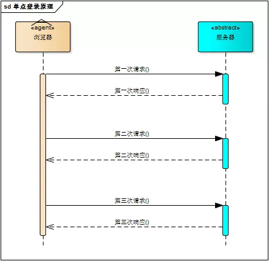
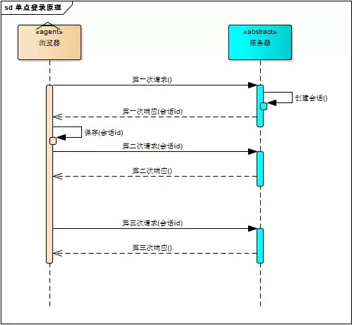
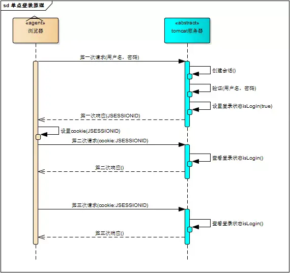
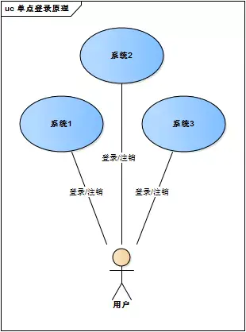
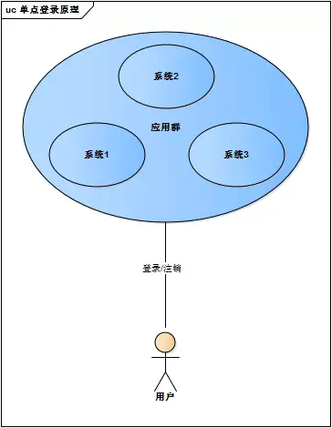
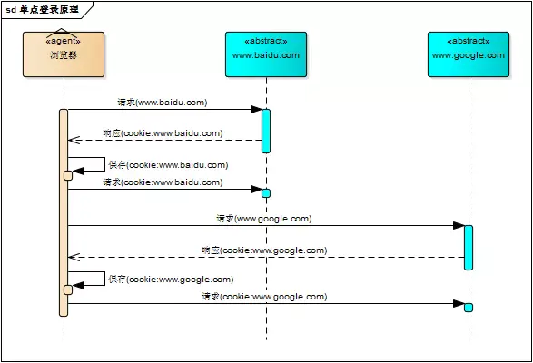
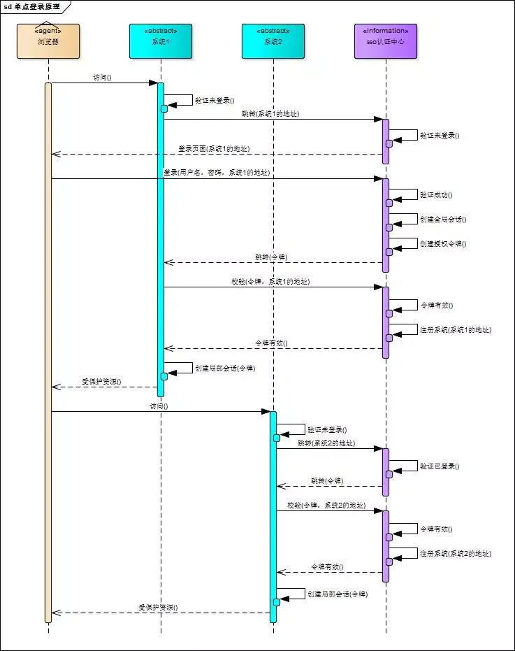
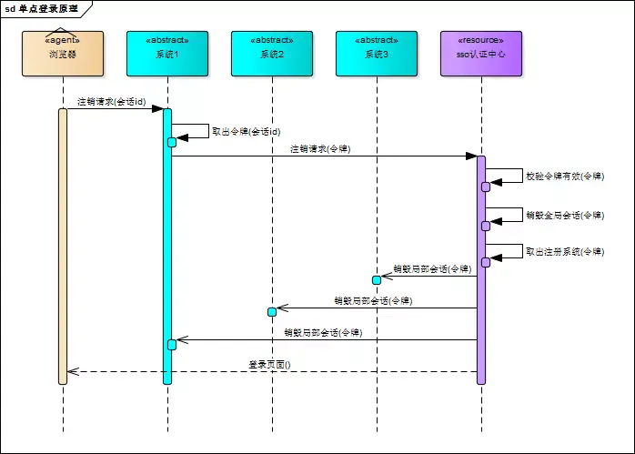
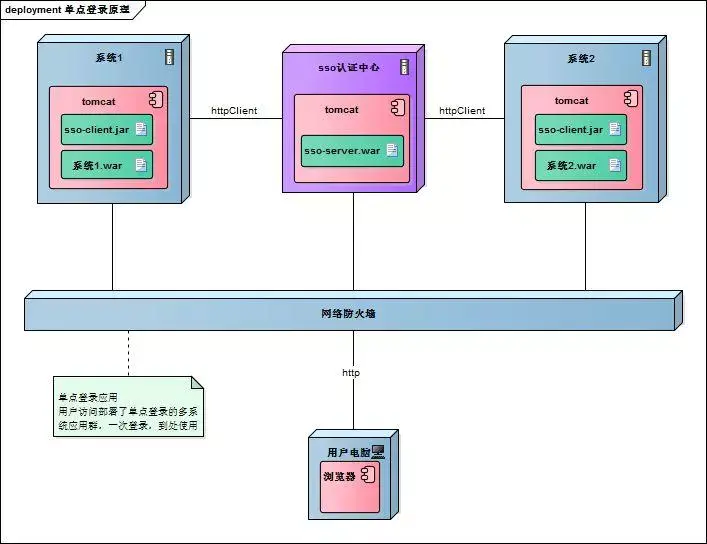
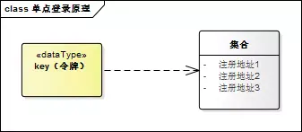

<center>更多内容请关注：</center>


<center><a href="https://wjhub.gitee.io">锁清秋</a></center>

----

## 一、什么是单点登录

单点登录的英文名叫做：`Single Sign On（简称SSO）`。

简单来说，单点登录就是在多个系统中，用户只需一次登录，各个系统即可感知该用户已经登录。

## 二、单系统登录

众所周知，HTTP是无状态的协议，这意味着服务器无法确认用户的信息。于是乎，W3C就提出了：给每一个用户都发一个通行证，无论谁访问的时候都需要携带通行证，这样服务器就可以从通行证上确认用户的信息。通行证就是Cookie。

如果说Cookie是检查用户身上的”通行证“来确认用户的身份，那么Session就是通过检查服务器上的”客户明细表“来确认用户的身份的。Session相当于在服务器中建立了一份“客户明细表”。

HTTP协议是无状态的，Session不能依据HTTP连接来判断是否为同一个用户。于是乎：服务器向用户浏览器发送了一个名为 JESSIONID 的Cookie，它的值是Session的id值。其实Session是依据Cookie来识别是否是同一个用户。

所以，一般我们单系统实现登录会这样做：

- 登录：将用户信息保存在Session对象中
  - 如果在Session对象中能查到，说明已经登录
  - 如果在Session对象中查不到，说明没登录（或者已经退出了登录）
- 注销（退出登录）：从Session中删除用户的信息
- 记住我（关闭掉浏览器后，重新打开浏览器还能保持登录状态）：配合Cookie来用

Example：

```java
/**
 * 用户登陆
 */
@PostMapping(value = "/user/session", produces = {"application/json;charset=UTF-8"})
public Result login(String mobileNo, String password, String inputCaptcha, HttpSession session, HttpServletResponse response) {

    //判断验证码是否正确
    if (WebUtils.validateCaptcha(inputCaptcha, "captcha", session)) {

        //判断有没有该用户
        User user = userService.userLogin(mobileNo, password);
        if (user != null) {
            /*设置自动登陆，一个星期.  将token保存在数据库中*/
            String loginToken = WebUtils.md5(new Date().toString() + session.getId());
            user.setLoginToken(loginToken);
            User user1 = userService.userUpload(user);

            session.setAttribute("user", user1);

            CookieUtil.addCookie(response,"loginToken",loginToken,604800);

            return ResultUtil.success(user1);

        } else {
            return ResultUtil.error(ResultEnum.LOGIN_ERROR);
        }
    } else {
        return ResultUtil.error(ResultEnum.CAPTCHA_ERROR);
    }

}

/**
 * 用户退出
 */
@DeleteMapping(value = "/session", produces = {"application/json;charset=UTF-8"})
public Result logout(HttpSession session,HttpServletRequest request,HttpServletResponse response ) {

    //删除session和cookie
    session.removeAttribute("user");

    CookieUtil.clearCookie(request, response, "loginToken");

    return ResultUtil.success();
}
/**
* @author ozc
* @version 1.0
* <p>
* 拦截器；实现自动登陆功能
*/
public class UserInterceptor implements HandlerInterceptor {


@Autowired
private UserService userService;

public boolean preHandle(HttpServletRequest request, HttpServletResponse response, Object o) throws Exception {
    User sessionUser = (User) request.getSession().getAttribute("user");

    // 已经登陆了，放行
    if (sessionUser != null) {
        return true;
    } else {
        //得到带过来cookie是否存在
        String loginToken = CookieUtil.findCookieByName(request, "loginToken");
        if (StringUtils.isNotBlank(loginToken)) {
            //到数据库查询有没有该Cookie
            User user = userService.findUserByLoginToken(loginToken);
            if (user != null) {
                request.getSession().setAttribute("user", user);
                return true;
            } else {
                //没有该Cookie与之对应的用户(Cookie不匹配)
                CookieUtil.clearCookie(request, response, "loginToken");
                return false;
            }
        } else {

            //没有cookie、也没有登陆。是index请求获取用户信息，可以放行
            if (request.getRequestURI().contains("session")) {
                return true;
            }

            //没有cookie凭证
            response.sendRedirect("/login.html");
            return false;
        }
    }
}
}
```

总结一下上面代码的思路：

- 用户登录时，验证用户的账户和密码
- 生成一个Token保存在数据库中，将Token写到Cookie中
- 将用户数据保存在Session中
- 请求时都会带上Cookie，检查有没有登录，如果已经登录则放行

## 三、多系统登录的问题与解决

### 3.1 Session不共享问题

单系统登录功能主要是用Session保存用户信息来实现的，但我们清楚的是：多系统即可能有多个Tomcat，而Session是依赖当前系统的Tomcat，所以系统A的Session和系统B的Session是不共享的。


解决系统之间Session不共享问题有一下几种方案：

- Tomcat集群Session全局复制（集群内每个tomcat的session完全同步）【会影响集群的性能呢，不建议】
- 根据请求的IP进行Hash映射到对应的机器上（这就相当于请求的IP一直会访问同一个服务器）【如果服务器宕机了，会丢失了一大部分Session的数据，不建议】
- 把Session数据放在Redis中（使用Redis模拟Session）【建议】

我们可以将登录功能单独抽取出来，做成一个子系统。


SSO（登录系统）的逻辑如下：

```java
// 登录功能(SSO单独的服务)
@Override
public TaotaoResult login(String username, String password) throws Exception {

    //根据用户名查询用户信息
    TbUserExample example = new TbUserExample();
    Criteria criteria = example.createCriteria();
    criteria.andUsernameEqualTo(username);
    List<TbUser> list = userMapper.selectByExample(example);
    if (null == list || list.isEmpty()) {
        return TaotaoResult.build(400, "用户不存在");
    }
    //核对密码
    TbUser user = list.get(0);
    if (!DigestUtils.md5DigestAsHex(password.getBytes()).equals(user.getPassword())) {
        return TaotaoResult.build(400, "密码错误");
    }
    //登录成功，把用户信息写入redis
    //生成一个用户token
    String token = UUID.randomUUID().toString();
    jedisCluster.set(USER_TOKEN_KEY + ":" + token, JsonUtils.objectToJson(user));
    //设置session过期时间
    jedisCluster.expire(USER_TOKEN_KEY + ":" + token, SESSION_EXPIRE_TIME);
    return TaotaoResult.ok(token);
}
```

其他子系统登录时，请求SSO（登录系统）进行登录，将返回的token写到Cookie中，下次访问时则把Cookie带上：

```java
public TaotaoResult login(String username, String password,
        HttpServletRequest request, HttpServletResponse response) {
    //请求参数
    Map<String, String> param = new HashMap<>();
    param.put("username", username);
    param.put("password", password);
    //登录处理
    String stringResult = HttpClientUtil.doPost(REGISTER_USER_URL + USER_LOGIN_URL, param);
    TaotaoResult result = TaotaoResult.format(stringResult);
    //登录出错
    if (result.getStatus() != 200) {
        return result;
    }
    //登录成功后把取token信息，并写入cookie
    String token = (String) result.getData();
    //写入cookie
    CookieUtils.setCookie(request, response, "TT_TOKEN", token);
    //返回成功
    return result;

}
```

总结：

- SSO系统生成一个token，并将用户信息存到Redis中，并设置过期时间
- 其他系统请求SSO系统进行登录，得到SSO返回的token，写到Cookie中
- 每次请求时，Cookie都会带上，拦截器得到token，判断是否已经登录

到这里，其实我们会发现其实就两个变化：

- 将登陆功能抽取为一个系统（SSO），其他系统请求SSO进行登录
- 本来将用户信息存到Session，现在将用户信息存到Redis

### 3.2 Cookie跨域的问题

上面我们解决了Session不能共享的问题，但其实还有另一个问题。Cookie是不能跨域的

比如说，我们请求<https://www.google.com/>时，浏览器会自动把google.com的Cookie带过去给google的服务器，而不会把<https://www.baidu.com/>的Cookie带过去给google的服务器。

这就意味着，由于域名不同，用户向系统A登录后，系统A返回给浏览器的Cookie，用户再请求系统B的时候不会将系统A的Cookie带过去。

针对Cookie存在跨域问题，有几种解决方案：

- 服务端将Cookie写到客户端后，客户端对Cookie进行解析，将Token解析出来，此后请求都把这个Token带上就行了
- 多个域名共享Cookie，在写到客户端的时候设置Cookie的domain。
- 将Token保存在SessionStroage中（不依赖Cookie就没有跨域的问题了）

到这里，我们已经可以实现单点登录了。

### 3.3 CAS原理

说到单点登录，就肯定会见到这个名词：CAS （`Central Authentication Service`）。

如果已经将登录单独抽取成系统出来，我们还能这样玩:

现在我们有两个系统，分别是 www.java3y.com 和 www.java4y.com，一个SSO www.sso.com


首先，用户想要访问系统A www.java3y.com受限的资源(比如说购物车功能，购物车功能需要登录后才能访问)，系统A www.java3y.com发现用户并没有登录，于是重定向到sso认证中心，并将自己的地址作为参数。请求的地址如下：

- www.sso.com?service=www.java3y.com

sso认证中心发现用户未登录，将用户引导至登录页面，用户进行输入用户名和密码进行登录，用户与认证中心建立全局会话（生成一份Token，写到Cookie中，保存在浏览器上）


随后，认证中心重定向回系统A，并把Token携带过去给系统A，重定向的地址如下：

- www.java3y.com?token=xxxxxxx

接着，系统A去sso认证中心验证这个Token是否正确，如果正确，则系统A和用户建立局部会话（创建Session）。到此，系统A和用户已经是登录状态了。


此时，用户想要访问系统B www.java4y.com受限的资源(比如说订单功能，订单功能需要登录后才能访问)，系统B www.java4y.com发现用户并没有登录，于是重定向到sso认证中心，并将自己的地址作为参数。请求的地址如下：

- www.sso.com?service=www.java4y.com

注意，因为之前用户与认证中心www.sso.com已经建立了全局会话（当时已经把Cookie保存到浏览器上了），所以这次系统B重定向到认证中心www.sso.com是可以带上Cookie的。

认证中心根据带过来的Cookie发现已经与用户建立了全局会话了，认证中心重定向回系统B，并把Token携带过去给系统B，重定向的地址如下：

- www.java4y.com?token=xxxxxxx

接着，系统B去sso认证中心验证这个Token是否正确，如果正确，则系统B和用户建立局部会话（创建Session）。到此，系统B和用户已经是登录状态了。


看到这里，其实SSO认证中心就类似一个中转站。

参考资料：

- <https://zhuanlan.zhihu.com/p/66037342>

---

-- 简单代码实现JWT(json web token)完成SSO单点登录--


————————————-===================================

============================================================

# 单点登录###

### 一、单系统登录机制

1、http无状态协议

web应用采用browser/server架构，http作为通信协议。http是无状态协议，浏览器的每一次请求，服务器会独立处理，不与之前或之后的请求产生关联，这个过程用下图说明，三次请求/响应对之间没有任何联系。

​         

 

但这也同时意味着，任何用户都能通过浏览器访问服务器资源，如果想保护服务器的某些资源，必须限制浏览器请求；要限制浏览器请求，必须鉴别浏览器请求，响应合法请求，忽略非法请求；要鉴别浏览器请求，必须清楚浏览器请求状态。既然http协议无状态，那就让服务器和浏览器共同维护一个状态吧！这就是会话机制。

 

## 2、会话机制

浏览器第一次请求服务器，服务器创建一个会话，并将会话的id作为响应的一部分发送给浏览器，浏览器存储会话id，并在后续第二次和第三次请求中带上会话id，服务器取得请求中的会话id就知道是不是同一个用户了，这个过程用下图说明，后续请求与第一次请求产生了关联。          

服务器在内存中保存会话对象，浏览器怎么保存会话id呢？你可能会想到两种方式。

### 请求参数cookie

将会话id作为每一个请求的参数，服务器接收请求自然能解析参数获得会话id，并借此判断是否来自同一会话，很明显，这种方式不靠谱。那就浏览器自己来维护这个会话id吧，每次发送http请求时浏览器自动发送会话id，cookie机制正好用来做这件事。cookie是浏览器用来存储少量数据的一种机制，数据以”key/value“形式存储，浏览器发送http请求时自动附带cookie信息。

tomcat会话机制当然也实现了cookie，访问tomcat服务器时，浏览器中可以看到一个名为“JSESSIONID”的cookie，这就是tomcat会话机制维护的会话id，使用了cookie的请求响应过程如下图。

 

## 3、登录状态

有了会话机制，登录状态就好明白了，我们假设浏览器第一次请求服务器需要输入用户名与密码验证身份，服务器拿到用户名密码去数据库比对，正确的话说明当前持有这个会话的用户是合法用户，应该将这个会话标记为“已授权”或者“已登录”等等之类的状态，既然是会话的状态，自然要保存在会话对象中，tomcat在会话对象中设置登录状态如下。

HttpSession session = request.getSession();

session.setAttribute("isLogin", true);

用户再次访问时，tomcat在会话对象中查看登录状态


HttpSession session = request.getSession();

session.getAttribute("isLogin");

实现了登录状态的浏览器请求服务器模型如下图描述。




每次请求受保护资源时都会检查会话对象中的登录状态，只有 isLogin=true 的会话才能访问，登录机制因此而实现。


## 二、多系统的复杂性

web系统早已从久远的单系统发展成为如今由多系统组成的应用群，面对如此众多的系统，用户难道要一个一个登录、然后一个一个注销吗？就像下图描述的这样。



web系统由单系统发展成多系统组成的应用群，复杂性应该由系统内部承担，而不是用户。无论web系统内部多么复杂，对用户而言，都是一个统一的整体，也就是说，用户访问web系统的整个应用群与访问单个系统一样，登录/注销只要一次就够了。



虽然单系统的登录解决方案很完美，但对于多系统应用群已经不再适用了，为什么呢？

单系统登录解决方案的核心是cookie，cookie携带会话id在浏览器与服务器之间维护会话状态。但cookie是有限制的，这个限制就是cookie的域（通常对应网站的域名），浏览器发送http请求时会自动携带与该域匹配的cookie，而不是所有cookie。



既然这样，为什么不将web应用群中所有子系统的域名统一在一个顶级域名下，例如“*.baidu.com”，然后将它们的cookie域设置为“baidu.com”，这种做法理论上是可以的，甚至早期很多多系统登录就采用这种同域名共享cookie的方式。

然而，可行并不代表好，共享cookie的方式存在众多局限。首先，应用群域名得统一；其次，应用群各系统使用的技术（至少是web服务器）要相同，不然cookie的key值（tomcat为JSESSIONID）不同，无法维持会话，共享cookie的方式是无法实现跨语言技术平台登录的，比如java、php、.net系统之间；第三，cookie本身不安全。

因此，我们需要一种全新的登录方式来实现多系统应用群的登录，这就是单点登录。

## 三、单点登录

什么是单点登录？单点登录全称Single Sign On（以下简称SSO），是指在多系统应用群中登录一个系统，便可在其他所有系统中得到授权而无需再次登录，包括单点登录与单点注销两部分。

## 1、登录

相比于单系统登录，sso需要一个独立的认证中心，只有认证中心能接受用户的用户名密码等安全信息，其他系统不提供登录入口，只接受认证中心的间接授权。间接授权通过令牌实现，sso认证中心验证用户的用户名密码没问题，创建授权令牌，在接下来的跳转过程中，授权令牌作为参数发送给各个子系统，子系统拿到令牌，即得到了授权，可以借此创建局部会话，局部会话登录方式与单系统的登录方式相同。这个过程，也就是单点登录的原理，用下图说明。



下面对上图简要描述。

1. 用户访问系统1的受保护资源，系统1发现用户未登录，跳转至sso认证中心，并将自己的地址作为参数；
2. sso认证中心发现用户未登录，将用户引导至登录页面；
3. 用户输入用户名密码提交登录申请；
4. sso认证中心校验用户信息，创建用户与sso认证中心之间的会话，称为全局会话，同时创建授权令牌；
5. sso认证中心带着令牌跳转会最初的请求地址（系统1）；
6. 系统1拿到令牌，去sso认证中心校验令牌是否有效；
7. sso认证中心校验令牌，返回有效，注册系统1；
8. 系统1使用该令牌创建与用户的会话，称为局部会话，返回受保护资源；
9. 用户访问系统2的受保护资源；
10. 系统2发现用户未登录，跳转至sso认证中心，并将自己的地址作为参数；
11. sso认证中心发现用户已登录，跳转回系统2的地址，并附上令牌；
12. 系统2拿到令牌，去sso认证中心校验令牌是否有效；
13. sso认证中心校验令牌，返回有效，注册系统2；
14. 系统2使用该令牌创建与用户的局部会话，返回受保护资源。


用户登录成功之后，会与sso认证中心及各个子系统建立会话，用户与sso认证中心建立的会话称为全局会话，用户与各个子系统建立的会话称为局部会话，局部会话建立之后，用户访问子系统受保护资源将不再通过sso认证中心，全局会话与局部会话有如下约束关系。

1. 局部会话存在，全局会话一定存在；
2. 全局会话存在，局部会话不一定存在；
3. 全局会话销毁，局部会话必须销毁。


你可以通过博客园、百度、csdn、淘宝等网站的登录过程加深对单点登录的理解，注意观察登录过程中的跳转url与参数。

## 2、注销

单点登录自然也要单点注销，在一个子系统中注销，所有子系统的会话都将被销毁，用下面的图来说明。




sso认证中心一直监听全局会话的状态，一旦全局会话销毁，监听器将通知所有注册系统执行注销操作。

下面对上图简要说明。

1. 用户向系统1发起注销请求
2. 系统1根据用户与系统1建立的会话id拿到令牌，向sso认证中心发起注销请求
3. sso认证中心校验令牌有效，销毁全局会话，同时取出所有用此令牌注册的系统地址
4. sso认证中心向所有注册系统发起注销请求
5. 各注册系统接收sso认证中心的注销请求，销毁局部会话
6. sso认证中心引导用户至登录页面


## 四、部署图

单点登录涉及sso认证中心与众子系统，子系统与sso认证中心需要通信以交换令牌、校验令牌及发起注销请求，因而子系统必须集成sso的客户端，sso认证中心则是sso服务端，整个单点登录过程实质是sso客户端与服务端通信的过程，用下图描述。



sso认证中心与sso客户端通信方式有多种，这里以简单好用的httpClient为例，web service、rpc、restful api都可以。

## 五、实现

只是简要介绍下基于java的实现过程，不提供完整源码，明白了原理，我相信你们可以自己实现。sso采用客户端/服务端架构，我们先看sso-client与sso-server要实现的功能（下面：sso认证中心=sso-server）。

sso-client

1. 拦截子系统未登录用户请求，跳转至sso认证中心；
2. 接收并存储sso认证中心发送的令牌；
3. 与sso-server通信，校验令牌的有效性；
4. 建立局部会话；
5. 拦截用户注销请求，向sso认证中心发送注销请求；
6. 接收sso认证中心发出的注销请求，销毁局部会话。

sso-server

1. 验证用户的登录信息；
2. 创建全局会话；
3. 创建授权令牌；
4. 与sso-client通信发送令牌；
5. 校验sso-client令牌有效性；
6. 系统注册；
7. 接收sso-client注销请求，注销所有会话。


接下来，我们按照原理来一步步实现sso吧！

 

## 1、sso-client拦截未登录请求

Java拦截请求的方式有servlet、filter、listener三种方式，我们采用filter。在sso-client中新建LoginFilter.java类并实现Filter接口，在doFilter()方法中加入对未登录用户的拦截。

```java
public void doFilter(ServletRequest request, ServletResponse response, FilterChain chain) throws IOException, ServletException {
    HttpServletRequest req = (HttpServletRequest) request;
    HttpServletResponse res = (HttpServletResponse) response;
    HttpSession session = req.getSession();
     
    if (session.getAttribute("isLogin")) {
        chain.doFilter(request, response);
        return;
    } 
```

## 2、sso-server拦截未登录请求

拦截从sso-client跳转至sso认证中心的未登录请求，跳转至登录页面，这个过程与sso-client完全一样。

### 3、sso-server验证用户登录信息

用户在登录页面输入用户名密码，请求登录，sso认证中心校验用户信息，校验成功，将会话状态标记为“已登录”。

```java
@RequestMapping("/login")
public String login(String username, String password, HttpServletRequest req) {
    this.checkLoginInfo(username, password);
    req.getSession().setAttribute("isLogin", true);
    return "success";
}
```

## 4、sso-server创建授权令牌

授权令牌是一串随机字符，以什么样的方式生成都没有关系，只要不重复、不易伪造即可，下面是一个例子。

```
String token = UUID.randomUUID().toString();
```

## 5、sso-client取得令牌并校验

sso认证中心登录后，跳转回子系统并附上令牌，子系统（sso-client）取得令牌，然后去sso认证中心校验，在LoginFilter.java的doFilter()中添加几行。

```java
// 请求附带token参数
String token = req.getParameter("token");
if (token != null) {
    // 去sso认证中心校验token
    boolean verifyResult = this.verify("sso-server-verify-url", token);
    if (!verifyResult) {
        res.sendRedirect("sso-server-url");
        return;
    }
    chain.doFilter(request, response);
}
verify()方法使用httpClient实现，这里仅简略介绍，httpClient详细使用方法请参考官方文档。

HttpPost httpPost = new HttpPost("sso-server-verify-url-with-token");
HttpResponse httpResponse = httpClient.execute(httpPost);

```

## 6、sso-server接收并处理校验令牌请求

用户在sso认证中心登录成功后，sso-server创建授权令牌并存储该令牌，所以，sso-server对令牌的校验就是去查找这个令牌是否存在以及是否过期，令牌校验成功后sso-server将发送校验请求的系统注册到sso认证中心（就是存储起来的意思）。

令牌与注册系统地址通常存储在key-value数据库（如redis）中，redis可以为key设置有效时间也就是令牌的有效期。redis运行在内存中，速度非常快，正好sso-server不需要持久化任何数据。

令牌与注册系统地址可以用下图描述的结构存储在redis中，可能你会问，为什么要存储这些系统的地址？如果不存储，注销的时候就麻烦了，用户向sso认证中心提交注销请求，sso认证中心注销全局会话，但不知道哪些系统用此全局会话建立了自己的局部会话，也不知道要向哪些子系统发送注销请求注销局部会话。




## 7、sso-client校验令牌成功创建局部会话

令牌校验成功后，sso-client将当前局部会话标记为“已登录”，修改LoginFilter.java，添加几行。

 

```
if (verifyResult) {
    session.setAttribute("isLogin", true);
}
```

sso-client还需将当前会话id与令牌绑定，表示这个会话的登录状态与令牌相关，此关系可以用java的hashmap保存，保存的数据用来处理sso认证中心发来的注销请求。


## 8、注销过程

用户向子系统发送带有“logout”参数的请求（注销请求），sso-client拦截器拦截该请求，向sso认证中心发起注销请求。

```java
String logout = req.getParameter("logout");
if (logout != null) {
    this.ssoServer.logout(token);
}复制代码
```

sso认证中心也用同样的方式识别出sso-client的请求是注销请求（带有“logout”参数），sso认证中心注销全局会话。

```java
@RequestMapping("/logout")
public String logout(HttpServletRequest req) {
    HttpSession session = req.getSession();
    if (session != null) {
        session.invalidate();//触发LogoutListener
    }
    return "redirect:/";
} 
```

sso认证中心有一个全局会话的监听器，一旦全局会话注销，将通知所有注册系统注销。

```java
public class LogoutListener implements HttpSessionListener {
    @Override
    public void sessionCreated(HttpSessionEvent event) {}
    @Override
    public void sessionDestroyed(HttpSessionEvent event) {
        //通过httpClient向所有注册系统发送注销请求
    }
} 
```

