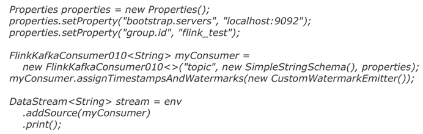
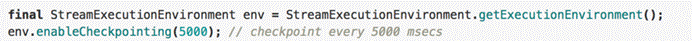

<center>更多内容请关注：https://wjhub.gitee.io</center>


<center><a href="https://wjhub.gitee.io">锁清秋</a></center>


----

# 大数剧-flink-高级编程A


> - flink开发source、operator、sink、状态与容错


## 一、flink开发source、operator、sink

## 1. 计算模型


 

## 2.DataSource

**输入Controlling Latency**  （控制延迟）

默认情况下，流中的元素并不会一个一个的在网络中传输(这会导致不必要的网络流量消耗) ，而是缓存起来，缓存的大小可以在Flink的配置文件、 ExecutionEnvironment、在某个算子上进行配置（默认100ms）

·    好处:提高吞吐

·    坏处:增加了延迟

·    如何把握平衡

- - 为了最大吞吐量，可以设置setBufferTimeout(-1)，这会移除timeout机制，缓存中的数据一满就会被发送
  - 为了最小的延迟，可以将超时设置为接近0的数（例如5或者10ms）
  - 缓存的超时不要设置为0，因为设置为0会带来一些性能的损耗

 

内置数据源 

 

1.   基于文件

  `  env**.**readTextFile**(**"file:///path"**)**  env**.**readFile**(**inputFormat**,** "file:///path"**);**  `

2.   基于Socket

     ` env**.**socketTextStream**(**"localhost"**,** 6666**,** '\n'**)**`

3.   基于Collection

     ```shell
     env.socketTextStream("localhost", 6666, '\n')import org.apache.flink.api.scala._
     env.fromCollection(List(1,2,3))
     env.fromElements(1,2,3)
     env.generateSequence(0, 1000)       #不需要隐式转换
     ```

     

自定义数据源

1. 实现SourceFunction（非并行的）

示例代码：

function：

```java
package cn.zhanghub.source;
import org.apache.flink.streaming.api.functions.source.SourceFunction;
import org.apache.hadoop.conf.Configuration;
import org.apache.hadoop.fs.FSDataInputStream;
import org.apache.hadoop.fs.FileChecksum;
import org.apache.hadoop.fs.FileSystem;
import org.apache.hadoop.fs.Path;
import java.io.BufferedReader;
import java.io.InputStreamReader;
public class FileCountryDictSourceFunction implements SourceFunction<String> {
    private String md5 = null;
    private Boolean isCancel = true;
    private Integer interval = 10000;
    @Override
    public void run(SourceContext<String> ctx) throws Exception {
        Path pathString = new Path("hdfs://ns1/user/qingniu/country_data");
        Configuration hadoopConf = new Configuration();
        FileSystem fs = FileSystem.get(hadoopConf);
        while (isCancel) {
            if(!fs.exists(pathString)){
                Thread.sleep(interval);
                continue;
            }
            FileChecksum fileChecksum = fs.getFileChecksum(pathString);
            String md5Str = fileChecksum.toString();
            String currentMd5 = md5Str.substring(md5Str.indexOf(":") + 1);
            if (!currentMd5.equals(md5)) {
                FSDataInputStream open = fs.open(pathString);
                BufferedReader reader = new BufferedReader(new InputStreamReader(open));
                String line = reader.readLine();
                while (line != null) {
                    ctx.collect(line);
                    line = reader.readLine();
                }
                reader.close();
                md5 = currentMd5;
            }
            Thread.sleep(interval);
        }
    }
    @Override
    public void cancel() {
        isCancel = false;
    }
}

```


运行时：

```java
package cn.zhanghub.source;
import org.apache.flink.streaming.api.datastream.DataStreamSource;
import org.apache.flink.streaming.api.environment.StreamExecutionEnvironment;
public class FileSource {
    public static void main(String[] args) throws Exception {
        StreamExecutionEnvironment env = StreamExecutionEnvironment.getExecutionEnvironment();
        DataStreamSource<String> stringDataStreamSource = env.addSource(new FileCountryDictSourceFunction());
        stringDataStreamSource.print();
        env.execute();
    }
}
```


2. 实现ParallelSourceFunction与RichParallelSourceFunction（并行的）

 

**以Kafka-connector-source为代表**

·    基于Kafka 的partition 机制，Flink实现了并行化数据切分

·    Flink 可以消费Kafka的topic，和sink数据到Kafka 

·    出现失败时，flink通过checkpoint机制来协调Kafka来恢复应用（通过设置kafka的offset）

**引入依赖：**

flink支持的kafka版本对比：

```xml
<dependency>
    <groupId>org.apache.flink</groupId>
    <artifactId>flink-connector-kafka-0.10_2.11</artifactId>
    <version>1.9.3</version>
    <scope>compile</scope>
</dependency>
```

flink支持的kafka版本对比：

| Maven Dependency                 | 支持自 | Class name                                   | Kafka版本 | 说明                                                         |
| -------------------------------- | ------ | -------------------------------------------- | --------- | ------------------------------------------------------------ |
| flink-connector-kafka- 0.8_2.11  | 1.0.0  | FlinkKafkaConsumer08 FlinkKafkaProducer08    | 0.8.x     | 内部使用kakfa的 SimpleConsumer API 。 Flink把Offset提交给Zookeeper |
| flink-connector-kafka- 0.9_2.11  | 1.0.0  | FlinkKafkaConsumer09 FlinkKafkaProducer09    | 0.9.x     | 使用kafka的new Consumer API Kafka.                           |
| flink-connector-kafka- 0.10_2.11 | 1.2.0  | FlinkKafkaConsumer010  FlinkKafkaProducer010 | 0.10.x    | 生产和消费支持 Kafka messages with timestamps                |


**1).Flink KafkaConsumer** **的 ** **Source API**


 

1.FlinkKafkaConsumer010创建方式：

```java
FlinkKafkaConsumer010(String topic, KeyedDeserializationSchema<T> deserializer, Properties props)
FlinkKafkaConsumer010(List<String> topics, DeserializationSchema<T> deserializer, Properties props)
FlinkKafkaConsumer010(List<String> topics, KeyedDeserializationSchema<T> deserializer, Properties props)
FlinkKafkaConsumer010(Pattern subscriptionPattern, KeyedDeserializationSchema<T> deserializer, Properties props)
```


- 三个构造参数:

- - 要消费的topic（topic name / topic names/正表达式）

  - DeserializationSchema      / KeyedDeserializationSchema（反序列化Kafka中的数据)）

  - Kafka consumer的属性，其中三个属性必须提供:

  - - bootstrap.servers（逗号分隔的Kafka broker列表）
    - zookeeper.connect（逗号分隔的Zookeeper server列表，仅Kafka 0.8需要)）
    - group.id（consumer  group id）

2.反序列化Schema类型

- 作用:对kafka里获取的二进制数据进行反序列化

- FlinkKafkaConsumer需要知道如何将Kafka中的二进制数据转换成Java/Scala对象，DeserializationSchema定义了该转换模式，通过T     deserialize(byte[] message)

- FlinkKafkaConsumer从kafka获取的每条消息都会通过DeserializationSchema的T     deserialize(byte[] message)反序列化处理

- 反序列化Schema类型（接口）:

- - DeserializationSchema(只反序列化value) 
  - KeyedDeserializationSchema

3.常见反序列化Schema

- SimpleStringSchema
- JSONDeserializationSchema     / JSONKeyValueDeserializationSchema
- TypeInformationSerializationSchema     / TypeInformationKeyValueSerializationSchema
- AvroDeserializationSchema

4.自定义反序列化Schema：

- 实现DeserializationSchema与KeyedDeserializationSchema接口

 

DeserializationSchema：


KeyedDeserializationSchema：


 

bean:

```java
package cn.zhanghub.source;
public class HainiuKafkaRecord {
    private String record;
    public HainiuKafkaRecord(String record) {
        this.record = record;
    }
    public String getRecord() {
        return record;
    }
    public void setRecord(String record) {
        this.record = record;
    }
}
```

schema：

 ```java
package cn.zhanghub.source;
import org.apache.flink.api.common.serialization.DeserializationSchema;
import org.apache.flink.api.common.typeinfo.TypeInformation;
import java.io.IOException;
public class HainiuKafkaRecordSchema implements DeserializationSchema<HainiuKafkaRecord> {
    @Override
    public HainiuKafkaRecord deserialize(byte[] message) throws IOException {
        HainiuKafkaRecord hainiuKafkaRecord = new HainiuKafkaRecord(new String(message));
        return hainiuKafkaRecord;
    }
    @Override
    public boolean isEndOfStream(HainiuKafkaRecord nextElement) {
        return false;
    }
    @Override
    public TypeInformation<HainiuKafkaRecord> getProducedType() {
        return TypeInformation.of(HainiuKafkaRecord.class);
    }
}
 ```

5.FlinkKafkaConsumer010最简样版代码



 

6.FlinkKafkaConsumer消费


| 消费模式                                                     | 说明                                                       |                                                              |
| ------------------------------------------------------------ | ---------------------------------------------------------- | ------------------------------------------------------------ |
| setStartFromEarliest                                         | 从队头开始，最早的记录                                     | 内部的Consumer提交到Kafka/zk中的偏移量将被忽略               |
| setStartFromLatest                                           | 从队尾开始，最新的记录                                     |                                                              |
| setStartFromGroupOffsets()                                   | 默认值，从当前消费组记录的偏移量开始，接着上次的偏移量消费 | 以Consumer提交到Kafka/zk中的偏移量最为起始位置开始消费, group.id设置在consumer的properties里; 如果没找到记录的偏移量，则使用consumer的properties的 auto.offset.reset设置的策略 |
| setStartFromSpecificOffsets(Map<TopicPa  rtition, Long>的参数) | 从指定的具体位置开始消费                                   |                                                              |
| setStartFromTimestamp(long)                                  | 从指定的时间戳开始消费                                     | 对于每个分区，时间戳大于或等于指定时间戳的记录将用作起始位  置。如果一个分区的最新记录早于时间戳，那么只需要从最新记录 中读取该分区。在此模式下，Kafka/zk中提交的偏移量将被忽略 |

注意

1. kafka 0.8版本，     consumer提交偏移量到zookeeper，后续版本提交到kafka（一个特殊的topic: __consumer_offsets）

7.动态Partition discovery

- Flink Kafka Consumer支持动态发现Kafka分区，且能保证exactly-once
- 默认禁止动态发现分区，把flink.partition-discovery.interval-millis设置大于0即可启用:

 

properties.setProperty("flink.partition-discovery.interval-millis", "30000")

 

8.动态Topic discovery

- Flink Kafka Consumer支持动态发现Kafka Topic，仅限通过正则表达式指定topic的方式 
- 默认禁止动态发现topic，把flink.partition-discovery.interval-millis设置大于0即可启用


 

示例代码：

```java
package cn.zhanghub.source;
import org.apache.flink.api.common.serialization.SimpleStringSchema;
import org.apache.flink.streaming.api.datastream.DataStreamSource;
import org.apache.flink.streaming.api.environment.StreamExecutionEnvironment;
import org.apache.flink.streaming.connectors.kafka.FlinkKafkaConsumer010;
import java.util.Properties;
import java.util.regex.Pattern;
public class KafkaRichParallelSource {
    public static void main(String[] args) throws Exception {
        StreamExecutionEnvironment env = StreamExecutionEnvironment.getExecutionEnvironment();
        Properties kafkaConsumerProps = new Properties();
        kafkaConsumerProps.setProperty("bootstrap.servers", "s1.hadoop:9092,s2.hadoop:9092,s3.hadoop:9092,s4.hadoop:9092,s5.hadoop:9092,s6.hadoop:9092,s7.hadoop:9092,s8.hadoop:9092");
        kafkaConsumerProps.setProperty("group.id", "qingniuflink");
        kafkaConsumerProps.setProperty("flink.partition-discovery.interval-millis", "30000");
        FlinkKafkaConsumer010<String> kafkaSource = new FlinkKafkaConsumer010<>("flink_event", new SimpleStringSchema(), kafkaConsumerProps);
//        FlinkKafkaConsumer010<String> kafkaSource = new FlinkKafkaConsumer010<>(Pattern.compile("flink_event_[0-9]"), new SimpleStringSchema(), kafkaConsumerProps);
        //    kafkaSource.setStartFromEarliest()
        //    kafkaSource.setStartFromGroupOffsets()
        kafkaSource.setStartFromLatest();
        DataStreamSource<String> kafkaInput = env.addSource(kafkaSource);
        kafkaInput.print();
        FlinkKafkaConsumer010<HainiuKafkaRecord> kafkaBeanSource = new FlinkKafkaConsumer010<>("flink_event", new HainiuKafkaRecordSchema(), kafkaConsumerProps);
        DataStreamSource<HainiuKafkaRecord> kafkaBeanInput = env.addSource(kafkaBeanSource);
        kafkaBeanInput.print();
        
        env.execute();
    }
}
```

## 3.transformations

 

下图展示了 Flink 中目前支持的主要几种流的类型，以及它们之间的转换关系。


**DataStream** 

DataStream 是 Flink 流处理 API 中最核心的数据结构。它代表了一个运行在多个分区上的并行流。一个 DataStream 可以从 StreamExecutionEnvironment 通过env.addSource(SourceFunction) 获得。

DataStream 上的转换操作都是逐条的，比如 map()，flatMap()，filter()

 

**自定义转换函数**

 

1.函数

scala函数

  data**.**flatMap**(**f **=>** f**.**split**(**" "**))**  

java的lambda

  data**.**flatMap**(**f **->** f**.**split**(**" "**));**  

2.实现接口

```scala
text.flatMap(new FlatMapFunction[String,String] {
      override def flatMap(value: String, out: Collector[String]) = {
        val strings: Array[String] = value.split(" ")
        for(s <- strings){
         out.collect(s)
        }
      }
})data.flatMap(f -> f.split(" "));
```

3.Rich Functions

Rich Function中有非常有用的四个方法:open，close，getRuntimeContext和setRuntimecontext 这些功能在创建本地状态、获取广播变量、获取运行时信息（例如累加器和计数器）和迭代信息时非常有帮助。

示例代码：

```scala
import java.util.Properties
import org.apache.flink.api.common.functions.RichFlatMapFunction
import org.apache.flink.configuration.Configuration
import org.apache.flink.util.Collector
import org.apache.kafka.clients.producer.{KafkaProducer, Producer, ProducerRecord}
class HainiuRichFlatMapFunction(topic:String,props:Properties) extends RichFlatMapFunction[String,Int]{
  var producer:Producer[String,String] = _
  override def open(parameters: Configuration): Unit = {
    //创建kafka生产者
    producer = new KafkaProducer[String,String](props)
  }
  override def close(): Unit = {
    //关闭kafka生产者
    producer.close()
  }
  override def flatMap(value: String, out: Collector[Int]): Unit = {
    //使用RuntimeContext得到子线程ID，比如可以用于多线程写文件
    println(getRuntimeContext.getIndexOfThisSubtask)
    //发送数据到kafka
    producer.send(new ProducerRecord[String,String](topic,value))
  }
}
```

**operators**

1.connect 与 union (合并流)

- connect之后生成ConnectedStreams，会对两个流的数据应用不同的处理方法，并且双流之间可以共享状态（比如计数）。这在第一个流的输入会影响第二个流时, 会非常有用。union 合并多个流，新的流包含所有流的数据。
- union是DataStream     → DataStream
- connect只能连接两个流，而union可以连接多于两个流
- connect连接的两个流类型可以不一致，而union连接的流的类型必须一致


示例代码：

union:

```java
package cn.zhanghub.operator;

import cn.zhanghub.source.FileCountryDictSourceFunction;
import org.apache.flink.api.common.serialization.SimpleStringSchema;
import org.apache.flink.streaming.api.datastream.DataStream;
import org.apache.flink.streaming.api.datastream.DataStreamSource;
import org.apache.flink.streaming.api.datastream.SingleOutputStreamOperator;
import org.apache.flink.streaming.api.environment.StreamExecutionEnvironment;
import org.apache.flink.streaming.api.functions.ProcessFunction;
import org.apache.flink.streaming.connectors.kafka.FlinkKafkaConsumer010;
import org.apache.flink.util.Collector;

import java.util.HashMap;
import java.util.Map;
import java.util.Properties;

public class CountryCodeUnion {
    public static void main(String[] args) throws Exception {
        StreamExecutionEnvironment env = StreamExecutionEnvironment.getExecutionEnvironment();
        env.setParallelism(1);

        DataStreamSource<String> countryDictSource = env.addSource(new FileCountryDictSourceFunction());

        Properties kafkaConsumerProps = new Properties();
        kafkaConsumerProps.setProperty("bootstrap.servers", "s1.hadoop:9092,s2.hadoop:9092,s3.hadoop:9092,s4.hadoop:9092,s5.hadoop:9092,s6.hadoop:9092,s7.hadoop:9092,s8.hadoop:9092");
        kafkaConsumerProps.setProperty("group.id", "qingniuflink");
        kafkaConsumerProps.setProperty("flink.partition-discovery.interval-millis", "30000");
        FlinkKafkaConsumer010<String> kafkaSource = new FlinkKafkaConsumer010<>("flink_event", new SimpleStringSchema(), kafkaConsumerProps);
        //    kafkaSource.setStartFromEarliest()
        //    kafkaSource.setStartFromGroupOffsets()
        kafkaSource.setStartFromLatest();

        DataStreamSource<String> kafkainput = env.addSource(kafkaSource);

        DataStream<String> union = countryDictSource.union(kafkainput);

        SingleOutputStreamOperator<String> process = union.process(new ProcessFunction<String, String>() {

            private Map<String, String> map = new HashMap<>();

            @Override
            public void processElement(String value, Context ctx, Collector<String> out) throws Exception {
                String[] split = value.split("\t");
                if (split.length > 1) {
                    map.put(split[0], split[1]);
                    out.collect(value);
                } else {
                    String countryName = map.get(value);
                    String outStr = countryName == null ? "no match" : countryName;
                    out.collect(outStr);
                }
            }
        });

        process.print();

        env.execute();
    }

}
```

connect:

 ```java
package cn.zhanghub.operator;
import cn.zhanghub.source.FileCountryDictSourceFunction;
import cn.zhanghub.source.HainiuKafkaRecord;
import cn.zhanghub.source.HainiuKafkaRecordSchema;
import org.apache.flink.streaming.api.datastream.ConnectedStreams;
import org.apache.flink.streaming.api.datastream.DataStreamSource;
import org.apache.flink.streaming.api.datastream.SingleOutputStreamOperator;
import org.apache.flink.streaming.api.environment.StreamExecutionEnvironment;
import org.apache.flink.streaming.api.functions.co.CoProcessFunction;
import org.apache.flink.streaming.connectors.kafka.FlinkKafkaConsumer010;
import org.apache.flink.util.Collector;
import java.util.HashMap;
import java.util.Map;
import java.util.Properties;
public class CountryCodeConnect {
    public static void main(String[] args) throws Exception {
        StreamExecutionEnvironment env = StreamExecutionEnvironment.getExecutionEnvironment();
        env.setParallelism(1);
        DataStreamSource<String> countryDictSource = env.addSource(new FileCountryDictSourceFunction());
        Properties kafkaConsumerProps = new Properties();
        kafkaConsumerProps.setProperty("bootstrap.servers", "s1.hadoop:9092,s2.hadoop:9092,s3.hadoop:9092,s4.hadoop:9092,s5.hadoop:9092,s6.hadoop:9092,s7.hadoop:9092,s8.hadoop:9092");
        kafkaConsumerProps.setProperty("group.id", "qingniuflink");
        kafkaConsumerProps.setProperty("flink.partition-discovery.interval-millis", "30000");
        FlinkKafkaConsumer010<HainiuKafkaRecord> kafkaSource = new FlinkKafkaConsumer010<>("flink_event", new HainiuKafkaRecordSchema(), kafkaConsumerProps);
        //    kafkaSource.setStartFromEarliest()
        //    kafkaSource.setStartFromGroupOffsets()
        kafkaSource.setStartFromLatest();
        DataStreamSource<HainiuKafkaRecord> kafkainput = env.addSource(kafkaSource);
        ConnectedStreams<String, HainiuKafkaRecord> connect = countryDictSource.connect(kafkainput);
        SingleOutputStreamOperator<String> connectInput = connect.process(new CoProcessFunction<String, HainiuKafkaRecord, String>() {
            private Map<String, String> map = new HashMap<String, String>();
            @Override
            public void processElement1(String value, Context ctx, Collector<String> out) throws Exception {
                String[] split = value.split("\t");
                map.put(split[0], split[1]);
                out.collect(value);
            }
            @Override
            public void processElement2(HainiuKafkaRecord value, Context ctx, Collector<String> out) throws Exception {
                String countryCode = value.getRecord();
                String countryName = map.get(countryCode);
                String outStr = countryName == null ? "no match" : countryName;
                out.collect(outStr);
            }
        });
        connectInput.print();
        env.execute();
    }
}
 ```

2.keyBy

- 含义: 根据指定的key进行分组（逻辑上把DataStream分成若干不相交的分区，key一样的event会 被划分到相同的partition，内部采用类似于hash分区来实现）
- 转换关系: DataStream →     KeyedStream

- 使用场景: 分组（类比SQL中的分组）比如join，coGroup，keyBy，groupBy，Reduce，GroupReduce，Aggregate，Windows

KeyedStream

- KeyedStream用来表示根据指定的key进行分组的数据流。
- 一个KeyedStream可以通过调用DataStream.keyBy()来获得。
- 在KeyedStream上进行任何transformation都将转变回DataStream。
- 在实现中，KeyedStream会把key的信息传入到算子的函数中。

示例代码：

```java
package cn.zhanghub.operator;

import cn.zhanghub.source.FileCountryDictSourceFunction;
import cn.zhanghub.source.HainiuKafkaRecord;
import cn.zhanghub.source.HainiuKafkaRecordSchema;
import org.apache.flink.api.common.functions.MapFunction;
import org.apache.flink.api.java.functions.KeySelector;
import org.apache.flink.api.java.tuple.Tuple2;
import org.apache.flink.streaming.api.datastream.ConnectedStreams;
import org.apache.flink.streaming.api.datastream.DataStreamSource;
import org.apache.flink.streaming.api.datastream.KeyedStream;
import org.apache.flink.streaming.api.datastream.SingleOutputStreamOperator;
import org.apache.flink.streaming.api.environment.StreamExecutionEnvironment;
import org.apache.flink.streaming.api.functions.co.KeyedCoProcessFunction;
import org.apache.flink.streaming.connectors.kafka.FlinkKafkaConsumer010;
import org.apache.flink.util.Collector;

import java.util.HashMap;
import java.util.Map;
import java.util.Properties;

public class CountryCodeConnectKeyBy {

    public static void main(String[] args) throws Exception {
        StreamExecutionEnvironment env = StreamExecutionEnvironment.getExecutionEnvironment();
        
        DataStreamSource<String> countryDictSource = env.addSource(new FileCountryDictSourceFunction());

        Properties kafkaConsumerProps = new Properties();
        kafkaConsumerProps.setProperty("bootstrap.servers", "s1.hadoop:9092,s2.hadoop:9092,s3.hadoop:9092,s4.hadoop:9092,s5.hadoop:9092,s6.hadoop:9092,s7.hadoop:9092,s8.hadoop:9092");
        kafkaConsumerProps.setProperty("group.id", "qingniuflink");
        kafkaConsumerProps.setProperty("flink.partition-discovery.interval-millis", "30000");
        FlinkKafkaConsumer010<HainiuKafkaRecord> kafkaSource = new FlinkKafkaConsumer010<>("flink_event", new HainiuKafkaRecordSchema(), kafkaConsumerProps);
        //    kafkaSource.setStartFromEarliest()
        //    kafkaSource.setStartFromGroupOffsets()
        kafkaSource.setStartFromLatest();

        DataStreamSource<HainiuKafkaRecord> kafkainput = env.addSource(kafkaSource);

        KeyedStream<Tuple2<String, String>, String> countryDictKeyBy = countryDictSource.map(new MapFunction<String, Tuple2<String, String>>() {
            @Override
            public Tuple2<String, String> map(String value) throws Exception {
                String[] split = value.split("\t");
                return Tuple2.of(split[0], split[1]);
            }
        }).keyBy(new KeySelector<Tuple2<String, String>, String>() {
            @Override
            public String getKey(Tuple2<String, String> value) throws Exception {
                return value.f0;
            }
        });

        KeyedStream<HainiuKafkaRecord, String> record = kafkainput.keyBy(new KeySelector<HainiuKafkaRecord, String>() {
            @Override
            public String getKey(HainiuKafkaRecord value) throws Exception {
                return value.getRecord();
            }
        });

        ConnectedStreams<Tuple2<String, String>, HainiuKafkaRecord> connect = countryDictKeyBy.connect(record);

        SingleOutputStreamOperator<String> connectInput = connect.process(new KeyedCoProcessFunction<String, Tuple2<String, String>, HainiuKafkaRecord, String>() {

            private Map<String, String> map = new HashMap<String, String>();

            @Override
            public void processElement1(Tuple2<String, String> value, Context ctx, Collector<String> out) throws Exception {
                map.put(ctx.getCurrentKey(), value.f1);
                out.collect(value.toString());
            }

            @Override
            public void processElement2(HainiuKafkaRecord value, Context ctx, Collector<String> out) throws Exception {
                String countryCode = ctx.getCurrentKey();
                String countryName = map.get(countryCode);
                String outStr = countryName == null ? "no match" : countryName;
                out.collect(outStr);
            }
        });

        connectInput.print();

        env.execute();

    }
}
```

Key的类型限制:

- 不能是没有覆盖hashCode方法的POJO（也就是bean）
-  不能是数组

POJO:

```java
package cn.zhanghub.source;

public class HainiuKafkaRecord {

    private String record;

    public HainiuKafkaRecord(String record) {
        this.record = record;
    }

    public String getRecord() {
        return record;
    }

    public void setRecord(String record) {
        this.record = record;
    }

    @Override
    public int hashCode() {
        final int prime = 31;
        int result = 1;
        result = prime * result + ((record == null) ? 0 : record.hashCode());
        return result;
    }
}
```

示例代码：

```java
package cn.zhanghub.operator;

import cn.zhanghub.source.FileCountryDictSourceFunction;
import cn.zhanghub.source.HainiuKafkaRecord;
import cn.zhanghub.source.HainiuKafkaRecordSchema;
import org.apache.flink.api.common.functions.MapFunction;
import org.apache.flink.api.java.functions.KeySelector;
import org.apache.flink.api.java.tuple.Tuple2;
import org.apache.flink.streaming.api.datastream.ConnectedStreams;
import org.apache.flink.streaming.api.datastream.DataStreamSource;
import org.apache.flink.streaming.api.datastream.KeyedStream;
import org.apache.flink.streaming.api.datastream.SingleOutputStreamOperator;
import org.apache.flink.streaming.api.environment.StreamExecutionEnvironment;
import org.apache.flink.streaming.api.functions.co.KeyedCoProcessFunction;
import org.apache.flink.streaming.connectors.kafka.FlinkKafkaConsumer010;
import org.apache.flink.util.Collector;

import java.util.HashMap;
import java.util.Map;
import java.util.Properties;

public class CountryCodeConnectKeyByObject {

    public static void main(String[] args) throws Exception {
        StreamExecutionEnvironment env = StreamExecutionEnvironment.getExecutionEnvironment();

        DataStreamSource<String> countryDictSource = env.addSource(new FileCountryDictSourceFunction());

        Properties kafkaConsumerProps = new Properties();
        kafkaConsumerProps.setProperty("bootstrap.servers", "s1.hadoop:9092,s2.hadoop:9092,s3.hadoop:9092,s4.hadoop:9092,s5.hadoop:9092,s6.hadoop:9092,s7.hadoop:9092,s8.hadoop:9092");
        kafkaConsumerProps.setProperty("group.id", "qingniuflink");
        kafkaConsumerProps.setProperty("flink.partition-discovery.interval-millis", "30000");
        FlinkKafkaConsumer010<HainiuKafkaRecord> kafkaSource = new FlinkKafkaConsumer010<>("flink_event", new HainiuKafkaRecordSchema(), kafkaConsumerProps);
        //    kafkaSource.setStartFromEarliest()
        //    kafkaSource.setStartFromGroupOffsets()
        kafkaSource.setStartFromLatest();

        DataStreamSource<HainiuKafkaRecord> kafkainput = env.addSource(kafkaSource);

        KeyedStream<Tuple2<HainiuKafkaRecord, String>, HainiuKafkaRecord> countryDictKeyBy = countryDictSource.map(new MapFunction<String, Tuple2<HainiuKafkaRecord, String>>() {
            @Override
            public Tuple2<HainiuKafkaRecord, String> map(String value) throws Exception {
                String[] split = value.split("\t");
                return Tuple2.of(new HainiuKafkaRecord(new String(split[0])), split[1]);
            }
        }).keyBy(new KeySelector<Tuple2<HainiuKafkaRecord, String>, HainiuKafkaRecord>() {
            @Override
            public HainiuKafkaRecord getKey(Tuple2<HainiuKafkaRecord, String> value) throws Exception {
                return value.f0;
            }
        });

        KeyedStream<HainiuKafkaRecord, HainiuKafkaRecord> record = kafkainput.keyBy(new KeySelector<HainiuKafkaRecord, HainiuKafkaRecord>() {
            @Override
            public HainiuKafkaRecord getKey(HainiuKafkaRecord value) throws Exception {
                return value;
            }
        });

        ConnectedStreams<Tuple2<HainiuKafkaRecord, String>, HainiuKafkaRecord> connect = countryDictKeyBy.connect(record);

        SingleOutputStreamOperator<String> connectInput = connect.process(new KeyedCoProcessFunction<HainiuKafkaRecord, Tuple2<HainiuKafkaRecord, String>, HainiuKafkaRecord, String>() {

            private Map<String, String> map = new HashMap<String, String>();

            @Override
            public void processElement1(Tuple2<HainiuKafkaRecord, String> value, Context ctx, Collector<String> out) throws Exception {
                String currentKey = ctx.getCurrentKey().getRecord();
                map.put(currentKey, value.f1);
                out.collect(value.toString());
            }

            @Override
            public void processElement2(HainiuKafkaRecord value, Context ctx, Collector<String> out) throws Exception {
                HainiuKafkaRecord currentKey = ctx.getCurrentKey();
                String countryName = map.get(currentKey.getRecord());
                String outStr = countryName == null ? "no match" : countryName;
                out.collect(currentKey.toString() + "--" + outStr);
            }
        });

        connectInput.print();

        env.execute();

    }
}
```

*可能会出现数据倾斜，可根据实际情况结合物理分区来解决

3.物理分区

算子间数据传递模式

- One-to-one streams 保持元素的分区和顺序
- Redistributing     streams 

改变流的分区策略取决于使用的算子

- keyBy()（re-partitions     by hashing the key）
- broadcast()
- rebalance()（which     re-partitions randomly）

都是Transformation，都可以改变分区 

| 分区Transformation       | 说明                                                         |
| ------------------------ | ------------------------------------------------------------ |
| Random partitioning      | 按均匀分布随机划分元素，网络开销往往比较大 dataStream.shuffle() |
| Round-robin partitioning | 循环对元素进行分区，为每一个分区创建相等的负载，这在数据倾斜时非常有用的: dataStream.rebalance() |
| Rescaling                | 跟rebalance有点类似，但不是全局的，通过轮询调度将元素从上游的task一个子 集发送到下游task的一个子集:  dataStream.rescale(); |
| Broadcasting             | 将元素广播到每个分区上  dataStream.broadcast();              |
| Custom partitioning      | dataStream.partitionCustom(partitioner,  "someKey") 或 dataStream.partitionCustom(partitioner, 0) |

 

4.解决数据倾斜

1).One-to-one streams 解决数据倾斜的方法：

**rebalance**

- 含义：再平衡，用来减轻数据倾斜
- 转换关系: DataStream →     DataStream
- 使用场景：处理数据倾斜，比如某个kafka的partition的数据比较多

 

示例代码：

```scala
val stream: DataStream[MyType] = env.addSource(new FlinkKafkaConsumer08[String](...))
val str1: DataStream[(String, MyType)] = stream.flatMap { ... }
val str2: DataStream[(String, MyType)] = str1.rebalance()
val str3: DataStream[AnotherType] = str2.map { ... }
```

上述 DataStream 上的转换在运行时会转换成如下的执行图：


如上图的执行图所示，DataStream 各个算子会并行运行，算子之间是数据流分区。如 Source 的第一个并行实例（S1）和 flatMap() 的第一个并行实例（m1）之间就是一个数据流分区。而在 flatMap() 和 map() 之间由于加了 rebalance()，它们之间的数据流分区就有3个子分区（m1的数据流向3个map()实例）。

 

**rescale**

- 原理：通过轮询调度将元素从上游的task一个子集发送到下游task的一个子集 
- 转换关系：DataStream →     DataStream
- 使用场景：数据传输都在一个TaskManager内，不需要通过网络。

**原理：**

 

第一个task并行度为2，第二个task并行度为6，第三个task并行度为2。从第一个task到第二个task，Src的 子集Src1 和 Map的子集Map1，2，3对应起来，Src1会以轮询调度的方式分别向Map1，2，3发送记录。 从第二个task到第三个task，Map的子集1，2，3对应Sink的子集1，这三个流的元素只会发送到Sink1。 假设我们每个TaskManager有三个Slot，并且我们开了SlotSharingGroup，那么通过rescale，所有的数据传输都在一个TaskManager内，不需要通过网络。


 

2).Redistributing streams 解决数据倾斜的方法：

**自定义partitioner**

- 转换关系：DataStream → DataStream

- 使用场景：自定义数据处理负载

- 实现方法：

- - 实现org.apache.flink.api.common.functions.Partitioner接口
  - 覆盖partition方法
  - 设计算法返回partitionId

 

示例代码：

```java
package cn.zhanghub.operator;

import cn.zhanghub.source.FileCountryDictSourceFunction;
import cn.zhanghub.source.HainiuKafkaRecord;
import cn.zhanghub.source.HainiuKafkaRecordSchema;
import org.apache.flink.api.common.functions.MapFunction;
import org.apache.flink.api.common.functions.Partitioner;
import org.apache.flink.api.java.functions.KeySelector;
import org.apache.flink.api.java.tuple.Tuple2;
import org.apache.flink.streaming.api.datastream.ConnectedStreams;
import org.apache.flink.streaming.api.datastream.DataStream;
import org.apache.flink.streaming.api.datastream.DataStreamSource;
import org.apache.flink.streaming.api.datastream.SingleOutputStreamOperator;
import org.apache.flink.streaming.api.environment.StreamExecutionEnvironment;
import org.apache.flink.streaming.api.functions.co.CoProcessFunction;
import org.apache.flink.streaming.connectors.kafka.FlinkKafkaConsumer010;
import org.apache.flink.util.Collector;

import java.util.HashMap;
import java.util.Map;
import java.util.Properties;

public class CountryCodeConnectCustomPartitioner {

    public static void main(String[] args) throws Exception {
        StreamExecutionEnvironment env = StreamExecutionEnvironment.getExecutionEnvironment();

        DataStreamSource<String> countryDictSource = env.addSource(new FileCountryDictSourceFunction());

        Properties kafkaConsumerProps = new Properties();
        kafkaConsumerProps.setProperty("bootstrap.servers", "s1.hadoop:9092,s2.hadoop:9092,s3.hadoop:9092,s4.hadoop:9092,s5.hadoop:9092,s6.hadoop:9092,s7.hadoop:9092,s8.hadoop:9092");
        kafkaConsumerProps.setProperty("group.id", "qingniuflink");
        kafkaConsumerProps.setProperty("flink.partition-discovery.interval-millis", "30000");
        FlinkKafkaConsumer010<HainiuKafkaRecord> kafkaSource = new FlinkKafkaConsumer010<>("flink_event", new HainiuKafkaRecordSchema(), kafkaConsumerProps);
        //    kafkaSource.setStartFromEarliest()
        //    kafkaSource.setStartFromGroupOffsets()
        kafkaSource.setStartFromLatest();

        DataStreamSource<HainiuKafkaRecord> kafkainput = env.addSource(kafkaSource);

        DataStream<Tuple2<String, String>> countryDictPartition = countryDictSource.map(new MapFunction<String, Tuple2<String, String>>() {
            @Override
            public Tuple2<String, String> map(String value) throws Exception {
                String[] split = value.split("\t");
                return Tuple2.of(split[0], split[1]);
            }
        }).partitionCustom(new Partitioner<String>() {
            @Override
            public int partition(String key, int numPartitions) {
                if (key.contains("CN")) {
                    return 0;
                } else {
                    return 1;
                }
            }
        }, new KeySelector<Tuple2<String, String>, String>() {
            @Override
            public String getKey(Tuple2<String, String> value) throws Exception {
                return value.f0;
            }
        });


        DataStream<HainiuKafkaRecord> recordPartition = kafkainput.partitionCustom(new Partitioner<String>() {
            @Override
            public int partition(String key, int numPartitions) {
                if (key.contains("CN")) {
                    return 0;
                } else {
                    return 1;
                }
            }
        }, new KeySelector<HainiuKafkaRecord, String>() {
            @Override
            public String getKey(HainiuKafkaRecord value) throws Exception {
                return value.getRecord();
            }
        });

        ConnectedStreams<Tuple2<String, String>, HainiuKafkaRecord> connect = countryDictPartition.connect(recordPartition);

        SingleOutputStreamOperator<String> connectInput = connect.process(new CoProcessFunction<Tuple2<String, String>, HainiuKafkaRecord, String>() {

            private Map<String, String> map = new HashMap<String, String>();

            @Override
            public void processElement1(Tuple2<String, String> value, Context ctx, Collector<String> out) throws Exception {
                map.put(value.f0, value.f1);
                out.collect(value.toString());
            }

            @Override
            public void processElement2(HainiuKafkaRecord value, Context ctx, Collector<String> out) throws Exception {
                String countryCode = value.getRecord();
                String countryName = map.get(countryCode);
                String outStr = countryName == null ? "no match" : countryName;
                out.collect(outStr);
            }
        });

        connectInput.print();

        env.execute();

    }
}


```

使用parititoner解决数据倾斜

```java
package cn.zhanghub.flink.operator;

import cn.zhanghub.flink.source.FileCountryDictSourceFunction;
import cn.zhanghub.flink.source.HainiuKafkaRecord;
import cn.zhanghub.flink.source.HainiuKafkaRecordSchema;
import org.apache.flink.api.common.functions.FlatMapFunction;
import org.apache.flink.api.common.functions.MapFunction;
import org.apache.flink.api.common.functions.Partitioner;
import org.apache.flink.api.java.functions.KeySelector;
import org.apache.flink.api.java.tuple.Tuple2;
import org.apache.flink.configuration.Configuration;
import org.apache.flink.streaming.api.datastream.ConnectedStreams;
import org.apache.flink.streaming.api.datastream.DataStream;
import org.apache.flink.streaming.api.datastream.DataStreamSource;
import org.apache.flink.streaming.api.datastream.SingleOutputStreamOperator;
import org.apache.flink.streaming.api.environment.StreamExecutionEnvironment;
import org.apache.flink.streaming.api.functions.co.CoProcessFunction;
import org.apache.flink.streaming.connectors.kafka.FlinkKafkaConsumer010;
import org.apache.flink.util.Collector;

import java.util.HashMap;
import java.util.Map;
import java.util.Properties;
import java.util.Random;

public class CountryCodeConnectCustomPartitioner {

    public static void main(String[] args) throws Exception {
        StreamExecutionEnvironment env = StreamExecutionEnvironment.createLocalEnvironmentWithWebUI(new Configuration());

        Properties kafkaConsumerProps = new Properties();
        kafkaConsumerProps.setProperty("bootstrap.servers", "s1.hadoop:9092,s3.hadoop:9092,s4.hadoop:9092,s5.hadoop:9092,s6.hadoop:9092,s7.hadoop:9092,s8.hadoop:9092");
        kafkaConsumerProps.setProperty("group.id", "qingniuflink");
        kafkaConsumerProps.setProperty("flink.partition-discovery.interval-millis", "30000");

        FlinkKafkaConsumer010<HainiuKafkaRecord> kafkaSource = new FlinkKafkaConsumer010<>("flink_event", new HainiuKafkaRecordSchema(), kafkaConsumerProps);
        kafkaSource.setStartFromLatest();

        DataStreamSource<HainiuKafkaRecord> kafkaInput = env.addSource(kafkaSource);
        DataStream<HainiuKafkaRecord> kafka = kafkaInput.map(new MapFunction<HainiuKafkaRecord, HainiuKafkaRecord>() {
            @Override
            public HainiuKafkaRecord map(HainiuKafkaRecord value) throws Exception {
                String record = value.getRecord();
                Random random = new Random();
                int i = random.nextInt(10);
                return new HainiuKafkaRecord(i + "_" + record);
            }
        }).partitionCustom(new Partitioner<HainiuKafkaRecord>() {
                               @Override
                               public int partition(HainiuKafkaRecord key, int numPartitions) {
                                   String[] s = key.getRecord().split("_");
                                   String randomId = s[0];
                                   return new Integer(randomId);
                               }
                           },
                new KeySelector<HainiuKafkaRecord, HainiuKafkaRecord>() {
                    @Override
                    public HainiuKafkaRecord getKey(HainiuKafkaRecord value) throws Exception {
                        return value;
                    }
                });

        DataStreamSource<String> countryDictSource = env.addSource(new FileCountryDictSourceFunction());

        DataStream<Tuple2<HainiuKafkaRecord, String>> countryDict = countryDictSource.flatMap(new FlatMapFunction<String, Tuple2<HainiuKafkaRecord, String>>() {
            @Override
            public void flatMap(String value, Collector<Tuple2<HainiuKafkaRecord, String>> out) throws Exception {
                String[] split = value.split("\t");
                String key = split[0];
                String values = split[1];
                for (int i = 0; i < 10; i++) {
                    String randomKey = i + "_" + key;
                    Tuple2<HainiuKafkaRecord, String> t2 = Tuple2.of(new HainiuKafkaRecord(randomKey), values);
                    out.collect(t2);
                }
            }
        }).partitionCustom(new Partitioner<HainiuKafkaRecord>() {
            @Override
            public int partition(HainiuKafkaRecord key, int numPartitions) {
                String[] s = key.getRecord().split("_");
                String randomId = s[0];
                return new Integer(randomId);
            }
        }, new KeySelector<Tuple2<HainiuKafkaRecord, String>, HainiuKafkaRecord>() {
            @Override
            public HainiuKafkaRecord getKey(Tuple2<HainiuKafkaRecord, String> value) throws Exception {
                return value.f0;
            }
        });


        ConnectedStreams<Tuple2<HainiuKafkaRecord, String>, HainiuKafkaRecord> connect = countryDict.connect(kafka);

        SingleOutputStreamOperator<String> connectInput = connect.process(new CoProcessFunction<Tuple2<HainiuKafkaRecord, String>, HainiuKafkaRecord, String>() {
            private Map<String, String> map = new HashMap<String, String>();

            @Override
            public void processElement1(Tuple2<HainiuKafkaRecord, String> value, Context ctx, Collector<String> out) throws Exception {
                map.put(value.f0.getRecord(), value.f1);
                out.collect(value.toString());
            }

            @Override
            public void processElement2(HainiuKafkaRecord value, Context ctx, Collector<String> out) throws Exception {
                String countryName = map.get(value.getRecord());
                String outStr = countryName == null ? "no match" : countryName;
                out.collect(outStr);
            }
        });

        connectInput.print();

        env.execute();

    }
}


```

5.reduce 与 fold

- 分组之后当然要对分组之后的数据也就是KeyedStream进行各种聚合操作啦
- KeyedStream →     DataStream
- 对于KeyedStream的聚合操作都是滚动的（rolling，在前面的状态基础上继续聚合），千万不要理解为批处理时的聚合操作（DataSet，其实也是滚动聚合，只不过他只把最后的结果给了我们）
-  

| 聚合操作                | 意义                                                         |
| ----------------------- | ------------------------------------------------------------ |
| reduce                  | KeyedStream流上，将上一次reduce的结果和本次的进行操作        |
| fold                    | 对keyedStream流上的event进行连接操作                         |
| sum/min/minBy/max/maxBy | reduce的特例，min和minBy的区别是min返回的是一个最小值，而minBy返回的是其字段中包含最小值的元素(同样原理适用于max和maxBy) |
| process                 | 底层的聚合操作                                               |


 示例代码：

```java
package cn.zhanghub.operator;

import cn.zhanghub.source.FileCountryDictSourceFunction;
import cn.zhanghub.source.HainiuKafkaRecord;
import cn.zhanghub.source.HainiuKafkaRecordSchema;
import org.apache.flink.api.common.functions.MapFunction;
import org.apache.flink.api.common.functions.ReduceFunction;
import org.apache.flink.api.java.functions.KeySelector;
import org.apache.flink.api.java.tuple.Tuple2;
import org.apache.flink.streaming.api.datastream.ConnectedStreams;
import org.apache.flink.streaming.api.datastream.DataStreamSource;
import org.apache.flink.streaming.api.datastream.KeyedStream;
import org.apache.flink.streaming.api.datastream.SingleOutputStreamOperator;
import org.apache.flink.streaming.api.environment.StreamExecutionEnvironment;
import org.apache.flink.streaming.api.functions.co.KeyedCoProcessFunction;
import org.apache.flink.streaming.connectors.kafka.FlinkKafkaConsumer010;
import org.apache.flink.util.Collector;
import org.apache.flink.util.OutputTag;

import java.util.HashMap;
import java.util.Map;
import java.util.Properties;

public class CountryCodeConnectKeyByCountryCount {

    public static void main(String[] args) throws Exception {
        StreamExecutionEnvironment env = StreamExecutionEnvironment.getExecutionEnvironment();

        DataStreamSource<String> countryDictSource = env.addSource(new FileCountryDictSourceFunction());

        Properties kafkaConsumerProps = new Properties();
        kafkaConsumerProps.setProperty("bootstrap.servers", "s1.hadoop:9092,s2.hadoop:9092,s3.hadoop:9092,s4.hadoop:9092,s5.hadoop:9092,s6.hadoop:9092,s7.hadoop:9092,s8.hadoop:9092");
        kafkaConsumerProps.setProperty("group.id", "qingniuflink");
        kafkaConsumerProps.setProperty("flink.partition-discovery.interval-millis", "30000");
        FlinkKafkaConsumer010<HainiuKafkaRecord> kafkaSource = new FlinkKafkaConsumer010<>("flink_event", new HainiuKafkaRecordSchema(), kafkaConsumerProps);
        //    kafkaSource.setStartFromEarliest()
        //    kafkaSource.setStartFromGroupOffsets()
        kafkaSource.setStartFromLatest();

        DataStreamSource<HainiuKafkaRecord> kafkainput = env.addSource(kafkaSource);

        KeyedStream<Tuple2<String, String>, String> countryDictKeyBy = countryDictSource.map(new MapFunction<String, Tuple2<String, String>>() {
            @Override
            public Tuple2<String, String> map(String value) throws Exception {
                String[] split = value.split("\t");
                return Tuple2.of(split[0], split[1]);
            }
        }).keyBy(new KeySelector<Tuple2<String, String>, String>() {
            @Override
            public String getKey(Tuple2<String, String> value) throws Exception {
                return value.f0;
            }
        });

        KeyedStream<HainiuKafkaRecord, String> record = kafkainput.keyBy(new KeySelector<HainiuKafkaRecord, String>() {
            @Override
            public String getKey(HainiuKafkaRecord value) throws Exception {
                return value.getRecord();
            }
        });

        ConnectedStreams<Tuple2<String, String>, HainiuKafkaRecord> connect = countryDictKeyBy.connect(record);

        SingleOutputStreamOperator<Tuple2<String, Integer>> connectInput = connect.process(new KeyedCoProcessFunction<String, Tuple2<String, String>, HainiuKafkaRecord, Tuple2<String, Integer>>() {

            private Map<String, String> map = new HashMap<String, String>();

            @Override
            public void processElement1(Tuple2<String, String> value, Context ctx, Collector<Tuple2<String, Integer>> out) throws Exception {
                map.put(ctx.getCurrentKey(), value.f1);
                out.collect(Tuple2.of(value.f0, 1));
            }

            @Override
            public void processElement2(HainiuKafkaRecord value, Context ctx, Collector<Tuple2<String, Integer>> out) throws Exception {
                String countryCode = ctx.getCurrentKey();
                String countryName = map.get(countryCode);
                String outStr = countryName == null ? "no match" : countryName;
                out.collect(Tuple2.of(countryName.substring(0, countryName.indexOf(" ")), 1));
            }
        });

        SingleOutputStreamOperator<Tuple2<String, Integer>> reduce = connectInput.keyBy(0).reduce(new ReduceFunction<Tuple2<String, Integer>>() {
            @Override
            public Tuple2<String, Integer> reduce(Tuple2<String, Integer> value1, Tuple2<String, Integer> value2) throws Exception {
                return Tuple2.of(value1.f0, value1.f1 + value2.f1);
            }
        });

        reduce.print();

        env.execute();
    }
}
```

6.OutputTab（拆分流）

- 只能在processFunction中使用
- 根据条件输出不同类型的数据

 

示例代码：

```java
package cn.zhanghub.operator;

import cn.zhanghub.source.FileCountryDictSourceFunction;
import cn.zhanghub.source.HainiuKafkaRecord;
import cn.zhanghub.source.HainiuKafkaRecordSchema;
import org.apache.flink.api.common.functions.MapFunction;
import org.apache.flink.api.common.functions.ReduceFunction;
import org.apache.flink.api.java.functions.KeySelector;
import org.apache.flink.api.java.tuple.Tuple2;
import org.apache.flink.streaming.api.datastream.ConnectedStreams;
import org.apache.flink.streaming.api.datastream.DataStreamSource;
import org.apache.flink.streaming.api.datastream.KeyedStream;
import org.apache.flink.streaming.api.datastream.SingleOutputStreamOperator;
import org.apache.flink.streaming.api.environment.StreamExecutionEnvironment;
import org.apache.flink.streaming.api.functions.co.KeyedCoProcessFunction;
import org.apache.flink.streaming.connectors.kafka.FlinkKafkaConsumer010;
import org.apache.flink.util.Collector;
import org.apache.flink.util.OutputTag;

import java.util.HashMap;
import java.util.Map;
import java.util.Properties;

public class CountryCodeConnectKeyByCountryCountOutputTag {

    private static final OutputTag<String> ot = new OutputTag<String>("china") {
    };

    public static void main(String[] args) throws Exception {
        StreamExecutionEnvironment env = StreamExecutionEnvironment.getExecutionEnvironment();

        DataStreamSource<String> countryDictSource = env.addSource(new FileCountryDictSourceFunction());

        Properties kafkaConsumerProps = new Properties();
        kafkaConsumerProps.setProperty("bootstrap.servers", "s1.hadoop:9092,s2.hadoop:9092,s3.hadoop:9092,s4.hadoop:9092,s5.hadoop:9092,s6.hadoop:9092,s7.hadoop:9092,s8.hadoop:9092");
        kafkaConsumerProps.setProperty("group.id", "qingniuflink");
        kafkaConsumerProps.setProperty("flink.partition-discovery.interval-millis", "30000");
        FlinkKafkaConsumer010<HainiuKafkaRecord> kafkaSource = new FlinkKafkaConsumer010<>("flink_event", new HainiuKafkaRecordSchema(), kafkaConsumerProps);
        //    kafkaSource.setStartFromEarliest()
        //    kafkaSource.setStartFromGroupOffsets()
        kafkaSource.setStartFromLatest();

        DataStreamSource<HainiuKafkaRecord> kafkainput = env.addSource(kafkaSource);

        KeyedStream<Tuple2<String, String>, String> countryDictKeyBy = countryDictSource.map(new MapFunction<String, Tuple2<String, String>>() {
            @Override
            public Tuple2<String, String> map(String value) throws Exception {
                String[] split = value.split("\t");
                return Tuple2.of(split[0], split[1]);
            }
        }).keyBy(new KeySelector<Tuple2<String, String>, String>() {
            @Override
            public String getKey(Tuple2<String, String> value) throws Exception {
                return value.f0;
            }
        });

        KeyedStream<HainiuKafkaRecord, String> record = kafkainput.keyBy(new KeySelector<HainiuKafkaRecord, String>() {
            @Override
            public String getKey(HainiuKafkaRecord value) throws Exception {
                return value.getRecord();
            }
        });

        ConnectedStreams<Tuple2<String, String>, HainiuKafkaRecord> connect = countryDictKeyBy.connect(record);

        SingleOutputStreamOperator<Tuple2<String, Integer>> connectInput = connect.process(new KeyedCoProcessFunction<String, Tuple2<String, String>, HainiuKafkaRecord, Tuple2<String, Integer>>() {

            private Map<String, String> map = new HashMap<String, String>();

            @Override
            public void processElement1(Tuple2<String, String> value, Context ctx, Collector<Tuple2<String, Integer>> out) throws Exception {
                map.put(ctx.getCurrentKey(), value.f1);
                out.collect(Tuple2.of(value.f0, 1));
            }

            @Override
            public void processElement2(HainiuKafkaRecord value, Context ctx, Collector<Tuple2<String, Integer>> out) throws Exception {
                String countryCode = ctx.getCurrentKey();
                String countryName = map.get(countryCode);
                String outStr = countryName == null ? "no match" : countryName;
                if (outStr.contains("中国")) {
                    ctx.output(ot, outStr);
                }
                out.collect(Tuple2.of(countryName.substring(0, countryName.indexOf(" ")), 1));
            }
        });

        SingleOutputStreamOperator<Tuple2<String, Integer>> reduce = connectInput.keyBy(1).reduce(new ReduceFunction<Tuple2<String, Integer>>() {
            @Override
            public Tuple2<String, Integer> reduce(Tuple2<String, Integer> value1, Tuple2<String, Integer> value2) throws Exception {
                return Tuple2.of(value1.f0, value1.f1 + value2.f1);
            }
        });
        reduce.print();
        connectInput.getSideOutput(ot).print();

        env.execute();
    }
}
```

## 4.sink

内置数据输出

1. 基于文件

  ```java
  #使用TextOutputFormat
  stream.writeAsText("/path/to/file")
  #使用CsvOutputFormat
  stream.writeAsCsv("/path/to/file")
  
  ```
  
2. 基于Socket

  stream.writeToSocket(host, port, SerializationSchema)

3. 基于标准/错误输出

   ```java
   stream.writeToSocket(host, port, SerializationSchema)#注: 线上应用杜绝使用，采用抽样打印或者日志的方式
   stream.print()
   stream.printToErr()
   ```

   

自定义数据输出

- 实现SinkFunction     或 继承RichSinkFunction（在没有自行改变并行度的情况下，是否并行取决其父operator）

1.实现RichSinkFunction

- 实现写入文件写入文件到HDFS

示例代码：

function：

```java
package cn.zhanghub.sink;

import org.apache.flink.configuration.Configuration;
import org.apache.flink.streaming.api.functions.sink.RichSinkFunction;
import org.apache.hadoop.fs.FSDataOutputStream;
import org.apache.hadoop.fs.FileSystem;
import org.apache.hadoop.fs.Path;

import java.text.SimpleDateFormat;
import java.util.Date;

public class HDFSSinkFunction extends RichSinkFunction<String> {

    private FileSystem fs = null;
    private SimpleDateFormat sf = null;
    private String pathStr = null;

    @Override
    public void open(Configuration parameters) throws Exception {
        org.apache.hadoop.conf.Configuration conf = new org.apache.hadoop.conf.Configuration();
        fs = FileSystem.get(conf);
        sf = new SimpleDateFormat("yyyyMMddHH");
        pathStr = "hdfs://ns1/user/qingniu/flinkstreaminghdfs";
    }

    @Override
    public void close() throws Exception {
        fs.close();
    }

    @Override
    public void invoke(String value, Context context) throws Exception {
        if (null != value) {
            String format = sf.format(new Date());
            int indexOfThisSubtask = getRuntimeContext().getIndexOfThisSubtask();
            StringBuilder sb = new StringBuilder();
            sb.append(pathStr).append("/").append(indexOfThisSubtask).append("_").append(format);
            Path path = new Path(sb.toString());
            FSDataOutputStream fsd = null;
            if (fs.exists(path)) {
                fsd = fs.append(path);
            } else {
                fsd = fs.create(path);
            }

            fsd.write((value + "\n").getBytes("UTF-8"));
            fsd.close();
        }
    }
}
```

运行类：

```java
package cn.zhanghub.sink;

import org.apache.flink.streaming.api.datastream.DataStreamSource;
import org.apache.flink.streaming.api.environment.StreamExecutionEnvironment;

public class HDFSFile {
    public static void main(String[] args) throws Exception {
        StreamExecutionEnvironment env = StreamExecutionEnvironment.getExecutionEnvironment();
        DataStreamSource<String> source = env.socketTextStream("localhost", 6666);
        source.addSink(new HDFSSinkFunction());
        env.execute();
    }
}
```

2.以Kafka-connector-sink

 


1.FlinkFlinkKafkaProducer创建方式：

```java

FlinkKafkaProducer010(String brokerList, String topicId, SerializationSchema<T> serializationSchema)
FlinkKafkaProducer010(String topicId, SerializationSchema<T> serializationSchema, Properties producerConfig)
FlinkKafkaProducer010(String brokerList, String topicId, KeyedSerializationSchema<T> serializationSchema)
FlinkKafkaProducer010(String topicId, KeyedSerializationSchema<T> serializationSchema, Properties producerConfig)
FlinkKafkaProducer010(String topicId,SerializationSchema<T> serializationSchema,Properties producerConfig,@Nullable FlinkKafkaPartitioner<T> customPartitioner)
FlinkKafkaProducer010(String topicId,KeyedSerializationSchema<T> serializationSchema,Properties producerConfig,@Nullable FlinkKafkaPartitioner<T> customPartitioner)

```

2.常见序列化Schema

·    TypeInformationKeyValueSerializationSchema

·    SimpleStringSchema

 

4.自定义序列化Schema：

- 实现KeyedSerializationSchema接口

 

****

 

示例代码：

```java
case class KafkaEventP(message: String, eventTime: Long)
//自定义Serializer用来进行对象序列化到kafka中
class KafkaEventPKeyedSerializationSchema extends KeyedSerializationSchema[KafkaEventP] {
  //序列化到kafka的key
  override def serializeKey(element: KafkaEventP): Array[Byte] = {
    element.message.getBytes()
  }

  //序列化到kafka的value
  override def serializeValue(element: KafkaEventP): Array[Byte] = {
    s"hainiu_processed_${element.message}".getBytes()
  }

  //得到目标topic可以不指定，因为在创建sink的时候已经指定
  override def getTargetTopic(element: KafkaEventP): String = {
    null
  }
}
```

4.producerConfig

FlinkKafkaProducer内部KafkaProducer的配置 

[https://kafka.apache.org/documentation.html ](https://kafka.apache.org/documentation.html)

示例代码：

```java
Properties producerPropsSns = new Properties();
producerPropsSns.setProperty("bootstrap.servers", "s1.hadoop:9092,s2.hadoop:9092,s3.hadoop:9092,s4.hadoop:9092,s5.hadoop:9092,s6.hadoop:9092,s7.hadoop:9092,s8.hadoop:9092");
producerPropsSns.setProperty("retries", "3");
```

5.FlinkKafkaPartitioner

- 默认使用FlinkFixedPartitioner，即每个subtask的数据写到同一个Kafka partition中
- 自定义分区器：继承FlinkKafkaPartitioner

示例代码：

Partitioner：

```java
package cn.zhanghub.sink;

import org.apache.flink.streaming.connectors.kafka.partitioner.FlinkKafkaPartitioner;

public class HainiuFlinkPartitioner extends FlinkKafkaPartitioner {
    @Override
    public int partition(Object record, byte[] key, byte[] value, String targetTopic, int[] partitions) {
        return 1;
    }
}
```

运行类：

 ```java
package cn.zhanghub.sink;

import org.apache.flink.api.common.serialization.SimpleStringSchema;
import org.apache.flink.streaming.api.datastream.DataStreamSource;
import org.apache.flink.streaming.api.environment.StreamExecutionEnvironment;
import org.apache.flink.streaming.connectors.kafka.FlinkKafkaProducer010;

import java.util.Properties;

public class KafkaRichParallelSink {
    public static void main(String[] args) throws Exception {

        StreamExecutionEnvironment env = StreamExecutionEnvironment.getExecutionEnvironment();
        DataStreamSource<String> source = env.socketTextStream("localhost", 6666);

        Properties producerPropsSns = new Properties();
        producerPropsSns.setProperty("bootstrap.servers", "s1.hadoop:9092,s3.hadoop:9092,s4.hadoop:9092,s5.hadoop:9092,s6.hadoop:9092,s7.hadoop:9092,s8.hadoop:9092");
        producerPropsSns.setProperty("retries", "3");
        //FlinkKafkaProducer010类的构造函数支持自定义kafka的partitioner，
        FlinkKafkaProducer010 kafkaOut = new FlinkKafkaProducer010<String>("flink_event_result",
                new SimpleStringSchema(),
                producerPropsSns,new HainiuFlinkPartitioner());

        source.addSink(kafkaOut);

        env.execute();
    }
}
 ```


## 二、状态与容错


## 1.Flink恢复机制

**1.** **通过配置重生策略进行容错**

·    Flink支持不同的重启策略，这些策略控制在出现故障时如何重新启动job

 

| Restart Strategy                                          | 配置项                                                    | 默认值 | 说明                                                         |
| --------------------------------------------------------- | --------------------------------------------------------- | ------ | ------------------------------------------------------------ |
| 固定延迟（Fixed delay）                                   | restart-strategy:fixed-delay                              |        | 如果超过最大尝试次数，作业最终会失败。在连续两次重启尝试之间等待固定的时间。 |
| restart-strategy.fixed-delay.attempts:3                   | 1或者Integer.MAX_VALUE(启用checkpoint但未指定重启策略时)  |        |                                                              |
| restart-strategy.fixed-delay.delay:10s                    | akka.ask.timeout或者10s(启用checkpoint但未指定重启策略时) |        |                                                              |
| 失败率（Failure rate）                                    | restart-strategy:failure-rate                             |        | 在失败后重新启动作业，但是当超过故障率（每个时间间隔的故障）时，作业最终会失败。在连续两次重启尝试之间等待固定的时间。 |
| restart-strategy:failure-rate.max-failures-per-interval:3 | 1                                                         |        |                                                              |
| restart-strategy.failure-rate.failure-rateinterval:5min   | 1 minute                                                  |        |                                                              |
| restart-strategy:failure-rate.delay:10s                   | akka.ask.timeout                                          |        |                                                              |
| 不恢复（No restart）                                      | restart-strategy:none                                     |        | 如果没有启用checkpointing，则使用无重启（no restart）策略。  |

 

·    重启策略可以在flink-conf.yaml中配置，表示全局的配置。也可以在应用代码中动态指定，会覆盖全局配置

固定延迟的代码

```java
env.setRestartStrategy(
    RestartStrategies.fixedDelayRestart(
        3,
        Time.of(0,TimeUnit.SECONDS)
    )
)

```

示例代码：

```java
package cn.zhanghub.state;

import cn.zhanghub.source.FileCountryDictSourceFunction;
import org.apache.flink.api.common.functions.MapFunction;
import org.apache.flink.api.common.restartstrategy.RestartStrategies;
import org.apache.flink.api.common.time.Time;
import org.apache.flink.streaming.api.datastream.DataStreamSource;
import org.apache.flink.streaming.api.environment.StreamExecutionEnvironment;

import java.util.concurrent.TimeUnit;

public class FileSourceRestart {

    public static void main(String[] args) throws Exception {
        StreamExecutionEnvironment env = StreamExecutionEnvironment.getExecutionEnvironment();

        //恢复策略
        env.setRestartStrategy(
                RestartStrategies.fixedDelayRestart(
                        3, // number of restart attempts
                        Time.of(0, TimeUnit.SECONDS) // delay
                )
        );

        DataStreamSource<String> stringDataStreamSource = env.addSource(new FileCountryDictSourceFunction());
        stringDataStreamSource.map(new MapFunction<String, String>() {
            @Override
            public String map(String value) throws Exception {
                System.out.println(value);
                if(value.contains("中国")){
                    int a = 1/0;
                }
                return value;
            }
        }).print();

        env.execute();
    }
}
```

通过以上配置可以给你的程序增加生命条数，但是有个问题？能不能不仅增加生命条件，还能帮我存档？通过checkpoint加上state进行数据存档

## 2.Flink的state

### 1.什么是状态（State）

·    Flink中的状态：一般指一个具体的task/operator某时刻在内存中的状态（例如某属性的值）

### 2.状态的作用

- 增量计算

- - 聚合操作
  - 机器学习训练模式
  - 等等

- 容错 

1. - Job故障重启
   - 升级

### 3.没有状态的日子如何度过

- Storm+Hbase，把这状态数据存放在Hbase中，计算的时候再次从Hbase读取状态数据，做更新在写入进去。这样就会有如下几个问题：

- - 流计算任务和Hbase的数据存储有可能不在同一台机器上，导致性能会很差。这样经常会做远端的访问，走网络和存储
  - 备份和恢复是比较困难，因为Hbase是没有回滚的，要做到Exactly onces很困难。在分布式环境下，如果程序出现故障，只能重启Storm，那么Hbase的数据也就无法回滚到之前的状态。比如广告计费的这种场景，Storm+Hbase是行不通的，出现的问题是钱可能就会多算，解决以上的办法是Storm+mysql，通过mysql的回滚解决一致性的问题。但是架构会变得非常复杂。性能也会很差，要commit确保数据的一致
  - 对于storm而言状态数据的划分和动态扩容也是非常难做的，一个很严重的问题是所有用户都会strom上重复的做这些工作，比如搜索，广告都要在做一遍，由此限制了部门的业务发展

### 4.Flink有状态的计算


### 5.Flink丰富的状态访问和高效的容错机制


### 6.状态分类

- Operator State
- Keyed State
- 特殊的：Broadcast State（1.5开始）

#### 1).Operator State

- 绑定到特定operator并行实例，每个operator的并行实例维护一个状态

- 与key无关

- 思考：一个并行度为3的source有几个状态（只考虑一个算子需要一个逻辑状态的情形）

- 支持的数据类型

- - ListState<T>         

- 例子：FlinkKafkaConsumer

- - 每个Kafka Consumer实例都维护一个topic分区和偏移量的映射作为其操作状态。


#### 2).Keyed State

- 基于KeyedStream之上的状态，dataStream.keyBy()，只能在作用于KeyedStrem上的function/Operator里使用
- KeyBy之后的Operator     State，可理解为分区过的Operator State
- 每个并行keyed Operator的每个实例的每个key有一个Keyed State：即<parallel-operator-instance,key>就是一个唯一的状态，由于每个key属于一个keyed operator的并行实例，因此我们可以将其简单地理解为<operator,key>
- 思考：一个并行度为2的keyed     Operator有多少个状态（只考虑一个算子需要一个逻辑状态的情形）


- 支持的数据结构

- - ValueState<T>：保留一个可以更新和检索的值

  - - update(T)
    - value()

  - ListState<T>：保存一个元素列表

  - - add(T)
    - addAll(List<T>)
    - get(T)
    - clear()

  - ReducingState<T>：保存一个值，该值表示添加到该状态所有值的聚合。

  - - add(T)

  - AggregatingState<IN,OUT>：保存一个值，该值表示添加到该状态的所有值的聚合。（与ReducingState相反，聚合类型添加到该状态的元素可以有不同类型）

  - - add(T)

  - FoldingState<T,ACC>：不推荐使用

  - - add(T)

  - MapState<UK,UV>：保存一个映射列表

  - - put(UK,UV)
    - putAll(Map<UK,UV>)
    - get(UK)


#### 3).注意：

- 状态不一定存储在内存，可能驻留在磁盘或其他地方
- 状态是使用RuntimeContext访问的，因此只能在Rich函数或process函数中访问

#### 4).状态的表现形式

- Keyed State和Operator     State，可以以两种形式存在：原始状态和托管状态。

- managed（托管状态）：

- - 托管状态是指Flink框架管理的状态，如ValueState，ListState，MapState等。
  - 通过框架提供的接口来更新和管理状态的值
  - 不需要序列化

- raw（原始状态）

- - 原始状态是由用户自行管理的具体的数据结构，Flink在做checkpoint的时候，使用byte[]来读写状态内容，对其内部数据结构一无所知
  - 需要序列化

- 通常在DataStream上的状态推荐使用托管的状态，当用户自定义operator时，会使用到原始状态。

- 大多数都是托管状态，除非自定义实现。

## 3.Flink的checkpoint

### 1).状态容错

- 有了状态自然需要状态容错，否则状态就失去意义了
- Flink状态容错的机制就是checkpoint

### 2).状态容错示意图

​    


 

### 3).状态容错示意图（checkpoint）


### 4).状态容错示意图（Restore）

- 恢复所有状态
- 设置source的位置（例如：Kafka的offset）


 

### 5).Checkpointing是什么

- 概念

- - 所谓checkpoint，就是在某一时刻，将所有task的状态做一个快照(snapshot)，然后存储到State Backend
  - 一种连续性绘制数据流状态的机制（周期性的），该机制确保即使出现故障，程序的状态最终也将为数据流中的每一条记录提供exactly once的语意保证（只能保证flink系统内，对于sink和source需要依赖的外部的组件一同保证）
  - 全局快照，持久化保存所有的task / operator的State
  - 序列化数据集合
  - 注意：可以通过开关使用at      least once语意保证
  - 注意：Checkpoint是通过分布式snapshot实现的，没有特殊说明时snapshot和checkpoint和back-up是一个意思  
  - 注意：State和Checkpointing不要搞混

- 特点：

- - 轻量级容错机制
  - 可异步
  - 全量 vs 增量
  - 失败情况可回滚至最近一次成功的checkpoint（自动）
  - 周期性（无需人工干预）

 

## 4.Checkpointing与State的使用

**启用****Checkpointing**

### 1).如何开启Checkpointing

- Checkpointing默认是禁用的
- 注意：迭代job目前不支持Checkpoint

 ```java
StreamExecutionEnvironment env = StreamExecutionEnvironment.getExecutionEnvironment();

//start a checkpoint every 1000 ms
env.enableCheckpointing(1000);

//advanced options:

//set mode to exactly-once (this is the default)
env.getCheckpointConfig().setCheckpointingMode(CheckpointingMode.EXACTLY_ONCE);

//make sure 500 ms of progress happen between checkpoints
env.getCheckpointConfig().setMinPauseBetweenCheckpoints(500);

//checkpoints have to complete within one minute,or are discarded
env.getCheckpointConfig().setCheckpointTimeout(60000);

//allow only one checkpoint to be in progress at the same time 
env.getCheckpointConfig().setMaxConcurrentCheckpoints(1);

//enable externalized checkpoints which are retained after job cancellation
env.getCheckpointConfig().enableExternalizedCheckpoints(ExternalizedCheckpointCleanup.RETAIN_ON_CANCELLATION);

env.getCheckpointConfig().setFailOnCheckpointingErrors(true);
 ```


### 2).Checkpointing高级选项之checkpointMode   

·    CheckpointingMode.EXACTLY_ONCE

·    CheckpointingMode.AT_LEAST_ONCE

·    如何选择：一般情况下选择EXACTLY_ONCE，除非场景要求极低的延迟（几毫秒）

·    注意：要想整个EXACTLY_ONCE，source和sink也要同时保证EXACTLY_ONCE

 

  //set mode to exactly-once (this is the  default)  env**.**getCheckpointConfig**().**setCheckpointingMode**(**CheckpointingMode**.**EXACTLY_ONCE**);**  

### 3).Checkpointing高级选项之保留策略

- 默认情况下，检查点不被保留，仅用于从故障中恢复作业。可以启用外部持久化检查点，同时指定保留策略

- - ExternalizedCheckpointCleanup.RETAIN_ON_CANCELLATION：在作业取消时保留检查点。注意，在这种情况系，必须在取消后手动清理检查点状态。
  - ExternalizedCheckpointCleanup.DELETE_ON_CANCELLATION当作业被cancel时，删除检查点。检查点状态仅在作业失败时可用。

```java
//enable externalized checkpoints which are retained after cancellation
env.getCheckpointConfig().enableExternalizedCheckpoints(ExternalizedCheckpointCleanup.RETAIN_ON_CANCELLATION);
```

### 4).Checkpointing其他高级选项   

- checkpointing的超时时间：超过时间没有完成则会被终止

  //checkpoints have to complete within  one minute, or are discarded 

 env**.**getCheckpointConfig**().**setCheckpointTimeout**(**60000**);**  

- checkpointing最小间隔：用于指定上一个checkpoint完成之后最小等多久可以出发另一个checkpoint，当指定这个参数时，maxConcurrentCheckpoints的值为1

  //make sure 500 ms of progress happen  between checkpoints 

 env**.**getCheckpointConfig**().**setMinPauseBetweenCheckpoints**(**500**);**  

- maxConcurrentCheckpoints：指定运行中的checkpoint最多可以有多少个（设定checkpointing最小间隔时本参数即为1）

  //allow only one checkpoint to be in  progress at the same time  

env**.**getCheckpointConfig**().**setMaxConcurrentCheckpoints**(**1**);**  

- failOnCheckpointingErrors用于指定在checkpoint发生异常的时候，是否应该fail该task，默认为true，如果设置为false，则task会拒绝checkpoint然后继续运行

 env**.**getCheckpointConfig**().**setFailOnCheckpointingErrors**(****true****);**  

注意，当开启checkpointing对重启（no restart）策略的影响：

- 如果没有启用checkpointing，就是不恢复数据。
- 如果启用了checkpointing，但没有配置重启策略，则使用固定延迟（fixed-delay）策略，其中尝试重启次数是Integer>MAX_VALUE

 

#### 1.使用Operator State方式1：实现CheckpointedFunction

- Stateful function（RichFunction）实现CheckpointedFunction接口，必须实现两个方法:               

- - Void      snapshotState(FunctionSnapshotContext context) throws Exception

​        Checkpoint执行时调用

​        一般用于原始状态与托管状态进行交换


- - Void      initializeState(FunctionlnitializationContext context) throws Exception;（初始化以及恢复逻辑）

​        Stateful function第一次初始化时调用
​         Stateful function从较早的checkpoint恢复时调用

示例代码：

checkpointFunction：

```java
package cn.zhanghub.state;

import org.apache.flink.api.common.state.ListState;
import org.apache.flink.api.common.state.ListStateDescriptor;
import org.apache.flink.api.common.state.ValueState;
import org.apache.flink.runtime.state.FunctionInitializationContext;
import org.apache.flink.runtime.state.FunctionSnapshotContext;
import org.apache.flink.streaming.api.checkpoint.CheckpointedFunction;
import org.apache.flink.streaming.api.functions.source.RichSourceFunction;
import org.apache.flink.streaming.api.functions.source.SourceFunction;
import org.apache.hadoop.conf.Configuration;
import org.apache.hadoop.fs.FSDataInputStream;
import org.apache.hadoop.fs.FileChecksum;
import org.apache.hadoop.fs.FileSystem;
import org.apache.hadoop.fs.Path;

import java.io.BufferedReader;
import java.io.InputStreamReader;
import java.util.List;

public class FileCountryDictSourceOperatorStateCheckpointedFunction implements SourceFunction<String>,CheckpointedFunction {

    private String md5 = null;
    private ListState<String> ls = null;

    private Boolean isCancel = true;

    private Integer interval = 1000;

    @Override
    public void run(SourceContext<String> ctx) throws Exception {
        Path pathString = new Path("hdfs://ns1/user/qingniu/country_data");
        Configuration hadoopConf = new Configuration();
        FileSystem fs = FileSystem.get(hadoopConf);
        while (isCancel) {
            if(!fs.exists(pathString)){
                Thread.sleep(interval);
                continue;
            }
            System.out.println(md5);
            FileChecksum fileChecksum = fs.getFileChecksum(pathString);
            String md5Str = fileChecksum.toString();
            String currentMd5 = md5Str.substring(md5Str.indexOf(":") + 1);
            if (!currentMd5.equals(md5)) {
                FSDataInputStream open = fs.open(pathString);
                BufferedReader reader = new BufferedReader(new InputStreamReader(open));
                String line = reader.readLine();
                while (line != null) {
                    ctx.collect(line);
                    line = reader.readLine();
                }
                reader.close();
                md5 = currentMd5;
            }
            Thread.sleep(interval);
        }
    }

    @Override
    public void cancel() {
        isCancel = false;
    }

    @Override
    public void snapshotState(FunctionSnapshotContext context) throws Exception {
        ls.clear();
        ls.add(md5);
        System.out.println("snapshotState");
    }

    @Override
    public void initializeState(FunctionInitializationContext context) throws Exception {
        ListStateDescriptor<String> lsd = new ListStateDescriptor<String>("md5",String.class);
        ls = context.getOperatorStateStore().getListState(lsd);
        if (context.isRestored()){
            Iterable<String> strings = ls.get();
            String next = strings.iterator().next();
            md5 = next;
        }
    }
}
```

运行程序：

```java
package cn.zhanghub.state;

import org.apache.flink.api.common.functions.MapFunction;
import org.apache.flink.api.common.restartstrategy.RestartStrategies;
import org.apache.flink.api.common.time.Time;
import org.apache.flink.streaming.api.CheckpointingMode;
import org.apache.flink.streaming.api.datastream.DataStreamSource;
import org.apache.flink.streaming.api.environment.CheckpointConfig;
import org.apache.flink.streaming.api.environment.StreamExecutionEnvironment;

import java.util.concurrent.TimeUnit;

public class FileSourceOperatorStateCheckpointed {

    public static void main(String[] args) throws Exception {
        StreamExecutionEnvironment env = StreamExecutionEnvironment.getExecutionEnvironment();

        env.enableCheckpointing(1000);
        CheckpointConfig checkpointConfig = env.getCheckpointConfig();
        //保存EXACTLY_ONCE
        checkpointConfig.setCheckpointingMode(CheckpointingMode.EXACTLY_ONCE);
        //每次ck之间的间隔，不会重叠
        checkpointConfig.setMinPauseBetweenCheckpoints(2000L);
        //每次ck的超时时间
        checkpointConfig.setCheckpointTimeout(20000L);
        //如果ck执行失败，程序是否停止
        checkpointConfig.setFailOnCheckpointingErrors(true);
        //job在执行CANCE的时候是否删除ck数据
        checkpointConfig.enableExternalizedCheckpoints(CheckpointConfig.ExternalizedCheckpointCleanup.RETAIN_ON_CANCELLATION);

        //恢复策略
        env.setRestartStrategy(
                RestartStrategies.fixedDelayRestart(
                        3, // number of restart attempts
                        Time.of(0, TimeUnit.SECONDS) // delay
                )
        );

        DataStreamSource<String> stringDataStreamSource = env.addSource(new FileCountryDictSourceOperatorStateCheckpointedFunction());
        stringDataStreamSource.map(new MapFunction<String, String>() {
            @Override
            public String map(String value) throws Exception {
                if(value.contains("中国")){
                     int a = 1/0;
                }
                return value;
            }
        }).print();
        env.execute();
    }
}
```

使用Operator State方式

#### 2：实现ListCheckpointed

（这个接口自己本身就带了一个ListState）

- Stateful function（RichFunction）实现ListCheckpointed接口，只用ListState的重分配方式

- 必须实现两个方法

- - List<T>snapshotState(long      checkpointld,long timestamp) throws Exception;

​        Checkpoint执行时调用

​        这个方法的返回值，会被当成一个listState ，util.List->listState


- - void      restoreState(List<T>state) throws Exception;  

​        这个方法的传入参数，实际上snapshotState返回的listState -> util.List，所以在这个方法面能直接得到listState恢复的数据。

​        Stateful function从较早的checkpoint恢复时调用

 

示例代码：

ListCheckpointed：

```java
package cn.zhanghub.state;

import org.apache.flink.streaming.api.checkpoint.ListCheckpointed;
import org.apache.flink.streaming.api.functions.source.SourceFunction;
import org.apache.hadoop.conf.Configuration;
import org.apache.hadoop.fs.FSDataInputStream;
import org.apache.hadoop.fs.FileChecksum;
import org.apache.hadoop.fs.FileSystem;
import org.apache.hadoop.fs.Path;

import java.io.BufferedReader;
import java.io.InputStreamReader;
import java.util.ArrayList;
import java.util.List;

public class FileCountryDictSourceOperatorStateListCheckpointedFunction implements SourceFunction<String>, ListCheckpointed<String> {

    private String md5 = null;

    private Boolean isCancel = true;

    private Integer interval = 1000;

    @Override
    public void run(SourceContext<String> ctx) throws Exception {
        Path pathString = new Path("hdfs://ns1/user/qingniu/country_data");
        Configuration hadoopConf = new Configuration();
        FileSystem fs = FileSystem.get(hadoopConf);
        while (isCancel) {
            if (!fs.exists(pathString)) {
                Thread.sleep(interval);
                continue;
            }
            System.out.println(md5);
            FileChecksum fileChecksum = fs.getFileChecksum(pathString);
            String md5Str = fileChecksum.toString();
            String currentMd5 = md5Str.substring(md5Str.indexOf(":") + 1);
            if (!currentMd5.equals(md5)) {
                FSDataInputStream open = fs.open(pathString);
                BufferedReader reader = new BufferedReader(new InputStreamReader(open));
                String line = reader.readLine();
                while (line != null) {
                    ctx.collect(line);
                    line = reader.readLine();
                }
                reader.close();
                md5 = currentMd5;
            }
            Thread.sleep(interval);
        }
    }

    @Override
    public void cancel() {
        isCancel = false;
    }

    @Override
    public List<String> snapshotState(long checkpointId, long timestamp) throws Exception {
        List<String> list = new ArrayList<>();
        list.add(md5);
        System.out.println("snapshotState");
        return list;
    }

    @Override
    public void restoreState(List<String> state) throws Exception {
        md5 = state.get(0);
    }
}
```

运行程序：

```java
package cn.zhanghub.state;

import org.apache.flink.api.common.functions.MapFunction;
import org.apache.flink.api.common.restartstrategy.RestartStrategies;
import org.apache.flink.api.common.time.Time;
import org.apache.flink.streaming.api.CheckpointingMode;
import org.apache.flink.streaming.api.datastream.DataStreamSource;
import org.apache.flink.streaming.api.environment.CheckpointConfig;
import org.apache.flink.streaming.api.environment.StreamExecutionEnvironment;

import java.util.concurrent.TimeUnit;

public class FileSourceOperatorStateListCheckpointed {

    public static void main(String[] args) throws Exception {
        StreamExecutionEnvironment env = StreamExecutionEnvironment.getExecutionEnvironment();

        env.enableCheckpointing(1000);
        CheckpointConfig checkpointConfig = env.getCheckpointConfig();
        //保存EXACTLY_ONCE
        checkpointConfig.setCheckpointingMode(CheckpointingMode.EXACTLY_ONCE);
        //每次ck之间的间隔，不会重叠
        checkpointConfig.setMinPauseBetweenCheckpoints(2000L);
        //每次ck的超时时间
        checkpointConfig.setCheckpointTimeout(20000L);
        //如果ck执行失败，程序是否停止
        checkpointConfig.setFailOnCheckpointingErrors(true);
        //job在执行CANCE的时候是否删除ck数据
        checkpointConfig.enableExternalizedCheckpoints(CheckpointConfig.ExternalizedCheckpointCleanup.RETAIN_ON_CANCELLATION);

//        //恢复策略
        env.setRestartStrategy(
                RestartStrategies.fixedDelayRestart(
                        3, // number of restart attempts
                        Time.of(0, TimeUnit.SECONDS) // delay
                )
        );

        DataStreamSource<String> stringDataStreamSource = env.addSource(new FileCountryDictSourceOperatorStateListCheckpointedFunction());
        stringDataStreamSource.map(new MapFunction<String, String>() {
            @Override
            public String map(String value) throws Exception {
                if(value.contains("中国")){
                     int a = 1/0;
                }
                return value;
            }
        }).print();
        env.execute();
    }
}


```

**2.** **使用** **KeyedState ** **：**

##### 1.Keyed State之过期超时策略

- 由于Keyed State太多，所以flink提供了针对Keyed State TTL的设置
       
  
- 任何类型的keyed State都可以设置TTL。如果TTL已配置，且状态已过期，则将以最佳方式处理
- 所有State collection都支持条目级别的TTL，即list、map中的条目独立expire
- 用法：

```java
StateTtlConfig ttlConfig = StateTtlConfig
    .newBuilder(Time.seconds(1))
    .setUpdateType(StateTtlConfig.UpdateType.OnCreateAndWrite)
    .setStateVisibility(StateTtlConfig.StateVisibility.NeverReturnExpired)
    .build();
ValueStateDescriptor<String> stateDescriptor = new ValueStateDescriptor<>("text state", String.class);
stateDescriptor.enableTimeToLive(ttlConfig);
```

- Refresh策略（默认是OnCreateAndWrite）：设置如何更新keyedState的最后访问时间

- - StateTtlConfig.UpdateType.Disabled      - 禁用TTL，永不过期
          
    
  - StateTtlConfig.UpdateType.OnCreateAndWrite      - 每次写操作均更新State的最后访问时间(Create、Update)
  - StateTtlConfig.UpdateType.OnReadAndWrite      - 每次读写操作均更新State的最后访问时间

- 状态可见性（默认是NeverReturnExpired)：设置是否返回过期的值（过期尚未清理，此时正好被访问）

- - StateTtlConfig.StateVisibility.NeverReturnExpired      - 永不返回过期状态
  - StateTtlConfig.StateVisibility.ReturnExpiredlfNotCleanedUp      - 可以返回过期但尚未清理的状态值

- TTL time等级
       
       

- - setTimeCharacteristic(TimeCharacteristic      timeCharacteristic)
  - 目前只支持ProcessingTime

##### 2.Keyed State之过期状态清理

- 清理策略

- - 默认：已经过期的数据被显示读取时才会清理（可能会导致状态越来越大，后续版本会改进）

  - FULL_STATE_SCAN_SNAPSHOT：在checkpoint时清理full snapshot中的expired state

  - - CleanupFullSnapshot()
    - 不适用于在RocksDB state       backend上的incremental checkpointing

##### 3.Keyed State TTL的注意事项

- 启用TTL增加后端状态存储的消耗
- 原来没启用TTL，后来启用TTL做恢复会将导致兼容性失败和StatmigrationException(反之也一样)
- TTL配置不是检查或保存点的一部分

 

示例代码：

```java
package cn.zhanghub.state;

import cn.zhanghub.source.FileCountryDictSourceFunction;
import cn.zhanghub.source.HainiuKafkaRecord;
import cn.zhanghub.source.HainiuKafkaRecordSchema;
import org.apache.flink.api.common.functions.MapFunction;
import org.apache.flink.api.common.restartstrategy.RestartStrategies;
import org.apache.flink.api.common.state.MapState;
import org.apache.flink.api.common.state.MapStateDescriptor;
import org.apache.flink.api.common.state.StateTtlConfig;
import org.apache.flink.api.common.time.Time;
import org.apache.flink.api.java.functions.KeySelector;
import org.apache.flink.api.java.tuple.Tuple2;
import org.apache.flink.configuration.Configuration;
import org.apache.flink.streaming.api.CheckpointingMode;
import org.apache.flink.streaming.api.datastream.ConnectedStreams;
import org.apache.flink.streaming.api.datastream.DataStreamSource;
import org.apache.flink.streaming.api.datastream.KeyedStream;
import org.apache.flink.streaming.api.datastream.SingleOutputStreamOperator;
import org.apache.flink.streaming.api.environment.CheckpointConfig;
import org.apache.flink.streaming.api.environment.StreamExecutionEnvironment;
import org.apache.flink.streaming.api.functions.co.KeyedCoProcessFunction;
import org.apache.flink.streaming.connectors.kafka.FlinkKafkaConsumer010;
import org.apache.flink.util.Collector;

import java.util.Map;
import java.util.Properties;
import java.util.concurrent.TimeUnit;

public class CountryCodeConnectKeyByKeyedState {

    public static void main(String[] args) throws Exception {
        StreamExecutionEnvironment env = StreamExecutionEnvironment.getExecutionEnvironment();

        env.enableCheckpointing(1000);
        CheckpointConfig checkpointConfig = env.getCheckpointConfig();
        //保存EXACTLY_ONCE
        checkpointConfig.setCheckpointingMode(CheckpointingMode.EXACTLY_ONCE);
        //每次ck之间的间隔，不会重叠
        checkpointConfig.setMinPauseBetweenCheckpoints(2000L);
        //每次ck的超时时间
        checkpointConfig.setCheckpointTimeout(20000L);
        //如果ck执行失败，程序是否停止
        checkpointConfig.setFailOnCheckpointingErrors(true);
        //job在执行CANCE的时候是否删除ck数据
        checkpointConfig.enableExternalizedCheckpoints(CheckpointConfig.ExternalizedCheckpointCleanup.RETAIN_ON_CANCELLATION);

        //恢复策略
        env.setRestartStrategy(
                RestartStrategies.fixedDelayRestart(
                        3, // number of restart attempts
                        Time.of(0, TimeUnit.SECONDS) // delay
                )
        );


        DataStreamSource<String> countryDictSource = env.addSource(new FileCountryDictSourceFunction());

        Properties kafkaConsumerProps = new Properties();
        kafkaConsumerProps.setProperty("bootstrap.servers", "s1.hadoop:9092,s2.hadoop:9092,s3.hadoop:9092,s4.hadoop:9092,s5.hadoop:9092,s6.hadoop:9092,s7.hadoop:9092,s8.hadoop:9092");
        kafkaConsumerProps.setProperty("group.id", "qingniuflink");
        kafkaConsumerProps.setProperty("flink.partition-discovery.interval-millis", "30000");
        FlinkKafkaConsumer010<HainiuKafkaRecord> kafkaSource = new FlinkKafkaConsumer010<>("flink_event", new HainiuKafkaRecordSchema(), kafkaConsumerProps);
        //    kafkaSource.setStartFromEarliest()
        //    kafkaSource.setStartFromGroupOffsets()
        kafkaSource.setStartFromLatest();

        DataStreamSource<HainiuKafkaRecord> kafkainput = env.addSource(kafkaSource);

        KeyedStream<Tuple2<String, String>, String> countryDictKeyBy = countryDictSource.map(new MapFunction<String, Tuple2<String, String>>() {
            @Override
            public Tuple2<String, String> map(String value) throws Exception {
                String[] split = value.split("\t");
                return Tuple2.of(split[0], split[1]);
            }
        }).keyBy(new KeySelector<Tuple2<String, String>, String>() {
            @Override
            public String getKey(Tuple2<String, String> value) throws Exception {
                return value.f0;
            }
        });

        KeyedStream<HainiuKafkaRecord, String> record = kafkainput.keyBy(new KeySelector<HainiuKafkaRecord, String>() {
            @Override
            public String getKey(HainiuKafkaRecord value) throws Exception {
                return value.getRecord();
            }
        });

        ConnectedStreams<Tuple2<String, String>, HainiuKafkaRecord> connect = countryDictKeyBy.connect(record);

        SingleOutputStreamOperator<String> connectInput = connect.process(new KeyedCoProcessFunction<String, Tuple2<String, String>, HainiuKafkaRecord, String>() {

            private MapState<String,String> map = null;

            @Override
            public void open(Configuration parameters) throws Exception {

                //keyState的TTL策略
                StateTtlConfig ttlConfig = StateTtlConfig
                        //keyState的超时时间为100秒
                        .newBuilder(Time.seconds(100))
                        //当创建和更新时，重新计时超时时间
                        .setUpdateType(StateTtlConfig.UpdateType.OnCreateAndWrite)
                        //失败时不返回keyState的值
                        //.setStateVisibility(StateTtlConfig.StateVisibility.NeverReturnExpired)
                        //失败时返回keyState的值
                        .setStateVisibility(StateTtlConfig.StateVisibility.ReturnExpiredIfNotCleanedUp)
                        //ttl的时间处理等级目前只支持ProcessingTime
                        .setTimeCharacteristic(StateTtlConfig.TimeCharacteristic.ProcessingTime)
                        .build();

                //从runtimeContext中获得ck时保存的状态
                MapStateDescriptor<String,String> msd = new MapStateDescriptor<String, String>("map",String.class,String.class);
                msd.enableTimeToLive(ttlConfig);
                map = getRuntimeContext().getMapState(msd);
            }

            @Override
            public void processElement1(Tuple2<String, String> value, Context ctx, Collector<String> out) throws Exception {
                map.put(ctx.getCurrentKey(), value.f1);
                out.collect(value.toString());
            }

            @Override
            public void processElement2(HainiuKafkaRecord value, Context ctx, Collector<String> out) throws Exception {
                for(Map.Entry<String,String> m:map.entries()){
                    System.out.println(m.getKey());
                    System.out.println(m.getValue());
                }
                if(value.getRecord().equals("CN")){
                    int a = 1/0;
                }
                String countryCode = ctx.getCurrentKey();
                String countryName = map.get(countryCode);
                String outStr = countryName == null ? "no match" : countryName;
                out.collect(outStr);
            }
        });

        connectInput.print();

        env.execute();
    }
}
```

**3.****使用BroadcastState：**

**之前的程序是使用Distribute（keyBy）的方式让数据进行shuffle完成数据的join的，那shuffle可能会带来数据倾斜的问题，那怎么能不shuffle完成数据的join呢？使用广播状态，相当于spark的广播变量的作用。**

1).为特殊场景而生

- 特殊场景：来自一个流的一些数据需要广播到所有下游任务，在这些任务中，这些数据被本地存储并用于处理另一个流上的所有传入元素。例如：一个低吞吐量流，其中包含一组规则，我们希望对来自另一个流的所有元素按规则进行计算。

- 典型应用：

- - 常规事件流.connect(事件流)
  - 常规配置流.connect(配置流)

2).Broadcast State使用套路（三步）

- 创建常规事件流DataStream /     KeyedDataStream
- 创建BroadcastedStream：创建规则流 / 配置流（低吞吐）并广播
- 连接两个Stream，生成BroadcastConnectedStream并实现计算处理
- proccess(BroadcastProcessFunction     and KeyedBroadcastProcessFunction)

3).BroadcastProcessFunction

```java
public abstract class BroadcastProcessFunction<IN1,IN2,OUT> extends BaseBroadcastProcessFunction {
    public abstract void processElement(IN1 value,ReadOnlyContext ctx,Collector<OUT> out) throws Exception;
    public abstract void processBroadcastElement(IN2 value,Context ctx,Collector<OUT> out) throws Exception;
}
```

- processElement(...)：负责处理非广播流中的传入元素，他可以使用与广播状态进行匹配
       
       

- processBroadcastElement(...)：负责处理广播流中的传入元素（例如规则），一般把广播流的元素添加到状态（MapState）里去备用，processElement处理业务数据时就可以使用（规则）

- ReadOnlyContext和Context的不同

- - ReadOnlyContext对Broadcast      State有只读权限
  - Context有读写权限

首先来个badCase

示例代码：

发射map类型的sourceFunction

```java
package cn.zhanghub.source;

import org.apache.flink.streaming.api.functions.source.SourceFunction;
import org.apache.hadoop.conf.Configuration;
import org.apache.hadoop.fs.FSDataInputStream;
import org.apache.hadoop.fs.FileChecksum;
import org.apache.hadoop.fs.FileSystem;
import org.apache.hadoop.fs.Path;

import java.io.BufferedReader;
import java.io.InputStreamReader;
import java.util.HashMap;
import java.util.Map;

public class FileCountryDictSourceMapFunction implements SourceFunction<Map<String,String>> {

    private String md5 = null;

    private Boolean isCancel = true;

    private Integer interval = 10000;

    @Override
    public void run(SourceContext<Map<String,String>> ctx) throws Exception {
        Path pathString = new Path("hdfs://ns1/user/qingniu/country_data");
        Configuration hadoopConf = new Configuration();
        FileSystem fs = FileSystem.get(hadoopConf);
        while (isCancel) {
            if(!fs.exists(pathString)){
                Thread.sleep(interval);
                continue;
            }
            FileChecksum fileChecksum = fs.getFileChecksum(pathString);
            String md5Str = fileChecksum.toString();
            String currentMd5 = md5Str.substring(md5Str.indexOf(":") + 1);
            if (!currentMd5.equals(md5)) {
                FSDataInputStream open = fs.open(pathString);
                BufferedReader reader = new BufferedReader(new InputStreamReader(open));
                String line = reader.readLine();
                Map<String,String> map = new HashMap<>();
                while (line != null) {
                    String[] split = line.split("\t");
                    map.put(split[0],split[1]);
                    line = reader.readLine();
                }
                ctx.collect(map);
                reader.close();
                md5 = currentMd5;
            }
            Thread.sleep(interval);
        }
    }

    @Override
    public void cancel() {
        isCancel = false;
    }
}
```

运行类：

```java
package cn.zhanghub.operator;

import cn.zhanghub.source.FileCountryDictSourceMapFunction;
import cn.zhanghub.source.HainiuKafkaRecord;
import cn.zhanghub.source.HainiuKafkaRecordSchema;
import org.apache.flink.streaming.api.datastream.ConnectedStreams;
import org.apache.flink.streaming.api.datastream.DataStreamSource;
import org.apache.flink.streaming.api.datastream.SingleOutputStreamOperator;
import org.apache.flink.streaming.api.environment.StreamExecutionEnvironment;
import org.apache.flink.streaming.api.functions.co.CoProcessFunction;
import org.apache.flink.streaming.connectors.kafka.FlinkKafkaConsumer010;
import org.apache.flink.util.Collector;

import java.util.HashMap;
import java.util.Map;
import java.util.Properties;

public class CountryCodeConnectMap {

    public static void main(String[] args) throws Exception {
        StreamExecutionEnvironment env = StreamExecutionEnvironment.getExecutionEnvironment();
        //必须设置不然匹配不上
        env.setParallelism(1);

        DataStreamSource<Map<String, String>> countryDictSource = env.addSource(new FileCountryDictSourceMapFunction());

        Properties kafkaConsumerProps = new Properties();
        kafkaConsumerProps.setProperty("bootstrap.servers", "s1.hadoop:9092,s2.hadoop:9092,s3.hadoop:9092,s4.hadoop:9092,s5.hadoop:9092,s6.hadoop:9092,s7.hadoop:9092,s8.hadoop:9092");
        kafkaConsumerProps.setProperty("group.id", "qingniuflink");
        kafkaConsumerProps.setProperty("flink.partition-discovery.interval-millis", "30000");
        FlinkKafkaConsumer010<HainiuKafkaRecord> kafkaSource = new FlinkKafkaConsumer010<>("flink_event", new HainiuKafkaRecordSchema(), kafkaConsumerProps);
        //    kafkaSource.setStartFromEarliest()
        //    kafkaSource.setStartFromGroupOffsets()
        kafkaSource.setStartFromLatest();

        DataStreamSource<HainiuKafkaRecord> kafkainput = env.addSource(kafkaSource);

        ConnectedStreams<Map<String, String>, HainiuKafkaRecord> connect = countryDictSource.connect(kafkainput);
        SingleOutputStreamOperator<String> connectInput = connect.process(new CoProcessFunction<Map<String, String>, HainiuKafkaRecord, String>() {

            private Map<String, String> map = new HashMap<String, String>();

            @Override
            public void processElement1(Map<String, String> value, Context ctx, Collector<String> out) throws Exception {
                for (Map.Entry<String, String> entry : value.entrySet()) {
                    map.put(entry.getKey(), entry.getValue());
                }
                out.collect(value.toString());
            }

            @Override
            public void processElement2(HainiuKafkaRecord value, Context ctx, Collector<String> out) throws Exception {
                String countryCode = value.getRecord();
                String countryName = map.get(countryCode);
                String outStr = countryName == null ? "no match" : countryName;
                out.collect(outStr);
            }
        });

        connectInput.print();

        env.execute();
    }
}
```

使用广播状态进行优化：

```java
public abstract class BroadcastProcessFunction<IN1,IN2,OUT> extends BaseBroadcastProcessFunction {
    public abstract void processElement(IN1 value,ReadOnlyContext ctx,Collector<OUT> out) throws Exception;
    public abstract void processBroadcastElement(IN2 value,Context ctx,Collector<OUT> out) throws Exception;
}
```

- processElement(...)：负责处理非广播流中的传入元素，他可以使用与广播状态进行匹配

- processBroadcastElement(...)：负责处理广播流中的传入元素（例如规则），一般把广播流的元素添加到状态（MapState）里去备用，processElement处理业务数据时就可以使用（规则）

- ReadOnlyContext和Context的不同

- - ReadOnlyContext对Broadcast      State有只读权限
  - Context有读写权限

 

示例代码：

```java
package cn.zhanghub.state;

import cn.zhanghub.source.FileCountryDictSourceMapFunction;
import cn.zhanghub.source.HainiuKafkaRecord;
import cn.zhanghub.source.HainiuKafkaRecordSchema;
import org.apache.flink.api.common.restartstrategy.RestartStrategies;
import org.apache.flink.api.common.state.BroadcastState;
import org.apache.flink.api.common.state.MapStateDescriptor;
import org.apache.flink.api.common.state.ReadOnlyBroadcastState;
import org.apache.flink.api.common.time.Time;
import org.apache.flink.runtime.state.memory.MemoryStateBackend;
import org.apache.flink.streaming.api.CheckpointingMode;
import org.apache.flink.streaming.api.datastream.BroadcastConnectedStream;
import org.apache.flink.streaming.api.datastream.BroadcastStream;
import org.apache.flink.streaming.api.datastream.DataStreamSource;
import org.apache.flink.streaming.api.datastream.SingleOutputStreamOperator;
import org.apache.flink.streaming.api.environment.CheckpointConfig;
import org.apache.flink.streaming.api.environment.StreamExecutionEnvironment;
import org.apache.flink.streaming.api.functions.co.BroadcastProcessFunction;
import org.apache.flink.streaming.connectors.kafka.FlinkKafkaConsumer010;
import org.apache.flink.util.Collector;

import java.util.HashMap;
import java.util.Map;
import java.util.Properties;
import java.util.concurrent.TimeUnit;

public class CountryCodeConnectMapBroadCast {

    private static final MapStateDescriptor<String, String> msd = new MapStateDescriptor<>("countryCodeMap", String.class, String.class);

    public static void main(String[] args) throws Exception {
        StreamExecutionEnvironment env = StreamExecutionEnvironment.getExecutionEnvironment();

        env.enableCheckpointing(1000);
        CheckpointConfig checkpointConfig = env.getCheckpointConfig();
        //保存EXACTLY_ONCE
        checkpointConfig.setCheckpointingMode(CheckpointingMode.EXACTLY_ONCE);
        //每次ck之间的间隔，不会重叠
        checkpointConfig.setMinPauseBetweenCheckpoints(2000L);
        //每次ck的超时时间
        checkpointConfig.setCheckpointTimeout(20000L);
        //如果ck执行失败，程序是否停止
        checkpointConfig.setFailOnCheckpointingErrors(true);
        //job在执行CANCE的时候是否删除ck数据
        checkpointConfig.enableExternalizedCheckpoints(CheckpointConfig.ExternalizedCheckpointCleanup.RETAIN_ON_CANCELLATION);

        //指定保存ck的存储模式，这个是默认的
        MemoryStateBackend stateBackend = new MemoryStateBackend(10 * 1024 * 1024, false);
        //指定保存ck的存储模式
//        FsStateBackend stateBackend = new FsStateBackend("file:///Users/leohe/Data/output/flink/checkpoints", true);

//        RocksDBStateBackend stateBackend = new RocksDBStateBackend("file:///Users/leohe/Data/output/flink/checkpoints", true);
        env.setStateBackend(stateBackend);


        //恢复策略
        env.setRestartStrategy(
                RestartStrategies.fixedDelayRestart(
                        3, // number of restart attempts
                        Time.of(0, TimeUnit.SECONDS) // delay
                )
        );


        DataStreamSource<Map<String, String>> countryDictSource = env.addSource(new FileCountryDictSourceMapFunction());

        Properties kafkaConsumerProps = new Properties();
        kafkaConsumerProps.setProperty("bootstrap.servers", "s1.hadoop:9092,s2.hadoop:9092,s3.hadoop:9092,s4.hadoop:9092,s5.hadoop:9092,s6.hadoop:9092,s7.hadoop:9092,s8.hadoop:9092");
        kafkaConsumerProps.setProperty("group.id", "qingniuflink");
        kafkaConsumerProps.setProperty("flink.partition-discovery.interval-millis", "30000");
        FlinkKafkaConsumer010<HainiuKafkaRecord> kafkaSource = new FlinkKafkaConsumer010<>("flink_event", new HainiuKafkaRecordSchema(), kafkaConsumerProps);
        //    kafkaSource.setStartFromEarliest()
        //    kafkaSource.setStartFromGroupOffsets()
        kafkaSource.setStartFromLatest();

        DataStreamSource<HainiuKafkaRecord> kafkainput = env.addSource(kafkaSource);

        BroadcastStream<Map<String, String>> broadcastinput = countryDictSource.broadcast(msd);

        BroadcastConnectedStream<HainiuKafkaRecord, Map<String, String>> broadcastConnect = kafkainput.connect(broadcastinput);

        SingleOutputStreamOperator<String> broadcastConnectInput = broadcastConnect.process(new BroadcastProcessFunction<HainiuKafkaRecord, Map<String, String>, String>() {

            //private Map<String, String> map = new HashMap<String, String>();
            
            @Override
            public void processElement(HainiuKafkaRecord value, ReadOnlyContext ctx, Collector<String> out) throws Exception {
                String countryCode = value.getRecord();
                ReadOnlyBroadcastState<String, String> broadcastState = ctx.getBroadcastState(msd);
                String countryName = broadcastState.get(countryCode);
//                String countryName = map.get(countryCode);
                String outStr = countryName == null ? "no match" : countryName;
                out.collect(outStr);
            }

            @Override
            public void processBroadcastElement(Map<String, String> value, Context ctx, Collector<String> out) throws Exception {
                BroadcastState<String, String> broadcastState = ctx.getBroadcastState(msd);
                for (Map.Entry<String, String> entry : value.entrySet()) {
                    broadcastState.put(entry.getKey(), entry.getValue());
                }
//                for (Map.Entry<String, String> entry : value.entrySet()) {
//                    map.put(entry.getKey(), entry.getValue());
//                }
                out.collect(value.toString());
            }
        });

        broadcastConnectInput.print();

        env.execute();
    }
}


```

广播状态的别一种使用方法，keyBy之后的：

##### 4. KeyedBroadcastProcessFunction

- processElement(...)：负责处理非广播流中的传入元素

- processBroadcastElement(...)：负责处理广播流中的传入元素（例如规则），一般把广播流的元素添加到状态里去备用，processElement处理业务数据时就可以使用（规则）

- ReadOnlyContext和Context的不同

- - ReadOnlyContext对Broadcast State有只读权限
  - Context有读写权限

示例代码：

```java
package cn.zhanghub.state;

import cn.zhanghub.source.FileCountryDictSourceMapFunction;
import cn.zhanghub.source.HainiuKafkaRecord;
import cn.zhanghub.source.HainiuKafkaRecordSchema;
import org.apache.flink.api.common.restartstrategy.RestartStrategies;
import org.apache.flink.api.common.state.BroadcastState;
import org.apache.flink.api.common.state.MapStateDescriptor;
import org.apache.flink.api.common.state.ReadOnlyBroadcastState;
import org.apache.flink.api.common.time.Time;
import org.apache.flink.api.java.functions.KeySelector;
import org.apache.flink.runtime.state.memory.MemoryStateBackend;
import org.apache.flink.streaming.api.CheckpointingMode;
import org.apache.flink.streaming.api.datastream.*;
import org.apache.flink.streaming.api.environment.CheckpointConfig;
import org.apache.flink.streaming.api.environment.StreamExecutionEnvironment;
import org.apache.flink.streaming.api.functions.co.BroadcastProcessFunction;
import org.apache.flink.streaming.api.functions.co.KeyedBroadcastProcessFunction;
import org.apache.flink.streaming.connectors.kafka.FlinkKafkaConsumer010;
import org.apache.flink.util.Collector;

import java.util.HashMap;
import java.util.Map;
import java.util.Properties;
import java.util.concurrent.TimeUnit;

public class CountryCodeConnectMapKeyedBroadCast {

    private static final MapStateDescriptor<String, String> msd = new MapStateDescriptor<>("countryCodeMap", String.class, String.class);

    public static void main(String[] args) throws Exception {
        StreamExecutionEnvironment env = StreamExecutionEnvironment.getExecutionEnvironment();

        env.enableCheckpointing(1000);
        CheckpointConfig checkpointConfig = env.getCheckpointConfig();
        //保存EXACTLY_ONCE
        checkpointConfig.setCheckpointingMode(CheckpointingMode.EXACTLY_ONCE);
        //每次ck之间的间隔，不会重叠
        checkpointConfig.setMinPauseBetweenCheckpoints(2000L);
        //每次ck的超时时间
        checkpointConfig.setCheckpointTimeout(20000L);
        //如果ck执行失败，程序是否停止
        checkpointConfig.setFailOnCheckpointingErrors(true);
        //job在执行CANCE的时候是否删除ck数据
        checkpointConfig.enableExternalizedCheckpoints(CheckpointConfig.ExternalizedCheckpointCleanup.RETAIN_ON_CANCELLATION);

        //指定保存ck的存储模式，这个是默认的
        MemoryStateBackend stateBackend = new MemoryStateBackend(10 * 1024 * 1024, false);
        //指定保存ck的存储模式
//        FsStateBackend stateBackend = new FsStateBackend("file:///Users/leohe/Data/output/flink/checkpoints", true);

//        RocksDBStateBackend stateBackend = new RocksDBStateBackend("file:///Users/leohe/Data/output/flink/checkpoints", true);
        env.setStateBackend(stateBackend);

        //恢复策略
        env.setRestartStrategy(
                RestartStrategies.fixedDelayRestart(
                        3, // number of restart attempts
                        Time.of(0, TimeUnit.SECONDS) // delay
                )
        );

        DataStreamSource<Map<String, String>> countryDictSource = env.addSource(new FileCountryDictSourceMapFunction());

        Properties kafkaConsumerProps = new Properties();
        kafkaConsumerProps.setProperty("bootstrap.servers", "s1.hadoop:9092,s2.hadoop:9092,s3.hadoop:9092,s4.hadoop:9092,s5.hadoop:9092,s6.hadoop:9092,s7.hadoop:9092,s8.hadoop:9092");
        kafkaConsumerProps.setProperty("group.id", "qingniuflink");
        kafkaConsumerProps.setProperty("flink.partition-discovery.interval-millis", "30000");
        FlinkKafkaConsumer010<HainiuKafkaRecord> kafkaSource = new FlinkKafkaConsumer010<>("flink_event", new HainiuKafkaRecordSchema(), kafkaConsumerProps);
        //    kafkaSource.setStartFromEarliest()
        //    kafkaSource.setStartFromGroupOffsets()
        kafkaSource.setStartFromLatest();

        DataStreamSource<HainiuKafkaRecord> kafkainput = env.addSource(kafkaSource);
        KeyedStream<HainiuKafkaRecord, String> record = kafkainput.keyBy(new KeySelector<HainiuKafkaRecord, String>() {
            @Override
            public String getKey(HainiuKafkaRecord value) throws Exception {
                return value.getRecord();
            }
        });

        BroadcastStream<Map<String, String>> broadcastinput = countryDictSource.broadcast(msd);

        BroadcastConnectedStream<HainiuKafkaRecord, Map<String, String>> broadcastConnect = record.connect(broadcastinput);

        SingleOutputStreamOperator<String> broadcastConnectInput = broadcastConnect.process(new KeyedBroadcastProcessFunction<String, HainiuKafkaRecord, Map<String, String>, String>(){

            //private Map<String, String> map = new HashMap<String, String>();

            @Override
            public void processElement(HainiuKafkaRecord value, ReadOnlyContext ctx, Collector<String> out) throws Exception {
                String countryCode = ctx.getCurrentKey();
                ReadOnlyBroadcastState<String, String> broadcastState = ctx.getBroadcastState(msd);
                String countryName = broadcastState.get(countryCode);
//                String countryName = map.get(countryCode);
                String outStr = countryName == null ? "no match" : countryName;
                out.collect(outStr);
            }

            @Override
            public void processBroadcastElement(Map<String, String> value, Context ctx, Collector<String> out) throws Exception {
                BroadcastState<String, String> broadcastState = ctx.getBroadcastState(msd);
                for (Map.Entry<String, String> entry : value.entrySet()) {
                    broadcastState.put(entry.getKey(), entry.getValue());
                }
//                for (Map.Entry<String, String> entry : value.entrySet()) {
//                    map.put(entry.getKey(), entry.getValue());
//                }
                out.collect(value.toString());
            }
        });

        broadcastConnectInput.print();

        env.execute();
    }
}
```

```java
public class MyReduceFunctionWithKeyedState extends RichReduceFunction<Tuple2<String, Integer>> {
    private ValueState<Integer> count;

    @Override
    public Tuple2<String, Integer> reduce(Tuple2<String, Integer> t1, Tuple2<String, Integer> t2) throws Exception {
        count.update(t1.f1 + t2.f1);
        return Tuple2.of(t1.f0, count.value());
    }

    @Override
    public void open(Configuration parameters) throws Exception {
        final ValueStateDescriptor<Integer> cs = new ValueStateDescriptor<>("cs", Integer.class);
        /** 超时时间设置*/
        StateTtlConfig ttlConfig = StateTtlConfig
                .newBuilder(Time.seconds(1))
                .setUpdateType(StateTtlConfig.UpdateType.OnCreateAndWrite)
                .setStateVisibility(StateTtlConfig.StateVisibility.NeverReturnExpired)
                .build();
        cs.enableTimeToLive(ttlConfig);

        count = getRuntimeContext().getState(cs);

    }
}
```


 注意事项

- **每个任务的广播状态的元素顺序有可能不一样**
- **Broadcast  State** **保存在内存中（并不在** **RocksDB** **）**

**5.CheckPoint** **原理（面试经常问）**

- 通过往source 注入barrier
- barrier作为checkpoint的标志 

##### 1.Barrier

- 全局异步化是snapshot的核心机制
- Flink分布式快照的核心概念之一就是数据栅栏（barrier）。这些barrier被插入到数据流中，作为数据流的一部分和数据一起向下流动。Barrier不会干扰正常数据，数据严格有序。一个barrier把数据流分割成两部分：一部分进入到当前快照，另一部分进入下一个快照。每一个barrier都带有快照ID，并且barrier之前的数据都进入了此快照。Barrier不会干扰数据流处理，所以非常轻量。多个不同快照的多个barrier会在流中同时出现，即多个快照可能同时创建。


- Barrier在数据源端插入，当snapshot n的barrier插入后，系统会记录当前snapshot位置值 n（用Sn表示）。
- 例如，在Apache Kafka中，这个变量表示某个分区中最后一条数据的偏移量。这个位置值 Sn 会被发送到一个称为checkpoint     cordinator的模块。（即Flink 的 JobManager）

 

**2.** **分布式环境下的** **ck** **原理：**


在分布式情况下：

- operator在收到所有输入数据流中的barrier之后，在发射barrier到其输出流之前对其状态进行快照。此时，在barrier之前的数据对状态的更新已经完成，不会再依赖barrier之前数据。
- 然后它会向其所有输出流插入一个标识 snapshot n 的barrier。当sink operator （DAG流的终点）从其输入流接收到所有barrier n时，它向checkpoint coordinator 确认 snapshot n 已完成当，所有sink 都确认了这个快照，代表快照在分布式的情况被标识为整体完成。

 

由于快照可能非常大，所以后端存储系统可配置。默认是存储到JobManager的内存中，但是对于生产系统，需要配置成一个可靠的分布式存储系统（例如HDFS）。状态存储完成后，operator会确认其checkpoint完成，发射出barrier到后续输出流。

快照现在包含了：

- 对于并行输入数据源：快照创建时数据流中的位置偏移
- 对于operator：存储在快照中的状态指针

**3.Barrier** **多并行度（对齐），** **flink** **怎么保证** **Exactly Once**


接收超过一个输入流的operator需要基于barrier对齐（align）输入。参见上图：

- operator 只要一接收到某个输入流的barrier n，它就不能继续处理此数据流后续的数据，直到operator接收到其余流的barrier n。否则会将属于snapshot n 的数据和snapshot n+1的搞混
- barrier n 所属的数据流先不处理，从这些数据流中接收到数据被放入接收缓存里（input buffer）
- 当从最后一个流中提取到barrier n 时，operator 会发射出所有等待向后发送的数据，然后发射snapshot n 所属的barrier
- 经过以上步骤，operator 恢复所有输入流数据的处理，优先处理输入缓存中的数据

 

##### 4.Exactly Once vs. At Least Once

- 对齐就Exactly Once（两个Barrier之间的数据就像在一个事务里一样，sink收到所有barrier n 时提交任务），不对齐就At Least Once
- Flink提供了在 checkpoint 时关闭对齐的方法，当 operator 接收到一个 barrier 时，就会打一个快照，而不会等待其他 barrier。
- 跳过对齐操作使得即使在 barrier 到达时，Operator 依然继续处理输入。这就是说：operator 在 checkpoint n 创建之前，继续处理属于 checkpoint n+1 的数据。所以当异常恢复时，这部分数据就会重复，因为它们被包含在了 checkpoint n 中，同时也会在之后再次被处理。
- 注意：对齐操作只会发生在拥有多输入运算（join）或者多个输出的 operator（重分区、分流）的场景下。所以，对于 map(), flatmap(),     fliter() 等的并行操作即使在至少一次的模式中仍然会保证严格一次。

## 5.使用Checkpointing的前提条件

- 在一定时间内可回溯的datasource（故障时可以回溯数据），常见的：

- - 一般是可持久化的消息队列：例如Kafka、RabbitMQ、Amazon Kinesis、Google PubSub
  - 也可以是文件系统：HDFS、S3、GFS、NFS、Ceph

- 可持久化存储State的存储系统，通常使用分布式文件系统（Checkpointing就是把job的所有状态都周期性持久化到存储里）

- - 一般是HDFS、S3、GFS、NFS、Ceph

- 注意：如果想保存checkpointing的时候是exactly-once的，那也需要你的存储端支持幂特性/事务

- - 一般是hbase的rowkey，redies的key或者mysql的事务

 

帮我把档存到那里？


## 6.State Backend

**选择合适的State Backend**

### 1.什么是State Backend

- State Backend就是用来保存快照的地方

- 用来在Checkpointing机制中持久化所有状态的一致性快照，这些状态包括：

- - 非用户定义的状态：例如，timers、非用户自定义的stateful operators（connectors,windows）
  - 用户定义的状态：就是前面讲的用户自定义的stateful operato所使用的Keyed State and Operator State

### 2.目前Flink自带三个开箱即用State Backend：

#### 1).MemoryStateBackend（默认）

- - MemoryStateBackend在Java堆上维护状态。Key/value状态和窗口运算符使用哈希表存储值和计时器等
  - Checkpoint时，MemoryStateBackend对State做一次快照，并在向JobManager发送Checkpoint确认完成的消息中带上此快照数据，然后快照就会存储在JobManager的堆内存中
  - MemoryStateBackend可以使用异步的方式进行快照（默认开启），推荐使用异步的方式避免阻塞。如果不希望异步，可以在构造的时候传入false（也可以通过全局配置文件指定），如下

 

  StateBackend backend **=** **new** MemoryStateBackend**(**10*****1024*****1024**,****false****);**  env**.**setStateBackend**(**backend**);**  

- 限制

- - 单个State的大小默认限制为5MB，可以在MemoryStateBackend的构造函数中增加
  - 不论如何配置，State大小都无法大于akka.framesize（JobManager和TaskManager之间发送的最大消息的大小默认是10MB）
  - JobManager必须有足够的内存大小

- 适用场景

- - 本地开发和调试
  - 小状态job，如只使用Map、FlatMap、Filter...或Kafka Consumer

 

#### 2).FsStateBackend

- FsStateBackend需要配置一个文件系统的URL，如"hdfs://namenode:40010/flink/checkpoint"或"[file:///data/flink/checkpoints"。](http://file/data/flink/checkpoints"。)
- FsStateBackend在TaskManager的内存中持有正在处理的数据。Checkpoint时将state snapshot 写入文件系统目录下的文件中。文件的路径等元数据会传递给JobManager，存在其内存中 （或者在HA模式下，存储在元数据checkpoint中）。
- FsStateBackend可以使用异步的方式进行快照（默认开启），推荐使用异步的方式避免阻塞。如果不希望异步可以在构造的时候传入false(也可以通过全局配置文件指定)，如下：

 

  StateBackend backend **=** **new** FsStateBackend**(**"hdfs://namenode:40010/flink/checkpoints"**,****false****);**  env**.**setStateBackend**(**backend**);**  

- 适用场景

- - 大状态、长窗口、大键/值状态的job
  - 所有高可用性的情况

 

#### 3).RocksDBStateBackend

- RocksDBStateBackend需要配置一个文件系统的URL来，如"hdfs://namenode:40010/flink/checkpoint"或"[file:///data/flink/checkpoints"](http://file/data/flink/checkpoints"。)
- RocksDBStateBackend将运行中的数据保存在RocksDB数据库中，（默认情况下）存储在TaskManager数据目录中，在Checkpoint时，整个RocksDB数据库将被Checkpointed到配置的文件系统和目录中。文件的路径等元数据会传递给JobManager，存在其内存中（或者在HA模式下，存储在元数据checkpoint中）。
- RocksDBStateBackend总是执行异步快照

 

  StateBackend backend **=** **new** RocksDBStateBackend**(**"hdfs://namenode:40010/flink/checkpoints"**);**  env**.**setStateBackend**(**backend**);**  

- 限制

- - RocksDB JNI API是基于byte[]，因此key和value最大支持大小为2^31个字节（2GB）。RocksDB自身在支持较大value时候有问题（merge operations in      RocksDB(e.g.ListState)）

- 适用场景

- - 超大状态，超长窗口、大键/值状态的job
  - 所有高可用性的情况

- 与前两种状态后端对比：

- - 目前只有RocksDBStateBackend支持增量checkpoint（默认全量）
  - 状态保存在数据库中，即使用RockDB可以保存的状态量仅受可用磁盘空间量的限制，相比其他的状态后端可保存更大的状态，但开销更大（读/写需要反序列化/序列化去检索/存储状态），吞吐受到限制

##### ·    使用RocksDBStateBackend特有配置

| 配置项                                      | 默认值   | 说明                                           |
| ------------------------------------------- | -------- | ---------------------------------------------- |
| state.backend.rocksdb.localdir              | （none） |                                                |
| state.backend.rocksdb.timer-service.factory | “HEAP”   | 指定timer service状态存储在哪里， HEAP/ROCKSDB |

 

·    代码中配置RocksDBStateBackend（可覆盖全局配置）

```java
StateBackend backend = new RocksDBStateBackend("hdfs://namenode:40010/flink/checkpoints",true);
env.setStateBackend(backend);
```

·    需要单独引入POM依赖

```xml
<dependency>
    <groupId>org.apache.flink</groupId>
    <artifactId>flink-statebackend-rocksdb_${scala.binary.version}</artifactId>
    <version>${flink.version}</version>
</dependency>
```

- 默认情况下（MemoryStateBackend）：State保存在taskmanager的内存中，checkpoint存储在JobManager的内存中

#### 4).StateBackend总结


#####  1).配置StateBackend

- 全局配置（配置文件conf/flink-conf.yaml）

```shell
# The backend that will be used to store operator state checkpoints
state.backend: filesystem

#Directory.for storing checkpoints
state.checkpoints.dir: hdfs:namenode:40010/flink/checkpoints
```

- 每个job单独配置State Backend（可覆盖全局配置）

```java
StreamExecutionEnvironment env = StreamExecutionEnvironment.getExecutionEnvironment();
env.setStateBackend(new FsStateBackend("hdfs://namenode:40010/flink/checkpoints"));
```

示例代码：

```java
package cn.zhanghub.state;

import org.apache.flink.api.common.functions.MapFunction;
import org.apache.flink.api.common.restartstrategy.RestartStrategies;
import org.apache.flink.api.common.time.Time;
import org.apache.flink.runtime.state.memory.MemoryStateBackend;
import org.apache.flink.streaming.api.CheckpointingMode;
import org.apache.flink.streaming.api.datastream.DataStreamSource;
import org.apache.flink.streaming.api.environment.CheckpointConfig;
import org.apache.flink.streaming.api.environment.StreamExecutionEnvironment;

import java.util.concurrent.TimeUnit;

public class FileSourceOperatorStateListCheckpointedStateBackend {

    public static void main(String[] args) throws Exception {
        StreamExecutionEnvironment env = StreamExecutionEnvironment.getExecutionEnvironment();

        env.enableCheckpointing(1000);
        CheckpointConfig checkpointConfig = env.getCheckpointConfig();
        //保存EXACTLY_ONCE
        checkpointConfig.setCheckpointingMode(CheckpointingMode.EXACTLY_ONCE);
        //每次ck之间的间隔，不会重叠
        checkpointConfig.setMinPauseBetweenCheckpoints(2000L);
        //每次ck的超时时间
        checkpointConfig.setCheckpointTimeout(20000L);
        //如果ck执行失败，程序是否停止
        checkpointConfig.setFailOnCheckpointingErrors(true);
        //job在执行CANCE的时候是否删除ck数据
        checkpointConfig.enableExternalizedCheckpoints(CheckpointConfig.ExternalizedCheckpointCleanup.RETAIN_ON_CANCELLATION);

        //指定保存ck的存储模式，这个是默认的
        MemoryStateBackend stateBackend = new MemoryStateBackend(10 * 1024 * 1024, false);
        //指定保存ck的存储模式
//        FsStateBackend stateBackend = new FsStateBackend("file:///Users/leohe/Data/output/flink/checkpoints", true);

//        RocksDBStateBackend stateBackend = new RocksDBStateBackend("file:///Users/leohe/Data/output/flink/checkpoints", true);
        env.setStateBackend(stateBackend);


        //恢复策略
        env.setRestartStrategy(
                RestartStrategies.fixedDelayRestart(
                        3, // number of restart attempts
                        Time.of(0, TimeUnit.SECONDS) // delay
                )
        );

        DataStreamSource<String> stringDataStreamSource = env.addSource(new FileCountryDictSourceOperatorStateListCheckpointedFunction());
        stringDataStreamSource.map(new MapFunction<String, String>() {
            @Override
            public String map(String value) throws Exception {
                if (value.contains("中国")) {
                    int a = 1 / 0;
                }
                return value;
            }
        }).print();
        env.execute();
    }
}
```

##### Checkpointing的默认全局配置（conf/flink-conf.yaml）

## 7.Savepoint

| 配置项                             | 默认值 | 说明                                                         |
| ---------------------------------- | ------ | ------------------------------------------------------------ |
| state.backend                      | (none) | • 用于指定checkpoint state存储的backend, 默认为none;   • 目前支持的backends是'jobmanager','filesystem','rocksdb'   • 也可以使用它们的工厂类的全限定名：  例如org.apache.flink.runtime.state.filesystem.  FsStateBackendFactory   • 如果没指定，  默认使用jobmanager, 即MemoryStateBackend |
| state.backend.async                | true   | 用于指定backend是否使用异步，  有些不支持async或者只支持async的state backend可能会忽略这个参数 |
| state.backend.fs.memory-­threshold | 1024   | 用于指定存储state的files大小阈值， 如果小于该值则会存储在root  checkpoint metadata file |
| state.backend.incremental          | false  | 用于指定是否采用增量checkpoint, 有些不支持增量checkpoint的backend会忽略该配置；  目前只有rocksdb支持 |
| state.backend.local-recovery       | false  |                                                              |
| state.checkpoints.dir              | (none) | • 用于指定checkpoint的data files和meta data存储的目录，  该目录必须对所有参与的TaskManagers及JobManagers可见（有读写权限）   • 例如： hdfs://namenode-host:port/flink-checkpoints |
| state.checkpoints.num-retained     | 1      | 用于指定保留的已完成的checkpoints最大个数                    |
| state.savepoints.dir               | (none) | • 用于指定savepoints的默认目录   • 例如： hdfs://namenode-host:port/flink-checkpoints |
| taskmanager.state.local.root-dirs  | (none) |                                                              |

 

#### 1).Savepoint概念

- 概念

- - savepoint可以理解为是一种特殊的checkpoint，savepoint就是指向checkpoint的一个指针，实际上也是使用通过checkpointing机制创建的streaming job的一致性快照，可以保存数据源的offset、并行操作状态也就是流处理过程中的状态历史版本。需要手动触发，而且不会过期，不会被覆盖，除非手动删除。正常情况下的线上环境是不需要设置savepoint的。除非对job或集群做出重大改动的时候， 需要进行测试运行。

- - 可以从应用在过去的任意做了savepoint的时刻开始继续消费，具有可以replay的功能

- Savepoint由两部分组成：

- - 数据目录：稳定存储上的目录，里面的二进制文件是streaming job状态的快照
  - 元数据文件：指向数据目录中属于当前Savepoint的数据文件的指针（绝对路径）

- 与Checkpoint的区别：Savepoint相当于备份（类比数据库备份）、Checkpoint相当于recovery log

- - Checkpoint是Flink自动创建的"recovery      log"用于故障自动恢复，由Flink创建，不需要用户交互。用户cancel作业时就删除，除非启动了保留机制（External Checkpoint）
  - Savepoint由用户创建，拥有和删除，保存点在作业终止后仍然存在。

- 作用

- - job开发新版本（更改job graph、更改并行度等等），应用重新发布
  - Flink版本的更新
  - 业务迁移，集群需要迁移，不容许数据丢失

#### 2).区分Checkpoint、External Checkpoint、Savepoint

| 概念                | 描述                                                         | 使用场景                                                     |
| ------------------- | ------------------------------------------------------------ | ------------------------------------------------------------ |
| Checkpoint          | 定期、自动的对job下的所有状态多快照并存储，会过期，仅用于从故障中恢复（重启策略）。当job cancel之后会被删除。 | 应用内部restarting时使用                                     |
| External Checkpoint | 一旦Flink处理程序被cancel后，会保留Checkpoint数据，以便根据实际需要恢复到指定的Checkpoint处理；属于checkpoint的范畴 |                                                              |
| Savepoint           | 用于创建的job state的“备份”，是一种特殊的checkpoint，只不过不像checkpoint定期的从系统中去触发的，它是用户通过命令触发，存储格式和checkpoint一样（代码都一样）；   注意：当Checkpoint使用RocksDBStateBackend并使用增量Checkpoint时会使用RocksDB内部格式，就跟Savepoint格式不一样了 | job开发新版本（更改job graph、更改并行度等等），应用重新发布  Flink版本的更新  业务迁移，集群需要迁移，不容许数据丢失 |

 

#### 3).assigning Operator ID

- 为了便于未来升级job程序，建议为operator分配ID，例如：

 ```scala
DataStream<String> stream = env.
    //Stateful source(e.g. Kafka) with ID
    .addSource(new StatefulSource())
    .uid("source-id") //ID for the source operator
    .shuffle()
    // Stateful mapper with ID
    .map(new StatefulMapper())
    .name("mapper-id") //ID for the mapper
    //Stateless printing sink
    .print(); // Auto-generated ID

 ```

- 如果不指定ID会自动生成，只要ID不变就能从指定的Savepoint恢复。自动生成ID依赖于结构，代码会变更会导致ID改变，所以手工分配ID是推荐的做法
- 设置ID之后，Savepoint可以想象为一个map映射（Operator ID ->     State）

#### 4).触发Savepoint

- 直接触发Savepoint（想象你要为数据库做个备份）

 

  $ bin**/**flink savepoint **:**jobId **[:**targetDirectory**]**  

 

·    直接触发Savepoint（Flink on yarn）：

 

  $ bin**/**flink savepoint **:**jobId **[:**targetDirectory**]** **-**yid **:**yarnAppId  

 

·    Cancel Job with Savepoint：

 

  $ bin**/**flink cancel **-**s **[:**targetDirectory**]** **:**jobId   

 

#### 5).从Savepoint恢复job

- 从指定Savepoint恢复job

 

  $ bin**/**flink run **-**s **:**savepointPath **[:**runArgs**]**  

 

·    从指定Savepoint恢复job（允许跳过不能映射的状态，例如删除了一个operator）

 

  $ bin**/**flink run **-**s **:**savepointPath **-**n **[:**runArgs**]**  

 

#### 6).删除Savepoint

·    删除Savepoint

 

  $ bin**/**flink savepoint **-**d **:**savepointPath  

 

·    注意：还可以通过常规的文件系统操作手动删除Savepoint（不影响其他Savepoint或Checkpoint）

## 8.状态的重新分配

**Operator State** **与Keyed State** **的Redistribute** **（重新分配）**

### 1).Operator State Redistribute

·    Redistribute：当Operator改变并发度的时候（Rescale），会触发状态的Redistribute，即Operator State里的数据会重新分配到Operator的Task实例

·    举例：某Operator的并行度由3改为2


- 不同数据结构的动态扩展方式不一样：

- - ListState：并发度在改变的时候，会将并发上的每个List都取出，然后把这些List合并到一个新的List，然后根据元素的个数在均匀分配给新的Task
  - UnionListState：相比于ListState更加灵活，把划分的方式交给用户去做，当改变并发的时候，会将原来的List拼接起来。然后不做划分，直接交给用户（每个Task给全量的状态，用户自己划分）
  - BroadcastState：如大表和小表做Join时，小表可以直接广播给大表的分区，在每个并发上的数据都是完全一致的。做的更新也相同，当改变并发的时候，把这些数据COPY到新的Task即可，以上是Flink Operator States提供的3种扩展方式，用户可以根据自己的需求做选择。

### 2).Keyed State的Redistribute（重新分配）

- Keyed State Redistribute

- - Key被Redistribute哪个task，他对应的Keyed State就被Redistribute到哪个Task

  - Keyed State Redistribute是基于Key Group来做分配的：

  - - 将key分为group
    - 每个key分配到唯一的group
    - 将group分配给task实例
    - Keyed State最终分配到哪个Task：group ID和taskID是从0开始算的

​            \- hash=hash(key)

​            \- KG=hash % numOfKeyGroups

​            \- Subtask=KG* taskNum / numOfKeyGroups

​            numOfKeyGroups是有多少个组，taskNum有多少个任务，KG是组ID从0开始算，Subtask是任务ID从0开始算


CheckpointedFunction如何选择重分配策略

CheckpointedFunction接口通过不同的Redistribute方案提供对Operator State的访问

获取状态时指定：getListState/getUnionListState（注意：ListState的不同分配策略，自己要根据不同的分配策略写对应拿取数据的逻辑）

 

## 9.kafka的source与sink的容错

### 1.FlinkKafkaConsumer容错

#### 1).理解FlinkKafkaSource的容错性 (影响出错时数据消费的位置)



- 如果Flink启用了检查点，Flink Kafka Consumer将会周期性的checkpoint其Kafka偏移量到快照。
- 通过实现CheckpointedFunction
- ListState<Tuple2<KafkaTopicPartition,     Long>>
- 保证仅一次消费
- 如果作业失败，Flink将流程序恢复到最新检查点的状态，并从检查点中存储的偏移量开始重新消费Kafka中的记录。（此时前面所讲的消费策略就不能决定消费起始位置了，因为出故障了）

 

 

#### 2).Flink Kafka Consumer Offset提交行为

| 情形           | 谁决定消费起始位置                                           |
| -------------- | ------------------------------------------------------------ |
| 禁用Checkpoint | Flink Kafka Consumer依赖于内部使用的Kafka客户端的自动定期偏移提交功能。因此，要禁用或启用偏移量提交，只需将enable.auto.commit(或auto.commit.enable for Kafka 0.8) / auto.commit.interval.ms设置设置到Kafka客户端的Properties |
| 启用Checkpoint | Checkpoint时会保存Offset到snapshot  当一次Checkpoint完成时，Flink Kafka Consumer将snapshot中的偏移量提交给  kafka/zookeeper。这确保Kafka Consumer中提交的偏移量与检查点状态中的偏移量一致。  用户可以通过调用Flink Kafka Consumer的setCommitOffsetsOnCheckpoints(boolean) ，方法来禁用或启用偏移提交到kafka/zookeeper  (默认情况下，行为为true)。  在此场景中，Properties中的自动定期偏移量提交设置将被完全忽略。 |

 

#### 3).不同情况下消费起始位置的分析

| 情形                                            | 谁决定消费起始位置                        |
| ----------------------------------------------- | ----------------------------------------- |
| 第一次启动，  无savepoint（常规情况）           | 由消费模式决定                            |
| 通过savepoint启动（应用升级，比如加  大并行度） | 由savepoint记录的offset决定               |
| 有checkpoint，失败后，job恢复的情况             | 由checkpoint的snapshoot中记录的offset决定 |
| 无checkpoint，失败后，job恢复的情况             | 由消费模式决定                            |

### 2.FlinkKafkaProducer容错

| 版本           | 容错性保证                                                   |
| -------------- | ------------------------------------------------------------ |
| Kafka 0.8      | at most once(有可能丢数据)                                   |
| Kafka 0.9/0.10 | 启动checkpoint时默认保证at-least-once（有可能重复）   setLogFailuresOnly(boolean) 默认是false（false保证at-least-once）往kafka发送数据失败了是否打日志:         False：不打日志，直接抛异常，导致应用重启（at-least-once）       True：打日志（丢数据）           setFlushOnCheckpoint(boolean)       默认是true（true保证at_least_once）Flink checkpoint时是否等待正在写往kafka的数据返回ack |
| Kafka 0.11     | 必须启动checkpoint   可以通过构造参数选择容错性语意：          Semantic.NONE：可能丢失也可能重复      Semantic.AT_LEAST_ONCE：不会丢失，但可能重复（默认）      Semantic.EXACTLY_ONCE：使用Kafka事务提供exactly-once语义 |

```java
Properties producerPropsSns = new Properties();
producerPropsSns.setProperty("bootstrap.servers", "s1.hadoop:9092,s3.hadoop:9092,s4.hadoop:9092,s5.hadoop:9092,s6.hadoop:9092,s7.hadoop:9092,s8.hadoop:9092");
producerPropsSns.setProperty("retries", "3");
//FlinkKafkaProducer010类的构造函数支持自定义kafka的partitioner，
FlinkKafkaProducer010 kafkaOut = new FlinkKafkaProducer010<String>("flink_event_result",new SimpleStringSchema(),producerPropsSns,new HainiuFlinkPartitioner());
kafkaOut.setLogFailuresOnly(false);
kafkaOut.setFlushOnCheckpoint(true);
```

