<center>更多内容请关注：https://wjhub.gitee.io</center>


<center><a href="https://wjhub.gitee.io">锁清秋</a></center>


----

# 大数剧-flink-基础-安装

> Flink的Standalone和YARN模式安装、Standalone和YARN模式的HA


## 1.Flink生态之核心组件

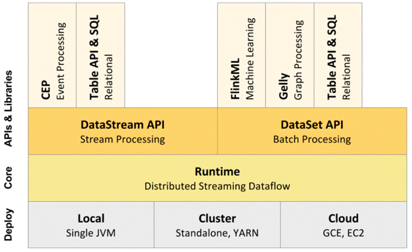

 

## 2.flink的主要运行方式有

Local：适用于开发

Standalone：分布式，适用于生产环境

On YARN：分布式，适用于生产环境（推荐）

 

## 3.Standalone集群模式安装

Linux，CentOS 6／7

安装JDK

下载 flink 安装包  

https://flink.apache.org/downloads.html

 

### 非高可用安装：

1.上传压缩包

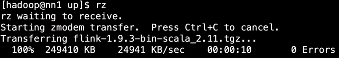

2.分发到每个机器上

 

  ./scp_all.sh ./up/flink-1.9.3-bin-scala_2.11.tgz /tmp/

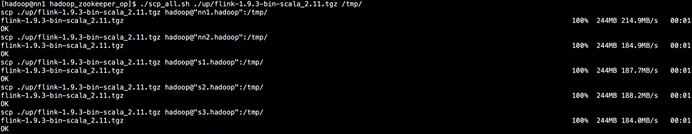

3.解压到/usr/local目录下

 

  ./ssh_root.sh tar -xzf /tmp/flink-1.9.3-bin-scala_2.11.tgz -C /usr/local/ 

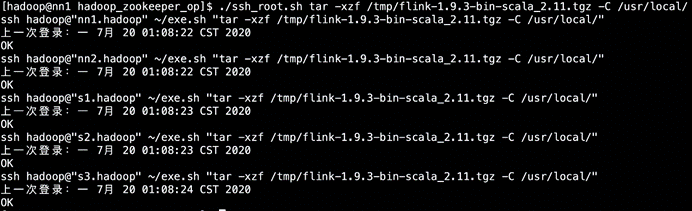

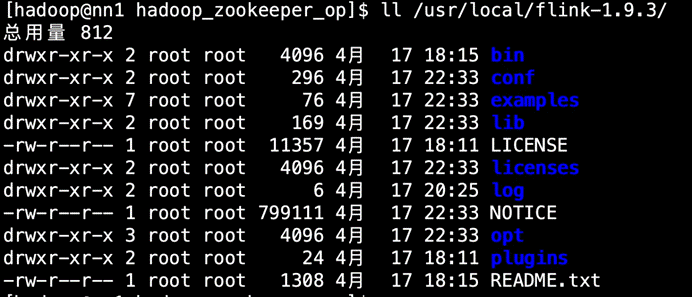

目录说明：

l bin:可执行脚本

l conf:配置文件目录

l examples:测试样例

l lib:依赖jar

l opt:扩展依赖jar

l log:日志

 

4.修改权限为hadoop


./ssh_root.sh chown -R hadoop:hadoop /usr/local/flink-1.9.3

 

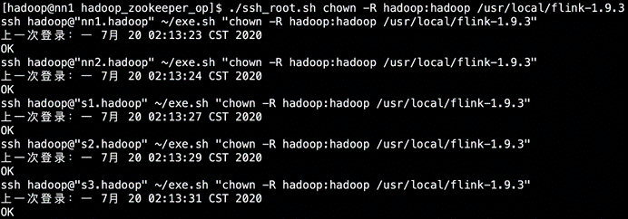

 

5.创建软件链接


./ssh_root.sh ln -s /usr/local/flink-1.9.3 /usr/local/flink

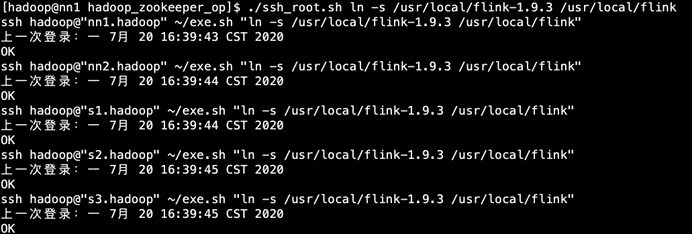

 

6.备份原有配置


./ssh_all.sh cp -r /usr/local/flink/conf /usr/local/flink/conf_back

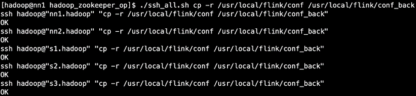

 

7.在每个机器上增加FLINK_HOME环境变量，之后source一下

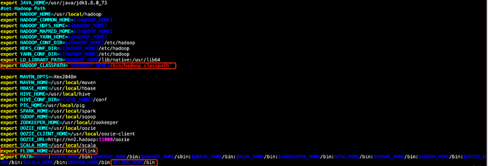

 

8.修改配置（conf目录下）

修改flink-conf.yaml

 

  vim /usr/local/flink/conf/flink-conf.yaml 

 

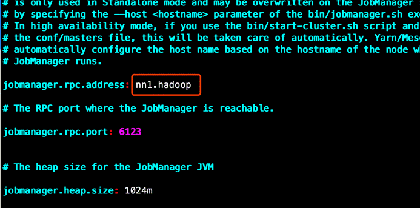

修改master

 

  vim /usr/local/flink/conf/masters  

 


修改slaves

 

  vim /usr/local/flink/conf/slaves  

 


 

分发修改配置

 

 ```shell
 ./scp_all.sh /usr/local/flink/conf/flink-conf.yaml /usr/local/flink/conf/
./scp_all.sh /usr/local/flink/conf/slaves /usr/local/flink/conf/
./scp_all.sh /usr/local/flink/conf/masters /usr/local/flink/conf/

 ```


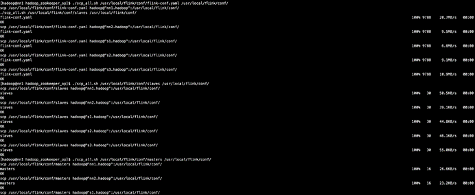


9.启动

 

  /usr/local/flink/bin/start-cluster.sh  

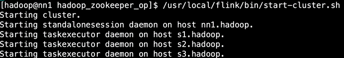

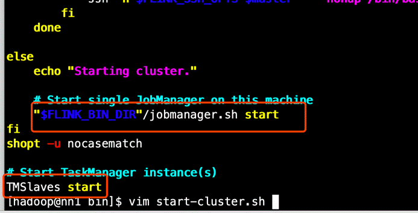

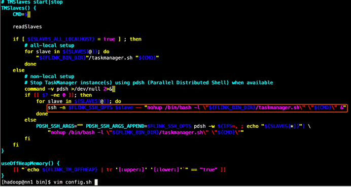

启动日志

 

  vim /usr/local/flink/log/flink-hadoop-standalonesession-0-nn1.hadoop.log  

 

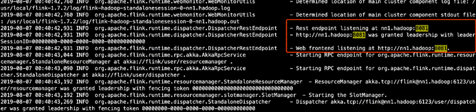

启动flink之后各机器上的进程

 

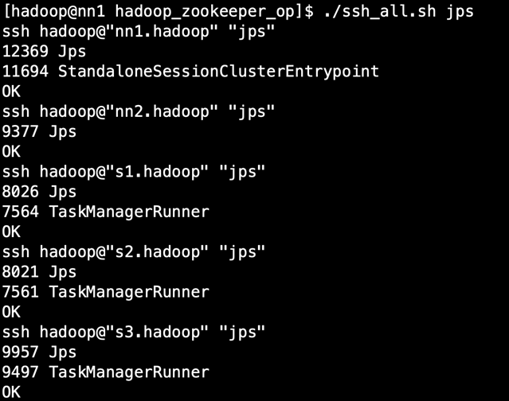

 

jobManager界面

 

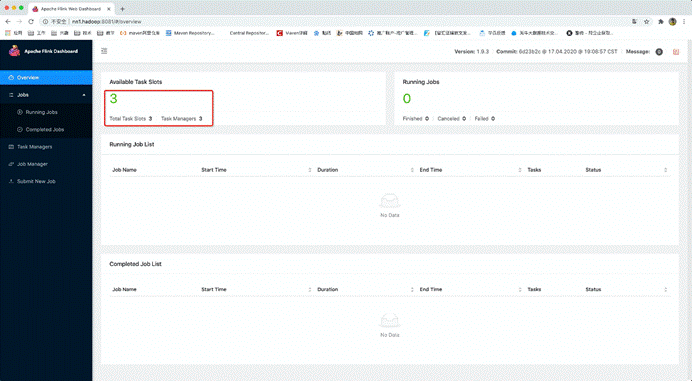

 

10.测试一下

功能是一个streaming版的WordCount

首先在nn1启动socketServer 

 

  nc -l -k -p 6666  

 


提交任务

 

  flink run -d /usr/local/flink/examples/streaming/SocketWindowWordCount.jar  --hostname  

 

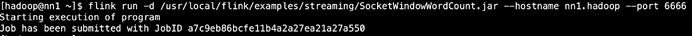

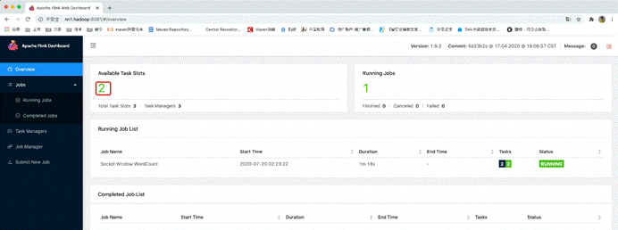


 

在nc中输入数据：

 


 

由于任务是在tm中运行，所以数据被打印到tm中


 

终止任务运行

 


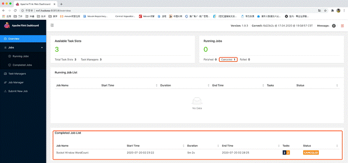

 

11.关闭集群

 

  stop-cluster.sh  

 

 

### 高可用安装：

1.修改配置（conf目录下）

修改flink-conf.yaml

 

  vim /usr/local/flink/conf/flink-conf.yaml  

 

高可用相关参数解释：

 ```shell

#指定高可用模式（必须）
high-availability: zookeeper
#ZooKeeper提供分布式协调服务（必须）
high-availability.zookeeper.quorum: nn1.hadoop:2181,nn2.hadoop:2181,s1.hadoop:2181
#根ZooKeeper节点，在该节点下放置所有集群节点（推荐）
high-availability.zookeeper.path.root: /flink
#JobManager元数据保存在文件系统storageDir中，只有指向此状态的指针存储在ZooKeeper中（必须）
high-availability.storageDir: hdfs://ns1/flink/ha/
#自定义集群（推荐）
high-availability.cluster-id: /hainiuFlinkCluster
#state checkpoints模式
state.backend: filesystem
#检查点(checkpoint)生成的分布式快照的保存地点，默认是jobmanager的memory，但是HA模式必须配置在hdfs上
state.checkpoints.dir: hdfs://ns1/flink/checkpoints    

 ```


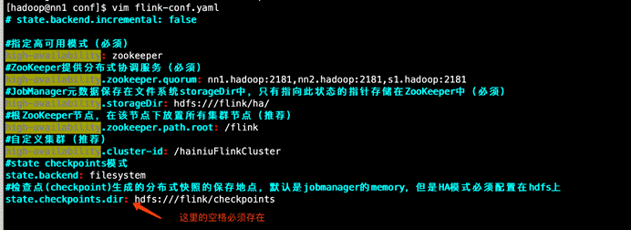

 

修改master

 

  vim /usr/local/flink/conf/masters  

 

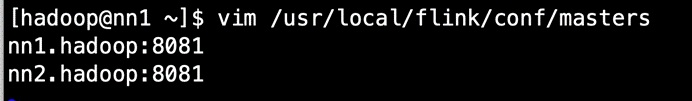

 

分发修改配置

 

  ./scp_all.sh /usr/local/flink/conf/flink-conf.yaml  /usr/local/flink/conf/  ./scp_all.sh  /usr/local/flink/conf/masters /usr/local/flink/conf/  

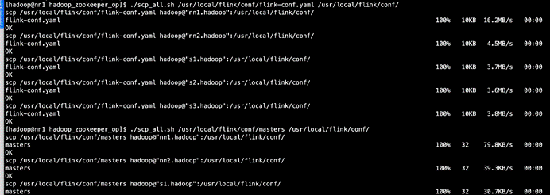

 

2.启动HA

先启动zookeeper

 

  ./ssh_all_zookeeper.sh /usr/local/zookeeper/bin/zkServer.sh start  

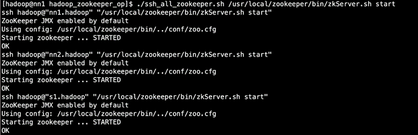

 

3.再启动hdfs

 

  start-dfs.sh  

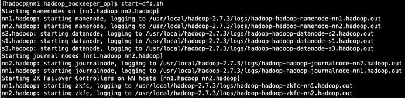

 

4.创建hdfs目录

 

  hadoop fs -mkdir -p hdfs:///flink/ha/  hadoop fs -mkdir  -p hdfs:///flink/checkpoints  

 


 

5.启动flink

 

  /usr/local/flink/bin/start-cluster.sh  

 

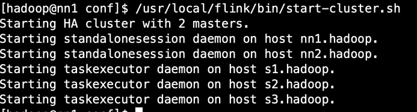

 

6.验证HA是否生效

查看主master的webUI

 

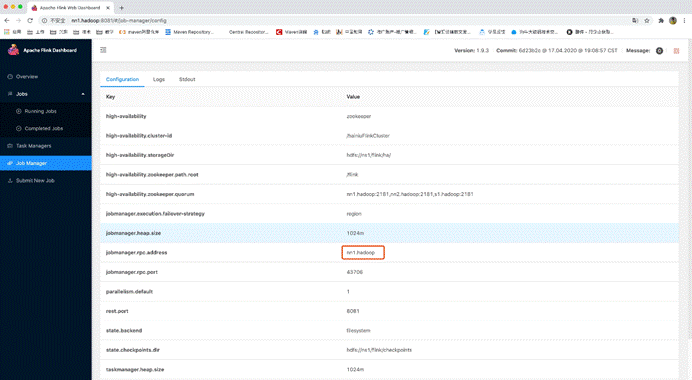

 

查看hdfs上的master元数据目录


 

查看zk中的是否新建/flink数据目录

 

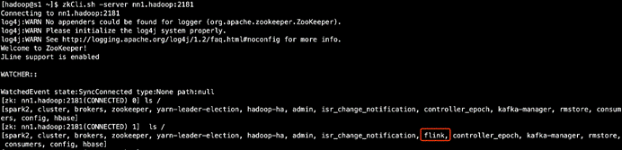

 

各机器上的进程

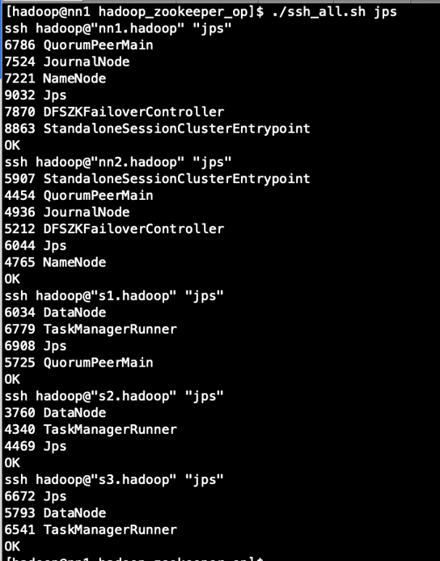

 

7.高可用演示：

提交任务

 

 

  flink run -d /usr/local/flink/examples/streaming/SocketWindowWordCount.jar  --hostna  

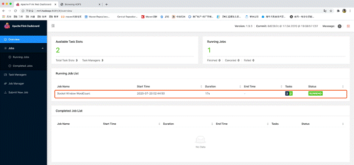

 

kill掉主master看看从master是否启用，以及运行中的任务是否还在

 

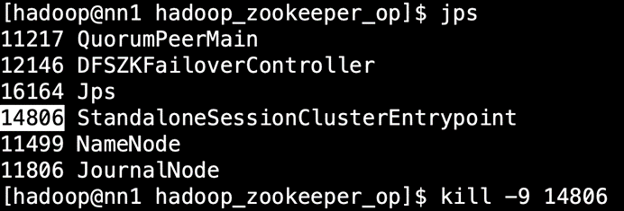

 

此时查看 从master 的日志，发现已经进入恢复模式

 

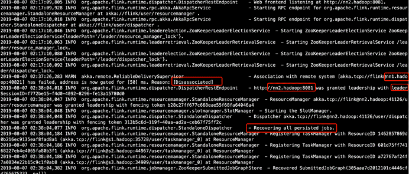

 

查看原来的从master的webUI，发现此时已经变成了主master

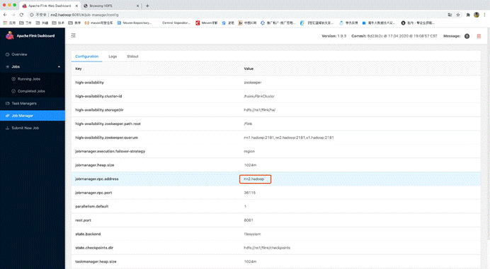

 

发现任务已恢复并正在运行

 

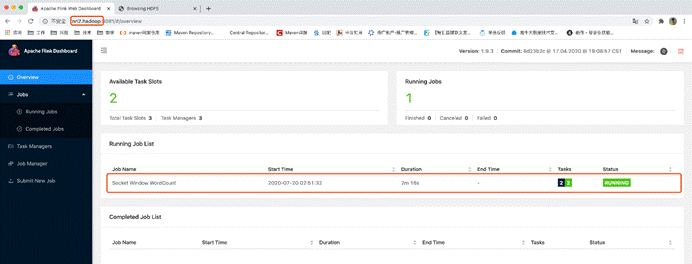

 

8.关闭集群，自动关闭HA

 

  stop-cluster.sh  

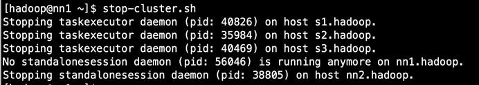

## 4.Flink On YARN模式

### 1.前言

在一个企业中，为了最大化的利用集群资源，一般都会在一个集群中同时运行多种类型的 Workload。因此 Flink 也支持在 Yarn 上面运行。首先，让我们通过下图了解下 Yarn 和 Flink 的关系。

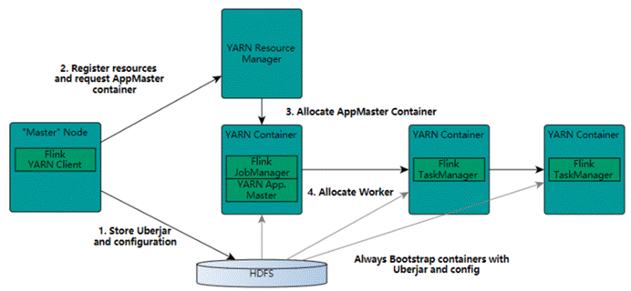

1.    在图中可以看出，Flink 与 Yarn 的关系与 MapReduce 和 Yarn 的关系是一样的。Flink 通过 Yarn 的接口实现了自己的 App Master。当在 Yarn 中部署了 Flink，Yarn 就会用自己的 Container 来启动 Flink 的 JobManager（也就是 App Master）和 TaskManager。

2.    启动新的Flink YARN会话时，客户端首先检查所请求的资源（容器和内存）是否可用。之后，它将包含Flink和配置的jar上传到HDFS（步骤1）。

3.    客户端的下一步是请求（步骤2）YARN容器以启动ApplicationMaster（步骤3）。由于客户端将配置和jar文件注册为容器的资源，因此在该特定机器上运行的YARN的NodeManager将负责准备容器（例如，下载文件）。完成后，将启动ApplicationMaster（AM）。

4.    该JobManager和AM在同一容器中运行。一旦它们成功启动，AM就知道JobManager（它自己的主机）的地址。它正在为TaskManagers生成一个新的Flink配置文件（以便它们可以连接到JobManager）。该文件也上传到HDFS。此外，AM容器还提供Flink的Web界面。YARN代码分配的所有端口都是临时端口。这允许用户并行执行多个Flink YARN会话。

5.    之后，AM开始为Flink的TaskManagers分配容器，这将从HDFS下载jar文件和修改后的配置。完成这些步骤后，即可建立Flink并准备接受作业。

### 2.修改配置

配置环境变量

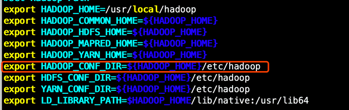

 

配置日志级别

 

  vim /usr/local/flink/conf/log4j-yarn-session.properties  

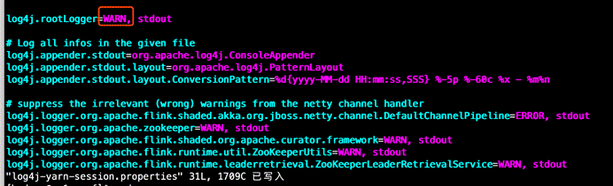

 

然后启动yarn

 

  start**-**yarn**.**sh  yarn**-**daemon**.**sh start proxyserver  #并删除原来的HA信息，不然会恢复以前的任务  #HDFS  hadoop fs **-**rmr **/**flink**/**checkpoints/*  hadoop fs -rmr /flink/ha/*  #ZK  zkCli.sh -server nn1.hadoop:2181  rmr /flink     

 

### 3.在yarn上启动jobManager

  yarn**-**session**.**sh **-**s 3 **-**tm 1024 **-**n 2 **-**jm 1024 **-**qu root**.**hainiu  

 

参数解释：

 

  **-**s **:** 每个TaskManager的slot的数量，executor**-**cores。建议将slot的数量设置每台机器的处理器数量  **-**tm **:** 每个TaskManager的内存大小，executor**-**memory  **-**n **:** TaskManager的数量，相当于executor的数量  **-**jm **:** JobManager的内存大小，driver**-**memory  **-**qu **:** yarn的资源队列  #可以通过  yarn-session.sh -h   命令来查看其它参数的使用  


 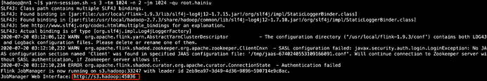

 

此时只是启动了一个jobManager

 

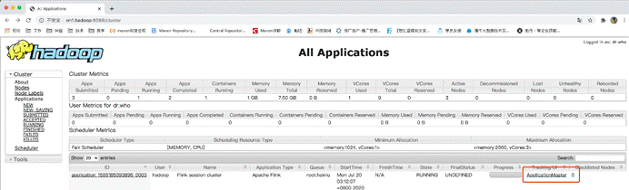

 

由于没有启动taskManager所以可用资源为0

 


### 4.此时提交任务，使用刚才的jobManager的address

先启动nc

 

  nc -l -k -p 6666  

 


 

  flink run **-**m s3**.**hadoop**:**45036 **-**yd **/**usr**/**local**/**flink**/**examples**/**streaming**/**SocketWindowWordCount**.**jar **--**hostname nn1**.**hadoop **--**port 6666  

 

参数解释：

 

  **-**m jobManager的地址  **-**yd yarn模式下背影运行  #可以通过直接输入  flink 命令来查看其它参数的使用  

 

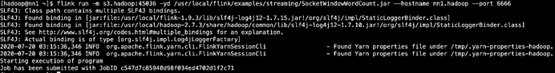

 

任务提交成功后，根据任务配置的最小资源模式启动相应的taskManager来运行这个任务，由于刚才配置的是2个taskManager每个有3个slot，而这个任务只需要一个slot，所以启动一个taskManager就够用了

 

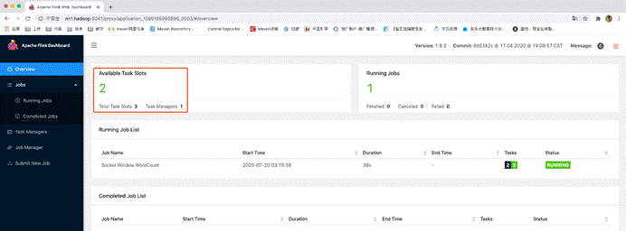

 

此时启动了5个任务，需要5个slot，而已启动的一个taskManager只有3个slot，所以无法满足已有任务的资源需求，所以就另外再启动了一个taskManager，那整个应用的slot就多出来了3个slot，变成了6个

 

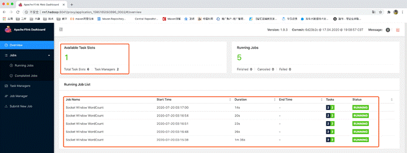

那如果是7个任务怎么办呢？还会再继续启动一个taskManager。如果yarn队列资源不够了才不会继续启动。

 

如果资源不够用了，那任务会是等待状态，长时间等待任务就会退出。

 

任务的等待状态

 

### 5.yarn模式的HA演示

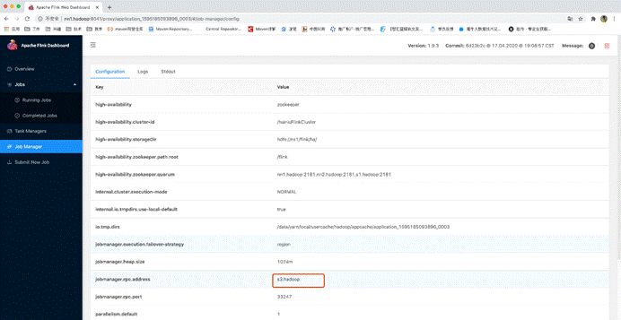

 

然后去所在机器上kill掉这个jobManager的yarn模式进程

 

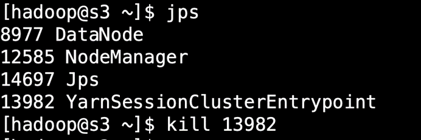

 

此时yarn会马上尝试重新再次启动这个jobManager

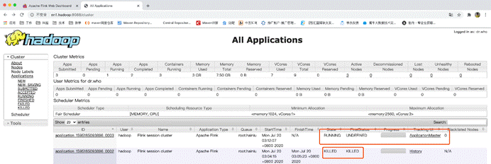

 

然后jobManager会去恢复，以前重新运行的任务

 

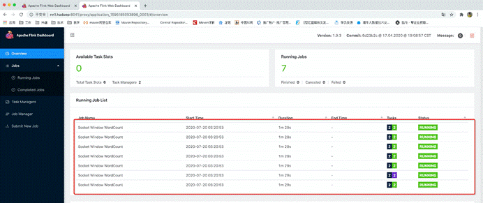

总结：说明flink在yarn模式下也是具备HA功能的，前提是你得在flink-conf.yaml配置HA相关的信息

 

以上是使用yarn-session.sh先启动了一个jobManager，然后再使用flink run -m jobManamger address来把任务提交到使用yarn-session.sh脚本启动的jobManager上

 

也可以不使用yarn-session.sh预先启动一个jobManager，而是直接使用flink run来运行一个自带jobManager的flink任务

 

比如下面这个命令，可以启动自带一个内存为1024MB的jobManager，最多2个内存为1536MB的taskManager，并且每个taskManager的taskSlots为3的flink应用，然后在这个flink应用直接运行了一个SocketWindowWordCount的任务

 

通过此命令运行的flink程序启动临时的jobManager和临时的taskManager，如果结果这个job，那临时的jobManager和taskManager也会直接退出

 

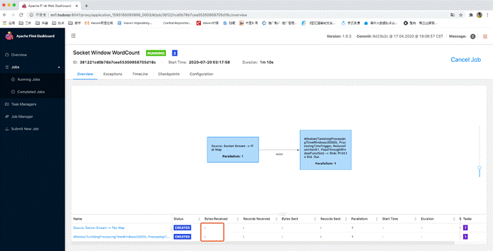

 

```shell
flink run -m yarn-cluster -yjm 1024 -ytm 1536 -yn 2 -ys 3 -yqu root.hainiu -ynm hainiuFlinkStreamingWordCount \
/usr/local/flink/examples/streaming/SocketWindowWordCount.jar --hostname nn1.hadoop --port 6666

```


参数解释：

-yjm jobManager的内存
-ytm taskManager的内存
-yn tm的数量
-ys 每个tm的任务槽
-yqu yarn资源队列名称
-ynm yarn application name


yarn application name已修改：

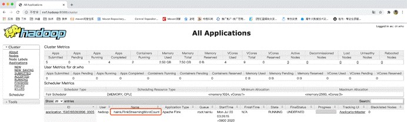

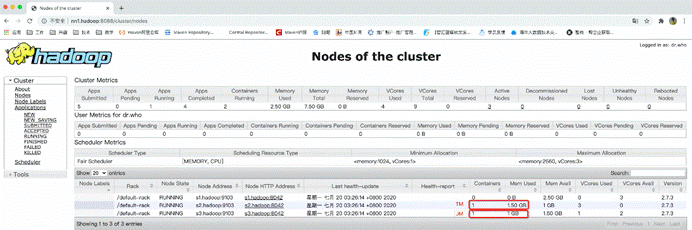


### 6.怎么在yarn模式上使用thinjar

#### 1.怎么让你的tm找到依赖的jar包

 

```shell
flink run -m yarn-cluster -yt /home/hadoop/spark_news_jars -yjm 1024 -ytm 1536 -yn 2 -ys 3 -yqu root.hainiu \
-ynm hainiuFlinkStreamingWordCount /usr/local/flink/examples/streaming/SocketWindowWordCount.jar --hostname nn1.hadoop --port 6666
#yt命令是上传指定目录到flink任务的hdfs目录，然后flink在yarn上中的程序先从这个HDFS把目录下的所有文件（包换刚才yt命令指定的本地目录）下载过来

```

 

 

 


 

跑任务那个机器的tm的进程信息

 


#### 2.怎么让你的driver找到依赖的jar包

 ```shell
flink run -m yarn-cluster -yt /home/hadoop/spark_news_jars -yjm 1024 -ytm 1536 -yn 2 -ys 3 -yqu root.hainiu -ynm hainiuFlinkStreamingWordCount 
-C file:///home/hadoop/spark_news_jars/kafka_2.11-0.10.0.1.jar /usr/local/flink/examples/streaming/SocketWindowWordCount.jar --hostname nn1.hadoop --port 6666
#-C 命令是同时指定driver和taskManager运行的java程序的classpath。这里用这个命令只为了让driver找到jar包，taskmanager是通过yt命令找到jar包的，所以tm上有没有-C命令指定的文件是无所谓的。
#-C 命令指定的文件路径必须URI格式的，那本地文件就以file:///开头，注意不能使用文件通配符"*"

 ```


跑任务那个机器的driver的进程信息


怎么指定dirver端找到多个依赖的jar包

 

结合shell脚本：

 

  ```shell
$(ll /home/hadoop/spark_news_jars/ |awk 'NR>1{print "-C file:///home/hadoop/spark_news_jars/"$9}'|tr '\n' ' ')
  ```

最终的命令如下：

```shell
flink run -m yarn-cluster -yt /home/hadoop/spark_news_jars -yjm 1024 -ytm 1536 -yn 2 -ys 3 -yqu root.hainiu -ynm hainiuFlinkStreamingWordCount \
$(ll /home/hadoop/spark_news_jars/ |awk 'NR>1{print "-C file:///home/hadoop/spark_news_jars/"$9}'|tr '\n' ' ') \
/usr/local/flink/examples/streaming/SocketWindowWordCount.jar --hostname nn1.hadoop --port 6666

```

 

跑任务那个机器的driver的进程信息

 

