<center>更多内容请关注：https://wjhub.gitee.io</center>


<center><a href="https://wjhub.gitee.io">锁清秋</a></center>


----

# 大数剧-flink-高级编程B

> flink开发 time、Watermarks、windows、windows的operator、TimerService、累加器

# 6.time、Watermarks、windows、windows的operator

## 1.time

**DataStream** **支持的三种time**

- DataStream有大量基于time的operator
- Flink支持三种time: 

1. - EventTime
   - IngestTime
   - ProcessingTime

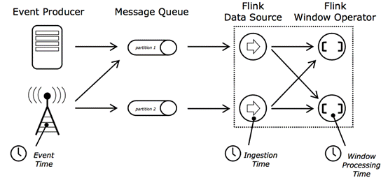

 

**三个时间的比较**

- EventTime

1. - 事件生成时的时间，在进入Flink之前就已经存在，可以从event的字段中抽取
   - 必须指定watermarks的生成方式
   - 优势:确定性：乱序、延时、或者数据重复等情况，都能给出正确的结果
   - 弱点:处理无序事件时性能和延迟受到影响

- IngestTime

1. - 事件进入flink的时间，即在source里获取的当前系统的时间，后续操作统一使用该时间
   - 不需要指定watermarks的生成方式(自动生成)
   - 弱点:不能处理无序事件和延迟数据

- ProcessingTime

1. - 执行操作的机器的当前系统时间(每个算子都不一样)
   - 不需要流和机器之间的协调
   - 优势:最佳的性能和最低的延迟
   - 弱点:不确定性 ，容易受到各种因素影像(event产生的速度、到达flink的速度、在算子之间传输速度等)，压根就不管顺序和延迟

- 比较

1. - 性能:      ProcessingTime> IngestTime> EventTime
   - 延迟:      ProcessingTime< IngestTime< EventTime
   - 确定性:      EventTime> IngestTime> ProcessingTime

 

**根据业务选择最合适的时间**

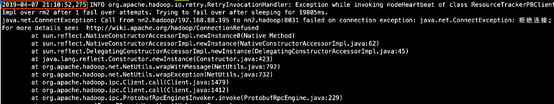

这个是hadoop的yarn日志，图中标注的是event time，同时也是yarn服务产生真正动作的时间，在进入操作时那台机器的系统时间是2019-04-07 21:10:55,666，

需求是要统计每隔5分钟内的日志error个数。

这时要使用event time才是是正确的。

注意：一般都需要使用event time，除非由于特殊情况只能用另外两种时间来代替

 

**设置time类型**

• 设置时间特性

 ```java
  val env = StreamExecutionEnvironment.getExecutionEnvironment();

  env.setStreamTimeCharacteristic(TimeCharacteristic.ProcessingTime)  ;
 ```


- 不设置Time 类型，默认是processingTime
- 如果使用EventTime则需要在source之后明确指定Timestamp Assigner &     Watermark Generator

 

## 2.Timestamp and Watermarks 时间戳和水位线

**Watermarks**

- out-of-order/late  element

- - 实时系统中，由于各种原因造成的延时，造成某些消息发到flink的时间延时于事件产生的时间。如果 基于event time构建window，但是对于late element，我们又不能无限期的等下去，必须要有个机制来保证一个特定的时间后，必须触发window去进行计算了。这个特别的机制，就是watermark 。

- Watermarks(水位线)就是来处理这种问题的机制

- - 是event time处理进度的标志
  - 表示比watermark更早(更老)的事件都已经到达(没有比水位线更低的数据 ) 
  - 基于watermark来进行窗口触发计算的判断


**有序流中Watermarks**

- 在某些情况下，基于Event Time的数据流是有续的
- 在有序流中，watermark就是一个简单的周期性标记。

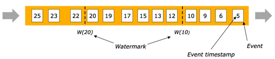

 

**乱序流中Watermarks**

- 在更多场景下，基于Event Time的数据流是无续的
- 在无序流中，watermark至关重要，它告诉operator比watermark更早(更老/时间戳更小)的事件已经到达， operator可以将内部事件时间提前到watermark的时间戳(可以触发window计算啦)

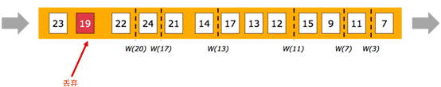

 

**并行流中的Watermarks**

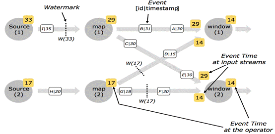

- 通常情况下， watermark在source函数中生成，但是也可以在source后任何阶段，如果指定多次后面会覆盖前面的值。 source的每个sub task独立生成水印
- watermark通过operator时会推进operators处的当前event time，同时operators会为下游生成一个新的watermark
- 多输入operator(union、 keyBy)的当前watermark是其输入流watermark的最小值

 

**生成Timestamp和Watermark**

- 需要设置     Timestamp / Watermark 的地方

- - 只有基于EventTime的流处理程序需要指定Timestamp和Watermarks的生成方式
  - 指定时间特性为Event Time

 ```java
val env = StreamExecutionEnvironment.getExecutionEnvironment(); 
env.setStreamTimeCharacteristic(TimeCharacteristic.EventTime);
#声明时间特性为Event Time后，Flink需要知道每个event的timestamp(一般从event的某个字段去抽取)
#Flink还需要知道目前event time的进度也就是Watermarks(一般伴随着Event Time一起指定生成的，二者息息相关) 
 ```

 

- 注意事项

- - timestamp和watermark都是采用毫秒
  - 代码中的event、element、record都是一个意思


 **生成Timestamp和Watermark有两种方式 **

1.直接在source function中生成

- 自定义source实现SourceFunction接口或者继承RichParallelSourceFunction

示例代码：

 ```java
package cn.zhanghub.windows;

import org.apache.flink.configuration.Configuration;
import org.apache.flink.streaming.api.TimeCharacteristic;
import org.apache.flink.streaming.api.datastream.DataStreamSource;
import org.apache.flink.streaming.api.environment.StreamExecutionEnvironment;
import org.apache.flink.streaming.api.functions.source.SourceFunction;
import org.apache.flink.streaming.api.watermark.Watermark;

public class TimestampWatermarkMethod1 {

    public static void main(String[] args) throws Exception {
        StreamExecutionEnvironment env = StreamExecutionEnvironment.createLocalEnvironmentWithWebUI(new Configuration());
        env.setStreamTimeCharacteristic(TimeCharacteristic.EventTime);

        DataStreamSource<String> dss = env.addSource(new SourceFunction<String>() {
            private Boolean isCancel = true;

            @Override
            public void run(SourceContext<String> ctx) throws Exception {
                while (isCancel) {
                    long currentTime = System.currentTimeMillis();
                    String testStr = currentTime + "\tzhanghub\t" + (currentTime - 1000);
                    String[] split = testStr.split("\t");
                    Long timestamp = Long.valueOf(split[0]);
                    String data = split[1];
                    Long waterMarkTime = Long.valueOf(split[2]);
                    ctx.collectWithTimestamp(data,timestamp);
                    ctx.emitWatermark(new Watermark(waterMarkTime));
                    Thread.sleep(1000);
                }
            }

            @Override
            public void cancel() {
                isCancel = false;
            }
        });
        dss.print();

        env.execute();
    }

}

 ```

2.timestamp assigner / watermark generator

- 通过assignTimestampsAndWatermarks方法指定timestamp assigner / watermark generator
- 一般在datasource后调用assignTimestampsAndWatermarks方法，也可以在第一个基于event time的operator之前指定(例如window operator)

- 特例：使用Kafka Connector作为source时，在source内部assignTimestampsAndWatermarks

 

- assignTimestampsAndWatermarks

- - 含义：提取记录中的时间戳作为Event time，主要在window操作中发挥作用，不设置默认就是ProcessingTime
  - 限制：只有基于event time构建window时才起作用
  - 使用场景：当你需要使用event time来创建window时，用来指定如何获取event的时间戳

**两种Watermark**

- Periodic Watermarks

- - 基于Timer
  - ExecutionConfig.setAutoWatermarkInterval(msec)      (默认是 200ms, 设置watermarker发送的周期)
  - 实现AssignerWithPeriodicWatermarks 接口

-  Puncuated     WaterMarks

- - 基于某些事件触发watermark 的生成和发送(由用户代码实现，例如遇到特殊元素)
  - 实现AssignerWithPuncuatedWatermarks 接口

1.Periodic Watermark

- 周期性调用getCurrentWatermark，如果获取的Watermark不等于null且比上一个最新的Watermark大 就向下游发射

示例代码：

```jade
package cn.zhanghub.windows;

import org.apache.flink.configuration.Configuration;
import org.apache.flink.streaming.api.TimeCharacteristic;
import org.apache.flink.streaming.api.datastream.DataStreamSource;
import org.apache.flink.streaming.api.environment.StreamExecutionEnvironment;
import org.apache.flink.streaming.api.functions.AssignerWithPeriodicWatermarks;
import org.apache.flink.streaming.api.functions.source.SourceFunction;
import org.apache.flink.streaming.api.watermark.Watermark;

import javax.annotation.Nullable;

public class TimestampWatermarkMethod2 {

    public static void main(String[] args) throws Exception {
        StreamExecutionEnvironment env = StreamExecutionEnvironment.createLocalEnvironmentWithWebUI(new Configuration());
        env.setStreamTimeCharacteristic(TimeCharacteristic.EventTime);

        DataStreamSource<String> dss = env.addSource(new SourceFunction<String>() {
            private Boolean isCancel = true;

            @Override
            public void run(SourceContext<String> ctx) throws Exception {
                while (isCancel) {
                    long currentTime = System.currentTimeMillis();
                    String testStr = currentTime + "\tzhanghub";
                    ctx.collect(testStr);
                    Thread.sleep(1000);
                }
            }

            @Override
            public void cancel() {
                isCancel = false;
            }
        });
        dss.assignTimestampsAndWatermarks(new AssignerWithPeriodicWatermarks<String>() {

            private long maxOutOfOrderness = 1000;

            private long waterMarkTime;

            @Nullable
            @Override
            public Watermark getCurrentWatermark() {
                //要比上一个最新的Watermark大
                //减去就是允许延时的时间
                return new Watermark(waterMarkTime - maxOutOfOrderness);
            }

            @Override
            public long extractTimestamp(String element, long previousElementTimestamp) {
                String[] split = element.split("\t");
                Long timestamp = Long.valueOf(split[0]);
                waterMarkTime = timestamp;
                return timestamp;
            }
        }).print();

        env.execute();
    }

}
```

2.Puncuated Watermark

- 根据自定义条件生成Watermark

示例代码：

```jade
package cn.zhanghub.windows;

import org.apache.flink.configuration.Configuration;
import org.apache.flink.streaming.api.TimeCharacteristic;
import org.apache.flink.streaming.api.datastream.DataStreamSource;
import org.apache.flink.streaming.api.environment.StreamExecutionEnvironment;
import org.apache.flink.streaming.api.functions.AssignerWithPunctuatedWatermarks;
import org.apache.flink.streaming.api.functions.source.SourceFunction;
import org.apache.flink.streaming.api.watermark.Watermark;

import javax.annotation.Nullable;

public class TimestampWatermarkMethod3 {

    public static void main(String[] args) throws Exception {
        StreamExecutionEnvironment env = StreamExecutionEnvironment.createLocalEnvironmentWithWebUI(new Configuration());
        env.setStreamTimeCharacteristic(TimeCharacteristic.EventTime);

        DataStreamSource<String> dss = env.addSource(new SourceFunction<String>() {
            private Boolean isCancel = true;

            @Override
            public void run(SourceContext<String> ctx) throws Exception {
                while (isCancel) {
                    long currentTime = System.currentTimeMillis();
                    String testStr = currentTime + "\tzhanghub";
                    ctx.collect(testStr);
                    Thread.sleep(1000);
                }
            }

            @Override
            public void cancel() {
                isCancel = false;
            }
        });
        dss.assignTimestampsAndWatermarks(new AssignerWithPunctuatedWatermarks<String>() {

            private long maxOutOfOrderness = 1000;

            @Override
            public Watermark checkAndGetNextWatermark(String lastElement, long extractedTimestamp) {
                String[] split = lastElement.split("\t");
                String data= split[1];
                if(data.equals("zhanghub")){
                    return new Watermark(extractedTimestamp - maxOutOfOrderness);
                }else {
                    return null;
                }
            }

            @Override
            public long extractTimestamp(String element, long previousElementTimestamp) {
                String[] split = element.split("\t");
                Long timestamp = Long.valueOf(split[0]);
                return timestamp;
            }
        }).print();

        env.execute();
    }

}
```

**以上是使用接口实现自定义WaterMarker和Timestamp的生成方法。**

**当然也可以使用Flink提供好的方法：**

**1).AscendingTimestampExtractor**

- 适用于event时间戳单调递增的场景，用于有序数据流

示例代码：

```java
package cn.zhanghub.windows;

import org.apache.flink.configuration.Configuration;
import org.apache.flink.streaming.api.TimeCharacteristic;
import org.apache.flink.streaming.api.datastream.DataStreamSource;
import org.apache.flink.streaming.api.environment.StreamExecutionEnvironment;
import org.apache.flink.streaming.api.functions.source.SourceFunction;
import org.apache.flink.streaming.api.functions.timestamps.AscendingTimestampExtractor;

public class TimestampWatermarkMethod4 {

    public static void main(String[] args) throws Exception {
        StreamExecutionEnvironment env = StreamExecutionEnvironment.createLocalEnvironmentWithWebUI(new Configuration());
        env.setStreamTimeCharacteristic(TimeCharacteristic.EventTime);

        DataStreamSource<String> dss = env.addSource(new SourceFunction<String>() {
            private Boolean isCancel = true;

            @Override
            public void run(SourceContext<String> ctx) throws Exception {
                while (isCancel) {
                    long currentTime = System.currentTimeMillis();
                    String testStr = currentTime + "\tzhanghub";
                    ctx.collect(testStr);
                    Thread.sleep(1000);
                }
            }

            @Override
            public void cancel() {
                isCancel = false;
            }
        });
        dss.assignTimestampsAndWatermarks(new AscendingTimestampExtractor<String>() {
            @Override
            public long extractAscendingTimestamp(String element) {
                String[] split = element.split("\t");
                Long timestamp = Long.valueOf(split[0]);
                return timestamp;
            }
        }).print();

        env.execute();
    }

}

```

**2).BoundedOutOfOrdernessTimestampExtractor**

- 允许固定延迟的Assigner，适用于预先知道最大延迟的场景(例如最多比之前的元素延迟1000ms)，用于乱序数据流在windows中处理延时数据。

示例代码：

```jade
package cn.zhanghub.windows;

import org.apache.flink.configuration.Configuration;
import org.apache.flink.streaming.api.TimeCharacteristic;
import org.apache.flink.streaming.api.datastream.DataStreamSource;
import org.apache.flink.streaming.api.environment.StreamExecutionEnvironment;
import org.apache.flink.streaming.api.functions.source.SourceFunction;
import org.apache.flink.streaming.api.functions.timestamps.BoundedOutOfOrdernessTimestampExtractor;
import org.apache.flink.streaming.api.windowing.time.Time;

public class TimestampWatermarkMethod5 {

    public static void main(String[] args) throws Exception {
        StreamExecutionEnvironment env = StreamExecutionEnvironment.createLocalEnvironmentWithWebUI(new Configuration());
        env.setStreamTimeCharacteristic(TimeCharacteristic.EventTime);

        DataStreamSource<String> dss = env.addSource(new SourceFunction<String>() {
            private Boolean isCancel = true;

            @Override
            public void run(SourceContext<String> ctx) throws Exception {
                while (isCancel) {
                    long currentTime = System.currentTimeMillis();
                    String testStr = currentTime + "\tzhanghub";
                    ctx.collect(testStr);
                    Thread.sleep(1000);
                }
            }

            @Override
            public void cancel() {
                isCancel = false;
            }
        });
        dss.assignTimestampsAndWatermarks(new BoundedOutOfOrdernessTimestampExtractor<String>(Time.seconds(10)) {
            @Override
            public long extractTimestamp(String element) {
                String[] split = element.split("\t");
                Long timestamp = Long.valueOf(split[0]);
                return timestamp;
            }
        }).print();

        env.execute();
    }

}

```

- 延迟数据处理，用于乱序数据流不在windows中，在别一个地方处理延时数据。

- - allowedLateness()，设定最大延迟时间，触发被延迟，不宜设置太长
  - sideOutputTag，设置侧输出标记，侧输出是可用于给延迟数据设置标记，然后根据标记再获取延迟的数据 ，这样就不会丢弃数据了

示例代码：

```java
package cn.zhanghub.flink.windows;

import org.apache.flink.api.common.functions.MapFunction;
import org.apache.flink.api.common.typeinfo.BasicTypeInfo;
import org.apache.flink.api.java.functions.KeySelector;
import org.apache.flink.streaming.api.TimeCharacteristic;
import org.apache.flink.streaming.api.datastream.DataStream;
import org.apache.flink.streaming.api.datastream.DataStreamSource;
import org.apache.flink.streaming.api.datastream.SingleOutputStreamOperator;
import org.apache.flink.streaming.api.environment.StreamExecutionEnvironment;
import org.apache.flink.streaming.api.functions.source.SourceFunction;
import org.apache.flink.streaming.api.functions.timestamps.AscendingTimestampExtractor;
import org.apache.flink.streaming.api.functions.windowing.ProcessWindowFunction;
import org.apache.flink.streaming.api.windowing.assigners.TumblingEventTimeWindows;
import org.apache.flink.streaming.api.windowing.time.Time;
import org.apache.flink.streaming.api.windowing.windows.TimeWindow;
import org.apache.flink.util.Collector;
import org.apache.flink.util.OutputTag;

import java.util.Iterator;

public class TimestampWatermarkMethod6 {

    private static final OutputTag<String> late = new OutputTag<String>("late", BasicTypeInfo.STRING_TYPE_INFO){};

    public static void main(String[] args) throws Exception {
        StreamExecutionEnvironment env = StreamExecutionEnvironment.getExecutionEnvironment();
        env.setStreamTimeCharacteristic(TimeCharacteristic.EventTime);
        env.setParallelism(1);

        SingleOutputStreamOperator<String> stringSingleOutputStreamOperator = env.addSource(new SourceFunction<String>() {
            private Boolean isCancel = true;

            @Override
            public void run(SourceContext<String> ctx) throws Exception {
                int num = 1;
                while (isCancel) {
                    long currentTime = System.currentTimeMillis();
                    if (num % 2 == 0) {
                        //这里的4000可能超时也可能不超时
                        currentTime -= 4000;
                    }

                    String testStr = currentTime + "\tzhanghub\t" + num;
                    System.out.println("source:" + testStr);
                    num++;
                    ctx.collect(testStr);
                    Thread.sleep(1000);
                }
            }

            @Override
            public void cancel() {
                isCancel = false;
            }
        }).assignTimestampsAndWatermarks(new AscendingTimestampExtractor<String>() {
            @Override
            public long extractAscendingTimestamp(String element) {
                String[] split = element.split("\t");
                String s = split[0];
                Long eventTime = Long.valueOf(s);
                return eventTime;
            }
        });

        SingleOutputStreamOperator<String> process = stringSingleOutputStreamOperator.keyBy(new KeySelector<String, String>() {
            @Override
            public String getKey(String value) throws Exception {
                String[] split = value.split("\t");
                return split[1];
            }
        }).timeWindow(Time.seconds(2))
                .allowedLateness(Time.seconds(2))
                .sideOutputLateData(late)
                .process(new ProcessWindowFunction<String, String, String, TimeWindow>() {
                    @Override
                    public void process(String s, Context context, Iterable<String> elements, Collector<String> out) throws Exception {
                        System.out.println(
                            "subtask:" + getRuntimeContext().getIndexOfThisSubtask() +
                                ",start:" + context.window().getStart() +
                                ",end:" + context.window().getEnd() +
                                ",waterMarks:" + context.currentWatermark() +
                                ",currentTime:" + System.currentTimeMillis());

                        Iterator<String> iterator = elements.iterator();
                        for (; iterator.hasNext(); ) {
                            String next = iterator.next();
                            System.out.println("windows-->" + next);
                            out.collect("on time:" + next);
                        }
                    }
                });

        //处理准时的数据
        process.print();
        //处理延时的数据
        DataStream<String> lateOutPut = process.getSideOutput(late);
        lateOutPut.map(new MapFunction<String, String>() {
            @Override
            public String map(String value) throws Exception {
                return "late:" + value;
            }
        }).print();

        env.execute();
    }
}

```

## 3.Window

**什么是windows，以及windows的作用，可以参考spark的windows**

- Flink 认为     Batch 是 Streaming 的一个特例，所以     Flink 底层引擎是一个流式引擎，在上面实现了流 处理和批处理。而窗口(window)就是从 Streaming 到 Batch 的一个桥梁。Flink 提供了非常完善的窗口机制，这是Flink最大的亮点之一（其他的亮点包括消息乱序处理，和 checkpoint 机制）。
- Window是一种切割无限数据集为有限块并进行相应计算的处理手段(跟keyBy一样，也是一种分组 手段)
- 在流处理应用中，数据是连续不断的，因此我们不可能等到所有数据都到了才开始处理。当然我们可以每来一个消息就处理一次，但是有时我们需要做一些聚合类的处理，例如:在过去的1分钟内有多少用户点击了我们的网页。在这种情况下，我们必须定义一个窗口，用来收集最近一分钟内的     数据，并对这个窗口内的数据进行计算。

 

**Window Assingers****（Window分类器），分为Keyed Windows和Non-Keyed Windows**

- Window Assinger是干啥的

- - 当你决定stream是否keyby之后，window是没有构建的，你还需要指定一个window Assinger 用于定义元素如何分配到窗口中

- window Assinger如何指定?

- - Keyedstream：window(WindowAssigner)
  - non-keyed streams：windowAll(WindowAssigner)

- window Assinger的作用:负责将每个传入的元素分配给一个或多个窗口


 **Windows** **分类器API示例：**

- Keyed Windows（在已经按照key分组的基础上(KeyedStream)，再构建多任务并行window）

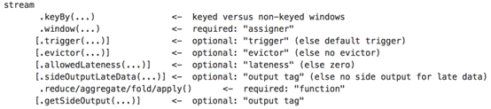

- Non-Keyed Windows（在未分组的DataStream上构建单任务window，并行度是1，API都带All后缀）

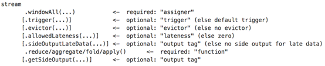

  **取决于是否使用了keyBy**

**WindowedStream & AllWindowedStream**

- WindowedStream代表了根据key分组，并且基于WindowAssigner切分窗口的数据流。所以WindowedStream都是从KeyedStream衍生而来的。而在WindowedStream上进行任何transformation也都将转变回DataStream。

 ```scala
val stream: DataStream[MyType] = ...
val windowed: WindowedDataStream[MyType] = stream
        .keyBy("userId")
        .window(TumblingEventTimeWindows.of(Time.seconds(5))) // Last 5 seconds of data
val result: DataStream[ResultType] = windowed.reduce(myReducer)

 ```


- 上述 WindowedStream 的样例代码在运行时会转换成如下的执行图：

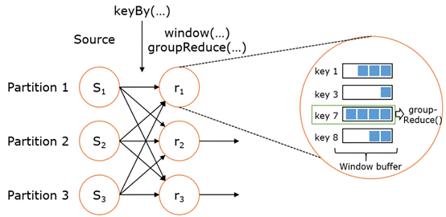

- Flink 的窗口实现中会将到达的数据缓存在对应的窗口buffer中。当到达窗口发送的条件时，Flink 会对整个窗口中的数据进行处理（由Trigger控制）。Flink 在聚合类窗口有一定的优化，即不会保存窗口中的所有值，而是每到一个元素执行一次聚合函数，最终只保存一份数据即可。
- 在key分组的流上进行窗口切分是比较常用的场景，也能够很好地并行化（不同的key上的窗口聚合可以分配到不同的task去处理）。不过有时候我们也需要在普通流上进行窗口的操作，这就是 AllWindowedStream。AllWindowedStream是直接在DataStream上进行windowAll(...)操作。AllWindowedStream 的实现是基于 WindowedStream     的（Flink 1.1.x 开始）。Flink 不推荐使用AllWindowedStream，因为在普通流上进行窗口操作，就势必需要将所有分区的流都汇集到单个的Task中，而这个单个的Task很显然就会成为整个Job的瓶颈。

 

**Keyed Windows** **对比** **Non-Keyed Windows** **（以基于** **time** **的** **window** **为例）**

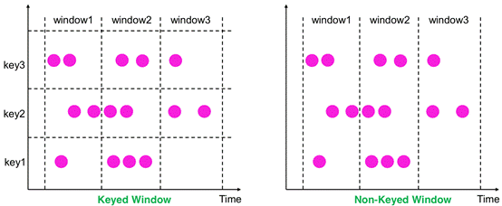

 

**Window** **分类** **(Window Assinger 类型 )**

- 有了window Assinger，才会创建出各种形式的window来覆盖我们所需的各种场景，所以不用 过多关注window本身的分类，关注window Assinger的分类即可
- Count-based window:根据元素个数对数据流进行分组切片

- - Tumbling CountWindow
  - Sliding CountWindow

- Time-based window :根据时间对数据流进行分组切片，设置方式window(start，end)

- - Tumbling Window
  - Sliding Window
  - Session Window

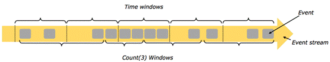

 

**所有类型窗口对比：**

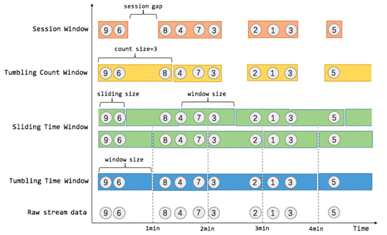

 

| 大类                   | 小类            | 按照key切分 | Time-base/按时间切 分 | Count-base/按count 切分 |
| ---------------------- | --------------- | ----------- | --------------------- | ----------------------- |
| Keyed-Window           | Tumbling Window | 是          | 是                    | 是                      |
| Sliding Window         | 是              | 是          | 是                    |                         |
| Session Window         | 是              | 是(不固定)  | 否                    |                         |
| Global Windows         | 是              | 是/否       | 是/否                 |                         |
| Tumbling count  Window | 是              | 否          | 是                    |                         |
| Sliding count Window   | 是              | 否          | 是                    |                         |
| Non-keyed  Window      | Tumbling Window | 否          | 是                    | 是                      |
| Sliding Window         | 否              | 是          | 是                    |                         |
| Session Window         | 否              | 是(不固定)  | 否                    |                         |
| Tumbling count  Window | 否              | 否          | 是                    |                         |
| Sliding count  Window  | 否              | 否          | 是                    |                         |

 

**Window** **的生命周期**

- 创建:当属于该窗口的第一个元素到达时就会创建该窗口

- 销毁:当时间(event/process time)超过窗口的结束时间戳+用户指定的延迟时 

- (allowedLateness(<time>))，窗口将被移除(仅限time-based window) 

- - 例如:对于一个每5分钟创建Tumbling Windows(即翻滚窗口)窗口，允许1分钟的时延，Flink将会在12:00到12:05这段时间内第一个元素到达时创建窗口，当watermark超过12:06时，该窗口将被移除

- Trigger(触发器):指定了窗口函数在什么条件下可被触发，触发器还可以决定在创建和删除窗口之间的任何时间清除窗口的内容。在这种情况下，清除仅限于窗口中的元素，而不是窗口元数据。这意味着新数据仍然可以添加到该窗口中。

- - 例如:当窗口中的元素个数超过4个时“ 或者 ”当水印达到窗口的边界时“触发计算

- Evictor(驱逐者):将在触发器触发之后或者在函数被应用前后，过滤(filter)窗口中的元素

- Window 的函数:函数里定义了应用于窗口(Window)生命周期内的计算逻辑

 

**总结**

- Window Assigner：分配器，解决数据分到那个窗口的问题。
- Trigger：触发器，解决什么时候开始算的问题。
- Evictor：“驱逐者”，类似filter作用，解决窗口运算前后数据过滤的问题。

 

**窗口练习：**

**Tumbling Windows** **（翻滚窗口）**

- 定义：将数据依据固定的窗口长度对数据进行切片

- 特点：

- - 时间对齐
  - 窗口长度固定 
  - event无重叠

- 适用场景:计算各个时间段的指标

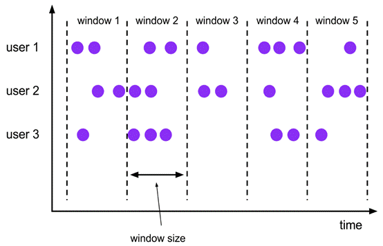

 

**Tumbling Windows** **的使用**

- 对齐方式:默认是aligned with epoch(整点、整分、整秒等)。

示例代码：

```java
package cn.zhanghub.flink.windows;

import org.apache.flink.api.java.functions.KeySelector;
import org.apache.flink.streaming.api.TimeCharacteristic;
import org.apache.flink.streaming.api.datastream.KeyedStream;
import org.apache.flink.streaming.api.datastream.SingleOutputStreamOperator;
import org.apache.flink.streaming.api.environment.StreamExecutionEnvironment;
import org.apache.flink.streaming.api.functions.source.SourceFunction;
import org.apache.flink.streaming.api.functions.timestamps.AscendingTimestampExtractor;
import org.apache.flink.streaming.api.functions.windowing.ProcessWindowFunction;
import org.apache.flink.streaming.api.windowing.assigners.TumblingEventTimeWindows;
import org.apache.flink.streaming.api.windowing.assigners.TumblingProcessingTimeWindows;
import org.apache.flink.streaming.api.windowing.time.Time;
import org.apache.flink.streaming.api.windowing.windows.TimeWindow;
import org.apache.flink.util.Collector;

import java.util.Iterator;

public class TumblingWindows {

    public static void main(String[] args) throws Exception {
        StreamExecutionEnvironment env = StreamExecutionEnvironment.getExecutionEnvironment();
        env.setStreamTimeCharacteristic(TimeCharacteristic.EventTime);

        SingleOutputStreamOperator<String> stringSingleOutputStreamOperator = env.addSource(new SourceFunction<String>() {
            private Boolean isCancel = true;

            @Override
            public void run(SourceContext<String> ctx) throws Exception {
                int num = 1;
                while (isCancel) {
                    long currentTime = System.currentTimeMillis();
                    String testStr = currentTime + "\tzhanghub\t" + num;
                    num++;
                    ctx.collect(testStr);
                    Thread.sleep(1000);
                }
            }

            @Override
            public void cancel() {
                isCancel = false;
            }
        }).assignTimestampsAndWatermarks(new AscendingTimestampExtractor<String>() {
            @Override
            public long extractAscendingTimestamp(String element) {
                String[] split = element.split("\t");
                String s = split[0];
                Long eventTime = Long.valueOf(s);
                return eventTime;
            }
        });

        KeyedStream<String, String> keyedStream = stringSingleOutputStreamOperator.keyBy(new KeySelector<String, String>() {
            @Override
            public String getKey(String value) throws Exception {
                String[] split = value.split("\t");
                return split[1];
            }
        });

        keyedStream.window(TumblingEventTimeWindows.of(Time.seconds(10),Time.seconds(9)))
                .process(new ProcessWindowFunction<String, String, String, TimeWindow>() {
                    @Override
                    public void process(String s, Context context, Iterable<String> elements, Collector<String> out) throws Exception {
                        System.out.println("subtask:" + getRuntimeContext().getIndexOfThisSubtask() +
                                ",start:" + context.window().getStart() +
                                ",end:" + context.window().getEnd() +
                                ",waterMarks:" + context.currentWatermark() +
                                ",currentTime:" + System.currentTimeMillis());
                        Iterator<String> iterator = elements.iterator();
                        Integer sum = 0;
                        for (; iterator.hasNext(); ) {
                            String next = iterator.next();
                            System.out.println(next);
                            String[] split = next.split("\t");
                            String s1 = split[2];
                            Integer integer = Integer.valueOf(s1);
                            sum += integer;
                        }
                        out.collect("sum:" + sum);
                    }
                }).print();

        keyedStream.window(TumblingProcessingTimeWindows.of(Time.seconds(5)));
        keyedStream.window(TumblingProcessingTimeWindows.of(Time.seconds(5),Time.seconds(2)));

        env.execute();
    }
}

```

**Sliding Windows** **（滑动窗口）**

- 定义：是固定窗口的更广义的一种形式。滑动窗口由固定的窗口长度和滑动间隔组成

- 特点：

- - 时间对齐
  - 窗口长度固定 
  - event有重叠（如果滑动间隔大于窗口是允许的，但是会造成数据丢失）

- 适用场景：每5分钟求统计一小时的数据，那就应该5分钟是窗口的滑动间隔，1小时为窗口的大小

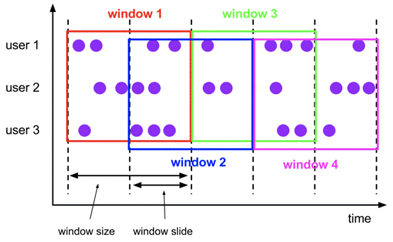

 

**Sliding Windows****的使用**

- 对齐方式：默认是aligned     with epoch(整点、整分、整秒等)。

示例代码：

```java
package cn.zhanghub.windows;

import org.apache.flink.api.common.functions.ReduceFunction;
import org.apache.flink.api.java.functions.KeySelector;
import org.apache.flink.api.java.tuple.Tuple3;
import org.apache.flink.streaming.api.TimeCharacteristic;
import org.apache.flink.streaming.api.datastream.KeyedStream;
import org.apache.flink.streaming.api.datastream.SingleOutputStreamOperator;
import org.apache.flink.streaming.api.environment.StreamExecutionEnvironment;
import org.apache.flink.streaming.api.functions.source.SourceFunction;
import org.apache.flink.streaming.api.functions.timestamps.AscendingTimestampExtractor;
import org.apache.flink.streaming.api.windowing.assigners.SlidingEventTimeWindows;
import org.apache.flink.streaming.api.windowing.assigners.SlidingProcessingTimeWindows;
import org.apache.flink.streaming.api.windowing.time.Time;

public class SlidingWindows {
    public static void main(String[] args) throws Exception {
        StreamExecutionEnvironment env = StreamExecutionEnvironment.getExecutionEnvironment();
        env.setStreamTimeCharacteristic(TimeCharacteristic.EventTime);

        SingleOutputStreamOperator<Tuple3<String, Long, Long>> zhanghub = env.addSource(new SourceFunction<Tuple3<String, Long, Long>>() {
            private Boolean isCancel = true;

            @Override
            public void run(SourceContext<Tuple3<String, Long, Long>> ctx) throws Exception {
                while (isCancel) {
                    ctx.collect(new Tuple3<>("zhanghub", 1L, System.currentTimeMillis()));
                    Thread.sleep(1000);
                }
            }

            @Override
            public void cancel() {
                isCancel = false;
            }
        }).assignTimestampsAndWatermarks(new AscendingTimestampExtractor<Tuple3<String, Long, Long>>() {
            @Override
            public long extractAscendingTimestamp(Tuple3<String, Long, Long> element) {
                return element.f2;
            }
        });

        KeyedStream<Tuple3<String, Long, Long>, String> keyBy = zhanghub.keyBy(new KeySelector<Tuple3<String, Long, Long>, String>() {
            @Override
            public String getKey(Tuple3<String, Long, Long> value) throws Exception {
                return value.f0;
            }
        });

        SingleOutputStreamOperator<Tuple3<String, Long, Long>> sum = keyBy.window(SlidingEventTimeWindows.of(Time.seconds(10), Time.seconds(5)))
                .reduce(new ReduceFunction<Tuple3<String, Long, Long>>() {
                    @Override
                    public Tuple3<String, Long, Long> reduce(Tuple3<String, Long, Long> value1, Tuple3<String, Long, Long> value2) throws Exception {
                        return Tuple3.of(value1.f0, value1.f1 + value2.f1, value2.f2);
                    }
                });

//        SingleOutputStreamOperator<Tuple3<String, Long, Long>> sum = keyBy.window(SlidingProcessingTimeWindows.of(Time.seconds(10), Time.seconds(5)))
//                .reduce(new ReduceFunction<Tuple3<String, Long, Long>>() {
//                    @Override
//                    public Tuple3<String, Long, Long> reduce(Tuple3<String, Long, Long> value1, Tuple3<String, Long, Long> value2) throws Exception {
//                        return Tuple3.of(value1.f0, value1.f1 + value2.f1, value2.f2);
//                    }
//                });

//        SingleOutputStreamOperator<Tuple3<String, Long, Long>> sum = keyBy.window(SlidingProcessingTimeWindows.of(Time.seconds(10), Time.seconds(5), Time.seconds(2)))
//                .reduce(new ReduceFunction<Tuple3<String, Long, Long>>() {
//                    @Override
//                    public Tuple3<String, Long, Long> reduce(Tuple3<String, Long, Long> value1, Tuple3<String, Long, Long> value2) throws Exception {
//                        return Tuple3.of(value1.f0, value1.f1 + value2.f1, value2.f2);
//                    }
//                });

        sum.print();

        env.execute();
    }
}

```

**Session Windows** **（事件窗口）**

- 定义：类似于web应用 的session，即一段时间没有接受到新数据就会生成新的窗口(固定gap/gap fun)

- 特点：

- - 时间无对齐
  - event不重叠
  - 没有固定开始和结束时间

- 适用场景：基于用户行为进行统计分析

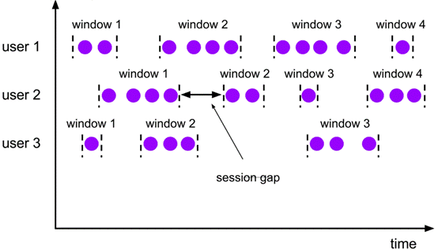

 

**Session Windows** **的使用**

- Gap

- - 固定gap
  - 动态gap：实现SessionWindowTimeGapExtractor

- 特殊处理方式

- - session window      operator为每个到达的event创建一个新窗口，如果它们之间的距离比定义的间隔更近，则将窗口合并在一起
  - 为了能够合并， session window operator需要合并触发器和合并窗口函数，例如ReduceFunction、 AggregateFunction或ProcessWindowFunction (FoldFunction不能合并)

示例代码：

```java
package cn.zhanghub.windows;

import org.apache.flink.api.common.functions.ReduceFunction;
import org.apache.flink.api.java.functions.KeySelector;
import org.apache.flink.api.java.tuple.Tuple3;
import org.apache.flink.streaming.api.TimeCharacteristic;
import org.apache.flink.streaming.api.datastream.KeyedStream;
import org.apache.flink.streaming.api.datastream.SingleOutputStreamOperator;
import org.apache.flink.streaming.api.environment.StreamExecutionEnvironment;
import org.apache.flink.streaming.api.functions.source.SourceFunction;
import org.apache.flink.streaming.api.functions.timestamps.AscendingTimestampExtractor;
import org.apache.flink.streaming.api.windowing.assigners.EventTimeSessionWindows;
import org.apache.flink.streaming.api.windowing.assigners.ProcessingTimeSessionWindows;
import org.apache.flink.streaming.api.windowing.assigners.SessionWindowTimeGapExtractor;
import org.apache.flink.streaming.api.windowing.time.Time;

public class SessionWindows {
    public static void main(String[] args) throws Exception {
        StreamExecutionEnvironment env = StreamExecutionEnvironment.getExecutionEnvironment();
        env.setStreamTimeCharacteristic(TimeCharacteristic.EventTime);

        SingleOutputStreamOperator<Tuple3<String, Long, Long>> zhanghub = env.addSource(new SourceFunction<Tuple3<String, Long, Long>>() {
            private Boolean isCancel = true;

            @Override
            public void run(SourceContext<Tuple3<String, Long, Long>> ctx) throws Exception {
                long num = 0;
                while (isCancel) {
                    num += 1;
                    ctx.collect(new Tuple3<>("zhanghub", num, System.currentTimeMillis()));
                    if (num % 5 == 0) {
                        Thread.sleep(3000);
                    } else {
                        Thread.sleep(1000);
                    }
                }
            }

            @Override
            public void cancel() {
                isCancel = false;
            }
        }).assignTimestampsAndWatermarks(new AscendingTimestampExtractor<Tuple3<String, Long, Long>>() {
            @Override
            public long extractAscendingTimestamp(Tuple3<String, Long, Long> element) {
                return element.f2;
            }
        });

        KeyedStream<Tuple3<String, Long, Long>, String> keyBy = zhanghub.keyBy(new KeySelector<Tuple3<String, Long, Long>, String>() {
            @Override
            public String getKey(Tuple3<String, Long, Long> value) throws Exception {
                return value.f0;
            }
        });

        SingleOutputStreamOperator<Tuple3<String, Long, Long>> sum = keyBy.window(EventTimeSessionWindows.withGap(Time.seconds(2)))
                .reduce(new ReduceFunction<Tuple3<String, Long, Long>>() {
                    @Override
                    public Tuple3<String, Long, Long> reduce(Tuple3<String, Long, Long> value1, Tuple3<String, Long, Long> value2) throws Exception {
                        return Tuple3.of(value1.f0, value1.f1 + value2.f1, value2.f2);
                    }
                });

//        SingleOutputStreamOperator<Tuple3<String, Long, Long>> sum = keyBy.window(EventTimeSessionWindows.withDynamicGap(new SessionWindowTimeGapExtractor<Tuple3<String, Long, Long>>() {
//            @Override
//            public long extract(Tuple3<String, Long, Long> element) {
//                if (element.f1 % 5 == 0) {
//                    return 2500L;
//                } else {
//                    return 2000L;
//                }
//            }
//        })).reduce(new ReduceFunction<Tuple3<String, Long, Long>>() {
//            @Override
//            public Tuple3<String, Long, Long> reduce(Tuple3<String, Long, Long> value1, Tuple3<String, Long, Long> value2) throws Exception {
//                return Tuple3.of(value1.f0, value1.f1 + value2.f1, value2.f2);
//            }
//        });

//        SingleOutputStreamOperator<Tuple3<String, Long, Long>> sum = keyBy.window(ProcessingTimeSessionWindows.withGap(Time.seconds(2)))
//                .reduce(new ReduceFunction<Tuple3<String, Long, Long>>() {
//                    @Override
//                    public Tuple3<String, Long, Long> reduce(Tuple3<String, Long, Long> value1, Tuple3<String, Long, Long> value2) throws Exception {
//                        return Tuple3.of(value1.f0, value1.f1 + value2.f1, value2.f2);
//                    }
//                });

//        SingleOutputStreamOperator<Tuple3<String, Long, Long>> sum = keyBy.window(ProcessingTimeSessionWindows.withDynamicGap(new SessionWindowTimeGapExtractor<Tuple3<String, Long, Long>>() {
//            @Override
//            public long extract(Tuple3<String, Long, Long> element) {
//                if (element.f1 % 5 == 0) {
//                    return 2500L;
//                } else {
//                    return 2000L;
//                }
//            }
//        })).reduce(new ReduceFunction<Tuple3<String, Long, Long>>() {
//            @Override
//            public Tuple3<String, Long, Long> reduce(Tuple3<String, Long, Long> value1, Tuple3<String, Long, Long> value2) throws Exception {
//                return Tuple3.of(value1.f0, value1.f1 + value2.f1, value2.f2);
//            }
//        });

        sum.print();

        env.execute();
    }
}

```

**Global Windows**


·     定义:有相同key的所有元素分配给相同的单个全局窗口 

·     必须指定自定义触发器否则没有任何意义

·     注意:不要跟Non-keyed Window搞混，两个不同的角度

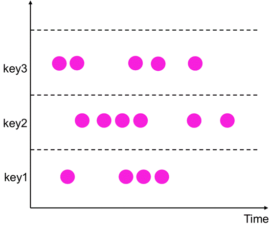

**Global Windows** **的使用**

·     Trigger :触发器，触发窗口的计算或数据清除，每个Window Assigner有一个默认的Trigger。解决什么时候开始算的问题

·     Evictor :“驱逐者”，类似filter作用。在Trigger触发之后，window被处理前或者后，Evictor用来删除窗口中无用的元素，可以进一步解决窗口输入输出数据的问题，默认是没有驱逐器的，所以也不常用。

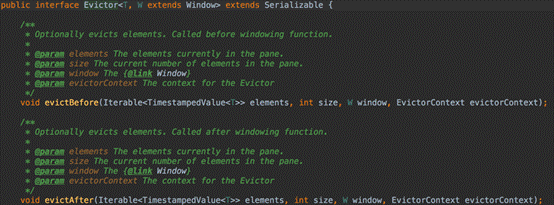

示例代码：

```java
package cn.zhanghub.windows;

import org.apache.flink.api.common.functions.ReduceFunction;
import org.apache.flink.api.java.functions.KeySelector;
import org.apache.flink.api.java.tuple.Tuple3;
import org.apache.flink.streaming.api.TimeCharacteristic;
import org.apache.flink.streaming.api.datastream.KeyedStream;
import org.apache.flink.streaming.api.datastream.SingleOutputStreamOperator;
import org.apache.flink.streaming.api.environment.StreamExecutionEnvironment;
import org.apache.flink.streaming.api.functions.source.SourceFunction;
import org.apache.flink.streaming.api.functions.timestamps.AscendingTimestampExtractor;
import org.apache.flink.streaming.api.windowing.assigners.GlobalWindows;
import org.apache.flink.streaming.api.windowing.evictors.Evictor;
import org.apache.flink.streaming.api.windowing.triggers.CountTrigger;
import org.apache.flink.streaming.api.windowing.windows.GlobalWindow;
import org.apache.flink.streaming.runtime.operators.windowing.TimestampedValue;

import java.util.Iterator;

public class GlobalWindowsH {
    public static void main(String[] args) throws Exception {
        StreamExecutionEnvironment env = StreamExecutionEnvironment.getExecutionEnvironment();
        env.setStreamTimeCharacteristic(TimeCharacteristic.EventTime);

        SingleOutputStreamOperator<Tuple3<String, Long, Long>> zhanghub = env.addSource(new SourceFunction<Tuple3<String, Long, Long>>() {
            private Boolean isCancel = true;

            @Override
            public void run(SourceContext<Tuple3<String, Long, Long>> ctx) throws Exception {
                long num = 0;
                while (isCancel) {
                    num += 1;
                    ctx.collect(new Tuple3<>("zhanghub", num, System.currentTimeMillis()));
                    Thread.sleep(1000);
                }
            }

            @Override
            public void cancel() {
                isCancel = false;
            }
        }).assignTimestampsAndWatermarks(new AscendingTimestampExtractor<Tuple3<String, Long, Long>>() {
            @Override
            public long extractAscendingTimestamp(Tuple3<String, Long, Long> element) {
                return element.f2;
            }
        });

        KeyedStream<Tuple3<String, Long, Long>, String> keyBy = zhanghub.keyBy(new KeySelector<Tuple3<String, Long, Long>, String>() {
            @Override
            public String getKey(Tuple3<String, Long, Long> value) throws Exception {
                return value.f0;
            }
        });

        SingleOutputStreamOperator<Tuple3<String, Long, Long>> sum = keyBy.window(GlobalWindows.create())
                .trigger(CountTrigger.of(5))
                .evictor(new Evictor<Tuple3<String, Long, Long>, GlobalWindow>() {
                    @Override
                    public void evictBefore(Iterable<TimestampedValue<Tuple3<String, Long, Long>>> elements, int size, GlobalWindow window, EvictorContext evictorContext) {
                        for (Iterator<TimestampedValue<Tuple3<String, Long, Long>>> iterator = elements.iterator(); iterator.hasNext(); ) {
                            TimestampedValue<Tuple3<String, Long, Long>> next = iterator.next();
                            System.out.println("before:" + next.getValue());
                            if (next.getValue().f1 % 5 == 0) {
                                iterator.remove();
                            }
                        }
                    }

                    @Override
                    public void evictAfter(Iterable<TimestampedValue<Tuple3<String, Long, Long>>> elements, int size, GlobalWindow window, EvictorContext evictorContext) {
                        for (Iterator<TimestampedValue<Tuple3<String, Long, Long>>> iterator = elements.iterator(); iterator.hasNext(); ) {
                            TimestampedValue<Tuple3<String, Long, Long>> next = iterator.next();
                            System.out.println("after:" + next.getValue());
                        }
                    }

                })
                .reduce(new ReduceFunction<Tuple3<String, Long, Long>>() {
                    @Override
                    public Tuple3<String, Long, Long> reduce(Tuple3<String, Long, Long> value1, Tuple3<String, Long, Long> value2) throws Exception {
                        return Tuple3.of(value1.f0, value1.f1 + value2.f1, value2.f2);
                    }
                });

        sum.print();

        env.execute();
    }
}

```

**窗口函数(作用在window上的Operator)**

- 在定义了窗口分配器之后，我们需要为每一个窗口明确的指定计算逻辑，这个就是窗口函数要做的事情，当系统决定一个窗口已经准备好执行之后，这个窗口函数将被用来处理窗口中的每一个元素(可能是分组的)。
- 窗口函数有那些：

| function                                        | 优点                                                         | 缺点                                                         |
| ----------------------------------------------- | ------------------------------------------------------------ | ------------------------------------------------------------ |
| ReduceFunction                                  | 更高效，因为在每个窗口中增量地对每一个到达的元素执行聚合操作(增量 聚合) | 场景覆盖不全，无法获取窗口的元数据                           |
| AggregateFunction(max/maxBy...)                 |                                                              |                                                              |
| FoldFunction(不推荐)                            |                                                              |                                                              |
| WindowFunction/AllWindowFunction                | 场景覆盖全面，可以拿到窗口的元数据：                         | • 相对低效一些，先把属于窗口的 所有元素都缓存，等到该计算了， 全部拿出来再计算; <br /> • 都可跟reducefun、aggfun、 foldfun组合使用 |
| ProcessWindowFunction/Process AllWindowFunction |                                                              |                                                              |
| ProcessWindowFunction与前三者 之一组合(混搭)    | 兼具高效和场景的覆盖                                         |                                                              |

- 特别提示:在没有专门说明的情况下，凡是带All的API就是给Non-keyed window使用的

WindowFunction用法：

示例代码：

```java
package cn.zhanghub.windows;

import org.apache.flink.api.java.functions.KeySelector;
import org.apache.flink.api.java.tuple.Tuple2;
import org.apache.flink.api.java.tuple.Tuple3;
import org.apache.flink.streaming.api.TimeCharacteristic;
import org.apache.flink.streaming.api.datastream.KeyedStream;
import org.apache.flink.streaming.api.datastream.SingleOutputStreamOperator;
import org.apache.flink.streaming.api.environment.StreamExecutionEnvironment;
import org.apache.flink.streaming.api.functions.source.SourceFunction;
import org.apache.flink.streaming.api.functions.timestamps.AscendingTimestampExtractor;
import org.apache.flink.streaming.api.functions.windowing.WindowFunction;
import org.apache.flink.streaming.api.windowing.assigners.GlobalWindows;
import org.apache.flink.streaming.api.windowing.evictors.Evictor;
import org.apache.flink.streaming.api.windowing.triggers.CountTrigger;
import org.apache.flink.streaming.api.windowing.windows.GlobalWindow;
import org.apache.flink.streaming.runtime.operators.windowing.TimestampedValue;
import org.apache.flink.util.Collector;

import java.util.Iterator;


public class WindowsFunctionOnCountWindow {
    public static void main(String[] args) throws Exception {
        StreamExecutionEnvironment env = StreamExecutionEnvironment.getExecutionEnvironment();
        env.setStreamTimeCharacteristic(TimeCharacteristic.EventTime);

        SingleOutputStreamOperator<Tuple3<String, Long, Long>> zhanghub = env.addSource(new SourceFunction<Tuple3<String, Long, Long>>() {
            private Boolean isCancel = true;

            @Override
            public void run(SourceContext<Tuple3<String, Long, Long>> ctx) throws Exception {
                long num = 0;
                while (isCancel) {
                    num += 1;
                    ctx.collect(new Tuple3<>("zhanghub", num, System.currentTimeMillis()));
                    Thread.sleep(1000);
                }
            }

            @Override
            public void cancel() {
                isCancel = false;
            }
        }).assignTimestampsAndWatermarks(new AscendingTimestampExtractor<Tuple3<String, Long, Long>>() {
            @Override
            public long extractAscendingTimestamp(Tuple3<String, Long, Long> element) {
                return element.f2;
            }
        });

        KeyedStream<Tuple3<String, Long, Long>, String> keyBy = zhanghub.keyBy(new KeySelector<Tuple3<String, Long, Long>, String>() {
            @Override
            public String getKey(Tuple3<String, Long, Long> value) throws Exception {
                return value.f0;
            }
        });

        keyBy.window(GlobalWindows.create())
                .trigger(CountTrigger.of(5))
                .evictor(new Evictor<Tuple3<String, Long, Long>, GlobalWindow>() {
                    @Override
                    public void evictBefore(Iterable<TimestampedValue<Tuple3<String, Long, Long>>> elements, int size, GlobalWindow window, EvictorContext evictorContext) {
                        for (Iterator<TimestampedValue<Tuple3<String, Long, Long>>> iterator = elements.iterator(); iterator.hasNext(); ) {
                            TimestampedValue<Tuple3<String, Long, Long>> next = iterator.next();
                            System.out.println("before:" + next.getValue());
                        }
                    }

                    @Override
                    public void evictAfter(Iterable<TimestampedValue<Tuple3<String, Long, Long>>> elements, int size, GlobalWindow window, EvictorContext evictorContext) {
                        for (Iterator<TimestampedValue<Tuple3<String, Long, Long>>> iterator = elements.iterator(); iterator.hasNext(); ) {
                            TimestampedValue<Tuple3<String, Long, Long>> next = iterator.next();
                            iterator.remove();
                        }
                    }
                })
                .apply(new WindowFunction<Tuple3<String, Long, Long>, Tuple2<String, Long>, String, GlobalWindow>() {
                    @Override
                    public void apply(String s, GlobalWindow window, Iterable<Tuple3<String, Long, Long>> input, Collector<Tuple2<String, Long>> out) throws Exception {
                        long sum = 0;
                        Iterator<Tuple3<String, Long, Long>> iterator = input.iterator();
                        for (input.iterator(); iterator.hasNext(); ) {
                            Tuple3<String, Long, Long> next = iterator.next();
                            System.out.println(next);
                            sum += next.f1;
                        }
                        System.out.println(sum);
                        out.collect(Tuple2.of(s, sum));
                    }
                }).print();

        env.execute();

    }

}

```

ProcessWindowFunction/ProcessAllWindowFunction与ReduceFunction混搭用法

- 含义: ProcessWindowFunction可以与ReduceFunction、AggregateFunction或FoldFunction组合，以便在元素到达窗口时增量地聚合它们。当窗口关闭时，ProcessWindowFunction将提供聚合结果。ProcessWindowFunction可以在访问附加窗口元信息的同时进行增量计算。

示例代码：

```java
package cn.zhanghub.windows;

import org.apache.flink.api.common.functions.AggregateFunction;
import org.apache.flink.api.java.functions.KeySelector;
import org.apache.flink.api.java.tuple.Tuple2;
import org.apache.flink.api.java.tuple.Tuple3;
import org.apache.flink.api.java.tuple.Tuple4;
import org.apache.flink.streaming.api.TimeCharacteristic;
import org.apache.flink.streaming.api.datastream.KeyedStream;
import org.apache.flink.streaming.api.datastream.SingleOutputStreamOperator;
import org.apache.flink.streaming.api.environment.StreamExecutionEnvironment;
import org.apache.flink.streaming.api.functions.source.SourceFunction;
import org.apache.flink.streaming.api.functions.timestamps.AscendingTimestampExtractor;
import org.apache.flink.streaming.api.functions.windowing.ProcessWindowFunction;
import org.apache.flink.streaming.api.windowing.assigners.TumblingEventTimeWindows;
import org.apache.flink.streaming.api.windowing.time.Time;
import org.apache.flink.streaming.api.windowing.windows.TimeWindow;
import org.apache.flink.util.Collector;

import java.util.Iterator;

public class ProcessAggregateFunctionOnCountWindow {
    public static void main(String[] args) throws Exception {

        StreamExecutionEnvironment env = StreamExecutionEnvironment.getExecutionEnvironment();
        env.setStreamTimeCharacteristic(TimeCharacteristic.EventTime);

        SingleOutputStreamOperator<Tuple3<String, Long, Long>> zhanghub = env.addSource(new SourceFunction<Tuple3<String, Long, Long>>() {
            private Boolean isCancel = true;

            @Override
            public void run(SourceContext<Tuple3<String, Long, Long>> ctx) throws Exception {
                long num = 0;
                while (isCancel) {
                    num += 1;
                    ctx.collect(new Tuple3<>("zhanghub", num, System.currentTimeMillis()));
                    Thread.sleep(1000);
                }
            }

            @Override
            public void cancel() {
                isCancel = false;
            }
        }).assignTimestampsAndWatermarks(new AscendingTimestampExtractor<Tuple3<String, Long, Long>>() {
            @Override
            public long extractAscendingTimestamp(Tuple3<String, Long, Long> element) {
                return element.f2;
            }
        });

        KeyedStream<Tuple3<String, Long, Long>, String> keyBy = zhanghub.keyBy(new KeySelector<Tuple3<String, Long, Long>, String>() {
            @Override
            public String getKey(Tuple3<String, Long, Long> value) throws Exception {
                return value.f0;
            }
        });

        SingleOutputStreamOperator<Tuple4<String, Long, Long, Long>> sum = keyBy.window(TumblingEventTimeWindows.of(Time.seconds(5)))
                .aggregate(new AggregateFunction<Tuple3<String, Long, Long>, Tuple2<String, Long>, Tuple2<String, Long>>() {
                    @Override
                    public Tuple2<String, Long> createAccumulator() {
                        return Tuple2.of("", 0L);
                    }

                    @Override
                    public Tuple2<String, Long> add(Tuple3<String, Long, Long> value, Tuple2<String, Long> accumulator) {
                        System.out.println("aggregate:" + value);
                        return Tuple2.of(value.f0, value.f1 + accumulator.f1);
                    }

                    @Override
                    public Tuple2<String, Long> getResult(Tuple2<String, Long> accumulator) {
                        return accumulator;
                    }

                    @Override
                    public Tuple2<String, Long> merge(Tuple2<String, Long> a, Tuple2<String, Long> b) {
                        return Tuple2.of(a.f0, a.f1 + b.f1);
                    }
                }, new ProcessWindowFunction<Tuple2<String, Long>, Tuple4<String, Long, Long, Long>, String, TimeWindow>() {
                    @Override
                    public void process(String s, Context context, Iterable<Tuple2<String, Long>> elements, Collector<Tuple4<String, Long, Long, Long>> out) throws Exception {
                        for (Iterator<Tuple2<String, Long>> iterator = elements.iterator(); iterator.hasNext(); ) {
                            Tuple2<String, Long> next = iterator.next();
                            System.out.println("process:" + next);
                        }
                        Tuple2<String, Long> next = elements.iterator().next();
                        TimeWindow window = context.window();
                        out.collect(Tuple4.of(next.f0, next.f1, window.getStart(), window.getEnd()));
                    }
                });

        sum.print();

        env.execute();
    }
}

```

## 4.windows的operator练习：

### 1.WindowsAll基础使用

示例代码：

```java
package cn.zhanghub.windows;

import org.apache.flink.api.common.functions.ReduceFunction;
import org.apache.flink.api.java.functions.KeySelector;
import org.apache.flink.api.java.tuple.Tuple2;
import org.apache.flink.streaming.api.datastream.DataStreamSource;
import org.apache.flink.streaming.api.datastream.KeyedStream;
import org.apache.flink.streaming.api.datastream.SingleOutputStreamOperator;
import org.apache.flink.streaming.api.environment.StreamExecutionEnvironment;

import java.util.ArrayList;
import java.util.List;

public class ReduceFunctionOnCountWindowAll {
    public static void main(String[] args) throws Exception {
        StreamExecutionEnvironment env = StreamExecutionEnvironment.getExecutionEnvironment();
        List<Tuple2<String,Long>> list = new ArrayList<>();
        list.add(Tuple2.of("zhanghub",1L));
        list.add(Tuple2.of("zhanghub2",2L));
        list.add(Tuple2.of("zhanghub",3L));
        list.add(Tuple2.of("zhanghub2",4L));
        list.add(Tuple2.of("zhanghub3",100L));

        DataStreamSource<Tuple2<String, Long>> input = env.fromCollection(list);
        KeyedStream<Tuple2<String, Long>, String> keyBy = input.keyBy(new KeySelector<Tuple2<String, Long>, String>() {
            @Override
            public String getKey(Tuple2<String, Long> value) throws Exception {
                return value.f0;
            }
        });
        SingleOutputStreamOperator<Tuple2<String, Long>> reduce = keyBy.countWindowAll(2).reduce(new ReduceFunction<Tuple2<String, Long>>() {
            @Override
            public Tuple2<String, Long> reduce(Tuple2<String, Long> value1, Tuple2<String, Long> value2) throws Exception {
                return Tuple2.of(value1.f0, value1.f1 + value2.f1);
            }
        });

        reduce.print();

        env.execute();
    }
}

```

### 2.windows join

| operator | 说明                                                         |
| -------- | ------------------------------------------------------------ |
| cogroup  | • 侧重于group，是对同一个key上的两组集合进行操作  <br /> • CoGroup的作用和join基本相同，但有一点不一样的是，如果未能找  到新到来的数据与另一个流在window中存在的匹配数据，仍会可将其  输出   • 只能在window中用 |
| join     | -  而 join 侧重的是pair，是对同一个key上的每对元素进行操作<br />-  类似inner join <br />-  按照一定条件分别取出两个流中匹配的元素，返回给下游处理 <br />- Join是cogroup 的特例<br />- 只能在window中用 |

#### 1).cogroup与join

示例代码：

```jade
package cn.zhanghub.windows;

import org.apache.flink.api.common.functions.CoGroupFunction;
import org.apache.flink.api.common.functions.JoinFunction;
import org.apache.flink.api.common.typeinfo.Types;
import org.apache.flink.api.java.functions.KeySelector;
import org.apache.flink.api.java.tuple.Tuple2;
import org.apache.flink.streaming.api.datastream.DataStreamSource;
import org.apache.flink.streaming.api.datastream.SingleOutputStreamOperator;
import org.apache.flink.streaming.api.environment.StreamExecutionEnvironment;
import org.apache.flink.streaming.api.windowing.assigners.ProcessingTimeSessionWindows;
import org.apache.flink.streaming.api.windowing.time.Time;
import org.apache.flink.streaming.api.windowing.triggers.CountTrigger;
import org.apache.flink.util.Collector;

import java.util.Iterator;

public class CoGroupOnAndJoinSessionWindow {
    public static void main(String[] args) throws Exception {
        StreamExecutionEnvironment env = StreamExecutionEnvironment.getExecutionEnvironment();
        DataStreamSource<String> s1 = env.socketTextStream("localhost", 6666);
        DataStreamSource<String> s2 = env.socketTextStream("localhost", 7777);
        SingleOutputStreamOperator<Tuple2<String, Integer>> input1 = s1.map(f -> Tuple2.of(f, 1)).returns(Types.TUPLE(Types.STRING, Types.INT));
        SingleOutputStreamOperator<Tuple2<String, Integer>> input2 = s2.map(f -> Tuple2.of(f, 1)).returns(Types.TUPLE(Types.STRING, Types.INT));

        /**
         * 1、创建两个socket stream。然后转成元素组成(String, Integer)类型的tuple。
         * 2、join条件为两个流中的数据((String, Integer)类型)第一个元素相同。
         * 3、为测试方便，这里使用session window。只有两个元素到来时间前后相差不大于10秒之时才会被匹配。
         *    Session window的特点为，没有固定的开始和结束时间，只要两个元素之间的时间间隔不大于设定值，就会分配到同一个window中，否则后来的元素会进入新的window。
         * 4、将window默认的trigger修改为count trigger。这里的含义为每到来一个元素，都会立刻触发计算。
         * 5、由于设置的并行度为12，所以有12个task
         * 6、所以两边相同的key会跑到其中一个task中，这样才能达到join的目的
         *    但是由于使用的是cogroup所以两边流跑到一个task中的key无论能不能匹配，都会以执行打印
         *    不能匹配的原因可能其中一个流相同的那个key还没有发送过来
         */
        input1.coGroup(input2)
                .where(new KeySelector<Tuple2<String, Integer>, String>() {
                    @Override
                    public String getKey(Tuple2<String, Integer> value) throws Exception {
                        return value.f0;
                    }
                })
                .equalTo(new KeySelector<Tuple2<String, Integer>, String>() {
                    @Override
                    public String getKey(Tuple2<String, Integer> value) throws Exception {
                        return value.f0;
                    }
                })
                .window(ProcessingTimeSessionWindows.withGap(Time.seconds(10)))
                .trigger(CountTrigger.of(1))
                .apply(new CoGroupFunction<Tuple2<String, Integer>, Tuple2<String, Integer>, String>() {
                    @Override
                    public void coGroup(Iterable<Tuple2<String, Integer>> first, Iterable<Tuple2<String, Integer>> second, Collector<String> out) throws Exception {
                        StringBuilder sb = new StringBuilder();
                        sb.append("Data in stream1: \n");
                        for (Iterator<Tuple2<String, Integer>> iterator = first.iterator(); iterator.hasNext(); ) {
                            Tuple2<String, Integer> next = iterator.next();
                            sb.append(next.f0).append("<->").append(next.f1).append("\n");
                        }
                        sb.append("Data in stream2: \n");
                        for (Iterator<Tuple2<String, Integer>> iterator = second.iterator(); iterator.hasNext(); ) {
                            Tuple2<String, Integer> next = iterator.next();
                            sb.append(next.f0).append("<->").append(next.f1).append("\n");
                        }
                        out.collect(sb.toString());
                    }
                }).print();

        /**
         * 1、创建两个socket stream。然后转成元素组成(String, Integer)类型的tuple。
         * 2、join条件为两个流中的数据((String, Integer)类型)第一个元素相同。
         * 3、为测试方便，这里使用session window。只有两个元素到来时间前后相差不大于10秒之时才会被匹配。
         *    Session window的特点为，没有固定的开始和结束时间，只要两个元素之间的时间间隔不大于设定值，就会分配到同一个window中，否则后来的元素会进入新的window。
         * 4、将window默认的trigger修改为count trigger。这里的含义为每到来一个元素，都会立刻触发计算。
         * 5、处理匹配到的两个数据，例如到来的数据为("zhanghub",1)和("zhanghub",1)，输出到下游则为"zhanghub == zhanghub"
         * 6、结论：
         *  a、join只返回匹配到的数据对。若在window中没有能够与之匹配的数据，则不会有输出。
         *  b、join会输出window中所有的匹配数据对。
         *  c、不在window内的数据不会被匹配到。
         * */
        input1.join(input2)
                .where(new KeySelector<Tuple2<String, Integer>, String>() {
                    @Override
                    public String getKey(Tuple2<String, Integer> value) throws Exception {
                        return value.f0;
                    }
                })
                .equalTo(new KeySelector<Tuple2<String, Integer>, String>() {
                    @Override
                    public String getKey(Tuple2<String, Integer> value) throws Exception {
                        return value.f0;
                    }
                })
                .window(ProcessingTimeSessionWindows.withGap(Time.seconds(10)))
                .trigger(CountTrigger.of(1))
                .apply(new JoinFunction<Tuple2<String, Integer>, Tuple2<String, Integer>, String>() {
                    @Override
                    public String join(Tuple2<String, Integer> first, Tuple2<String, Integer> second) throws Exception {
                        return first.f0 + " == " + second.f0;
                    }
                }).print();

        env.execute();
    }
}

```

原理图：

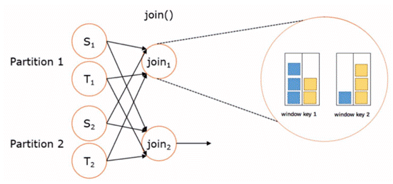

不同的windows的join场景：

- Tumbling Window Join

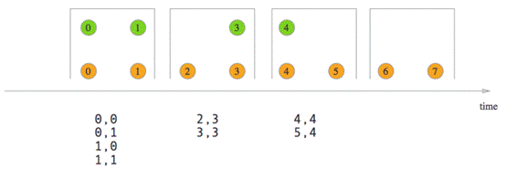

- Sliding Window Join

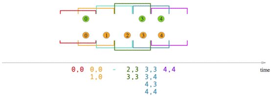

- Session Window Join

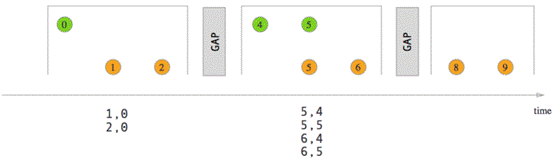

 

 

# 7.TimerService、累加器、parquet格式、flink行存储与列存储操作

## 1.ProcessFunction   

- 不要跟ProcessWindowFunction混为一谈
- ProcessFunction是一个低阶的流处理操作，它可以访问流处理程序的基础构建模块

- 事件是一条一条处理的
- 对状态的处理，比如容错性，一致性，仅在keyed stream中
- 提供定时器，基于event time和processing time， 仅在keyed stream中
- ProcessFunction可以看作是一个具有keyed state 和 timers访问权的FlatMapFunction
- 通过RuntimeContext访问keyed state
- 计时器允许应用程序对处理时间和事件时间中的更改作出响应。对processElement(...)函数的每次调用都获得一个Context对象，该对象可以访问元素的event time timestamp和TimerService

## 2.TimerService

- TimerService可用于为将来的event/process time瞬间注册回调。当到达计时器的特定时间时，将调用onTimer(...)方法。在该调用期间，所有状态都再次限定在创建计时器时使用的键的范围内，从而允许计时器操作键控状态
- processing-time/event-time timer都由TimerService在内部维护并排队等待执行。
- 仅在keyed stream中有效
- 由于Flink对（每个key+timestamp）只维护一个计时器。如果为相同的timestamp注册了多个timer ， 则只调用onTimer()方法一次。
- Flink保证同步调用onTimer()和processElement() 。因此用户不必担心状态的并发修改。
- 容错

- - Timer具有容错和checkpoint能力（基于flink app的状态）。从故障恢复或从savepoint启动应用程序时，Timer将被恢复。
  - 大量计时器会增加检查点存储空间，因为计时器是检查点状态的一部分

### 1).TimerService的使用

需求：使用processFunction的TimeService实现两个流的Join功能并实现sessionWindows

示例代码：

```java
package cn.zhanghub.windows;

import org.apache.flink.api.common.typeinfo.Types;
import org.apache.flink.api.java.tuple.Tuple;
import org.apache.flink.api.java.tuple.Tuple3;
import org.apache.flink.streaming.api.TimeCharacteristic;
import org.apache.flink.streaming.api.datastream.ConnectedStreams;
import org.apache.flink.streaming.api.datastream.DataStreamSource;
import org.apache.flink.streaming.api.datastream.KeyedStream;
import org.apache.flink.streaming.api.datastream.SingleOutputStreamOperator;
import org.apache.flink.streaming.api.environment.StreamExecutionEnvironment;
import org.apache.flink.streaming.api.functions.co.KeyedCoProcessFunction;
import org.apache.flink.util.Collector;

public class ConnectJoinTimeServerSessionWindow {
    public static void main(String[] args) throws Exception {
        StreamExecutionEnvironment env = StreamExecutionEnvironment.getExecutionEnvironment();

        DataStreamSource<String> s1 = env.socketTextStream("localhost", 6666);
        DataStreamSource<String> s2 = env.socketTextStream("localhost", 7777);
        KeyedStream<Tuple3<String, Integer, Long>, Tuple> input1 = s1.map(f -> Tuple3.of(f, 1, System.currentTimeMillis())).returns(Types.TUPLE(Types.STRING, Types.INT, Types.LONG)).keyBy("f0");
        KeyedStream<Tuple3<String, Integer, Long>, Tuple> input2 = s2.map(f -> Tuple3.of(f, 1, System.currentTimeMillis())).returns(Types.TUPLE(Types.STRING, Types.INT, Types.LONG)).keyBy("f0");

        /**
         * 使用timerService实现SessionWindows的Join功能
         * 注意：这个join因为没有使用state，所以只要不同的key跑在一个subTask里面也能Join在一起
         *      因为Operator中的变量是共用的
         */
        ConnectedStreams<Tuple3<String, Integer, Long>, Tuple3<String, Integer, Long>> connect = input1.connect(input2);
        SingleOutputStreamOperator<String> process = connect.process(new KeyedCoProcessFunction<String, Tuple3<String, Integer, Long>, Tuple3<String, Integer, Long>, String>() {

            private Long datatime = null;
            private String outString = "";
            private int intervalTime = 3000;

            @Override
            public void processElement1(Tuple3<String, Integer, Long> value, Context ctx, Collector<String> out) throws Exception {
                outString += value.f0 + "\t";
                datatime = value.f2;
                ctx.timerService().registerProcessingTimeTimer(datatime + intervalTime);
                System.out.println("subTaskId:" + getRuntimeContext().getIndexOfThisSubtask() + ",value:" + value.f0);
            }

            @Override
            public void processElement2(Tuple3<String, Integer, Long> value, Context ctx, Collector<String> out) throws Exception {
                outString += value.f0 + "\t";
                datatime = value.f2;
                ctx.timerService().registerProcessingTimeTimer(datatime + intervalTime);
                System.out.println("subTaskId:" + getRuntimeContext().getIndexOfThisSubtask() + ",value:" + value.f0);
            }

            @Override
            public void onTimer(long timestamp, OnTimerContext ctx, Collector<String> out) throws Exception {
                System.out.println("timerService start");
                if (timestamp == datatime + intervalTime) {
                    out.collect(outString);
                    outString = "";
                }
            }
        });

        process.print();

        env.execute();
    }
}
```

升级版示例代码:

```java
package cn.zhanghub.windows;

import org.apache.flink.api.common.functions.ReduceFunction;
import org.apache.flink.api.common.state.ReducingState;
import org.apache.flink.api.common.state.ReducingStateDescriptor;
import org.apache.flink.api.common.state.ValueState;
import org.apache.flink.api.common.state.ValueStateDescriptor;
import org.apache.flink.api.common.typeinfo.Types;
import org.apache.flink.api.java.tuple.Tuple;
import org.apache.flink.api.java.tuple.Tuple3;
import org.apache.flink.configuration.Configuration;
import org.apache.flink.streaming.api.TimeCharacteristic;
import org.apache.flink.streaming.api.datastream.ConnectedStreams;
import org.apache.flink.streaming.api.datastream.DataStreamSource;
import org.apache.flink.streaming.api.datastream.KeyedStream;
import org.apache.flink.streaming.api.datastream.SingleOutputStreamOperator;
import org.apache.flink.streaming.api.environment.StreamExecutionEnvironment;
import org.apache.flink.streaming.api.functions.co.KeyedCoProcessFunction;
import org.apache.flink.util.Collector;

public class ConnectJoinTimeServerStateSessionWindow {
    public static void main(String[] args) throws Exception {
        StreamExecutionEnvironment env = StreamExecutionEnvironment.getExecutionEnvironment();

        DataStreamSource<String> s1 = env.socketTextStream("localhost", 6666);
        DataStreamSource<String> s2 = env.socketTextStream("localhost", 7777);
        KeyedStream<Tuple3<String, Integer, Long>, Tuple> input1 = s1.map(f -> Tuple3.of(f, 1, System.currentTimeMillis())).returns(Types.TUPLE(Types.STRING, Types.INT, Types.LONG)).keyBy("f0");
        KeyedStream<Tuple3<String, Integer, Long>, Tuple> input2 = s2.map(f -> Tuple3.of(f, 1, System.currentTimeMillis())).returns(Types.TUPLE(Types.STRING, Types.INT, Types.LONG)).keyBy("f0");

        /**
         * 使用timerService实现SessionWindows的Join功能
         * 注意：这个join因为使用keyedState，所以即使不同的key跑在一个subTask里面也是每个key join自己的
         *      因为keyedState是属于每个key的
         */
        ConnectedStreams<Tuple3<String, Integer, Long>, Tuple3<String, Integer, Long>> connect = input1.connect(input2);
        SingleOutputStreamOperator<String> process = connect.process(new KeyedCoProcessFunction<String, Tuple3<String, Integer, Long>, Tuple3<String, Integer, Long>, String>() {

            private int intervalTime = 3000;
            private ReducingState<String> rs = null;
            private ValueState<Long> vs = null;

            @Override
            public void open(Configuration parameters) throws Exception {
                ReducingStateDescriptor<String> rsd = new ReducingStateDescriptor<String>("rsd", new ReduceFunction<String>() {
                    @Override
                    public String reduce(String value1, String value2) throws Exception {
                        return value1 + "\t" + value2;
                    }
                }, String.class);
                rs = getRuntimeContext().getReducingState(rsd);
                ValueStateDescriptor<Long> vsd = new ValueStateDescriptor<>("vsd", Long.class);
                vs = getRuntimeContext().getState(vsd);
            }

            @Override
            public void processElement1(Tuple3<String, Integer, Long> value, Context ctx, Collector<String> out) throws Exception {
                rs.add(value.f0);
                vs.update(value.f2);
                ctx.timerService().registerProcessingTimeTimer(vs.value() + intervalTime);
                System.out.println("subTaskId:" + getRuntimeContext().getIndexOfThisSubtask() + ",value:" + value.f0);
            }

            @Override
            public void processElement2(Tuple3<String, Integer, Long> value, Context ctx, Collector<String> out) throws Exception {
                rs.add(value.f0);
                vs.update(value.f2);
                ctx.timerService().registerProcessingTimeTimer(vs.value() + intervalTime);
                System.out.println("subTaskId:" + getRuntimeContext().getIndexOfThisSubtask() + ",value:" + value.f0);
            }

            @Override
            public void onTimer(long timestamp, OnTimerContext ctx, Collector<String> out) throws Exception {
                System.out.println("timerService start");
                Long dataTime = vs.value();
                if (timestamp == dataTime + intervalTime) {
                    out.collect(rs.get());
                    rs.clear();
                }
            }
        });

        process.print();

        env.execute();
    }
}

```


### 2).计时器合并

- 由于Flink对每个键和时间戳只维护一个计时器，因此可以通过降低计时器频率来合并计时器，从而减少计时器的数量。
- event-time timer只会在watermarks到来时触发
- 使用ctx.timerService().deleteEventTimeTimer删除过期Timer

示例代码：

```java
package cn.zhanghub.windows;

import org.apache.flink.api.common.functions.ReduceFunction;
import org.apache.flink.api.common.state.ReducingState;
import org.apache.flink.api.common.state.ReducingStateDescriptor;
import org.apache.flink.api.common.state.ValueState;
import org.apache.flink.api.common.state.ValueStateDescriptor;
import org.apache.flink.api.common.typeinfo.Types;
import org.apache.flink.api.java.tuple.Tuple;
import org.apache.flink.api.java.tuple.Tuple3;
import org.apache.flink.configuration.Configuration;
import org.apache.flink.streaming.api.TimeCharacteristic;
import org.apache.flink.streaming.api.datastream.ConnectedStreams;
import org.apache.flink.streaming.api.datastream.DataStreamSource;
import org.apache.flink.streaming.api.datastream.KeyedStream;
import org.apache.flink.streaming.api.datastream.SingleOutputStreamOperator;
import org.apache.flink.streaming.api.environment.StreamExecutionEnvironment;
import org.apache.flink.streaming.api.functions.AssignerWithPeriodicWatermarks;
import org.apache.flink.streaming.api.functions.co.KeyedCoProcessFunction;
import org.apache.flink.streaming.api.watermark.Watermark;
import org.apache.flink.util.Collector;

import javax.annotation.Nullable;

public class ConnectJoinTimeServerStateSessionWindowEventTimeMerge {
    public static void main(String[] args) throws Exception {
        StreamExecutionEnvironment env = StreamExecutionEnvironment.createLocalEnvironmentWithWebUI(new Configuration());
        env.setStreamTimeCharacteristic(TimeCharacteristic.EventTime);

        DataStreamSource<String> s1 = env.socketTextStream("localhost", 6666);
        DataStreamSource<String> s2 = env.socketTextStream("localhost", 7777);

        KeyedStream<Tuple3<String, Integer, Long>, Tuple> input1 = s1.map(f -> Tuple3.of(f, 1, System.currentTimeMillis())).returns(Types.TUPLE(Types.STRING, Types.INT, Types.LONG))
                .assignTimestampsAndWatermarks(new AssignerWithPeriodicWatermarks<Tuple3<String, Integer, Long>>() {
                    @Nullable
                    @Override
                    public Watermark getCurrentWatermark() {
                        return new Watermark(System.currentTimeMillis());
                    }

                    @Override
                    public long extractTimestamp(Tuple3<String, Integer, Long> element, long previousElementTimestamp) {
                        return element.f2;
                    }
                }).keyBy("f0");

        KeyedStream<Tuple3<String, Integer, Long>, Tuple> input2 = s2.map(f -> Tuple3.of(f, 1, System.currentTimeMillis())).returns(Types.TUPLE(Types.STRING, Types.INT, Types.LONG))
                .assignTimestampsAndWatermarks(new AssignerWithPeriodicWatermarks<Tuple3<String, Integer, Long>>() {
                    @Nullable
                    @Override
                    public Watermark getCurrentWatermark() {
                        return new Watermark(System.currentTimeMillis());
                    }

                    @Override
                    public long extractTimestamp(Tuple3<String, Integer, Long> element, long previousElementTimestamp) {
                        return element.f2;
                    }
                }).keyBy("f0");

        /**
         * 使用timerService实现SessionWindows的Join功能
         * 注意：这个join因为使用keyedState，所以即使不同的key跑在一个subTask里面也是每个key join自己的
         *      因为keyedState是属于每个key的
         */
        ConnectedStreams<Tuple3<String, Integer, Long>, Tuple3<String, Integer, Long>> connect = input1.connect(input2);
        SingleOutputStreamOperator<String> process = connect.process(new KeyedCoProcessFunction<String, Tuple3<String, Integer, Long>, Tuple3<String, Integer, Long>, String>() {

            private int intervalTime = 3000;
            private ReducingState<String> rs = null;
            private ValueState<Long> currentTime = null;
            private ValueState<Long> currentTimeService = null;

            @Override
            public void open(Configuration parameters) throws Exception {
                ReducingStateDescriptor<String> rsd = new ReducingStateDescriptor<String>("rsd", new ReduceFunction<String>() {
                    @Override
                    public String reduce(String value1, String value2) throws Exception {
                        return value1 + "\t" + value2;
                    }
                }, String.class);
                rs = getRuntimeContext().getReducingState(rsd);
                ValueStateDescriptor<Long> currentTimeSD = new ValueStateDescriptor<>("currentTime", Long.class);
                currentTime = getRuntimeContext().getState(currentTimeSD);
                ValueStateDescriptor<Long> lastTimeServiceSD = new ValueStateDescriptor<>("lastTimeService", Long.class);
                currentTimeService = getRuntimeContext().getState(lastTimeServiceSD);
            }

            @Override
            public void processElement1(Tuple3<String, Integer, Long> value, Context ctx, Collector<String> out) throws Exception {
                doWork(value, ctx);
            }

            @Override
            public void processElement2(Tuple3<String, Integer, Long> value, Context ctx, Collector<String> out) throws Exception {
                doWork(value, ctx);
            }

            private void doWork(Tuple3<String, Integer, Long> value, KeyedCoProcessFunction<String, Tuple3<String, Integer, Long>, Tuple3<String, Integer, Long>, String>.Context ctx) throws Exception {
                rs.add(value.f0);

                if (currentTimeService.value() != null) {
                    ctx.timerService().deleteEventTimeTimer(currentTimeService.value());
                }

                long timestamp = ctx.timestamp();
                currentTime.update(timestamp);
                currentTimeService.update(timestamp + intervalTime);
                ctx.timerService().registerEventTimeTimer(currentTimeService.value());
                System.out.println("subTaskId:" + getRuntimeContext().getIndexOfThisSubtask() + ",value:" + value.f0);
            }

            @Override
            public void onTimer(long timestamp, OnTimerContext ctx, Collector<String> out) throws Exception {
                System.out.println("timerService start");
                Long dataTime = currentTime.value();
                if (timestamp == dataTime + intervalTime) {
                    out.collect(rs.get());
                    rs.clear();
                }
            }
        });

        process.print();

        env.execute();
    }
}

```

## 3.累加器和计数器

- 用于在flink程序运行过程中进行计数，类似于spark的Accumulator或mr的counter

### 1).内置累加器:

- IntCounter
- LongCounter
- DoubleCounter 
- Histogram

### 2).自定义累加器

- 实现Accumulator或者SimpleAccumulator

### 3).如何使用累加器

- 第一步：在自定义的转换操作里创建累加器对象: private     IntCounter numLines = new IntCounter();
- 第二步：注册累加器对象，通常是在rich function的open()方法中。这里你还需要定义累加器的名字 getRuntimeContext().addAccumulator("num-lines",     this.numLines);
- 第三步：在operator函数的任何地方使用累加器，包括在open()和close()方法中this.numLines.add(1);
- 第四步：结果存储在JobExecutionResult里

JobExecutionResult myJobExecutionResult = env.execute("Flink Batch Java API Skeleton");

myJobExecutionResult.getAccumulatorResult("num-lines")

示例代码：

```java
package cn.zhanghub.windows;

import org.apache.flink.api.common.JobExecutionResult;
import org.apache.flink.api.common.accumulators.IntCounter;
import org.apache.flink.api.common.functions.RichFlatMapFunction;
import org.apache.flink.api.java.tuple.Tuple2;
import org.apache.flink.configuration.Configuration;
import org.apache.flink.streaming.api.datastream.DataStreamSource;
import org.apache.flink.streaming.api.environment.StreamExecutionEnvironment;
import org.apache.flink.util.Collector;

public class IntCounterBounded {
    public static void main(String[] args) throws Exception {
        StreamExecutionEnvironment env = StreamExecutionEnvironment.createLocalEnvironmentWithWebUI(new Configuration());

//        DataStreamSource<String> input1 = env.socketTextStream("localhost", 6666);
        DataStreamSource<String> input1 = env.fromElements("a a a", "b b b");
        input1.flatMap(new RichFlatMapFunction<String, Tuple2<String, Integer>>() {

            private IntCounter inc = null;

            @Override
            public void open(Configuration parameters) throws Exception {
                inc = new IntCounter();
                getRuntimeContext().addAccumulator("zhanghub", this.inc);
            }

            @Override
            public void flatMap(String value, Collector<Tuple2<String, Integer>> out) throws Exception {
                String[] strs = value.split(" ");
                for (String s : strs) {
                    this.inc.add(1);
                    out.collect(Tuple2.of(s, 1));
                }
            }
        }).print();

        JobExecutionResult res = env.execute("intCount");
        Integer num = (Integer) res.getAccumulatorResult("zhanghub");
        System.out.println(num);
    }
}

```

升级版示例代码：

```java
package cn.zhanghub.windows;

import org.apache.flink.api.common.accumulators.IntCounter;
import org.apache.flink.api.common.functions.RichFlatMapFunction;
import org.apache.flink.configuration.Configuration;
import org.apache.flink.streaming.api.datastream.DataStreamSource;
import org.apache.flink.streaming.api.environment.StreamExecutionEnvironment;
import org.apache.flink.util.Collector;

public class IntCounterUnbounded {

    public static void main(String[] args) throws Exception {
        StreamExecutionEnvironment env = StreamExecutionEnvironment.getExecutionEnvironment();

        DataStreamSource<String> input1 = env.socketTextStream("localhost", 6666);
        input1.flatMap(new RichFlatMapFunction<String, IntCounter>() {

            private IntCounter inc = null;

            @Override
            public void open(Configuration parameters) throws Exception {
                inc = new IntCounter();
                getRuntimeContext().addAccumulator("zhanghub", this.inc);
            }

            @Override
            public void flatMap(String value, Collector<IntCounter> out) throws Exception {
                String[] strs = value.split(" ");
                for (String s : strs) {
                    this.inc.add(1);
                }
                out.collect(this.inc);
            }
        }).print();

        env.execute("intCount");
    }
}

```

再升级版示例代码：

```java
package cn.zhanghub.windows;

import org.apache.flink.api.common.functions.ReduceFunction;
import org.apache.flink.api.common.functions.RichFlatMapFunction;
import org.apache.flink.streaming.api.datastream.DataStreamSource;
import org.apache.flink.streaming.api.datastream.DataStreamUtils;
import org.apache.flink.streaming.api.datastream.SingleOutputStreamOperator;
import org.apache.flink.streaming.api.environment.StreamExecutionEnvironment;
import org.apache.flink.streaming.api.windowing.time.Time;
import org.apache.flink.util.Collector;

import java.util.Iterator;

public class IntCounterUnboundedWindows {

    public static void main(String[] args) throws Exception {
        StreamExecutionEnvironment env = StreamExecutionEnvironment.getExecutionEnvironment();

        DataStreamSource<String> input1 = env.socketTextStream("localhost", 6666);
        SingleOutputStreamOperator<Integer> reduce = input1.flatMap(new RichFlatMapFunction<String, Integer>() {

            @Override
            public void flatMap(String value, Collector<Integer> out) throws Exception {
                String[] strs = value.split(" ");
                for (String s : strs) {
                    out.collect(1);
                }
            }

        }).timeWindowAll(Time.seconds(5))
                .reduce(new ReduceFunction<Integer>() {
                    @Override
                    public Integer reduce(Integer value1, Integer value2) throws Exception {
                        return value1 + value2;
                    }
                });

        Iterator<Integer> collect = DataStreamUtils.collect(reduce);
        
        for (; collect.hasNext(); ) {
            Integer next = collect.next();
            //插入mysql
            System.out.println("count:" + next);
        }
        
        env.execute("intCount");
    }
}

```

