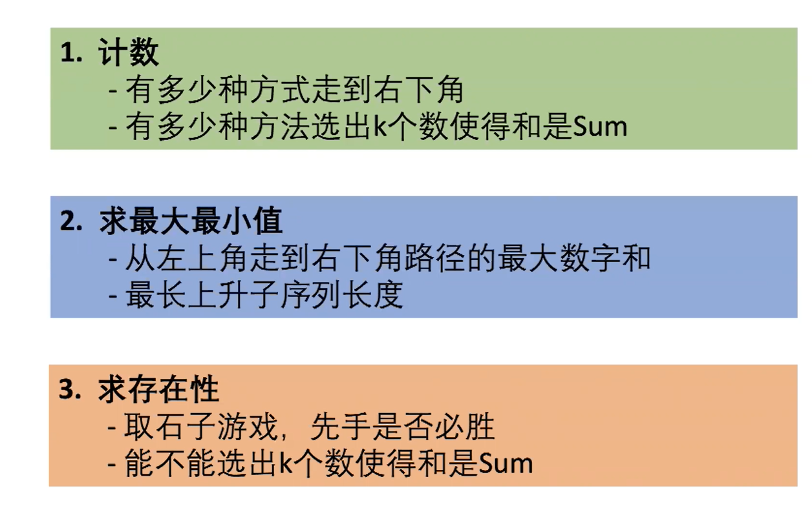

<center>更多内容请关注：</center>


<center><a href="https://wjhub.gitee.io">锁清秋</a></center>

----

## 回溯算法

优质博客：[一文学会回溯算法解题技巧](https://mp.weixin.qq.com/s/xrxU0SB9c-vLu4QHyODO7w)

>回溯法可以理解为通过选择不同的岔路口寻找目的地，一个岔路口一个岔路口的去尝试找到目的地。如果走错了路，继续返回来找到岔路口的另一条路，直到找到目的地。

模板：


```java
void dfs(已选解集合,每个阶段可选解) {
    if (已选解集合满足条件) {
        结果集.add(已选解集合);
        return;
    }

    // 遍历每个阶段的可选解集合
    for (可选解 in 每个阶段的可选解) {

        // 选择此阶段其中一个解,将其加入到已选解集合中
        已选解集合.add(可选解)

        // 进入下一个阶段
        dfs(已选解集合,下个阶段可选的空间解)

        // 「回溯」换个解再遍历
        已选解集合.remove(可选解)

    }
}
```

## 动态规划(DP)

### 动态规划题目类型

> 


一、 最值型动态规划：

动态规划组成部分:

1.确定状态

- 最后一步(最优策略中使用的最后一 枚硬币ak )
- 化成子问题(最少的硬币拼出更小的面值27-aK )

2.转移方程

- f[X] = min{f[X-2]+1, f[X-5]+1, f[X-7]+1} 

3.初始条件和边界情况

- f[O] = 0,如果不能拼出Y , f[Y]=正无穷

4.计算顺序（倒着来）

- f[0], f[1], f[2]

 例1

```java
// Java：零钱兑换 : 322
public int coinChange(int[] coins, int amount) {
  if (amount == 0) return 0;
  /** 
   * f(n): 数量；n:金额 ；
   * f(n) = [f(n-X0),...,f(n-Xn)]min
   * */
  final int[] f = new int[amount + 1];
  f[0] = 0;
  for (int i = 1; i < f.length; i++) {
    f[i] = Integer.MAX_VALUE;
    for (int j = 0; j < coins.length; j++)
      /** 处理 金额比面值小得情况 和 f[i - coins[j]] == Integer.MAX_VALUE 时，+1 会溢出的问题 */
      if (i >= coins[j] && f[i - coins[j]] != Integer.MAX_VALUE)
        f[i] = Math.min(f[i], f[i - coins[j]] + 1);
  }
  return f[amount] == Integer.MAX_VALUE ? -1 : f[amount];
}
```


-------------------------------------

优质博文：  
[如何理解动态规划？](https://www.zhihu.com/question/39948290/answer/883302989)
[一文学会动态规划解题技巧](https://leetcode-cn.com/circle/article/lxC3ZB/)
[告别动态规划，连刷 40 道题，我总结了这些套路，看不懂你打我](https://zhuanlan.zhihu.com/p/91582909)
[算法萌新如何学好动态规划（1）](https://zhuanlan.zhihu.com/p/150516970)

>以下是我综合了动态规划的特点给出的动态规划的定义：
>
>动态规划是一种多阶段决策最优解模型，一般用来求最值问题，多数情况下它可以采用自下而上的递推方式来得出每个子问题的最优解（即最优子结构），进而自然而然地得出依赖子问题的原问题的最优解。


总结一下 DP 问题的解题思路：

1. 确定「DP 状态」
    - 符合「最优子结构」原则：DP 状态最优值由更小规模的 DP 状态最优值推出
    - 符合「无后效性」原则：状态的得到方式，不会影响后续其它 DP 状态取值

2. 确定「DP 转移方程」
    - 分类讨论，细心枚举

斐波那契数列用动态规划的解法：（其实就是：从以前的从大到小变为：`从小到大`）

```java
class Solution {
    public int fib(int N) {
        if (N <= 1)
            return N;
        int[] ints = new int[N + 1];
        ints[0] = 0;
        ints[1] = 1;
        for (int i = 2; i <= N; i++) {
            ints[i] = ints[i - 1] + ints[i - 2];
        }
        return ints[N];
    }
}
```

如爬楼梯问题
递归求法：

```java
class Solution {
    public int climbStairs(int n) {
        if (n <= 2) {
            return n;
        }
        return climbStairs(n - 1) + climbStairs(n - 2);
    }
}
```

优化：动态规划

```java
class Solution {
public int climbStairs(int n) {
    if (n<1)
        return 0;
    if (n<=2)
        return n;
    int[] ret = new int[n];
    ret[0] = 1;
    ret[1] = 2;
    for (int i = 2; i < n; i++) {
        ret[i] = ret[i-1] + ret[i-2];
    }
    return ret[n - 1];
}
}
```
