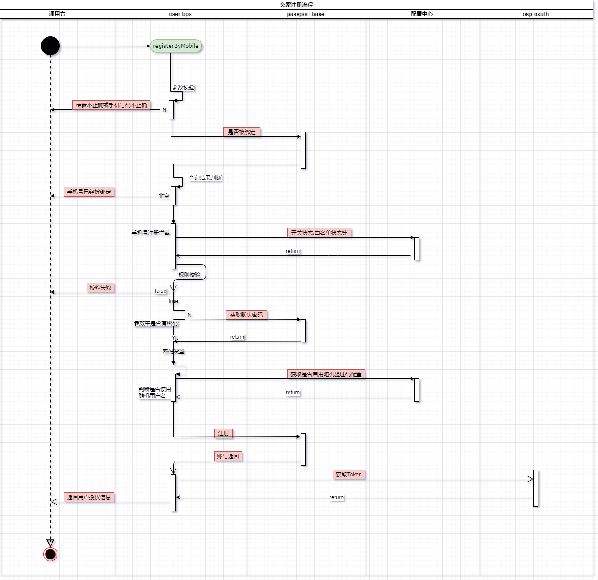
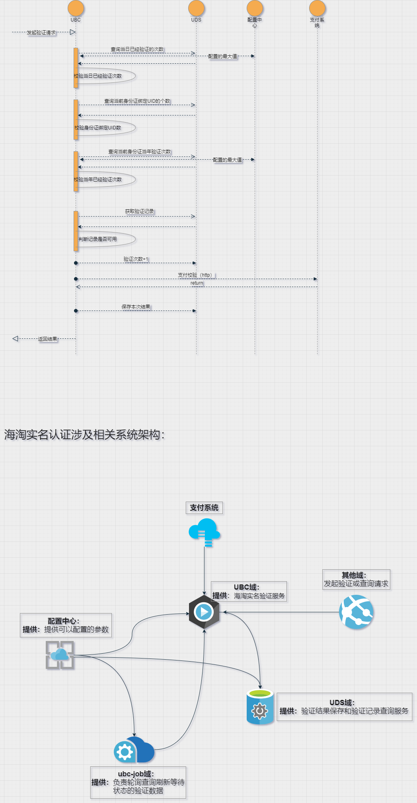

## 免密登录注册流程

### 背景：

- 注册流程混乱、业务逻辑冗余，代码冗余（大量的不必要的校验和查询操作）
- 调用来源不清晰，多端复用（多端公用一个注册登录接口，流量集中于一个接口）
- 流程不清晰，调用过程耦合（调用流程全部在一个方法中，代码存在严重的耦合）

### 流程

### 1. 注册
上游通过OpenID获取用户信息（手机号，设备ID，手机型号等信息））对手机号等相关信息，进行参数校验，查询是否已经被绑定或注册，查询是否在白/黑名单中（拦截处理）

*如果已经注册过了：*

- 判断是否需要挑战：异地登录校验、更换设备登录校验、登陆信息异常是否考虑账户冻结停用、是否允许第三方平台存储密码

*如果未注册过*

- 使用加密工具获取一个随机密码

- 调用注册方法进行注册

### 分库分表

> 1. Asgard ：中间件，部署在独立的服务器上，业务代码如同在使用单一数据库一样使用它，实际上它内部管理着很多的数据源，当有数据库请求时，它会对 SQL 语句做必要的改写，然后发往指定的数据源。
>
>    *主从原理*：主库通过同步binlog到从库，relaylog去读 ； 从库有延迟可以通过缓存 冗余数据来解决 ；
>
> 2. 写主库，（返回用户ID）（水平分库，用hash直接hash路由id到对应的库的对应的表，64个库，64张表）
>
>    *分库分表* [参考文章](https://blog.csdn.net/qq_41360177/article/details/99222284) 单表单库：QPS：2000/s，单表磁盘存储200w
>
>    - 垂直拆分：业务维度分成不同的表
>
>    - 水平拆分：单一表的数据拆分成多个表存储 （表结构不变）
>
>    - 某一个字段的hash 比如主键先分库hash 再分表hash
>
>      按照某一个字段的哈希值做拆分，这种拆分规则比较适用于实体表，比如说用户表，内容表，我们一般按照这些实体表的 ID 字段来拆分。比如说我们想把用户表拆分成 16 个库，每个库是 64 张表，那么可以先对用户 ID 做哈希，哈希的目的是将 ID 尽量打散，然后再对 16 取余，这样就得到了分库后的索引值；对 64 取余，就得到了分表后的索引值
>
> 3. 数据一致性问题：半同步复制，也就是主库将数据写入带binlog文件的时候强制从库将数据同步到数据库，直到从库完成返回ack才算完成。
>
> 4. *事务* [参考文章](https://zhuanlan.zhihu.com/p/95016577)
>
>    ​	事务的ACID是通过InnoDB日志和锁来保证。事务的隔离性是通过数据库锁的机制实现的，持久性通过redo log（重做日志）来实现，原子性和一致性通过Undo log来实现。
>
>    ​	UndoLog的原理很简单，为了满足事务的原子性，在操作任何数据之前，首先将数据备份到一个地方（这个存储数据备份的地方称为UndoLog）。然后进行数据的修改。如果出现了错误或者用户执行了ROLLBACK语句，系统可以利用Undo Log中的备份将数据恢复到事务开始之前的状态。
>
>    ​	和Undo Log相反，RedoLog记录的是新数据的备份。在事务提交前，只要将RedoLog持久化即可，不需要将数据持久化。当系统崩溃时，虽然数据没有持久化，但是RedoLog已经持久化。系统可以根据RedoLog的内容，将所有数据恢复到最新的状态。 对具体实现过程有兴趣的同学可以去自行搜索扩展。

- 注册完成后将用户UID和分配的流程ID存储在Redis缓存中，并设置过期时间（15s），返回

### 2. 登录
- 对比调用方传回的流程ID是否和当前缓存中的流程ID是否相同

- 相同：用缓存中的用户ID去登录，请求osp-oauth服务，获取token(含有用户UID和基本会员信息– 权限，用户ID等)，将token缓存redis并返回（MySQL已经记录了token）

### 单点登录

> ## 单点登录
>
> 什么是单点登录？单点登录全称Single Sign On（以下简称SSO），是指在多系统应用群中登录一个系统，便可在其他所有系统中得到授权而无需再次登录，包括单点登录与单点注销两部分。
>
> ## 1、登录 (CAS)
>
> 相比于单系统登录，sso需要一个独立的认证中心，只有认证中心能接受用户的用户名密码等安全信息，其他系统不提供登录入口，只接受认证中心的间接授权。间接授权通过令牌实现，sso认证中心验证用户的用户名密码没问题，创建授权令牌，在接下来的跳转过程中，授权令牌作为参数发送给各个子系统，子系统拿到令牌，即得到了授权，可以借此创建局部会话，局部会话登录方式与单系统的登录方式相同。这个过程，也就是单点登录的原理，用下图说明。
>
> 
>
> 下面对上图简要描述。
>
> 1. 用户访问系统1的受保护资源，系统1发现用户未登录，跳转至sso认证中心，并将自己的地址作为参数；
> 2. sso认证中心发现用户未登录，将用户引导至登录页面；
> 3. 用户输入用户名密码提交登录申请；
> 4. sso认证中心校验用户信息，创建用户与sso认证中心之间的会话，称为全局会话，同时创建授权令牌；
> 5. sso认证中心带着令牌跳转会最初的请求地址（系统1）；
> 6. 系统1拿到令牌，去sso认证中心校验令牌是否有效；
> 7. sso认证中心校验令牌，返回有效，注册系统1；
> 8. 系统1使用该令牌创建与用户的会话，称为局部会话，返回受保护资源；
> 9. 用户访问系统2的受保护资源；
> 10. 系统2发现用户未登录，跳转至sso认证中心，并将自己的地址作为参数；
> 11. sso认证中心发现用户已登录，跳转回系统2的地址，并附上令牌；
> 12. 系统2拿到令牌，去sso认证中心校验令牌是否有效；
> 13. sso认证中心校验令牌，返回有效，注册系统2；
> 14. 系统2使用该令牌创建与用户的局部会话，返回受保护资源。
>
>
> 用户登录成功之后，会与sso认证中心及各个子系统建立会话，用户与sso认证中心建立的会话称为全局会话，用户与各个子系统建立的会话称为局部会话，局部会话建立之后，用户访问子系统受保护资源将不再通过sso认证中心，全局会话与局部会话有如下约束关系。
>
> 1. 局部会话存在，全局会话一定存在；
> 2. 全局会话存在，局部会话不一定存在；
> 3. 全局会话销毁，局部会话必须销毁。

## 海淘验证业务调用时序

