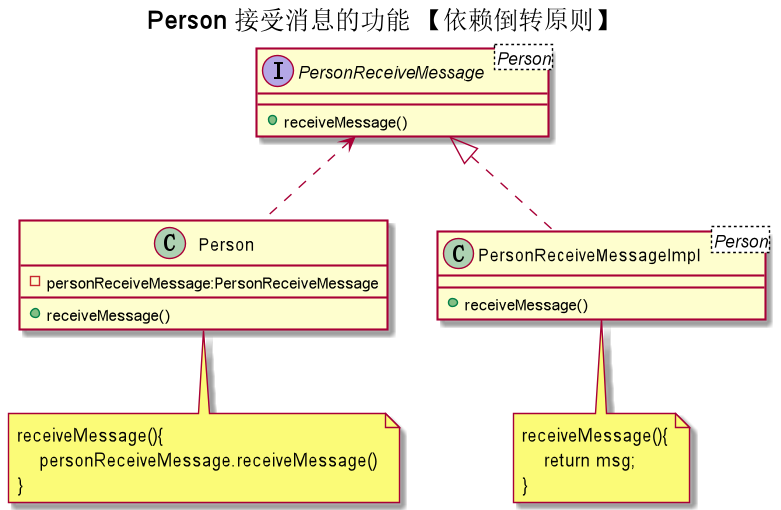
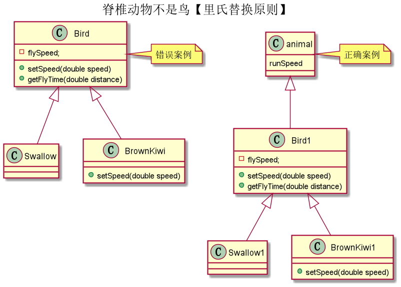
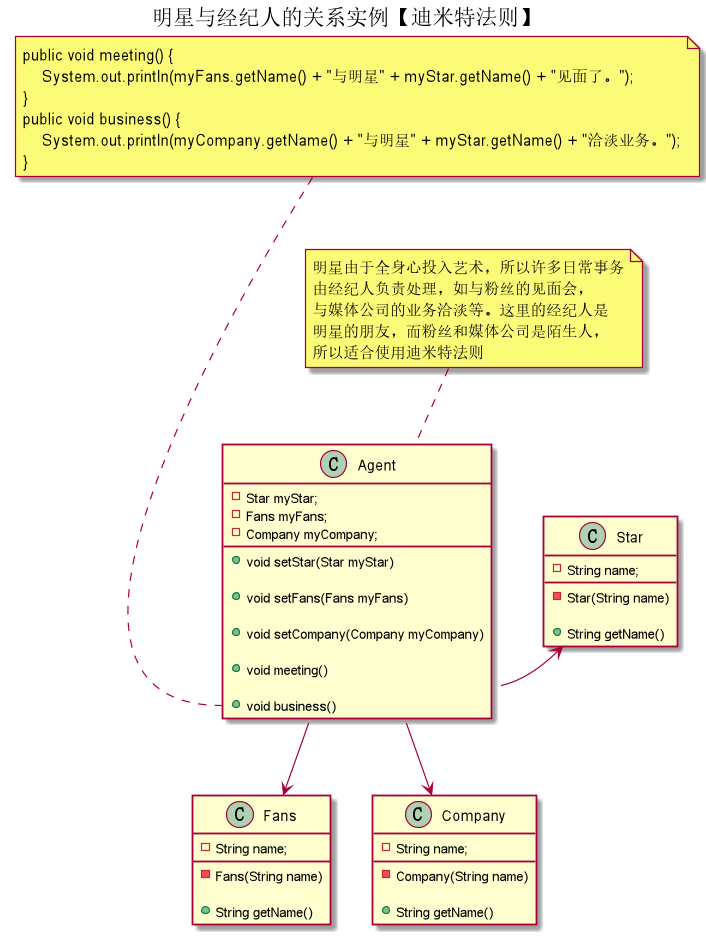

更多内容请关注：

<a href="https://wjhub.gitee.io">锁清秋</a>

----

 7 种设计原则，它们分别为开闭原则、里氏替换原则、依赖倒置原则、单一职责原则、接口隔离原则、迪米特法则和合成复用原则。

这 7 种设计原则是软件设计模式必须尽量遵循的原则，是设计模式的基础。在实际开发过程中，并不是一定要求所有代码都遵循设计原则，而是要综合考虑人力、时间、成本、质量，不刻意追求完美，要在适当的场景遵循设计原则。这体现的是一种平衡取舍，可以帮助我们设计出更加优雅的代码结构。

各种原则要求的侧重点不同，下面分别用一句话归纳总结软件设计模式的七大原则，如下表所示。

| 设计原则     | 一句话归纳                                                   | 目的                                       |
| ------------ | ------------------------------------------------------------ | ------------------------------------------ |
| 开闭原则     | 对扩展开放，对修改关闭                                       | 降低维护带来的新风险                       |
| 依赖倒置原则 | 高层不应该依赖低层，要面向接口编程                           | 更利于代码结构的升级扩展                   |
| 单一职责原则 | 一个类只干一件事，实现类要单一                               | 便于理解，提高代码的可读性                 |
| 接口隔离原则 | 一个接口只干一件事，接口要精简单一                           | 功能解耦，高聚合、低耦合                   |
| 迪米特法则   | 不该知道的不要知道，一个类应该保持对其它对象最少的了解，降低耦合度 | 只和朋友交流，不和陌生人说话，减少代码臃肿 |
| 里氏替换原则 | 不要破坏继承体系，子类重写方法功能发生改变，不应该影响父类方法的含义 | 防止继承泛滥                               |
| 合成复用原则 | 尽量使用组合或者聚合关系实现代码复用，少使用继承             | 降低代码耦合                               |

实际上，这些原则的目的只有一个：降低对象之间的耦合，增加程序的可复用性、可扩展性和可维护性。

> 记忆口诀：访问加限制，函数要节俭，依赖不允许，动态加接口，父类要抽象，扩展不更改。

在程序设计时，我们应该将程序功能最小化，每个类只干一件事。若有类似功能基础之上添加新功能，则要合理使用继承。对于多方法的调用，要会运用接口，同时合理设置接口功能与数量。最后类与类之间做到低耦合高内聚。

## 2. 接口隔离原则（Interface Segregation Principle，ISP）
(1)要求程序员尽量将臃肿庞大的接口拆分成更小的和更具体的接口，让接口中只包含客户感兴趣的方法。
 - 客户端不应该被迫依赖于它不使用的方法
 - 一个类对另一个类的依赖应该建立在最小的接口上

(2)接口隔离原则和单一职责都是为了提高类的内聚性、降低它们之间的耦合性，体现了封装的思想，但两者是不同的：

- 单一职责原则注重的是职责，而接口隔离原则注重的是对接口依赖的隔离。
- 单一职责原则主要是约束类，它针对的是程序中的实现和细节；接口隔离原则主要约束接口，主要针对抽象和程序整体框架的构建。

### 接口隔离原则的实现方法

在具体应用接口隔离原则时，应该根据以下几个规则来衡量。

 - 接口尽量小，但是要有限度。一个接口只服务于一个子模块或业务逻辑。
 - 为依赖接口的类定制服务。只提供调用者需要的方法，屏蔽不需要的方法。
 - 了解环境，拒绝盲从。每个项目或产品都有选定的环境因素，环境不同，接口拆分的标准就不同深入了解业务逻辑。
 - 提高内聚，减少对外交互。使接口用最少的方法去完成最多的事情。

## 3. 依赖倒置原则（Dependence Inversion Principle，DIP）

  高层模块不应该依赖低层模块，两者都应该依赖其抽象；抽象不应该依赖细节，细节应该依赖抽象
  - 其核心思想是：要面向接口编程，不要面向实现编程。
 >由于在软件设计中，细节具有多变性，而抽象层则相对稳定，因此以抽象为基础搭建起来的架构要比以细节为基础搭建起来的架构要稳定得多。
 >这里的抽象指的是接口或者抽象类，而细节是指具体的实现类。
 >使用接口或者抽象类的目的是制定好规范和契约，而不去涉及任何具体的操作，把展现细节的任务交给它们的实现类去完成。

  ### 依赖、倒置原则的作用

  - 降低类间的耦合性。
  - 提高系统的稳定性。
  - 减少并行开发引起的风险。
  - 提高代码的可读性和可维护性。

  ### 依赖倒置原则的实现方法

  依赖倒置原则的目的是通过要面向接口的编程来降低类间的耦合性，所以我们在实际编程中只要遵循以下4点，就能在项目中满足这个规则。
  - 每个类尽量提供接口或抽象类，或者两者都具备。
  - 变量的声明类型尽量是接口或者是抽象类。
  - 任何类都不应该从具体类派生。
  - 使用继承时尽量遵循里氏替换原则。

 ### 依赖传递的三种方式

 1) 接口传递
 2) 构造方法传递
 3) setter方式传递

## 4. 里氏替换原则（Liskov Substitution Principle，LSP）

​	继承必须确保超类所拥有的性质在子类中仍然成立

> 子类可以扩展父类的功能，但不能改变父类原有的功能。也就是说：子类继承父类时，除添加新的方法完成新增功能外，尽量不要重写父类的方法。

### 里氏替换原则的主要作用

1. 里氏替换原则是实现“开闭原则”的重要方式之一。
2. 它克服了继承中重写父类造成的可复用性变差的缺点。
3. 它是动作正确性的保证。即类的扩展不会给已有的系统引入新的错误，降低了代码出错的可能性。
4. 加强程序的健壮性，同时变更时可以做到非常好的兼容性，提高程序的维护性、可扩展性，降低需求变更时引入的风险。

### 里氏替换原则实现方法

- 子类可以实现父类的抽象方法，但不能覆盖父类的非抽象方法
- 子类中可以增加自己特有的方法
- 当子类的方法重载父类的方法时，方法的前置条件（即方法的输入参数）要比父类的方法更宽松
- 当子类的方法实现父类的方法时（重写/重载或实现抽象方法），方法的后置条件（即方法的的输出/返回值）要比父类的方法更严格或相等

> **如果程序违背了里氏替换原则，则继承类的对象在基类出现的地方会出现运行错误。这时其修正方法是：取消原来的继承关系，重新设计它们之间的关系。**

## 5. 开闭原则（Open Closed Principle，OCP）

​		软件实体应当对扩展开放 ( 提供方 )，对修改关闭（使用方）（Software entities should be open for extension，but closed for modification）；

> 开闭原则的含义是：当应用的需求改变时，在不修改软件实体的源代码或者二进制代码的前提下，可以扩展模块的功能，使其满足新的需求。
>
> 即：用抽象构建框架，用实现扩展细节。

### 开闭原则的作用

1. 对软件测试的影响
软件遵守开闭原则的话，软件测试时只需要对扩展的代码进行测试就可以了，因为原有的测试代码仍然能够正常运行。
2. 可以提高代码的可复用性
粒度越小，被复用的可能性就越大；在面向对象的程序设计中，根据原子和抽象编程可以提高代码的可复用性。
3. 可以提高软件的可维护性
遵守开闭原则的软件，其稳定性高和延续性强，从而易于扩展和维护。

### 开闭原则的实现方法

可以通过“抽象约束、封装变化”来实现开闭原则，即通过接口或者抽象类为软件实体定义一个相对稳定的抽象层，而将相同的可变因素封装在相同的具体实现类中。

因为抽象灵活性好，适应性广，只要抽象的合理，可以基本保持软件架构的稳定。而软件中易变的细节可以从抽象派生来的实现类来进行扩展，当软件需要发生变化时，只需要根据需求重新派生一个实现类来扩展就可以了。

## 6. 迪米特法则（Law of Demeter，LoD）
> 又叫作最少知识原则（Least Knowledge Principle，LKP)

迪米特法则的定义是：只与你的直接朋友交谈，不跟“陌生人”说话（Talk only to your immediate friends and not to strangers）。其含义是：如果两个软件实体无须直接通信，那么就不应当发生直接的相互调用，可以通过第三方转发该调用。其目的是降低类之间的耦合度，提高模块的相对独立性。

迪米特法则中的“朋友”是指：当前对象本身、当前对象的成员对象、当前对象所创建的对象、当前对象的方法参数等，这些对象同当前对象存在关联、聚合或组合关系，可以直接访问这些对象的方法。

### 迪米特法则的优点

迪米特法则要求限制软件实体之间通信的宽度和深度，正确使用迪米特法则将有以下两个优点。

1. 降低了类之间的耦合度，提高了模块的相对独立性。
2. 由于亲合度降低，从而提高了类的可复用率和系统的扩展性。

但是，过度使用迪米特法则会使系统产生大量的中介类，从而增加系统的复杂性，使模块之间的通信效率降低。所以，在釆用迪米特法则时需要反复权衡，确保高内聚和低耦合的同时，保证系统的结构清晰。

### 迪米特法则的实现方法

从迪米特法则的定义和特点可知，它强调以下两点：

1. 从依赖者的角度来说，只依赖应该依赖的对象。
2. 从被依赖者的角度说，只暴露应该暴露的方法。

所以，在运用迪米特法则时要注意以下 6 点。

1. 在类的划分上，应该创建弱耦合的类。类与类之间的耦合越弱，就越有利于实现可复用的目标。
2. 在类的结构设计上，尽量降低类成员的访问权限。
3. 在类的设计上，优先考虑将一个类设置成不变类。
4. 在对其他类的引用上，将引用其他对象的次数降到最低。
5. 不暴露类的属性成员，而应该提供相应的访问器（set 和 get 方法）。
6. 谨慎使用序列化（Serializable）功能。

## 7. 合成复用原则（Composite Reuse Principle，CRP）

> 合成复用原则（Composite Reuse Principle，CRP）又叫组合/聚合复用原则（Composition/Aggregate Reuse Principle，CARP）。它要求在软件复用时，要尽量先使用组合或者聚合等关联关系来实现，其次才考虑使用继承关系来实现。
>
> 如果要使用继承关系，则必须严格遵循里氏替换原则。合成复用原则同里氏替换原则相辅相成的，两者都是开闭原则的具体实现规范。

### 合成复用原则的重要性

通常类的复用分为继承复用和合成复用两种，继承复用虽然有简单和易实现的优点，但它也存在以下缺点。

1. 继承复用破坏了类的封装性。因为继承会将父类的实现细节暴露给子类，父类对子类是透明的，所以这种复用又称为“白箱”复用。
2. 子类与父类的耦合度高。父类的实现的任何改变都会导致子类的实现发生变化，这不利于类的扩展与维护。
3. 它限制了复用的灵活性。从父类继承而来的实现是静态的，在编译时已经定义，所以在运行时不可能发生变化。

采用组合或聚合复用时，可以将已有对象纳入新对象中，使之成为新对象的一部分，新对象可以调用已有对象的功能，它有以下优点。

1. 它维持了类的封装性。因为成分对象的内部细节是新对象看不见的，所以这种复用又称为“黑箱”复用。
2. 新旧类之间的耦合度低。这种复用所需的依赖较少，新对象存取成分对象的唯一方法是通过成分对象的接口。
3. 复用的灵活性高。这种复用可以在运行时动态进行，新对象可以动态地引用与成分对象类型相同的对象。

### 合成复用原则的实现方法

合成复用原则是通过将已有的对象纳入新对象中，作为新对象的成员对象来实现的，新对象可以调用已有对象的功能，从而达到复用。

下面以汽车分类管理程序为例来介绍合成复用原则的应用。